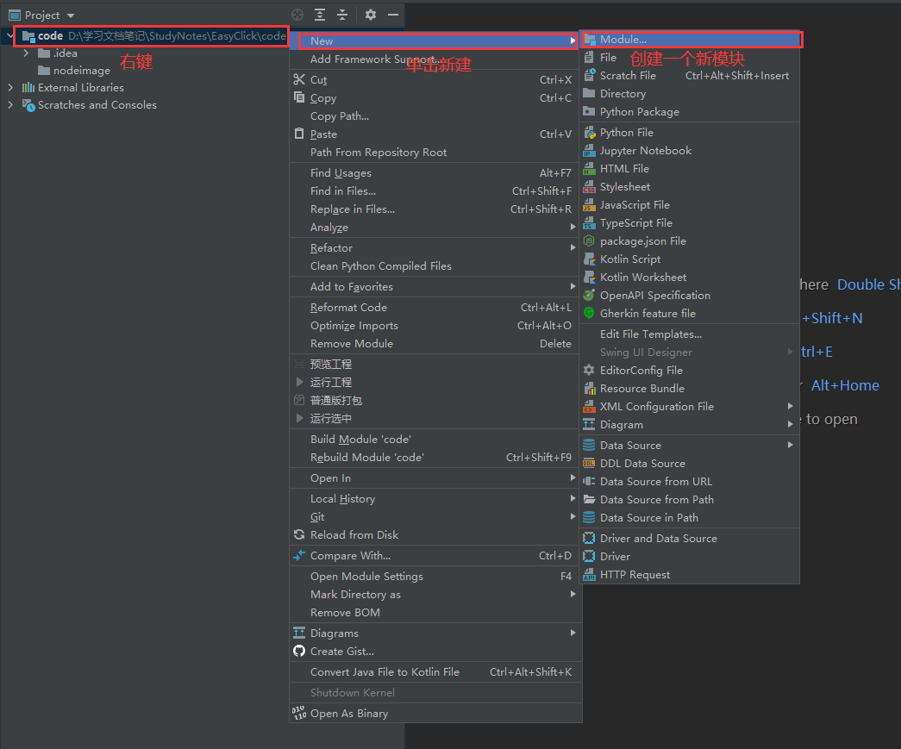
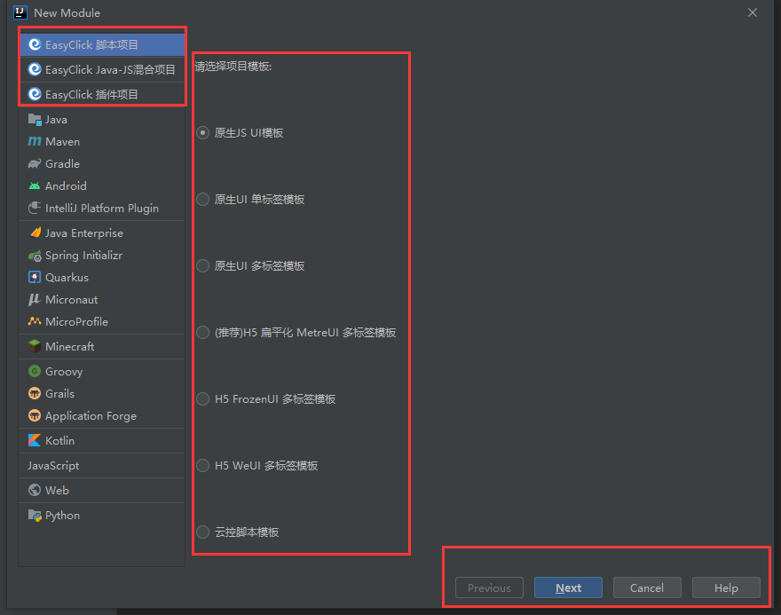
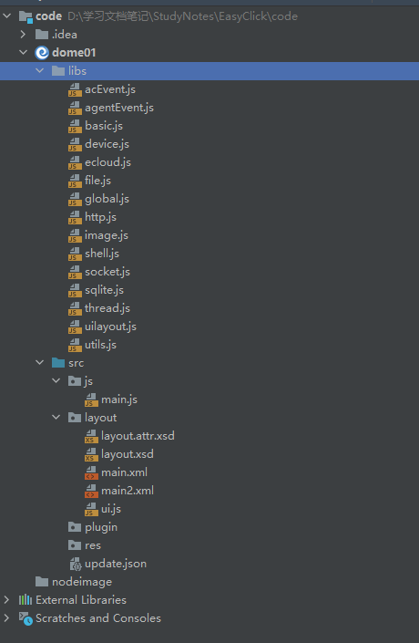
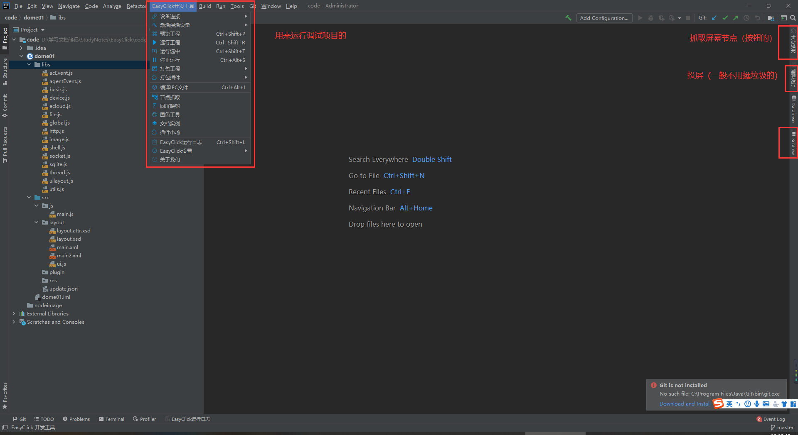

# EasyClick(未写完)

视频教程： https://www.bilibili.com/video/BV1vz4y1S7gd?p=3

开发文档：https://easyclick.gitee.io/docs/#/README

## 壹、简介(未写完)

## 贰、下载&安装(未写完)

## 叁、项目创建&认识界面&打包&运行(未写完)

##### 一、项目创建

1. 使用资源管理器(WIN + E)创建一个空文件夹

2. 使用IDEA打开这个文件夹

3. 右键项目新建一个新模块 （右键 --> New --> Module..）

4. 根据需要创建一个项目 这个我创建的是 (官方推荐的模板 ）建议使用H5的模板创建

5. 之后输入名称然后完成创建

##### 二、认识界面

1. 界面图片

2. EasyClick开发工具
   1. 设备连接： 用来连接你手机设备的(开发前第一件事就是连接设备)，通常使用USB连接或WIFI连接(输入你手机的IP)，连接时他提示你下载一个(重要的)APP安装下载就好
3. 

## 肆、节点

## 伍、UI