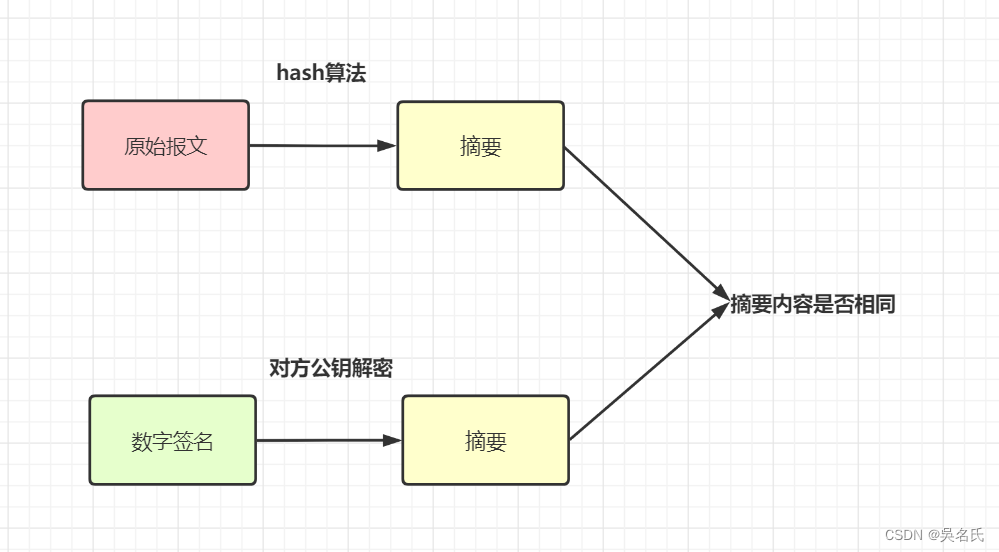

### 1. 遵守HTTP方法的语义
- **GET方法**：用于请求数据，不应改变服务器上的状态或数据。
- **POST方法**：用于创建新的资源或数据条目。
- **PUT方法**：用于完整更新现有资源。
- **PATCH方法**：用于部分更新现有资源。
- **DELETE方法**：用于删除资源。

### 2. 输入验证
- **严格的输入验证**：对所有输入数据进行验证，防止SQL注入、跨站脚本攻击（XSS）等。
- **类型、长度和格式**：确保输入数据的类型、长度和格式符合预期。

### 3. CSRF和XSS防护
- **使用CSRF令牌**：防止跨站请求伪造攻击，通过在客户端提交的表单中包含一个不可预测的令牌。
- **内容安全策略（CSP）**：实施CSP以防止XSS攻击，限制资源（如脚本）可以从何处加载。

### 4. 安全鉴权
- **使用JWT Token**：登录和数据操作需要JWT Token，用户ID，以及cref token。任何Token过期都需要重新登录，利用refreshToken机制维持登录状态。
- **网站同源机制和双重Cookie验证**：大部分接口应使用同源机制进行防御，对于不使用同源机制的API，必须使用crefToken以及双重Cookie验证。
- **Token存储**：区分令牌存储位置，有些需要存储在Cookie中，有些存储在前端数据库，有些存储在后端。

### 5. 最小权限原则
- **定义清晰的访问控制**：确保每个API端点都有适当的访问控制，限制只有授权用户才能执行特定操作。
- **实施认证和授权机制**：使用OAuth2.0, JWT等机制来管理用户的身份验证和授权。

### 6. 接口加密
1. **生成密钥**：就是对**关键字段**计算进行哈希计算

   * 比如获取关键的cookie 和前端数据库的内容或者token 然后进行处理，最后再对结果进行哈希计算
   * 通常作为 header 的字段

2. **数据加签验签**： 数据报文加签验签，是保证数据传输安全的常用手段，它可以保证数据在传输过程中不被篡改。

   * **数据加签**：用Hash算法（如`MD5，或者SHA-256`）把原始请求参数生成报文摘要，然后用私钥对这个摘要进行加密，就得到这个报文对应的数字签名`sign`（这个过程就是**加签**）。通常来说呢，请求方会把**数字签名和报文原文**一并发送给接收方。

   

   - **验签**：接收方拿到原始报文和数字签名（`sign`）后，用**同一个Hash算法**(比如都用MD5)从报文中生成摘要A。另外，用对方提供的公钥对数字签名进行解密，得到摘要B，对比A和B是否相同，就可以得知报文有没有被篡改过。

   

   > 再举个例子，有些小伙伴是这么实现的，将所有非空参数（包含一个包AccessKey，唯一的开发者标识）按照升序，然后再拼接个SecretKey（这个仅作本地加密使用，不参与网络传输，它只是用作签名里面的），得到一个stringSignTemp的值，最后用MD5运算，得到sign。
   >
   > 服务端收到报文后，会校验，只有拥有合法的身份AccessKey和签名Sign正确，才放行。这样就解决了身份验证和参数篡改问题，如果请求参数被劫持，由于劫持者获取不到SecretKey（仅作本地加密使用，不参与网络传输），他就无法伪造合法的请求啦
   > ————————————————
   >
   > 原文链接：https://blog.csdn.net/qq_37284798/article/details/128397671

3. **timestamp+nonce方案防止重放攻击**
   时间戳超时机制也是有漏洞的，如果是在时间差内，黑客进行的重放攻击，那就不好使了。可以使用timestamp+nonce方案。

   nonce指唯一的随机字符串，用来标识每个被签名的请求。我们可以将每次请求的nonce参数存储到一个“set集合”中，或者可以json格式存储到数据库或缓存中。每次处理HTTP请求时，首先判断该请求的nonce参数是否在该“集合”中，如果存在则认为是非法请求。

   然而对服务器来说，永久保存nonce的代价是非常大的。可以结合timestamp来优化。因为timstamp参数对于超过3min的请求，都认为非法请求，所以我们只需要存储3min的nonce参数的“集合”即可。
   ————————————————     

   原文链接：https://blog.csdn.net/qq_37284798/article/details/128397671

4. **限流机制**
   如果用户本来就是就是真实用户，他恶意频繁调用接口，想搞垮你的系统呢？这种情况就需要接入限流了。

   可以使用Guava的RateLimiter单机版限流，也可以使用Redis分布式限流，还可以使用阿里开源组件sentinel限流。比如说，一分钟可以接受多少次请求。

   ————————————————     

   原文链接：https://blog.csdn.net/qq_37284798/article/details/128397671
