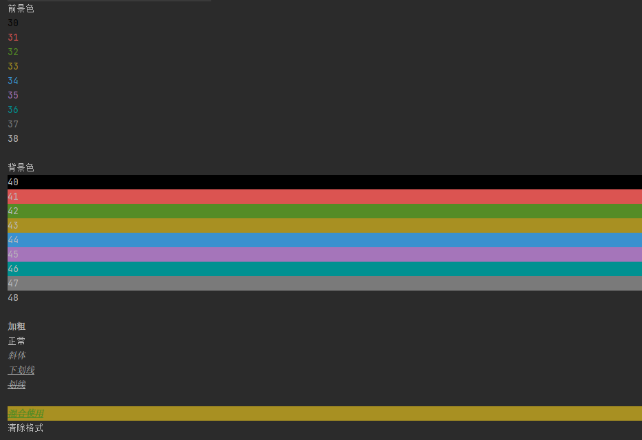

文章地址:  https://www.cnblogs.com/gzj03/p/14425860.html

注意如果不清除格式那么他会一直使用。该数字不局限于一下几种

```java
        System.out.println("前景色");
        for (int i = 30; i <= 38; i++) {
            System.out.println("\033[" + i + "m" + i);
        }
        System.out.println();
        System.out.println("背景色");
        for (int i = 40; i <= 48; i++) {
            System.out.println("\033[" + i + "m" + i);
        }

        System.out.println();
        System.out.println("\033[" + 1 + "m" + "加粗");
        System.out.println("\033[" + 2 + "m" + "正常");
        System.out.println("\033[" + 3 + "m" + "斜体");
        System.out.println("\033[" + 4 + "m" + "下划线");
        System.out.println("\033[" + 9 + "m" + "划线");

        System.out.println();
        System.out.println("\033[32;43;1m" + "混合使用");
        System.out.println("\033[" + 0 + "m" + "清除格式");
```




