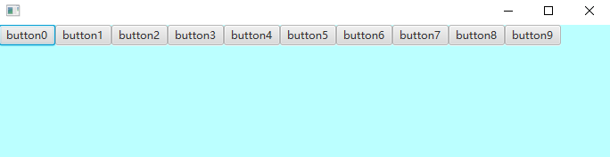
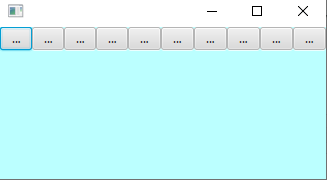
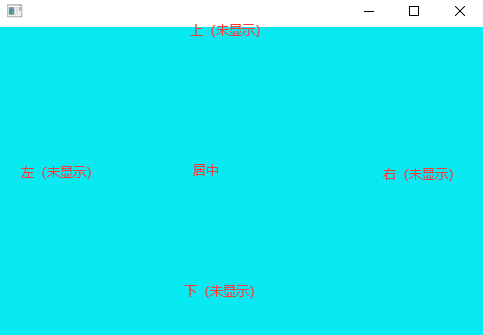
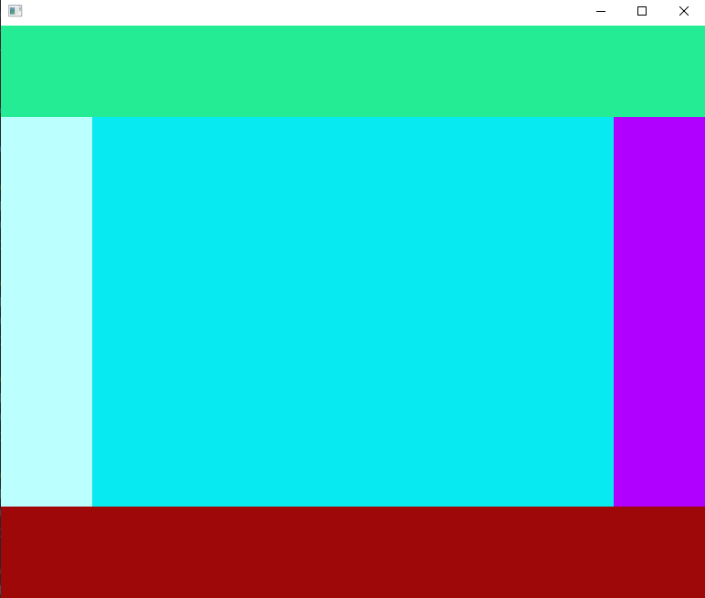
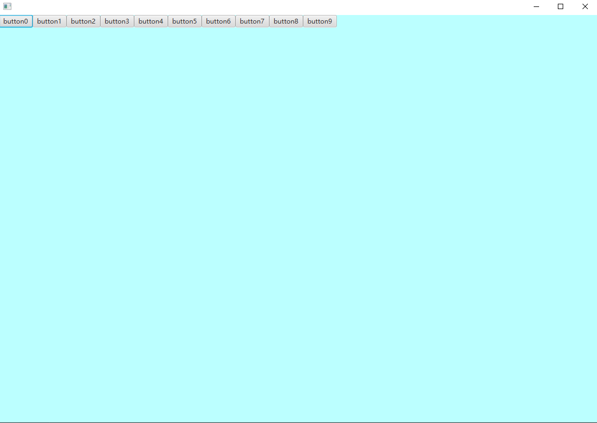
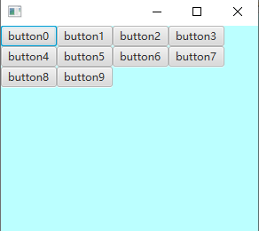
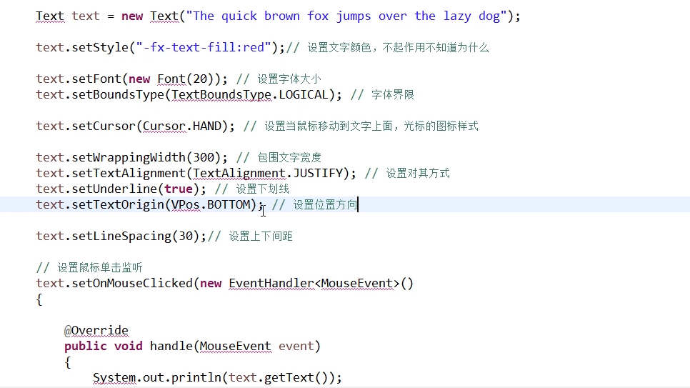
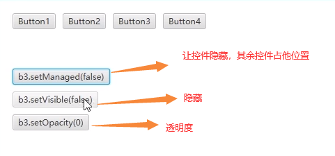

# **JAVAFX** 草稿

作者:子墨

参照: https://space.bilibili.com/5096022?spm_id_from=333.788.b_765f7570696e666f.1


## 一、简介

> 什么是JavaFX

- javafx是java的一个类库，用来开发桌面程序的一套类库
- javafx从jdk8开始就不在内置在jdk里面。需要单独下载
- JavaFX 的外观可以自定义。层叠样式表（CSS）将应用的外观与功能分离，让程序员可以更专注于编码。美工可以简单地通过 CSS 来自定义应用程序的外观。


>  准备工作

- 为了方便我们使用JDK8来对JavafX进行学习
- 如果你的不是JDK8请升级或降级来达到JDK8，或者下载JavaFX的类库来进行开发
- 我们使用工具为IDEA

[Maven](https://openjfx.cn/openjfx-docs/#maven)

[Gradle](https://openjfx.cn/openjfx-docs/#gradle)

[API](https://openjfx.cn/javadoc/15/)

[JavaFx_控件等](https://www.w3cschool.cn/java/javafx-checkbox.html)

## 二、我的第一个程序HelloWorld

##### 1. 第一个程序

文档：https://openjfx.cn/openjfx-docs/

1. 继承 javafx.application.Application 类 并实现里面的方法
2. 在main方法里运行应用程序`launch(args);`
3. 在start方法里面让窗口显示出来，并设置标题

```java
import javafx.application.Application;
import javafx.stage.Stage;
/**
 * 这是我的第一个程序
 */

public class Main extends Application {
    public static void main(String[] args) {
        //运行
        launch(args);
    }
    @Override
    public void start(Stage primaryStage) throws Exception {
        primaryStage.show();//显示窗口
        primaryStage.setTitle("HelloWorld");//设置标题
    }
}
```


##### 2. javaFX的各种启动方式

1. 继承Application，通过launch方法运行

```java
public class Main extends Application {
    public static void main(String[] args) {
        //运行
        launch(args);
    }
    @Override
    public void start(Stage primaryStage) throws Exception {
        primaryStage.show();//显示窗口
        primaryStage.setTitle("HelloWorld");//设置标题
    }
}
```


2. 继承Application，通过静态launch方法运行

```java
public class Main extends Application {
    public static void main(String[] args) {
        //运行
        Application.launch(args);
    }
    @Override
    public void start(Stage primaryStage) throws Exception {
        primaryStage.show();//显示窗口
        primaryStage.setTitle("HelloWorld");//设置标题
    }
}
```


3.通过静态launch方法运行继承Application的类

```java
public class MyJavaFX extends Application {
    @Override
    public void start(Stage primaryStage) throws Exception {
        primaryStage.show();//显示窗口
        primaryStage.setTitle("HelloWorld");//设置标题
    }
}
```

```java
public class Main  {

    public static void main(String[] args) {
        //运行
        MyJavaFX.launch(MyJavaFX.class,args);
    }
}
```


##### 3. javaFX的生命周期

```java
public class MyJavaFX extends Application {
    @Override
    public void init() throws Exception {
        System.out.println("Application实现类init()方法执行，执行线程为: "+Thread.currentThread().getName());
    }
    @Override
    public void start(Stage primaryStage) throws Exception {
        primaryStage.show();//显示窗口
        primaryStage.setTitle("HelloWorld");//设置标题
        System.out.println("Application实现类start方法执行，执行线程为: "+Thread.currentThread().getName());
    }
    @Override
    public void stop() throws Exception {
        System.out.println("Application实现类 stop()方法执行，执行线程为: "+Thread.currentThread().getName());
    }
}
```

```
Main方法执行，执行线程为: main
Application实现类init()方法执行，执行线程为: JavaFX-Launcher
Application实现类start方法执行，执行线程为: JavaFX Application Thread
Application实现类 stop()方法执行，执行线程为: JavaFX Application Thread
```

==**通过观察发现，JavaFX程序进行了3个阶段( init--> start---> stop)，每个阶段都有自己的线程**==


## 三、窗体与模式

##### 1. Stage类介绍

```java
public class Stage  extends Window
    JavaFXStage类是顶级JavaFX容器。初级阶段由平台构建。该应用程序可以构造其他Stage对象。
    Stage对象必须在JavaFX Application Thread上构造和修改。
    JavaFX应用程序线程是在JavaFX运行时启动过程中创建的。有关更多信息，请参见Application类和Platform.startup(Runnable)方法。
    许多Stage属性是只读的，因为它们可以由基础平台在外部进行更改，因此不能绑定。
```

**说人话就是Stage可以创建窗体**

```java
import javafx.application.Application;
import javafx.scene.image.Image;
import javafx.stage.Stage;

public class Main extends Application {
    public static void main(String[] args) {
        launch(args);
    }
    @Override
    public void start(Stage primaryStage) throws Exception {
        primaryStage.setTitle("0");
        primaryStage.show();

        Stage s = new Stage();
        s.setTitle("1");
        s.show();

        Stage s2 = new Stage();
        s2.setTitle("2");
        s2.show();

        Stage s3 = new Stage();
        s3.setTitle("3");
        s3.show();
    }
}
```


##### 2. Stage类的方法

| 修饰符和类型                     | 方法                                                         | 描述                                                         |
| :------------------------------- | :----------------------------------------------------------- | :----------------------------------------------------------- |
| **`ReadOnlyBooleanProperty`**    | **`alwaysOnTopProperty()`****                                | **定义是否将`Stage`其保留在其他窗口之上。**                  |
| **`void`**                       | **`close()`****                                              | **关闭此`Stage`。(关闭窗口)**                                |
| `ObjectProperty<String>`         | `fullScreenExitHintProperty()`                               |                                                              |
| `ObjectProperty<KeyCombination>` | `fullScreenExitKeyProperty()`                                | 获取全屏退出键组合的属性。                                   |
| `ReadOnlyBooleanProperty`        | `fullScreenProperty()`                                       | 指定这是否`Stage`应为未装饰的全屏窗口。                      |
| **==get==**                      |                                                              |                                                              |
| `String`                         | `getFullScreenExitHint()`                                    | 获取属性fullScreenExitHint的值。                             |
| `KeyCombination`                 | `getFullScreenExitKeyCombination()`                          | 获取用于退出全屏模式的当前序列。                             |
| **`ObservableList<Image>`**      | **`getIcons()`**                                             | **获取窗口图标。 (primaryStage.getIcons().add(new Image(URL));来设置图标  图片要相对路径，绝对路径要file:C:\\...,网络也行，图片可以png格式)** |
| **`double`**                     | **`getMaxHeight()**`**                                       | **获取属性maxHeight的值。**                                  |
| **`double`**                     | **`getMaxWidth()**`**                                        | **获取属性maxWidth的值。**                                   |
| **`double`**                     | **`getMinHeight()**`**                                       | **获取属性minHeight的值。**                                  |
| **`double`**                     | **`getMinWidth()**`**                                        | **获取属性minWidth的值。**                                   |
| `Modality`                       | `getModality()`                                              | 检索此阶段的modality属性。                                   |
| `Window`                         | `getOwner()`                                                 | 检索此阶段的所有者窗口，对于未拥有的阶段，检索null。         |
| `StageStyle`                     | `getStyle()`                                                 | 检索此阶段的样式属性。                                       |
| `String`                         | `getTitle()`                                                 | 获取属性标题的值。                                           |
| `double`                         | `getWidth()`                                                 | 获取窗口宽度                                                 |
| `double`                         | `getHeight()`                                                | 获取窗口高度                                                 |
| `double`                         | `getY()`                                                     | 获取窗口的x轴                                                |
| `double`                         | `getY()`                                                     | 获取窗口的x轴                                                |
| **==分割==**                     |                                                              |                                                              |
| `ReadOnlyBooleanProperty`        | `iconifiedProperty()**`                                      | 定义是否`Stage`已图标化。                                    |
| **`void`**                       | **`initModality(Modality modality)`**                        | **指定此阶段的模式。**                                       |
| **`void`**                       | **`initOwner(Window owner)`**                                | **指定此阶段的所有者窗口，对于顶级无人阶段指定为null。**     |
| `void`                           | `initStyle(StageStyle style)`                                | 指定此阶段的样式。                                           |
| `boolean`                        | `isAlwaysOnTop()`                                            | 获取属性alwaysOnTop的值。                                    |
| `boolean`                        | `isFullScreen()`                                             | 获取属性fullScreen的值。                                     |
| `boolean`                        | `isIconified()**`                                            | 获取图标化的属性的值。                                       |
| `boolean`                        | `isMaximized()**`                                            | 获取最大化的属性值。                                         |
| **`boolean`**                    | **`isResizable()`**                                          | **获取可调整大小的属性的值。**                               |
| **`DoubleProperty`**             | **`maxHeightProperty()`**                                    | **定义this的最大高度`Stage`。**                              |
| **`ReadOnlyBooleanProperty`**    | **`maximizedProperty()`**                                    | **定义是否`Stage`最大化。**                                  |
| **`DoubleProperty`**             | **`maxWidthProperty()`**                                     | **定义this的最大宽度`Stage`。**                              |
| **`DoubleProperty`**             | **`minHeightProperty()`**                                    | **定义this的最小高度`Stage`。**                              |
| **`DoubleProperty`**             | **`minWidthProperty()`**                                     | **定义this的最小宽度`Stage`。**                              |
| **`BooleanProperty`**            | **`resizableProperty()`**                                    | **定义能否`Stage`由用户调整大小。**                          |
| **==set==**                      |                                                              |                                                              |
| `void`                           | `setAlwaysOnTop(boolean value)`                              | 设置窗口置顶，不能被其他窗口覆盖                             |
| `void`                           | `setFullScreen(boolean value)`                               | 设置属性fullScreen的值。                                     |
| `void`                           | `setFullScreenExitHint(String value)`                        | 指定当用户进入全屏模式时显示的文本，通常用于指示用户退出全屏模式的方式。 |
| `void`                           | `setFullScreenExitKeyCombination(KeyCombination keyCombination)` | 指定将允许用户退出全屏模式的KeyCombination。                 |
| `void`                           | `setIconified(boolean value)`                                | 设置图标化的属性的值。                                       |
| **`void`**                       | **`setMaxHeight(double value)`**                             | **设置窗口最大高度**                                         |
| **`void`**                       | **`setMaximized(boolean value)`**                            | **设置窗口为最大化。(false 设置最小化)   **                  |
| **`void`**                       | **`setMaxWidth(double value)`**                              | **设置窗口最大宽度。**                                       |
| **`void`**                       | **`setMinHeight(double value)`**                             | **设置窗口最小高度**                                         |
| **`void`**                       | **`setMinWidth(double value)`**                              | **设置窗口最小宽度**                                         |
| **`void`**                       | **`setResizable(boolean value)`**                            | **设置是否允许(用户)调整窗口大小。**                         |
| **`void`**                       | **setWidth(double value)**                                   | **设置窗口宽度**                                             |
| **`void`**                       | **setHeight(double value)**                                  | **设置窗口高度**                                             |
| **`void`**                       | **`setScene(Scene value)`**                                  | **指定此阶段要使用的场景。**                                 |
| **`void`**                       | **`setTitle(String value)`**                                 | **设置窗口的标题的。**                                       |
| `void`                           | `setX(double value)`                                         | 设置窗口x轴的。                                              |
| `void`                           | `setY(double value)`                                         | 设置窗口Y轴的。                                              |
| `void`                           | setOpacity(double value)                                     | 设置窗口透明度,取值范围[0,1]                                 |
| **==分割==**                     |                                                              |                                                              |
| **`void`**                       | **`show()`**                                                 | **尝试通过将可见性设置为true来显示此窗口**                   |
| **`void`**                       | **`showAndWait()`**                                          | **显示此阶段并等待其隐藏（关闭），然后返回到调用方。**       |
| **`StringProperty`**             | **`titleProperty()`**                                        | **定义的标题`Stage`。**                                      |
| **`void`**                       | **`toBack()`**                                               | **发送`Window`到后台。**                                     |
| **`void`**                       | **`toFront()`**                                              | **将`Window`前景带到前台。**                                 |


| 修饰符和类型           | 方法             | 描述                                                         |
| :--------------------- | :--------------- | :----------------------------------------------------------- |
| ReadOnlyDoubleProperty | heightProperty() | 窗口高度属性，可以给他添加监听器来对窗口高度进行监测和定义事件 |
| ReadOnlyDoubleProperty | widthProperty()  | 窗口高度属性，可以给他添加监听器来对窗口宽度进行监测和定义事件 |
| ReadOnlyDoubleProperty | yProperty()      | 窗口Y轴属性,可以给他添加监听器来对窗口Y轴进行监测和定义事件  |
| ReadOnlyDoubleProperty | xProperty()      | 窗口Y轴属性,可以给他添加监听器来对窗口x轴进行监测和定义事件  |

```java
//监听窗口x位置
primaryStage.xProperty().addListener(new ChangeListener<Number>() {
    @Override
    public void changed(ObservableValue<? extends Number> observable, Number oldValue, Number newValue) {
        System.out.print("窗体X轴发生变化   : ");
        System.out.println(oldValue+" ==变为==>  "+newValue);
    }
});

//监听窗口y位置
primaryStage.yProperty().addListener(new ChangeListener<Number>() {
    @Override
    public void changed(ObservableValue<? extends Number> observable, Number oldValue, Number newValue) {
        System.out.print("窗体y轴发生变化   : ");
        System.out.println(oldValue+" ==变为==>  "+newValue);
    }
});

//监听窗体高度
primaryStage.heightProperty().addListener(new ChangeListener<Number>() {
    @Override
    public void changed(ObservableValue<? extends Number> observable, Number oldValue, Number newValue) {
        System.out.print("窗体高度发生变化   : ");
        System.out.println(oldValue+" ==变为==>  "+newValue);
    }
});

//监听窗体宽度
primaryStage.widthProperty().addListener(new ChangeListener<Number>() {
    @Override
    public void changed(ObservableValue<? extends Number> observable, Number oldValue, Number newValue) {
        System.out.print("窗体宽度发生变化   : ");
        System.out.println(oldValue+" ==变为==>  "+newValue);
    }
});
```


##### 3. 窗口风格

Stage具有以下样式之一：

- `StageStyle.DECORATED` -具有纯白色背景和平台装饰的舞台。**默认**
- `StageStyle.UNDECORATED` -具有纯白色背景且没有装饰的舞台。透明背景
- `StageStyle.TRANSPARENT` -具有透明背景且没有装饰的舞台。透明背景
- `StageStyle.UTILITY` -具有纯白色背景和最少平台装饰的舞台。类似弹窗只有一个关闭按钮

```java
@Override
public void start(Stage primaryStage) throws Exception {
    primaryStage.setTitle("风格");

    primaryStage.initStyle(StageStyle.DECORATED);//具有纯白色背景和平台装饰的舞台。 默认
    //        primaryStage.initStyle(StageStyle.UNDECORATED);//具有纯白色背景且没有装饰的舞台。
    //        primaryStage.initStyle(StageStyle.TRANSPARENT);//具有透明背景且没有装饰的舞台。
    //        primaryStage.initStyle(StageStyle.UTILITY);//具有纯白色背景和最少平台装饰的舞台。

    primaryStage.show();
}
```


##### 4. 窗口类型(模态)

阶段具有以下方式之一：

- `Modality.NONE` -一个不阻止任何其他窗口的阶段。（默认）
- `Modality.WINDOW_MODAL`-阻止输入事件从其所有者（父级）传递到其根的所有窗口的阶段。它的根是没有所有者的最近的祖先窗口。（这是一个弹窗，设置后不能操作弹窗的主窗口）
- `Modality.APPLICATION_MODAL` -阻止输入事件从同一应用程序传递到所有窗口的阶段，除了其子层次结构中的事件。（这是一个弹窗，设置后不能操作本应用内其他窗口）

当窗口被模式阶段阻塞时，将保留其相对于其祖先的Z顺序，并且不接收任何输入事件和窗口激活事件，但会继续进行动画处理并正常渲染。请注意，显示模式阶段并不一定会阻止调用方。`show()`无论阶段的方式如何，该 方法都会立即返回。`showAndWait()`如果需要阻止调用者，直到隐藏（关闭）模态阶段，请使用此方法。必须先初始化模态，然后才能使该阶段可见。


```java
    @Override
    public void start(Stage primaryStage) throws Exception {
        primaryStage.setTitle("风格和模态");
        primaryStage.show();


        Stage s = new Stage();
//        s.initModality(Modality.APPLICATION_MODAL);   //（默认）
//        s.initModality(Modality.NONE);	//是一个弹窗，设置后不能操作本应用内其他窗口

        s.initModality(Modality.WINDOW_MODAL);//只能操作s和其他窗口不能操作primaryStage窗口
        s.initOwner(primaryStage);//为这个窗口设置主窗口
        s.show();

        Stage s2 = new Stage();
        s2.setTitle("s2");
        s2.show();

    }
```


#### 注意

1. 在窗口没显示之前是不能获取窗口的高，宽，x,y等。

```java
@Override
public void start(Stage primaryStage) throws Exception {
    System.out.println(primaryStage.getX());
    System.out.println(primaryStage.getWidth());
    primaryStage.show();
}
```

```
NaN
NaN
```


2. 关闭所有窗口后程序关闭，如果有窗口被隐藏没有关闭程序不会停止


## 四、工具类

### 1. Screen

###### ffjio反

描述图形目标（例如监视器）的特征。在桌面区域可以跨越多个物理屏幕设备的虚拟设备多屏幕环境中，`Screen`对象的边界 是相对于的`Screen.primary`。

| 修饰符和类型                    | 方法                | 描述                                   |
| :------------------------------ | :------------------ | :------------------------------------- |
| `Rectangle2D`                   | `getBounds()`       | 获取全部的范围屏幕。                   |
| `double`                        | `getDpi()`          | 获取此的分辨率（每英寸点数）`Screen`。 |
| `static Screen`                 | `getPrimary()`      | 主要的`Screen`。                       |
| `static ObservableList<Screen>` | `getScreens()`      | 可查看的当前可用列表`Screens`。        |
| `Rectangle2D`                   | `getVisualBounds()` | 获取可视范围内的屏幕                   |

```java
@Override
public void start(Stage primaryStage) throws Exception {
    Screen primary = Screen.getPrimary(); //获取主屏幕
    Rectangle2D bounds = primary.getBounds();//获取全部的范围屏幕。
    System.out.println("屏幕最大XY  :"+bounds.getMaxX()+" × "+ bounds.getMaxY());
    System.out.println("屏幕最大宽高 :"+bounds.getWidth()+" × "+ bounds.getHeight());

    Rectangle2D visualBounds = primary.getVisualBounds();//获取可视化范围的屏幕。
    System.out.println("可视屏幕的最大XY  :"+visualBounds.getMaxX()+" × "+ visualBounds.getMaxY());
    System.out.println("可视屏幕的最大宽高 :"+visualBounds.getWidth()+" × "+ visualBounds.getHeight());

    double dpi = primary.getDpi();//获取此的分辨率（每英寸点数)
    System.out.println("DPI ：" + dpi);

    Platform.exit();//退出程序
}
```


### 2. Platform

应用程序平台支持类。

- Platform和start方法是同一个线程 JavaFX Application Thread

| `static ReadOnlyBooleanProperty` | `accessibilityActiveProperty()`                | 指示可访问性是否处于活动状态。                               |
| :------------------------------- | ---------------------------------------------- | ------------------------------------------------------------ |
| `static Object`                  | `enterNestedEventLoop(Object key)`             | 输入一个嵌套的事件循环并阻塞，直到进行相应的exitNestedEventLoop调用为止。 |
| `static void`                    | `exit()`                                       | 使JavaFX应用程序终止。                                       |
| `static void`                    | `exitNestedEventLoop(Object key, Object rval)` | 退出嵌套事件循环并取消阻止相应enterNestedEventLoop的调用方。 |
| `static boolean`                 | `isAccessibilityActive()`                      | 获取属性accessibilityActive的值。                            |
| `static boolean`                 | `isFxApplicationThread()`                      | 如果调用线程是JavaFX Application Thread，则返回true。        |
| `static boolean`                 | `isImplicitExit()`                             | 获取implicitExit属性的值。                                   |
| `static boolean`                 | `isNestedLoopRunning()`                        | 检查嵌套事件循环是否正在运行，返回true表示一个嵌套事件循环，如果当前没有正在运行的嵌套事件循环，则返回false。 |
| `static boolean`                 | `isSupported(ConditionalFeature feature)`      | 查询平台是否支持特定的条件功能。                             |
| `static void`                    | `requestNextPulse()`                           | 请求Java运行时执行脉冲。                                     |
| `static void`                    | `runLater(Runnable runnable)`                  | 将来在某些未指定的时间在JavaFX Application Thread上运行指定的Runnable。 |
| `static void`                    | `setImplicitExit(boolean implicitExit)`        | 当窗口全部被关闭后是否退出程序                               |
| `static void`                    | `startup(Runnable runnable)`                   | 此方法启动JavaFX运行时。                                     |

```java
@Override
public void start(Stage primaryStage) throws Exception {
    //和start是一个线程 JavaFX Application Thread
    //将来在某些未指定的时间在JavaFX Application Thread上运行指定的Runnable。
    Platform.runLater(new Runnable() {
        @Override
        public void run() {
            System.out.println(Thread.currentThread().getName());
        }
    });
    System.out.println(Thread.currentThread().getName());

    //查询平台是否支持特定的条件功能。
    boolean supported = Platform.isSupported(ConditionalFeature.SCENE3D);
    System.out.println("当前电脑是否支持3d: "+supported);

    Platform.exit();//退出
}
```


## 五、Group  和 scene


组件要放在场景里面，场景放在窗体里面

Group  他是一个容器不是一个布局类，仅仅是容器而已

```java
@Override
public void start(Stage primaryStage) throws Exception {
    Group root = new Group();//组件节点
    Scene scene = new Scene(root);//场景
    primaryStage.setScene(scene);//窗体
}
```


> Group类方法

| 修饰符和类型           | 方法                                 | 描述                                                         |
| :--------------------- | :----------------------------------- | :----------------------------------------------------------- |
| `BooleanProperty`      | `autoSizeChildrenProperty()`         | 控制是否`Group`在布局过程中自动将所有可调整大小的子级调整为其首选大小。 |
| `ObservableList<Node>` | `getChildren()`                      | 获取此子项的列表`Group`。                                    |
| `boolean`              | `isAutoSizeChildren()`               | 获取属性autoSizeChildren的值。                               |
| `protected void`       | `layoutChildren()`                   | Group实现layoutChildren，以便在每个子项可调整大小的情况下将其大小调整为其首选大小。 |
| `double`               | `minHeight(double width)`            | 返回用于布局计算的节点的最小高度。                           |
| `double`               | `minWidth(double height)`            | 返回用于布局计算的节点的最小宽度。                           |
| `double`               | `prefHeight(double width)`           | 组将首选高度定义为只是其布局边界的高度，而后者又仅仅是其所有子项的布局边界的并集。 |
| `double`               | `prefWidth(double height)`           | 组将首选宽度定义为只是其布局范围的宽度，而宽度又仅仅是其所有子级的布局范围的并集。 |
| `void`                 | `setAutoSizeChildren(boolean value)` | 设置属性autoSizeChildren的值。                               |


>  Scene类方法

不全

```java
scene.setCursor(Cursor.CLOSED_HAND);//设置鼠标样式
scene.setCursor(Cursor.cursor("https://gimg2.baidu.com/image_search/src=http%3A%2F%2Fbpic.588ku.com%2Felement_origin_min_pic%2F17%2F11%2F27%2F754c03f5facafc06c9f68b0fbce3b6a2.jpg&refer=http%3A%2F%2Fbpic.588ku.com&app=2002&size=f9999,10000&q=a80&n=0&g=0n&fmt=jpeg?sec=1617342447&t=328fe965c396d4aad10ea7504457d2d6"));//设置鼠标样式  图片

//打开网页
HostServices host = getHostServices();
host.showDocument("www.baidu.com");
```


>  单击按键添加一个按键

```java
int i = 0;
@Override
public void start(Stage primaryStage) throws Exception {
    //按钮
    Button button = new Button();
    button.setText("点我");//添加文本
    //确定位置，如果不知道默认在左上角
    button.setLayoutX(170);
    button.setLayoutY(170);

    //组件节点
    Group root = new Group();
    root.getChildren().add(button);//添加控件
    //        root.getChildren().addAll(button);//批量添加控件
    root.setOpacity(1);//设置透明度
    root.setAutoSizeChildren(true);//设置是否给组件设置默认值，默认为true
    //        root.getChildren().remove(0);//清理控件
    //        root.getChildren().clear();//清理所有控件

    Object[] objects = root.getChildren().toArray(); //返回控件数组
    //设置监听，监听控件添加
    root.getChildren().addListener(new ListChangeListener<Node>() {
        @Override
        public void onChanged(Change<? extends Node> c) {
            System.out.println("当前控件数量： "+c.getList().size());
        }
    });

    
    //场景
    Scene scene = new Scene(root);
    //窗体
    primaryStage.setScene(scene);
    //设置单击事件
    button.setOnAction(new EventHandler<ActionEvent>() {
        @Override
        public void handle(ActionEvent event) {
            Button button1 = new Button("按钮" + i);
            button1.setLayoutY(i+50);
            root.getChildren().add(button1);
            i++;
        }
    });
    //设置窗体属性
    primaryStage.setTitle("嘿嘿");
    primaryStage.setWidth(400);
    primaryStage.setHeight(400);
    primaryStage.show();
}
```


## 六、控件

控件大多数继承自 `node` 所以控件之间大多数方法都是相同的，想要看一个控件的方法不光要看控件本身特有的方法还要看其父类的方法，这样才能便于记忆

控件的样式继承自Region，布局继承Labeled，控制继承Control

有些控件无法设置某些样式但是用css或其他可以设置

java.lang.Object

- **javafx.scene.Node**
  - javafx.scene.Parent
    - javafx.scene.layout.Region
      - javafx.scene.control.Control
        - ​	javafx.scene.control.Labeled

### 1. 按钮

#### 1.1 了解Button类

##### 构造方法

| 构造方法                            | 描述                                         |
| :---------------------------------- | :------------------------------------------- |
| `Button()`                          | 创建一个带有空字符串作为其标签的按钮。       |
| `Button(String text)`               | 创建一个带有指定文本作为标签的按钮。         |
| `Button(String text, Node graphic)` | 创建一个带有指定文本和图标作为其标签的按钮。 |


##### 方法

| 修饰符和类型        | 方法                              | 描述                                                         |
| :------------------ | :-------------------------------- | :----------------------------------------------------------- |
| `BooleanProperty`   | `cancelButtonProperty()`          | 如果场景中没有其他节点消耗它，则“取消按钮”是接收键盘VK_ESC按下的按钮。 |
| `protected Skin<?>` | `createDefaultSkin()`             | 为此控件创建默认外观的新实例。                               |
| `BooleanProperty`   | `defaultButtonProperty()`         | 如果场景中没有其他节点使用它，则默认按钮是接收键盘VK_ENTER按下的按钮。 |
| `void`              | `fire()`                          | 当用户手势指示应发生此按钮库的事件时调用。                   |
| `boolean`           | `isCancelButton()`                | 获取属性取消按钮的值。                                       |
| `boolean`           | `isDefaultButton()`               | 获取属性默认按钮的值。                                       |
| `void`              | `setCancelButton(boolean value)`  | 设置属性取消按钮的值。                                       |
| `void`              | `setDefaultButton(boolean value)` | 设置属性默认按钮的值。                                       |
| void                | setManaged(boolend b)             | 是否让控件消失                                               |
| void                | setVisible(boolend b)             | 隐藏控件                                                     |


##### 继承结构

java.lang.Object

- javafx.scene.Node
  - javafx.scene.Parent
    - javafx.scene.layout.Region
      - javafx.scene.control.Control
        - ​	javafx.scene.control.Labeled
          - ​	javafx.scene.control.ButtonBase
            - ​	javafx.scene.control.Button

##### javafx.scene.layout.Region

Region是所有基于JavaFX Node的UI控件以及所有布局容器的基类。它是可调整大小的父节点，可以从CSS设置样式。它可以有多个背景和边框。它旨在支持与JavaFX相关的尽可能多的CSS3规范，用于背景和边框。完整的规范可在[W3C获得](http://www.w3.org/TR/2012/CR-css3-background-20120724/)。


##### 实例

```java
@Override
public void start(Stage primaryStage) throws Exception {

    //设置scene
    Group root = new Group();
    Scene scene = new Scene(root);
    primaryStage.setScene(scene);

    //添加按键到节点
    root.getChildren().addAll(button1(),css());

    //设置窗体
    primaryStage.setTitle("按钮控件");
    primaryStage.setWidth(800);
    primaryStage.setHeight(800);
    primaryStage.show();
}

//定义一个按钮
Button button1 (){
    Button button = new Button("按钮1");
    //设置位置
    button.setLayoutY(100);
    button.setLayoutX(100);
    //设置大小
    button.setPrefHeight(200);
    button.setPrefWidth(200);
    //设置字体
    button.setFont(Font.font("楷体",20));
    //设置背景，可以查看类API进一步定制
    //红、绿、蓝、透明度  #00 00 00 00
    BackgroundFill fill = new BackgroundFill(Paint.valueOf("#ef5b9c"),new CornerRadii(25),new Insets(5));//颜色，圆角，偏移量(按钮离边框的距离 上下左右同一指定10)
    Background background = new Background(fill);
    button.setBackground(background);
    //设置边框
    BorderStroke borderStroke = new BorderStroke(Paint.valueOf("#009ad6"),BorderStrokeStyle.DASHED, new CornerRadii(30),
                                                 new BorderWidths(2),new Insets(0));//颜色，类型，圆角，宽度，[偏移量: 边框和按钮的距离]
    Border border = new Border(borderStroke);
    button.setBorder(border);

    return button;
}

//定义一个按钮 css 编写按钮样式 简单应用
Button css(){
    Button button = new Button("css");
    //设置位置
    button.setLayoutY(400);
    button.setLayoutX(400);
    //设置大小
    button.setPrefHeight(200);
    button.setPrefWidth(200);
    //设置字体
    button.setFont(Font.font("楷体",20));
    //css设置样式
    button.setStyle("-fx-background-color: #aaee00;" +  /* 设置按键背景颜色*/
                    "-fx-background-radius: 20;" +              /* 设置按键圆角颜色*/
                    "-fx-text-fill: #00eea0;"+                   /* 设置字体颜色*/
                    "-fx-border-style: dashed ;" +              /*设置边框*/
                    "-fx-border-color: #aa00EE;" +
                    "-fx-border-radius: 25;" +
                    "-fx-border-width: 2"
                   );

    return button;
}
```


#### 1.2 按钮事件

##### 单击事件

```java
Button b = new Button("按钮1");
b.setOnAction(new EventHandler<ActionEvent>() {
    @Override
    public void handle(ActionEvent event) {
        //获取被单击的按钮对象
        Button b = (Button) event.getSource();
        //获取这个按键的文本
        String text = b.getText();
        System.out.println(text+"被单击了");
    }
});
```

##### 多击事件

1. 为按键添加事件处理程序
   - addEventFilter();//父向子类传值
   - addEventHandler(); //子向父类传值
2. 参数传入鼠标单击事件`MouseEvent.MOUSE_CLICKED`(鼠标其他事件看MouseEvent去)
3. 添加一个事件处理内部类`EventHandler`，事件填鼠标事件`MouseEvent`,实现handle()方法
4. event.getClickCount() 获取鼠标单击次数
5. **注意导包 ，导入javafx的包，其他的不要**

```java
//为按钮添加多击事件
Button b = new Button("按钮1");
//       b.addEventFilter();//父向子类传值
//       b.addEventHandler(); //子向父类传值
/*
   MouseEvent 鼠标事件
   MOUSE_CLICKED 点击事件
   注意导包
*/
b.addEventHandler(MouseEvent.MOUSE_CLICKED,new EventHandler<MouseEvent>(){
    @Override
    public void handle(MouseEvent event) {
        System.out.println(((Button)event.getSource()).getText()+"被单击了");
        if (event.getClickCount()==2) System.out.println(((Button)event.getSource()).getText()+"被双击了");
        if (event.getClickCount()==3) System.out.println(((Button)event.getSource()).getText()+"被三击了");
    }
});
```


##### 鼠标按键绑定

1. 为按键添加事件处理程序
   - addEventFilter();//父向子类传值
   - addEventHandler(); //子向父类传值
2. 参数传入鼠标单击事件`MouseEvent.MOUSE_CLICKED`(鼠标其他事件看MouseEvent去)
3. 添加一个事件处理内部类`EventHandler`，事件填鼠标事件`MouseEvent`,实现handle()方法
4. event.getClickCount() 获取鼠标单击次数
5. event.getButton() 获取被鼠标的哪个键点击了 （返回枚举类型）
   - event.getButton().name()   返回字符串类型
6. MouseButton.PRIMARY  获取鼠标的左键返回枚举类型）
   - MouseButton.PRIMARY.name()  返回字符串类型
7. 如果按键被左键双击就执行    if ((event.getClickCount()==2) && (event.getButton().name()).equals(MouseButton.PRIMARY.name()))
8. **注意导包 ，导入javafx的包，其他的不要**

```java
//为按钮添加多击事件
Button b = new Button("按钮1");

/*
   MouseEvent 鼠标事件
   MOUSE_CLICKED 点击事件
   event.getButton().name()   返回字符串类型
   MouseButton.PRIMARY.name()  返回字符串类型
   event.getClickCount() 获取鼠标单击次数
   注意导包
*/
b.addEventHandler(MouseEvent.MOUSE_CLICKED,new EventHandler<MouseEvent>(){
    @Override
    public void handle(MouseEvent event) {
        if ((event.getClickCount()==2) && (event.getButton().name()).equals(MouseButton.PRIMARY.name())){
                    System.out.println("按钮被左键双击");
         }
    }
});
```


> 按键监听

1. 设置监听
   - setOnKeyPressed  监听键盘按键按下
   - setOnKeyReleased 监听键盘按键释放
2. event.getCode() 获取键盘按下的键 (返回枚举)
   - event.getCode().name() 	(返回字符串)
   - event.getCode().getName()  (返回字符串)
3. KeyCode.S  (返回枚举)
   - KeyCode.S.name() 	(返回字符串)
   - KeyCode.S.getName()  (返回字符串)

```java
//按键按下
b.setOnKeyPressed(new EventHandler<KeyEvent>() {
    @Override
    public void handle(KeyEvent event) {
        //                if (event.getCode().name().equals("S")){
        //                    System.out.println("S 被按下");
        //                }
        if (event.getCode().getName().equals(KeyCode.S.getName())){
            System.out.println("S 被按下");
        }
    }
});


//按键释放
b.setOnKeyReleased(new EventHandler<KeyEvent>() {
    @Override
    public void handle(KeyEvent event) {
        if (event.getCode().getName().equals(KeyCode.S.getName())){
            System.out.println("S 被释放");
        }
    }
});
```


##### 设置快捷键

**第一种：**

```java
Button b1 =new  Button("new");
KeyCodeCombination kc1 = new KeyCodeCombination(KeyCode.W, KeyCodeCombination.CONTROL_DOWN);
Mnemonic mnemonic1 = new Mnemonic(b1, kc1);
scene.addMnemonic(mnemonic1);
解析：
KeyCodeCombination是一个继承KeyCombination的一个类这个创建KeyCodeCombination的对象，在构造方法内写入快件键的按键。
Mnemonic类似于监听器绑定的东西，你创建了监听器你需要绑定控件，new一个Mnemonic的对象就行了。
```

**第二种：(几乎没用过)**

```java
Button b1 =new  Button("new");
KeyCodeCombination kc1 = new KeyCodeCombination("W", KeyCodeCombination.CONTROL_DOWN);
Mnemonic mnemonic1 = new Mnemonic(b1, kc1);
scene.addMnemonic(mnemonic1);
解析：
这个方法与上一个比，只是改变了KeyCodeCombination构造方法的内容,直接用字符串的形式也是可以的。
```

**第三种：(推荐使用)**


```java
KeyCodeCombination kc1 = new KeyCodeCombination(KeyCode.W, KeyCodeCombination.CONTROL_DOWN);
    scene.getAccelerators().put(kc1, new Runnable() {

        @Override
        public void run() {
            System.out.println("事件");
        }
});
解析：
这个方法非常灵活,但是你会发现他没有和按钮绑定，也就是说，他可以设置全局的快捷方式。如果需要和按钮绑定，方法很简单，调用按钮的方法就行了！(可以用封装的方法)
还可以用b1.fire()哦 他会去点击按钮
注意：他不是创建了新的线程。
```


### 2. 输入框

循着Swing的旧例，JavaFX仍然提供了三种文本输入框，分别是单行输入框TextField、密码输入框PasswordField、多行输入框TextArea。这些输入框都由抽象类TextInputControl派生而来，因此拥有共同的编辑方法，常用的主要有下列两个：
setEditable：设置输入框能否编辑。为true表示能够编辑，为false表示不能编辑。
setPromptText：设置输入框的提示语，用来提示用户可以输入什么样的文本。
文本输入框与文本标签的区别在于，输入框内的文字允许编辑，而标签文字不允许编辑。尽管如此，输入框依旧要在界面上显示文字，故而它拥有以下与Label控件同样的方法：
setPrefSize：设置输入框的推荐宽高。
setText：设置输入框的文本。
setFont：设置输入框的字体。
setBackground：设置输入框的背景。
至于Label控件的其它方法如setAlignment、setTextFill、setWrapText、setGraphic，由于涉及到具体细节，因此TextInputControl类并未提供。除此之外，JavaFX的三种输入框各有千秋


文本的库：

[FXMisc](https://github.com/FXMisc)/**[RichTextFX](https://github.com/FXMisc/RichTextFX)**

* RichTextFX 提供 JavaFX API 的文本框，作为文本范围的样式。RichTextFX 是基础的富文本编辑器，还是带有语法高亮功能的代码编辑器。 

* RichTextFX 有着大量的扩展空间，比如，支持段落级样式，文本中的任意节点，包括样式信息的复制粘贴等。

#### 单行输入框TextField


文本输入组件，允许用户输入单行未格式化的文本。与JavaFX的早期版本不同，TextField控件不提供对多行输入的支持，但这是控件的唯一目的[`TextArea`](https://openjfx.cn/javadoc/15/javafx.controls/javafx/scene/control/TextArea.html)。另外，如果您想要一种格式的富文本编辑，则还有一个 [`HTMLEditor`](https://openjfx.cn/javadoc/15/javafx.web/javafx/scene/web/HTMLEditor.html)控件。

TextField支持在TextField[`prompt text`](https://openjfx.cn/javadoc/15/javafx.controls/javafx/scene/control/TextInputControl.html#promptTextProperty()) 中不存在时[`text`](https://openjfx.cn/javadoc/15/javafx.controls/javafx/scene/control/TextInputControl.html#textProperty())（通过用户或通过编程设置）向用户显示的概念。这是一种通知用户有关文本字段中预期内容的有用方法，而无需诉诸[`tooltips`](https://openjfx.cn/javadoc/15/javafx.controls/javafx/scene/control/Tooltip.html)或在屏幕上进行[`labels`](https://openjfx.cn/javadoc/15/javafx.controls/javafx/scene/control/Label.html)。

##### 继承

java.lang.Object

- **javafx.scene.Node**
  - javafx.scene.Parent
    - **javafx.scene.layout.Region**
      - javafx.scene.control.Control
        - javafx.scene.control.TextInputControl
          - javafx.scene.control.TextField


##### 方法

| 修饰符和类型                                      | 方法                                           | 描述                                                         |
| :------------------------------------------------ | :--------------------------------------------- | :----------------------------------------------------------- |
| `ObjectProperty<Pos>`                             | `alignmentProperty()`                          | 指定当TextField中有空白时如何对齐文本。                      |
| `protected Skin<?>`                               | `createDefaultSkin()`                          | 为此控件创建默认外观的新实例。                               |
| `Pos`                                             | `getAlignment()`                               | 获取属性对齐方式的值。                                       |
| `CharSequence`                                    | `getCharacters()`                              | 返回支持文本字段内容的字符序列。                             |
| `static List<CssMetaData<? extends Styleable,?>>` | `getClassCssMetaData()`                        |                                                              |
| `List<CssMetaData<? extends Styleable,?>>`        | `getControlCssMetaData()`                      |                                                              |
| `EventHandler<ActionEvent>`                       | `getOnAction()`                                | 获取属性onAction的值。                                       |
| `int`                                             | `getPrefColumnCount()`                         | 获取属性prefColumnCount的值。                                |
| `ObjectProperty<EventHandler<ActionEvent>>`       | `onActionProperty()`                           | 与此文本字段关联的操作处理程序，或者`null`如果未分配任何操作处理程序， 则为该操作处理程序。 |
| `IntegerProperty`                                 | `prefColumnCountProperty()`                    | 文本列的首选数量。                                           |
| `void`                                            | `setAlignment(Pos value)`                      | 设置属性对齐方式的值。                                       |
| `void`                                            | `setOnAction(EventHandler<ActionEvent> value)` | 设置属性onAction的值。                                       |
| `void`                                            | `setPrefColumnCount(int value)`                | 设置属性prefColumnCount的值。                                |


##### 例子

```java
@Override
public void start(Stage primaryStage) throws Exception {
    Group root = new Group();
    //输入框
    TextField text = addSelectedText(addTestInputEvents(getText()));
    root.getChildren().addAll(addEventHandlers(text));

    Scene scene = new Scene(root);
    primaryStage.setScene(scene);
    primaryStage.setTitle("输入框");
    primaryStage.setHeight(800);
    primaryStage.setWidth(800);
    primaryStage.show();
}

//创建一个输入框
TextField getText(){
    TextField text = new TextField();
    //给输入框添加文本
    text.setText("");
    //设置位置
    text.setLayoutX(100);
    text.setLayoutY(100);
    //设置提示信息
    text.setTooltip(getTip());
    //设置提示文本
    text.setPromptText("请输入7个字文本");
    //让输入框失去焦点
    text.setFocusTraversable(false);

    return text;
}

//创建一个提示信息
Tooltip getTip(){
    Tooltip tip  = new Tooltip();
    //设置提示内容
    tip.setText("这是一个输入框");
    //设置字体
    tip.setFont(Font.font("楷体",12));
    //设置提示框的颜色
    tip.setStyle("-fx-background-color: #aaee0088;" +  /* 设置提示信息颜色*/
                 "-fx-background-radius: 20;" +              /* 设置提示信息颜色*/
                 "-fx-text-fill: #272727;"+                   /* 设置字体颜色*/
                 "-fx-border-style: dashed ;" +              /*设置边框*/
                 "-fx-border-color: #aa00EE;" +
                 "-fx-border-radius: 25;" +
                 "-fx-border-width: 2");
    return tip;
}

//输入框输入监听
//监听输入框的输入的内容
TextField addTestInputEvents(TextField text){
    text.textProperty().addListener(new ChangeListener<String>() {
        @Override
        public void changed(ObservableValue<? extends String> observable, String oldValue, String newValue) {
            System.out.println("文本框内容: "+newValue);
            //判断如果用户输入字符大于7个就让设置输入框内容为上一次的内容
            //禁止输入7个字符以上
            if (newValue.length()>7){
                text.setText(oldValue);
            }
        }
    });
    return  text;
}

//输入框文本选择监听
//监听输入框中被选择的内容是什么
TextField addSelectedText(TextField text){
    text.selectedTextProperty().addListener(new ChangeListener<String>() {
        @Override
        public void changed(ObservableValue<? extends String> observable, String oldValue, String newValue) {
            System.out.println("文本框选择了: "+newValue);
        }
    });
    return  text;
}

//文本框事件处理
//这里处理单击事件
TextField addEventHandlers(TextField text){
    text.addEventHandler(MouseEvent.MOUSE_PRESSED, new EventHandler<MouseEvent>() {
        @Override
        public void handle(MouseEvent event) {
            System.out.println("输入框被单击了");
        }
    });
    return  text;
}
```


### 3. 密码框

##### 继承

- [java.lang.Object](https://docs.oracle.com/en/java/javase/12/docs/api/java.base/java/lang/Object.html?is-external=true)
  - [javafx.scene.Node](https://openjfx.cn/javadoc/15/javafx.graphics/javafx/scene/Node.html)
    - [javafx.scene.Parent](https://openjfx.cn/javadoc/15/javafx.graphics/javafx/scene/Parent.html)
      - [javafx.scene.layout.Region](https://openjfx.cn/javadoc/15/javafx.graphics/javafx/scene/layout/Region.html)
        - [javafx.scene.control.Control](https://openjfx.cn/javadoc/15/javafx.controls/javafx/scene/control/Control.html)
          - [javafx.scene.control.TextInputControl](https://openjfx.cn/javadoc/15/javafx.controls/javafx/scene/control/TextInputControl.html)
            - [javafx.scene.control.TextField](https://openjfx.cn/javadoc/15/javafx.controls/javafx/scene/control/TextField.html)
              - javafx.scene.control.PasswordField

##### 方法

| 修饰符和类型 | 方法                                                         | 描述                               |
| :----------- | :----------------------------------------------------------- | :--------------------------------- |
| `void`       | `copy()`                                                     | 对PasswordField不执行任何操作。    |
| `void`       | `cut()`                                                      | 对PasswordField不执行任何操作。    |
| `Object`     | `queryAccessibleAttribute(AccessibleAttribute attribute, Object... parameters)` | 辅助技术调用此方法以请求属性的值。 |

##### 例子

```java
@Override
public void start(Stage primaryStage) throws Exception {
    Group root = new Group();
    //密码框
    PasswordField psd = getPsd(); //创建密码框的方法
    psd = addPsdInputEvents(psd);//添加输入事件
    psd = addSelectedText(psd);//添加选择事件
    psd = addEventHandlers(psd);//添加单击事件
    root.getChildren().addAll(psd);

    Scene scene = new Scene(root);
    primaryStage.setScene(scene);
    primaryStage.setTitle("密码框");
    primaryStage.setHeight(800);
    primaryStage.setWidth(800);
    primaryStage.show();
}

//创建一个密码框
PasswordField getPsd(){
    PasswordField psd = new PasswordField();
    //给密码框添加文本
    psd.setText("");
    //设置位置
    psd.setLayoutX(100);
    psd.setLayoutY(100);
    //设置提示信息
    psd.setTooltip(getTip());
    //设置提示文本
    psd.setPromptText("请输入密码");
    //让输入框失去焦点
    psd.setFocusTraversable(false);

    return psd;
}

//创建一个提示信息
Tooltip getTip(){
    Tooltip tip  = new Tooltip();
    //设置提示内容
    tip.setText("限制7个字符");
    //设置字体
    tip.setFont(Font.font("楷体",12));
    //设置提示框的颜色
    tip.setStyle("-fx-background-color: #aaee0088;" +  /* 设置提示信息颜色*/
                 "-fx-background-radius: 20;" +              /* 设置提示信息颜色*/
                 "-fx-text-fill: #272727;"+                   /* 设置字体颜色*/
                 "-fx-border-style: dashed ;" +              /*设置边框*/
                 "-fx-border-color: #aa00EE;" +
                 "-fx-border-radius: 25;" +
                 "-fx-border-width: 2");
    return tip;
}

//密码框输入监听
//监听密码框的输入的内容
PasswordField addPsdInputEvents(PasswordField psd){
    psd.textProperty().addListener(new ChangeListener<String>() {
        @Override
        public void changed(ObservableValue<? extends String> observable, String oldValue, String newValue) {
            System.out.println("密码框内容: "+newValue);
            //判断如果用户输入字符大于7个就让设置输入框内容为上一次的内容
            //禁止输入7个字符以上
            if (newValue.length()>7){
                psd.setText(oldValue);
            }
        }
    });
    return  psd;
}

//密码框文本选择监听
//监听输密码框中被选择的内容是什么
PasswordField addSelectedText(PasswordField psd){
    psd.selectedTextProperty().addListener(new ChangeListener<String>() {
        @Override
        public void changed(ObservableValue<? extends String> observable, String oldValue, String newValue) {
            System.out.println("密码框选择了: "+newValue);
        }
    });
    return  psd;
}

//密码框事件处理
//这里处理单击事件
PasswordField addEventHandlers(PasswordField psd){
    psd.addEventHandler(MouseEvent.MOUSE_PRESSED, new EventHandler<MouseEvent>() {
        @Override
        public void handle(MouseEvent event) {
            System.out.println("密码框被单击了");
        }
    });
    return  psd;
}
```


### 4.  标签

标签是不可编辑的文本控件。标签对于显示适合特定空间的文本很有用，因此可能需要使用省略号或截断符来调整字符串的大小以适合文本。标签也很有用，因为它们可以具有助记符，如果使用助记符，它将把焦点发送到列为该`labelFor`属性目标的控件。

标签将focusTraversable设置为false。

##### 继承

- [java.lang.Object](https://docs.oracle.com/en/java/javase/12/docs/api/java.base/java/lang/Object.html?is-external=true)
  - [javafx.scene.Node](https://openjfx.cn/javadoc/15/javafx.graphics/javafx/scene/Node.html)
    - [javafx.scene.Parent](https://openjfx.cn/javadoc/15/javafx.graphics/javafx/scene/Parent.html)
      - [javafx.scene.layout.Region](https://openjfx.cn/javadoc/15/javafx.graphics/javafx/scene/layout/Region.html)
        - [javafx.scene.control.Control](https://openjfx.cn/javadoc/15/javafx.controls/javafx/scene/control/Control.html)
          - [javafx.scene.control.Labeled](https://openjfx.cn/javadoc/15/javafx.controls/javafx/scene/control/Labeled.html)
            - javafx.scene.control.Label

##### 属性

| Type                   | Property   | Description                        |
| :--------------------- | :--------- | :--------------------------------- |
| `ObjectProperty<Node>` | `labelFor` | 标签可以充当其他控件或节点的标签。 |

##### 方法

| 修饰符和类型           | 方法                           | 描述                                                         |
| :--------------------- | :----------------------------- | :----------------------------------------------------------- |
| `protected Skin<?>`    | `createDefaultSkin()`          | 为此控件创建默认外观的新实例。                               |
| `protected Boolean`    | `getInitialFocusTraversable()` | 返回此控件的初始焦点可遍历状态，供JavaFX CSS引擎用来正确设置其初始值。 |
| `Node`                 | `getLabelFor()`                | 获取属性labelFor的值。                                       |
| `ObjectProperty<Node>` | `labelForProperty()`           | 标签可以充当其他控件或节点的标签。                           |
| `void`                 | `setLabelFor(Node value)`      | 设置属性labelFor的值。                                       |

##### 例子


#### ImageView


### 控件END


## 七、布局

### 0. 前言

##### 0.1 前言

1. 不要仅局限于当前类的API，还要看一些父类的API里面可能会有惊喜
2. 大部分布局类都是 **javafx.scene.layout.Pane** 的子类
3. 继承结构

[java.lang.Object](https://docs.oracle.com/en/java/javase/12/docs/api/java.base/java/lang/Object.html?is-external=true)

- [javafx.scene.Node](https://openjfx.cn/javadoc/15/javafx.graphics/javafx/scene/Node.html)
  - [javafx.scene.Parent](https://openjfx.cn/javadoc/15/javafx.graphics/javafx/scene/Parent.html)
    - [javafx.scene.layout.Region](https://openjfx.cn/javadoc/15/javafx.graphics/javafx/scene/layout/Region.html)
      - [javafx.scene.layout.Pane](https://openjfx.cn/javadoc/15/javafx.graphics/javafx/scene/layout/Pane.html)

4. **0.2**方法不建议当前看，建议学了一部分布局类后查看
5. 所有的方法都是摘自FX的API，都是机翻

##### 0.2 方法

###### [javafx.scene.layout.Pane](https://openjfx.cn/javadoc/15/javafx.graphics/javafx/scene/layout/Pane.html)

[@DefaultProperty](https://openjfx.cn/javadoc/15/javafx.base/javafx/beans/DefaultProperty.html)("children") public class **Pane** extends [Region](https://openjfx.cn/javadoc/15/javafx.graphics/javafx/scene/layout/Region.html)

需要将子类列表公开为公共的布局窗格的基类，以便子类的用户可以自由添加/删除子类。

此类可以在需要绝对定位子项的情况下直接使用，因为除了将可调整大小的子项调整为首选大小之外，它不会执行布局。定位子项是应用程序的责任，因为在布局期间窗格将位置单独放置。例如：

```
     Pane canvas = new Pane();
     canvas.setStyle("-fx-background-color: black;");
     canvas.setPrefSize(200,200);
     Circle circle = new Circle(50,Color.BLUE);
     circle.relocate(20, 20);
     Rectangle rectangle = new Rectangle(100,100,Color.RED);
     rectangle.relocate(70,70);
     canvas.getChildren().addAll(circle,rectangle);
 
```

注意：如果应用程序需要在父级内保持子级对齐（居中、位于左上角等），则应使用 a[`StackPane`](https://openjfx.cn/javadoc/15/javafx.graphics/javafx/scene/layout/StackPane.html) 代替。

无论子级的可见属性值如何，窗格都会调整每个托管子级的大小；所有布局计算都会忽略非托管子项。

----

**可调整范围**

在布局期间，窗格的父级将在窗格的可调整大小范围内调整窗格的大小。默认情况下，窗格根据其内容计算此范围，如下表所示：

|          | 宽度                                              | 高度                                              |
| -------- | ------------------------------------------------- | ------------------------------------------------- |
| 最低限度 | 左加右插图。                                      | 顶部加底部插图。                                  |
| 首选     | 包含每个孩子在其当前 x 位置和首选宽度所需的宽度。 | 包含每个孩子在其当前 y 位置和首选高度所需的高度。 |
| 最大     | 双倍.MAX_VALUE                                    | 双倍.MAX_VALUE                                    |

窗格的无界最大宽度和高度是对父级的指示，可以将其调整大小超过其首选大小以填充分配给它的任何空间。

窗格提供了用于直接设置大小范围的属性。这些属性默认为标记值 Region.USE_COMPUTED_SIZE，但是应用程序可以根据需要将它们设置为其他值：

```
     pane.setPrefSize(500,400);
 
```

应用程序可以通过将这些属性设置回 Region.USE_COMPUTED_SIZE 来恢复计算值。

默认情况下，窗格不会剪裁其内容，因此如果子级位于负坐标处或窗格被调整为小于其首选大小，则子级的边界可能会扩展到其自身的边界之外。


| 修饰符和类型           | 方法            | 描述                           |
| :--------------------- | :-------------- | :----------------------------- |
| `ObservableList<Node>` | `getChildren()` | 获取 this 的子项列表`Parent`。 |


###### [javafx.scene.layout.Region](https://openjfx.cn/javadoc/15/javafx.graphics/javafx/scene/layout/Region.html)

public class **Region** extends [Parent](https://openjfx.cn/javadoc/15/javafx.graphics/javafx/scene/Parent.html)

Region 是所有基于 JavaFX 节点的 UI 控件和所有布局容器的基类。它是一个可调整大小的父节点，可以从 CSS 中设置样式。它可以有多个背景和边框。它旨在支持与 JavaFX 相关的尽可能多的背景和边框的 CSS3 规范。完整的规范可在[W3C 上获得](http://www.w3.org/TR/2012/CR-css3-background-20120724/)。

每个 Region 都有其布局边界，这些边界被指定为 (0, 0, width, height)。区域可能会超出这些范围。Region 的内容区域是其子元素的布局所占用的区域。默认情况下，此区域与区域的布局边界相同，但可以通过边框的属性（使用 BorderStrokes 或 BorderImages）和填充进行修改。padding 可以是负数，这样 Region 的内容区域可能会超出 Region 的布局边界，但不会影响布局边界。

一个区域有一个背景和一个边界，尽管其中一个或两个可能是空的。区域的背景由零个或多个 BackgroundFills 和零个或多个 BackgroundImages 组成。同样，一个 Region 的边界由它的 Border 定义，它由零个或多个 BorderStrokes 和零个或多个 BorderImages 组成。首先绘制所有 BackgroundFills，然后是 BackgroundImages、BorderStrokes，最后是 BorderImages。内容绘制在所有背景和边框之上。如果存在 BorderImage（并正确加载所有图像），则实际上不会绘制 BorderStrokes，尽管它们被考虑用于计算内容区域的位置（请参阅 BorderStroke 的笔画宽度属性）。这些语义符合 CSS 3 规范。

默认情况下，区域显示为矩形。BackgroundFill 半径可能会导致矩形显示为圆形。这不仅会影响视觉效果看起来像一个圆角矩形，还会导致区域的拾取行为像一个圆角矩形，从而忽略圆角半径之外的位置。但是，通过指定`shape`属性，可以使区域使用任何形状。如果指定了形状，则所有 BackgroundFills、BackgroundImages 和 BorderStrokes 都将应用于该形状。BorderImages 不用于具有指定形状的区域。

尽管 Region 的布局边界不受任何 Border 或 Background 的影响，但 Region 的内容区域 insets 和选择区域会受到影响。在`insets`该区域的定义布局界限的边缘和所述内容区域的边缘之间的距离。例如，如果 Region 布局边界是 (x=0, y=0, width=200, height=100)，并且 insets 是 (top=10, right=20, bottom=30, left=40)，那么内容区域边界将为 (x=40, y=10, width=140, height=60)。布局其子类的 Region 子类应该计算并遵守这些内容区域边界。

默认情况下，Region 继承其超类的布局行为[`Parent`](https://openjfx.cn/javadoc/15/javafx.graphics/javafx/scene/Parent.html)，这意味着它会将任何可调整大小的子节点调整为它们的首选大小，但不会重新定位它们。如果应用程序需要更具体的布局行为，那么它应该使用 Region 子类之一： [`StackPane`](https://openjfx.cn/javadoc/15/javafx.graphics/javafx/scene/layout/StackPane.html), [`HBox`](https://openjfx.cn/javadoc/15/javafx.graphics/javafx/scene/layout/HBox.html), [`VBox`](https://openjfx.cn/javadoc/15/javafx.graphics/javafx/scene/layout/VBox.html), [`TilePane`](https://openjfx.cn/javadoc/15/javafx.graphics/javafx/scene/layout/TilePane.html), [`FlowPane`](https://openjfx.cn/javadoc/15/javafx.graphics/javafx/scene/layout/FlowPane.html), [`BorderPane`](https://openjfx.cn/javadoc/15/javafx.graphics/javafx/scene/layout/BorderPane.html), [`GridPane`](https://openjfx.cn/javadoc/15/javafx.graphics/javafx/scene/layout/GridPane.html), 或[`AnchorPane`](https://openjfx.cn/javadoc/15/javafx.graphics/javafx/scene/layout/AnchorPane.html)。

为了实现更自定义布局，区域子类必须覆盖 [`computePrefWidth`](https://openjfx.cn/javadoc/15/javafx.graphics/javafx/scene/layout/Region.html#computePrefWidth(double))，[`computePrefHeight`](https://openjfx.cn/javadoc/15/javafx.graphics/javafx/scene/layout/Region.html#computePrefHeight(double))和 [`layoutChildren`](https://openjfx.cn/javadoc/15/javafx.graphics/javafx/scene/Parent.html#layoutChildren())。请注意，[`layoutChildren`](https://openjfx.cn/javadoc/15/javafx.graphics/javafx/scene/Parent.html#layoutChildren())在执行自上而下的布局传递时由场景图自动调用，不应由区域子类直接调用。

布局其子类的区域子类将通过设置[`layoutX`](https://openjfx.cn/javadoc/15/javafx.graphics/javafx/scene/Node.html#setLayoutX(double))/[`layoutY`](https://openjfx.cn/javadoc/15/javafx.graphics/javafx/scene/Node.html#setLayoutY(double))而不改变 [`translateX`](https://openjfx.cn/javadoc/15/javafx.graphics/javafx/scene/Node.html#setTranslateX(double))/来定位节点 [`translateY`](https://openjfx.cn/javadoc/15/javafx.graphics/javafx/scene/Node.html#setTranslateY(double))，这是为调整和动画保留的。

| 修饰符和类型                                      | 方法                                                         | 描述                                                         |
| :------------------------------------------------ | :----------------------------------------------------------- | :----------------------------------------------------------- |
| `ObjectProperty<Background>`                      | `backgroundProperty()`                                       | Region的背景，由零个或多个BackgroundFills和零个或多个BackgroundImages组成。 |
| `ObjectProperty<Border>`                          | `borderProperty()`                                           | Region 的边界，由零个或多个 BorderStrokes 和零个或多个 BorderImages 组成。 |
| `BooleanProperty`                                 | `cacheShapeProperty()`                                       | 向系统定义一个提示，表明用于定义区域背景的 Shape 是稳定的，并且将从缓存中受益。 |
| `BooleanProperty`                                 | `centerShapeProperty()`                                      | 定义形状是否在区域的宽度或高度内居中。                       |
| `protected double`                                | `computeMaxHeight(double width)`                             | 计算该区域的最大高度。                                       |
| `protected double`                                | `computeMaxWidth(double height)`                             | 计算该区域的最大宽度。                                       |
| `protected double`                                | `computeMinHeight(double width)`                             | 计算该区域的最小高度。                                       |
| `protected double`                                | `computeMinWidth(double height)`                             | 计算该区域的最小宽度。                                       |
| `protected double`                                | `computePrefHeight(double width)`                            | 计算给定宽度的该区域的首选高度；Region 子类应该覆盖此方法以根据其内容和布局策略返回适当的值。 |
| `protected double`                                | `computePrefWidth(double height)`                            | 计算给定高度的此区域的首选宽度。                             |
| `Background`                                      | `getBackground()`                                            | 获取属性背景的值。                                           |
| `Border`                                          | `getBorder()`                                                | 获取属性边框的值。                                           |
| `static List<CssMetaData<? extends Styleable,?>>` | `getClassCssMetaData()`                                      |                                                              |
| `List<CssMetaData<? extends Styleable,?>>`        | `getCssMetaData()`                                           | 此方法应委托给 ，[`Node.getClassCssMetaData()`](https://openjfx.cn/javadoc/15/javafx.graphics/javafx/scene/Node.html#getClassCssMetaData())以便无需反射即可访问节点的 CssMetaData。 |
| `double`                                          | `getHeight()`                                                | 获取属性高度的值。                                           |
| `Insets`                                          | `getInsets()`                                                | 获取属性插入的值。                                           |
| `double`                                          | `getMaxHeight()`                                             | 获取属性 maxHeight 的值。                                    |
| `double`                                          | `getMaxWidth()`                                              | 获取属性 maxWidth 的值。                                     |
| `double`                                          | `getMinHeight()`                                             | 获取属性 minHeight 的值。                                    |
| `double`                                          | `getMinWidth()`                                              | 获取属性 minWidth 的值。                                     |
| `Insets`                                          | `getOpaqueInsets()`                                          | 获取属性 opaqueInsets 的值。                                 |
| `Insets`                                          | `getPadding()`                                               | 获取属性填充的值。                                           |
| `double`                                          | `getPrefHeight()`                                            | 获取属性 prefHeight 的值。                                   |
| `double`                                          | `getPrefWidth()`                                             | 获取属性 prefWidth 的值。                                    |
| `Shape`                                           | `getShape()`                                                 | 获取属性形状的值。                                           |
| `String`                                          | `getUserAgentStylesheet()`                                   | 通过覆盖此方法，实现可以为此区域及其子项指定自己的用户代理样式。 |
| `double`                                          | `getWidth()`                                                 | 获取属性宽度的值。                                           |
| `ReadOnlyDoubleProperty`                          | `heightProperty()`                                           | 此可调整大小的节点的高度。                                   |
| `ReadOnlyObjectProperty<Insets>`                  | `insetsProperty()`                                           | Region 的 insets 定义了从区域边缘（其布局边界，或 (0, 0, width, height)）到内容区域边缘的距离。 |
| `boolean`                                         | `isCacheShape()`                                             | 获取属性 cacheShape 的值。                                   |
| `boolean`                                         | `isCenterShape()`                                            | 获取属性 centerShape 的值。                                  |
| `boolean`                                         | `isResizable()`                                              | 返回，`true`因为所有区域都可以调整大小。                     |
| `boolean`                                         | `isScaleShape()`                                             | 获取属性 scaleShape 的值。                                   |
| `boolean`                                         | `isSnapToPixel()`                                            | 获取属性 snapToPixel 的值。                                  |
| `protected void`                                  | `layoutInArea(Node child, double areaX, double areaY, double areaWidth, double areaHeight, double areaBaselineOffset, HPos halignment, VPos valignment)` | 实用方法，它在由`areaX`, `areaY`, `areaWidth`x定义的该区域的区域内布置孩子`areaHeight`，并具有相对于该区域的基线偏移量。 |
| `protected void`                                  | `layoutInArea(Node child, double areaX, double areaY, double areaWidth, double areaHeight, double areaBaselineOffset, Insets margin, boolean fillWidth, boolean fillHeight, HPos halignment, VPos valignment)` | 实用方法，它在由`areaX`, `areaY`, `areaWidth`x定义的该区域的区域内布置孩子`areaHeight`，并具有相对于该区域的基线偏移量。 |
| `static void`                                     | `layoutInArea(Node child, double areaX, double areaY, double areaWidth, double areaHeight, double areaBaselineOffset, Insets margin, boolean fillWidth, boolean fillHeight, HPos halignment, VPos valignment, boolean isSnapToPixel)` | 实用方法，它在由`areaX`, `areaY`, `areaWidth`x定义的父级区域内布置子级`areaHeight`，并具有相对于该区域的基线偏移量。 |
| `protected void`                                  | `layoutInArea(Node child, double areaX, double areaY, double areaWidth, double areaHeight, double areaBaselineOffset, Insets margin, HPos halignment, VPos valignment)` | 实用方法，它在由`areaX`, `areaY`, `areaWidth`x定义的该区域的区域内布置孩子`areaHeight`，并具有相对于该区域的基线偏移量。 |
| `double`                                          | `maxHeight(double width)`                                    | 在布局期间调用以确定此节点的最大高度。                       |
| `DoubleProperty`                                  | `maxHeightProperty()`                                        | 用于覆盖区域计算的最大高度的属性。                           |
| `double`                                          | `maxWidth(double height)`                                    | 在布局期间调用以确定此节点的最大宽度。                       |
| `DoubleProperty`                                  | `maxWidthProperty()`                                         | 用于覆盖区域计算的最大宽度的属性。                           |
| `double`                                          | `minHeight(double width)`                                    | 在布局期间调用以确定此节点的最小高度。                       |
| `DoubleProperty`                                  | `minHeightProperty()`                                        | 用于覆盖区域计算的最小高度的属性。                           |
| `double`                                          | `minWidth(double height)`                                    | 在布局期间调用以确定此节点的最小宽度。                       |
| `DoubleProperty`                                  | `minWidthProperty()`                                         | 用于覆盖区域计算的最小宽度的属性。                           |
| `ObjectProperty<Insets>`                          | `opaqueInsetsProperty()`                                     | 定义绘制完全不透明像素的区域的面积。                         |
| `ObjectProperty<Insets>`                          | `paddingProperty()`                                          | 区域内容周围的顶部、右侧、底部和左侧填充。                   |
| `protected void`                                  | `positionInArea(Node child, double areaX, double areaY, double areaWidth, double areaHeight, double areaBaselineOffset, HPos halignment, VPos valignment)` | 实用方法，将孩子定位在由`areaX`, `areaY`, `areaWidth`x定义的该区域的区域内`areaHeight`，并具有相对于该区域的基线偏移量。 |
| `static void`                                     | `positionInArea(Node child, double areaX, double areaY, double areaWidth, double areaHeight, double areaBaselineOffset, Insets margin, HPos halignment, VPos valignment, boolean isSnapToPixel)` | 实用方法，将孩子定位在由`areaX`, `areaY`, `areaWidth`x定义的该区域的区域内`areaHeight`，并具有相对于该区域的基线偏移量。 |
| `double`                                          | `prefHeight(double width)`                                   | 在布局期间调用以确定此节点的首选高度。                       |
| `DoubleProperty`                                  | `prefHeightProperty()`                                       | 用于覆盖区域计算的首选高度的属性。                           |
| `double`                                          | `prefWidth(double height)`                                   | 在布局期间调用以确定此节点的首选宽度。                       |
| `DoubleProperty`                                  | `prefWidthProperty()`                                        | 用于覆盖区域计算的首选宽度的属性。                           |
| `void`                                            | `resize(double width, double height)`                        | 在布局期间由区域的父级调用以设置区域的宽度和高度。           |
| `BooleanProperty`                                 | `scaleShapeProperty()`                                       | 指定形状（如果已定义）是否缩放以匹配区域的大小。             |
| `void`                                            | `setBackground(Background value)`                            | 设置属性背景的值。                                           |
| `void`                                            | `setBorder(Border value)`                                    | 设置属性边框的值。                                           |
| `void`                                            | `setCacheShape(boolean value)`                               | 设置属性 cacheShape 的值。                                   |
| `void`                                            | `setCenterShape(boolean value)`                              | 设置属性 centerShape 的值。                                  |
| `protected void`                                  | `setHeight(double value)`                                    | 设置属性高度的值。                                           |
| `void`                                            | `setMaxHeight(double value)`                                 | 设置属性 maxHeight 的值。                                    |
| `void`                                            | `setMaxSize(double maxWidth, double maxHeight)`              | 覆盖区域计算的最大宽度和高度的便捷方法。                     |
| `void`                                            | `setMaxWidth(double value)`                                  | 设置属性 maxWidth 的值。                                     |
| `void`                                            | `setMinHeight(double value)`                                 | 设置属性 minHeight 的值。                                    |
| `void`                                            | `setMinSize(double minWidth, double minHeight)`              | 覆盖区域计算的最小宽度和高度的便捷方法。                     |
| `void`                                            | `setMinWidth(double value)`                                  | 设置属性 minWidth 的值。                                     |
| `void`                                            | `setOpaqueInsets(Insets value)`                              | 设置属性 opaqueInsets 的值。                                 |
| `void`                                            | `setPadding(Insets value)`                                   | 设置属性填充的值。                                           |
| `void`                                            | `setPrefHeight(double value)`                                | 设置属性 prefHeight 的值。                                   |
| `void`                                            | `setPrefSize(double prefWidth, double prefHeight)`           | 覆盖区域计算的首选宽度和高度的便捷方法。                     |
| `void`                                            | `setPrefWidth(double value)`                                 | 设置属性 prefWidth 的值。                                    |
| `void`                                            | `setScaleShape(boolean value)`                               | 设置属性 scaleShape 的值。                                   |
| `void`                                            | `setShape(Shape value)`                                      | 设置属性形状的值。                                           |
| `void`                                            | `setSnapToPixel(boolean value)`                              | 设置 snapToPixel 属性的值。                                  |
| `protected void`                                  | `setWidth(double value)`                                     | 设置属性宽度的值。                                           |
| `ObjectProperty<Shape>`                           | `shapeProperty()`                                            | 指定后，`Shape`将导致区域呈现为指定的形状而不是圆角矩形。    |
| `double`                                          | `snappedBottomInset()`                                       | 获取底部插入的实用方法，包括填充和边框插入。                 |
| `double`                                          | `snappedLeftInset()`                                         | 获取左插图的实用方法，包括填充和边框插图。                   |
| `double`                                          | `snappedRightInset()`                                        | 获取正确插入的实用方法，包括填充和边框插入。                 |
| `double`                                          | `snappedTopInset()`                                          | 获取顶部插入的实用方法，包括填充和边框插入。                 |
| `protected double`                                | `snapPosition(double value)`                                 | **已弃用。**替换为`snapPositionX()`和`snapPositionY()`       |
| `double`                                          | `snapPositionX(double value)`                                | 如果该区域的 snapToPixel 属性为真，则返回一个四舍五入到水平方向最近像素的值，否则返回相同的值。 |
| `double`                                          | `snapPositionY(double value)`                                | 如果该区域的 snapToPixel 属性为真，则返回一个四舍五入到垂直方向最近像素的值，否则返回相同的值。 |
| `protected double`                                | `snapSize(double value)`                                     | **已弃用。**替换为`snapSizeX()`和`snapSizeY()`               |
| `double`                                          | `snapSizeX(double value)`                                    | 如果该区域的 snapToPixel 属性为真，则返回一个值，该值被限制在水平方向上最近的像素，否则返回相同的值。 |
| `double`                                          | `snapSizeY(double value)`                                    | 如果此区域的 snapToPixel 属性为 true，则返回垂直方向上最近像素的天花板值，否则返回相同的值。 |
| `protected double`                                | `snapSpace(double value)`                                    | **已弃用。**替换为`snapSpaceX()`和`snapSpaceY()`             |
| `double`                                          | `snapSpaceX(double value)`                                   | 如果该区域的 snapToPixel 属性为真，则返回一个四舍五入到水平方向最近像素的值，否则返回相同的值。 |
| `double`                                          | `snapSpaceY(double value)`                                   | 如果该区域的 snapToPixel 属性为真，则返回一个四舍五入到垂直方向最近像素的值，否则返回相同的值。 |
| `BooleanProperty`                                 | `snapToPixelProperty()`                                      | 定义此区域是否将其子项的位置、间距和大小值调整为像素边界。   |
| `ReadOnlyDoubleProperty`                          | `widthProperty()`                                            | 此可调整大小的节点的宽度。                                   |


###### [javafx.scene.Parent](https://openjfx.cn/javadoc/15/javafx.graphics/javafx/scene/Parent.html)

```
公共抽象类父
扩展节点
```

在场景图中具有子节点的所有节点的基类。

此类处理所有分层场景图操作，包括添加/删除子节点、将分支标记为脏以进行布局和渲染、拾取、边界计算以及在每个脉冲上执行布局传递。

有两个直接具体的 Parent 子类

- [`Group`](https://openjfx.cn/javadoc/15/javafx.graphics/javafx/scene/Group.html) 要应用于子节点集合的效果和变换。
- [`Region`](https://openjfx.cn/javadoc/15/javafx.graphics/javafx/scene/layout/Region.html) 可以使用 CSS 和布局子项设置样式的节点的类。


| 修饰符和类型                        | 方法                                                         | 描述                                                         |
| :---------------------------------- | :----------------------------------------------------------- | :----------------------------------------------------------- |
| `protected double`                  | `computeMinHeight(double width)`                             | 计算 this 的最小高度`Parent`。                               |
| `protected double`                  | `computeMinWidth(double height)`                             | 计算 this 的最小宽度`Parent`。                               |
| `protected double`                  | `computePrefHeight(double width)`                            | 计算 this 的首选高度`Parent`。                               |
| `protected double`                  | `computePrefWidth(double height)`                            | 计算 this 的首选宽度`Parent`。                               |
| `double`                            | `getBaselineOffset()`                                        | 根据第一个托管子项计算基线偏移量。                           |
| `protected ObservableList<Node>`    | `getChildren()`                                              | 获取 this 的子项列表`Parent`。                               |
| `ObservableList<Node>`              | `getChildrenUnmodifiable()`                                  | 获取此子项的列表`Parent`作为只读列表。                       |
| `protected <E extends Node>List<E>` | `getManagedChildren()`                                       | 获取 this 的所有托管子项的列表`Parent`。                     |
| `ObservableList<String>`            | `getStylesheets()`                                           | 获取链接到样式表的字符串 URL 的可观察列表，以与此父级的内容一起使用。 |
| `boolean`                           | `isNeedsLayout()`                                            | 获取属性需要布局的值。                                       |
| `void`                              | `layout()`                                                   | 在此父项下的场景图上执行自上而下的布局传递。                 |
| `protected void`                    | `layoutChildren()`                                           | 在布局传递期间调用以在 this 中布局子项 `Parent`。            |
| `Node`                              | `lookup(String selector)`                                    | `Node`根据给定的 CSS 选择器查找 this或第一个子节点。         |
| `double`                            | `minHeight(double width)`                                    | 返回节点的最小高度以用于布局计算。                           |
| `double`                            | `minWidth(double height)`                                    | 返回节点的最小宽度以用于布局计算。                           |
| `ReadOnlyBooleanProperty`           | `needsLayoutProperty()`                                      | 表示此节点及其子节点需要在下一个脉冲上进行布局传递。         |
| `double`                            | `prefHeight(double width)`                                   | 返回节点的首选高度以用于布局计算。                           |
| `double`                            | `prefWidth(double height)`                                   | 返回节点的首选宽度以用于布局计算。                           |
| `Object`                            | `queryAccessibleAttribute(AccessibleAttribute attribute, Object... parameters)` | 此方法由辅助技术调用以请求属性值。                           |
| `void`                              | `requestLayout()`                                            | 请求在渲染下一个场景之前执行布局传递。                       |
| `protected void`                    | `requestParentLayout()`                                      | 请求在渲染下一个场景之前执行父级的布局传递。                 |
| `protected void`                    | `setNeedsLayout(boolean value)`                              | 设置属性需要布局的值。                                       |
| `protected void`                    | `updateBounds()`                                             | 更新 this`Parent`及其子项的边界。                            |


### **1. [AnchorPane ](https://openjfx.cn/javadoc/15/javafx.graphics/javafx/scene/layout/AnchorPane.html#())**  绝对布局

- 锚点布局/绝对布局，在布局中不允许子级(控件)自己设置位置。
- 可以对布局类进行设置和美化
- 可以在布局了里面添加一个布局类，不局限于控件，由于子级布局类没有宽和高所以不可见(对子级布局类设置背景颜色)
- 如果子布局里面有控件那么我们根布局是无法直接控制那个控件的因为那个控件只受到子布局影响
- 布局时对子级四边设置锚点后会托管子级的宽高
- 用法与Group类似
- 这里不给例子了，因为没啥东西

##### 1.1  继承

- [java.lang.Object](https://docs.oracle.com/en/java/javase/12/docs/api/java.base/java/lang/Object.html?is-external=true)
  - [javafx.scene.Node](https://openjfx.cn/javadoc/15/javafx.graphics/javafx/scene/Node.html)
    - [javafx.scene.Parent](https://openjfx.cn/javadoc/15/javafx.graphics/javafx/scene/Parent.html)
      - [javafx.scene.layout.Region](https://openjfx.cn/javadoc/15/javafx.graphics/javafx/scene/layout/Region.html)
        - [javafx.scene.layout.Pane](https://openjfx.cn/javadoc/15/javafx.graphics/javafx/scene/layout/Pane.html)
          - javafx.scene.layout.AnchorPane


##### 1.2 方法

| 修饰符和类型       | 方法                                        | 描述                                                         |
| :----------------- | :------------------------------------------ | :----------------------------------------------------------- |
| `static void`      | `clearConstraints(Node child)`              | 从子节点删除所有锚定窗格约束。                               |
| `protected double` | `computeMinHeight(double width)`            | 计算该区域的最小高度。                                       |
| `protected double` | `computeMinWidth(double height)`            | 计算该区域的最小宽度。                                       |
| `protected double` | `computePrefHeight(double width)`           | 计算给定宽度下该区域的首选高度；区域子类应重写此方法，以根据其内容和布局策略返回适当的值。 |
| `protected double` | `computePrefWidth(double height)`           | 对于给定的高度，计算该区域的首选宽度。                       |
| `static Double`    | `getBottomAnchor(Node child)`               | 如果设置，则返回子项的底部锚点约束。                         |
| `static Double`    | `getLeftAnchor(Node child)`                 | 返回孩子的左锚约束（如果已设置）。                           |
| `static Double`    | `getRightAnchor(Node child)`                | 返回孩子的右锚约束（如果已设置）。                           |
| `static Double`    | `getTopAnchor(Node child)`                  | 如果设置，则返回子项的顶部锚点约束。                         |
| `protected void`   | `layoutChildren()`                          | 在布局通行证期间调用以在此布局子级 `Parent`。                |
| `static void`      | `setBottomAnchor(Node child, Double value)` | 设置锚窗格中包含的子项与底部的距离                           |
| `static void`      | `setLeftAnchor(Node child, Double value)`   | 设置在锚窗格中时为孩子设置左锚的距离                         |
| `static void`      | `setRightAnchor(Node child, Double value)`  | 设置在锚窗格中时为孩子设置正确的锚的距离                     |
| `static void`      | `setTopAnchor(Node child, Double value)`    | 在锚定窗格中包含该子级时，设置子项的顶部锚定的距离           |

##### 1.3 例子

```java
 		//创建锚点/绝对布局
        AnchorPane root = new AnchorPane();//根节点
        setBackground(root,"#ee00aa");//设置背景颜色
        AnchorPane an = new AnchorPane();//二级节点
        setBackground(an,"#00ee00");//设置背景颜色

        root.getChildren().add(an);//添加二级节点

        Scene scene = new Scene(root);
        primaryStage.setScene(scene);
        primaryStage.setTitle("标签");
        primaryStage.setHeight(800);
        primaryStage.setWidth(800);
        primaryStage.show();
```

注意：这里二级节点是一个布局，这个布局如果不设置大小(宽高)是不会显示的

```java
an.setPrefWidth(300);
an.setPrefHeight(300);
```

动态调整二级布局大小

```java
    public void start(Stage primaryStage) throws Exception {
        //创建锚点/绝对布局
        AnchorPane root = new AnchorPane();//根节点
        setBackground(root,"#ee00aa");//设置背景颜色
        AnchorPane an = new AnchorPane();//二级节点
        setBackground(an,"#00ee00");//设置背景颜色

        root.getChildren().add(an);//添加二级节点

        Scene scene = new Scene(root);
        primaryStage.setScene(scene);
        primaryStage.setTitle("标签");
        primaryStage.setHeight(800);
        primaryStage.setWidth(800);
        primaryStage.show();

        //放在这里是因为只有窗口被创建了才有宽和高
        //此时调整窗口大小an不会随着窗口调整而调整，所以我们需要一个监听来动态调整
        //这是一个静态方法，这里为了突出谁是调用者就这样写了
        root.setTopAnchor(an,0.0);//设置距离顶部的大小
        root.setBottomAnchor(an,root.getHeight()/2);//设置距离底部的大小
        root.setRightAnchor(an,root.getWidth()/2);//设置距离右部的大小
        root.setLeftAnchor(an,0.0);//设置距离左部的大小


        root.widthProperty().addListener(new ChangeListener<Number>() {
            @Override
            public void changed(ObservableValue<? extends Number> observable, Number oldValue, Number newValue) {
                root.setRightAnchor(an,newValue.doubleValue()/2);//设置距离右部的大小
            }
        });
//        primaryStage.widthProperty().addListener(new ChangeListener<Number>() {
//            @Override
//            public void changed(ObservableValue<? extends Number> observable, Number oldValue, Number newValue) {
//                root.setRightAnchor(an,root.getWidth()/2);//设置距离右部的大小
//            }
//        });


        root.heightProperty().addListener(new ChangeListener<Number>() {
            @Override
            public void changed(ObservableValue<? extends Number> observable, Number oldValue, Number newValue) {
                root.setRightAnchor(an,newValue.doubleValue()/2);//设置距离右部的大小
                System.out.println(newValue);
            }
        });
//        primaryStage.heightProperty().addListener(new ChangeListener<Number>() {
//            @Override
//            public void changed(ObservableValue<? extends Number> observable, Number oldValue, Number newValue) {
//                //这里不用newValue是因为他是窗体的高，而我们要做的是要root的高,而且窗体是有边框的，所以窗体高不等于root的高。上面的一样
//                root.setRightAnchor(an,root.getHeight()/2);//设置距离右部的大小
//            }
//        });

    }

    //设置背景颜色
    AnchorPane setBackground( AnchorPane an, String c){
        an.setStyle("-fx-background-color: "+c);
        return an;
    }
```


### 2. HBox和VBox  水平和垂直布局

##### 2.0 前言

1. 水平布局和垂直布局
2. 布局特性和大部分一样（不允许子级(控件)自己设置位置。之类的）
3. 控件会自动水平(垂直)排列，不会叠加在一起
4. 当控件多出窗口后控件会缩小，不会自动换行。自动换行的要使用线性布局


###### 界面：



###### 缩小后:



##### 2.1 继承

* [javafx.scene.layout.Pane](https://openjfx.cn/javadoc/15/javafx.graphics/javafx/scene/layout/Pane.html)
  * javafx.scene.layout.HBox  / javafx.scene.layout.VBox


##### 2.2 方法

| 修饰符和类型                                      | 方法                                   | 描述                                                         |
| :------------------------------------------------ | :------------------------------------- | :----------------------------------------------------------- |
| `ObjectProperty<Pos>`                             | `alignmentProperty()`                  | hbox 宽度和高度内子项的整体对齐方式。                        |
| `static void`                                     | `clearConstraints(Node child)`         | 从子节点中删除所有 hbox 约束。                               |
| `protected double`                                | `computeMinHeight(double width)`       | 计算该区域的最小高度。                                       |
| `protected double`                                | `computeMinWidth(double height)`       | 计算该区域的最小宽度。                                       |
| `protected double`                                | `computePrefHeight(double width)`      | 计算给定宽度的该区域的首选高度；Region 子类应该覆盖此方法以根据其内容和布局策略返回适当的值。 |
| `protected double`                                | `computePrefWidth(double height)`      | 计算给定高度的此区域的首选宽度。                             |
| `BooleanProperty`                                 | `fillHeightProperty()`                 | 是否将调整大小的子项调整大小以填充 hbox 的整个高度，或者调整到他们的首选高度并根据`alignment` vpos 值对齐。 |
| `Pos`                                             | `getAlignment()`                       | 获取属性对齐的值。                                           |
| `double`                                          | `getBaselineOffset()`                  | 根据第一个托管子项计算基线偏移量。                           |
| `static List<CssMetaData<? extends Styleable,?>>` | `getClassCssMetaData()`                |                                                              |
| `Orientation`                                     | `getContentBias()`                     | 出于布局目的返回节点调整大小偏差的方向。                     |
| `List<CssMetaData<? extends Styleable,?>>`        | `getCssMetaData()`                     | 此方法应委托给 ，[`Node.getClassCssMetaData()`](https://openjfx.cn/javadoc/15/javafx.graphics/javafx/scene/Node.html#getClassCssMetaData())以便无需反射即可访问节点的 CssMetaData。 |
| `static Priority`                                 | `getHgrow(Node child)`                 | 如果设置，则返回孩子的 hgrow 约束。                          |
| `static Insets`                                   | `getMargin(Node child)`                | 如果设置，则返回子项的边距约束。                             |
| `double`                                          | `getSpacing()`                         | 获取属性间距的值。                                           |
| `boolean`                                         | `isFillHeight()`                       | 获取属性 fillHeight 的值。                                   |
| `protected void`                                  | `layoutChildren()`                     | 在布局传递期间调用以在 this 中布局子项 `Parent`。            |
| `void`                                            | `requestLayout()`                      | 请求在渲染下一个场景之前执行布局传递。                       |
| `void`                                            | `setAlignment(Pos value)`              | 设置属性对齐的值。                                           |
| `void`                                            | `setFillHeight(boolean value)`         | 设置属性 fillHeight 的值。                                   |
| `static void`                                     | `setHgrow(Node child, Priority value)` | 当被 hbox 包含时，设置孩子的水平增长优先级。                 |
| `static void`                                     | `setMargin(Node child, Insets value)`  | 当被 hbox 包含时，设置孩子的边距。                           |
| `void`                                            | `setSpacing(double value)`             | 设置属性间距的值。                                           |
| `DoubleProperty`                                  | `spacingProperty()`                    | hbox 中每个孩子之间的水平空间量。                            |


##### 2.3 例子

```java
	@Override
    public void start(Stage primaryStage) throws Exception {
        //Vbot与之相同
        HBox hBox = new HBox();
        hBox.setStyle("-fx-background-color: #BBFFFF");


        Button button0 = new Button("button0");
        hBox.getChildren().add(button0);
        //创建控件
        for (int i = 1; i <10; i++) {
            Button button = new Button("button"+i);
            hBox.getChildren().add(button);
        }
        //设置对齐方式:居中
        hBox.setAlignment(Pos.CENTER);
        //设置内边距
        hBox.setPadding(new Insets(10));
        //设置间距
        hBox.setSpacing(10);
        //设置控件外边距(这里是静态方法)
        HBox.setMargin(button0,new Insets(100));
//        hBox.setMargin(button0,new Insets(100));


        Scene scene = new Scene(hBox);
        primaryStage.setScene(scene);
        primaryStage.setWidth(1200);
        primaryStage.setHeight(800);
        primaryStage.show();
    }
```


### 3. BorderPane  边界布局

##### 3.0 API描述


BorderPane 在顶部、左侧、右侧、底部和中心位置布置子项。


顶部和底部的孩子将被调整到他们喜欢的高度并扩展边框窗格的宽度。左右子节点将被调整为它们的首选宽度，并在顶部和底部节点之间扩展长度。并且中心节点将被调整大小以填充中间的可用空间。任何位置都可以为空。例子：

```java
     BorderPane borderPane = new BorderPane();
     ToolBar toolbar = new ToolBar();
     HBox statusbar = new HBox();
     Node appContent = new AppContentNode();
     borderPane.setTop(toolbar);
     borderPane.setCenter(appContent);
     borderPane.setBottom(statusbar);
 
```

Borderpanes 可以使用 CSS 设置背景和边框的样式。有关[`Region`](https://openjfx.cn/javadoc/15/javafx.graphics/javafx/scene/layout/Region.html)详细信息，请参阅 超类。

BorderPane 尊重其子项的最小、首选和最大尺寸。如果孩子的可调整大小范围阻止其调整大小以适应其位置，它将使用默认对齐方式相对于空间对齐，如下所示：

- 顶部：位置TOP_LEFT
- 底部：Pos.BOTTOM_LEFT
- 左：Pos.TOP_LEFT
- 右：Pos.TOP_RIGHT
- 中心：Pos.CENTER

有关如何自定义这些对齐方式，请参阅“可选布局约束”。

BorderPane 将每个孩子设置在五个位置，而不管孩子的可见属性值如何；不受管理的孩子将被忽略。

###### ==可调整范围==

BorderPane 通常用作 a 的根[`Scene`](https://openjfx.cn/javadoc/15/javafx.graphics/javafx/scene/Scene.html)，在这种情况下，它的大小将跟踪场景的大小。如果应用程序没有直接设置场景或舞台大小，场景大小将被初始化为边框窗格的首选大小。但是，如果边框窗格具有除场景之外的父级，则该父级将在布局期间在边框窗格的可调整大小范围内调整边框窗格的大小。默认情况下，边框窗格根据下表中概述的内容计算此范围。

|          | 宽度                                                         | 高度                                                         |
| -------- | ------------------------------------------------------------ | ------------------------------------------------------------ |
| 最低限度 | 左/右插入加上宽度以显示右/左子项所需的首选项宽度和顶部/底部/中心，至少具有最小宽度 | 顶部/底部插入加上在其首选高度和左侧/右侧/中心显示顶部/底部子项所需的高度，至少为最小高度 |
| 首选     | 左/右插入加上显示顶部/右侧/底部/左侧/中心子项所需的宽度，至少具有他们的首选项宽度 | 顶部/底部插入加上显示顶部/右侧/底部/左侧/中心子项所需的高度，至少具有他们的首选高度 |
| 最大     | 双倍.MAX_VALUE                                               | 双倍.MAX_VALUE                                               |

边框窗格的无界最大宽度和高度是对父级的指示，可以将其调整大小超过其首选大小以填充分配给它的任何空间。

BorderPane 提供了用于直接设置大小范围的属性。这些属性默认为标记值 Region.USE_COMPUTED_SIZE，但是应用程序可以根据需要将它们设置为其他值：

```
     borderPane.setPrefSize(500,400);
 
```

应用程序可以通过将这些属性设置回 Region.USE_COMPUTED_SIZE 来恢复计算值。

BorderPane 默认不剪裁其内容，因此如果子项的最小尺寸阻止其适应其空间，则子项的边界可能会超出其自身的边界。

###### ==可选布局约束==

应用程序可以对单个子项设置约束以自定义 BorderPane 的布局。对于每个约束，BorderPane 都提供了一个静态方法来在子项上设置它。

| 约束 | 类型                   | 描述                               |
| ---- | ---------------------- | ---------------------------------- |
| 结盟 | javafx.geometry.Pos    | 子项在其边框窗格区域内的对齐方式。 |
| 利润 | javafx.geometry.Insets | 孩子外面的边缘空间。               |

例子：

```
     ListView list = new ListView();
     BorderPane.setAlignment(list, Pos.TOP_LEFT);
     BorderPane.setMargin(list, new Insets(12,12,12,12));
     borderPane.setCenter(list);
```

##### 3.1 注意

* 如果对五个方位都放了节点，那么这些节点都必须设置宽高，否则就只有中间节点显示，上面也有提到
* 总结： 如果节点没有设置宽高那么就会被(设置宽高的)挤占空间



* 五个节点设置一样的宽高后

  

##### 3.2 方法

| 修饰符和类型           | 方法                                  | 描述                                                         |
| :--------------------- | :------------------------------------ | :----------------------------------------------------------- |
| `ObjectProperty<Node>` | `bottomProperty()`                    | 放置在此边框窗格底部边缘的节点。                             |
| `ObjectProperty<Node>` | `centerProperty()`                    | 放置在此边框窗格中心的节点。                                 |
| `static void`          | `clearConstraints(Node child)`        | 从子节点中删除所有边框窗格约束。                             |
| `protected double`     | `computeMinHeight(double width)`      | 计算该区域的最小高度。                                       |
| `protected double`     | `computeMinWidth(double height)`      | 计算该区域的最小宽度。                                       |
| `protected double`     | `computePrefHeight(double width)`     | 计算给定宽度的该区域的首选高度；Region 子类应该覆盖此方法以根据其内容和布局策略返回适当的值。 |
| `protected double`     | `computePrefWidth(double height)`     | 计算给定高度的此区域的首选宽度。                             |
| `static Pos`           | `getAlignment(Node child)`            | 如果设置，则返回子项的对齐约束。                             |
| `Node`                 | `getBottom()`                         | 获取属性底部的值。                                           |
| `Node`                 | `getCenter()`                         | 获取属性中心的值。                                           |
| `Orientation`          | `getContentBias()`                    | 出于布局目的返回节点调整大小偏差的方向。                     |
| `Node`                 | `getLeft()`                           | 获取剩余的属性值。                                           |
| `static Insets`        | `getMargin(Node child)`               | 如果设置，则返回子项的边距约束。                             |
| `Node`                 | `getRight()`                          | 获取财产权的价值。                                           |
| `Node`                 | `getTop()`                            | 获取属性 top 的值。                                          |
| `protected void`       | `layoutChildren()`                    | 在布局传递期间调用以在 this 中布局子项 `Parent`。            |
| `ObjectProperty<Node>` | `leftProperty()`                      | 放置在此边框窗格左边缘的节点。                               |
| `ObjectProperty<Node>` | `rightProperty()`                     | 放置在此边框窗格右边缘的节点。                               |
| `static void`          | `setAlignment(Node child, Pos value)` | 当被边框窗格包含时，设置子项的对齐方式。                     |
| `void`                 | `setBottom(Node value)`               | 设置属性底部的值。                                           |
| `void`                 | `setCenter(Node value)`               | 设置属性中心的值。                                           |
| `void`                 | `setLeft(Node value)`                 | 设置左属性的值。                                             |
| `static void`          | `setMargin(Node child, Insets value)` | 当被边框窗格包含时，设置子项的边距。                         |
| `void`                 | `setRight(Node value)`                | 设置财产权的价值。                                           |
| `void`                 | `setTop(Node value)`                  | 设置属性 top 的值。                                          |
| `ObjectProperty<Node>` | `topProperty()`                       | 放置在此边框窗格顶部边缘的节点。                             |


##### 3.3 例子

```java
    public void start(Stage primaryStage) throws Exception {

        AnchorPane a1 = new AnchorPane();
        a1.setStyle("-fx-background-color: #BBFFFF");
        a1.setPrefWidth(100);
        a1.setPrefHeight(100);

        AnchorPane a2 = new AnchorPane();
        a2.setStyle("-fx-background-color: #B000FF");
        a2.setPrefWidth(100);
        a2.setPrefHeight(100);

        AnchorPane a3 = new AnchorPane();
        a3.setStyle("-fx-background-color: #24ec95");
        a3.setPrefWidth(100);
        a3.setPrefHeight(100);

        AnchorPane a4 = new AnchorPane();
        a4.setStyle("-fx-background-color: #9e0808");
        a4.setPrefWidth(100);
        a4.setPrefHeight(100);

        AnchorPane a5 = new AnchorPane();
        a5.setStyle("-fx-background-color: #08eaf1");
        a5.setPrefWidth(100);
        a5.setPrefHeight(100);

        //方位布局(边界布局)
        BorderPane borderPane = new BorderPane();
        borderPane.setLeft(a1);
        borderPane.setRight(a2);
        borderPane.setTop(a3);
        borderPane.setBottom(a4);
        borderPane.setCenter(a5);

        //内边距
        borderPane.setPadding(new Insets(10));
        //外边距
        BorderPane.setMargin(a1,new Insets(10));
        //对齐方式
        BorderPane.setAlignment(a1, Pos.CENTER);

        Scene scene = new Scene(borderPane);
        primaryStage.setScene(scene);
        primaryStage.show();
    }
```


### 4. FlowPane 流式布局

##### 4.0 前言

* 在这布局内的节点会像水一样自动换行







##### 4.1 API 描述

FlowPane 将其子项布置在一个流中，该流环绕在 flowpane 的边界处。

水平流动窗格（默认）将按行布置节点，环绕流动窗格的宽度。垂直流板按列布置节点，环绕流板的高度。如果 flowpane 设置了边框和/或填充，内容将在这些插图中流动。

FlowPane 的 prefWrapLength 属性确定其首选宽度（水平）或首选高度（垂直）。如果默认值 (400) 不够用，应用程序应该设置 prefWrapLength。请注意， prefWrapLength 仅用于计算首选尺寸，可能无法反映实际的包装尺寸，后者跟踪流板的实际尺寸。

对齐属性控制行和列如何在流程窗格的边界内对齐，默认为 Pos.TOP_LEFT。还可以通过为水平设置 rowValignment 或为垂直设置 columnHalignment 来控制行和列内节点的对齐方式。

水平流板示例：

```
     Image images[] = { ... };
     FlowPane flow = new FlowPane();
     flow.setVgap(8);
     flow.setHgap(4);
     flow.setPrefWrapLength(300); // preferred width = 300
     for (int i = 0; i < images.length; i++) {
         flow.getChildren().add(new ImageView(image[i]);
     }
 
```

垂直流板示例：

```
     FlowPane flow = new FlowPane(Orientation.VERTICAL);
     flow.setColumnHalignment(HPos.LEFT); // align labels on left
     flow.setPrefWrapLength(200); // preferred height = 200
     for (int i = 0; i < titles.size(); i++) {
         flow.getChildren().add(new Label(titles[i]);
     }
 
```

FlowPane 将每个被管理的孩子都列出来，而不管孩子的可见属性值如何；所有布局计算都会忽略非托管子项。

FlowPane 可以使用 CSS 设置背景和边框的样式。有关[`Region`](https://openjfx.cn/javadoc/15/javafx.graphics/javafx/scene/layout/Region.html)详细信息，请参阅 超类。

###### 可调整范围

flowpane 的父级将在布局期间在 flowpane 的可调整大小范围内调整 flowpane 的大小。默认情况下，流程窗格根据下表中列出的内容计算此范围。

|          | 宽度                            | 高度                                                         |
| -------- | ------------------------------- | ------------------------------------------------------------ |
| 最低限度 | 左/右插图加上最大的儿童偏好宽度 | 顶部/底部插入加上以指定宽度包裹时以首选高度显示所有子项所需的高度 |
| 首选     | 左/右插图加上 prefWrapLength    | 顶部/底部插入加上以指定宽度包裹时以首选高度显示所有子项所需的高度 |
| 最大     | 双倍.MAX_VALUE                  | 双倍.MAX_VALUE                                               |


|          | 宽度                                                         | 高度                                |
| -------- | ------------------------------------------------------------ | ----------------------------------- |
| 最低限度 | 左/右插入加上宽度在指定高度包裹时以首选宽度显示所有子项所需的宽度 | 顶部/底部插图加上最大的儿童首选高度 |
| 首选     | 左/右插入加上在指定高度包裹时以它们的首选宽度显示所有子项所需的宽度 | 顶部/底部插入加上 prefWrapLength    |
| 最大     | 双倍.MAX_VALUE                                               | 双倍.MAX_VALUE                      |

Flowpane 的无界最大宽度和高度向父级表明它可以调整到超出其首选大小以填充分配给它的任何空间。

FlowPane 提供了用于直接设置大小范围的属性。这些属性默认为标记值 Region.USE_COMPUTED_SIZE，但是应用程序可以根据需要将它们设置为其他值：

```
     flowPane.setMaxWidth(500);
 
```

应用程序可以通过将这些属性设置回 Region.USE_COMPUTED_SIZE 来恢复计算值。

默认情况下，FlowPane 不会剪辑其内容，因此如果子级的首选项大小大于 FlowPane 必须为其分配的空间，则子级的边界可能会超出其自身的边界。


##### 4.2 方法

| 修饰符和类型                                      | 方法                                  | 描述                                                         |
| :------------------------------------------------ | :------------------------------------ | :----------------------------------------------------------- |
| `ObjectProperty<Pos>`                             | `alignmentProperty()`                 | 流程窗格内容在其宽度和高度内的整体对齐方式。                 |
| `static void`                                     | `clearConstraints(Node child)`        | 从子节点中删除所有流窗格约束。                               |
| `ObjectProperty<HPos>`                            | `columnHalignmentProperty()`          | 垂直流窗格的每一列中节点的水平对齐方式。                     |
| `protected double`                                | `computeMinHeight(double width)`      | 计算该区域的最小高度。                                       |
| `protected double`                                | `computeMinWidth(double height)`      | 计算该区域的最小宽度。                                       |
| `protected double`                                | `computePrefHeight(double forWidth)`  | 计算给定宽度的该区域的首选高度；Region 子类应该覆盖此方法以根据其内容和布局策略返回适当的值。 |
| `protected double`                                | `computePrefWidth(double forHeight)`  | 计算给定高度的此区域的首选宽度。                             |
| `Pos`                                             | `getAlignment()`                      | 获取属性对齐的值。                                           |
| `static List<CssMetaData<? extends Styleable,?>>` | `getClassCssMetaData()`               |                                                              |
| `HPos`                                            | `getColumnHalignment()`               | 获取属性 columnHalignment 的值。                             |
| `Orientation`                                     | `getContentBias()`                    | 出于布局目的返回节点调整大小偏差的方向。                     |
| `List<CssMetaData<? extends Styleable,?>>`        | `getCssMetaData()`                    | 此方法应委托给 ，[`Node.getClassCssMetaData()`](https://openjfx.cn/javadoc/15/javafx.graphics/javafx/scene/Node.html#getClassCssMetaData())以便无需反射即可访问节点的 CssMetaData。 |
| `double`                                          | `getHgap()`                           | 获取属性 hgap 的值。                                         |
| `static Insets`                                   | `getMargin(Node child)`               | 如果设置，则返回子项的边距约束。                             |
| `Orientation`                                     | `getOrientation()`                    | 获取属性方向的值。                                           |
| `double`                                          | `getPrefWrapLength()`                 | 获取属性 prefWrapLength 的值。                               |
| `VPos`                                            | `getRowValignment()`                  | 获取属性 rowValignment 的值。                                |
| `double`                                          | `getVgap()`                           | 获取属性 vgap 的值。                                         |
| `DoubleProperty`                                  | `hgapProperty()`                      | 水平流窗格中每个节点之间的水平空间量或垂直流窗格中列之间的空间量。 |
| `protected void`                                  | `layoutChildren()`                    | 在布局传递期间调用以在 this 中布局子项 `Parent`。            |
| `ObjectProperty<Orientation>`                     | `orientationProperty()`               | 该流板的方向。                                               |
| `DoubleProperty`                                  | `prefWrapLengthProperty()`            | 内容应在水平流动窗格中环绕的首选宽度或内容应在垂直流动窗格中环绕的首选高度。 |
| `void`                                            | `requestLayout()`                     | 请求在渲染下一个场景之前执行布局传递。                       |
| `ObjectProperty<VPos>`                            | `rowValignmentProperty()`             | 水平流窗格的每一行内节点的垂直对齐。                         |
| `void`                                            | `setAlignment(Pos value)`             | 设置属性对齐的值。                                           |
| `void`                                            | `setColumnHalignment(HPos value)`     | 设置属性 columnHalignment 的值。                             |
| `void`                                            | `setHgap(double value)`               | 设置属性 hgap 的值。                                         |
| `static void`                                     | `setMargin(Node child, Insets value)` | 设置流窗格中包含的子级的边距。                               |
| `void`                                            | `setOrientation(Orientation value)`   | 设置属性方向的值。                                           |
| `void`                                            | `setPrefWrapLength(double value)`     | 设置属性 prefWrapLength 的值。                               |
| `void`                                            | `setRowValignment(VPos value)`        | 设置属性 rowValignment 的值。                                |
| `void`                                            | `setVgap(double value)`               | 设置属性 vgap 的值。                                         |
| `DoubleProperty`                                  | `vgapProperty()`                      | 垂直流程窗格中每个节点之间的垂直空间量或水平流程窗格中行之间的空间量。 |


##### 4.3 例子

```java
public void start(Stage primaryStage) throws Exception {
        FlowPane flowPane = new FlowPane();
        flowPane.setStyle("-fx-background-color: #BBFFFF");

        //添加控件
        Button button0 = new Button("button0");
        flowPane.getChildren().add(button0);

        for (int i = 1; i < 10; i++) {
            flowPane.getChildren().add(new Button("button"+i));
        }

        //设置内边距
        flowPane.setPadding(new Insets(10));
        //设置外边距
        FlowPane.setMargin(button0,new Insets(10));
        //设置对齐
        flowPane.setAlignment(Pos.CENTER);
        //水平间距
        flowPane.setHgap(10);
        //垂直间距
        flowPane.setVgap(10);
        //设置布局方向: 水平
        flowPane.setOrientation(Orientation.VERTICAL);


        Scene scene = new Scene(flowPane);
        primaryStage.setScene(scene);
        primaryStage.setWidth(1200);
        primaryStage.setHeight(800);
        primaryStage.show();

    }
```


### 5. GridPane 网格布局

##### 5.1 前言

* 

##### 5.2 API描述

GridPane 在行和列的灵活网格中布置其子项。如果设置了边框和/或内边距，则其内容将布置在这些插图中。

子项可以放置在网格内的任何位置，并且可以跨越多个行/列。子项可以在行/列内自由重叠，它们的堆叠顺序将由网格窗格的子项列表的顺序定义（后面的第 0 个节点，前面的最后一个节点）。

GridPane 可以使用 CSS 设置背景和边框的样式。有关[`Region`](https://openjfx.cn/javadoc/15/javafx.graphics/javafx/scene/layout/Region.html)详细信息，请参阅 超类。

###### ==网格约束==

孩子在网格中的位置由其布局约束定义：

| 约束   | 类型 | 描述                       |
| ------ | ---- | -------------------------- |
| 列索引 | 整数 | 子布局区域开始的列。       |
| 行索引 | 整数 | 子布局区域开始的行。       |
| 列跨度 | 整数 | 子布局区域水平跨越的列数。 |
| 行跨度 | 整数 | 子布局区域垂直跨越的行数。 |

如果未明确设置行/列索引，则子项将放置在第一行/列中。如果未设置行/列跨度，它们将默认为 1。可以动态更改子项的放置约束，并且网格窗格将相应更新。

不需要预先指定行/列的总数，因为网格窗格将自动扩展/收缩网格以容纳内容。

要使用 GridPane，应用程序需要在子项上设置布局约束并将这些子项添加到 gridpane 实例。使用 GridPane 类上的静态 setter 方法对子项设置约束：

```
     GridPane gridpane = new GridPane();

     // Set one constraint at a time...
     // Places the button at the first row and second column
     Button button = new Button();
     GridPane.setRowIndex(button, 0);
     GridPane.setColumnIndex(button, 1);

     // or convenience methods set more than one constraint at once...
     Label label = new Label();
     GridPane.setConstraints(label, 2, 0); // column=2 row=0

     // don't forget to add children to gridpane
     gridpane.getChildren().addAll(button, label);
 
```

应用程序还可以使用方便的方法，这些方法结合了设置约束和添加子项的步骤：

```
     GridPane gridpane = new GridPane();
     gridpane.add(new Button(), 1, 0); // column=1 row=0
     gridpane.add(new Label(), 2, 0);  // column=2 row=0
 
```

###### ==行/列大小调整==

默认情况下，行和列的大小将适合其内容；一列的宽度足以容纳最宽的孩子，一行的高度足以容纳最高的孩子。但是，如果应用程序需要显式控制行或列的大小，则可以通过添加 RowConstraints 和 ColumnConstraints 对象来指定这些指标。例如，要创建具有两个固定宽度列的网格：

```
     GridPane gridpane = new GridPane();
     gridpane.getColumnConstraints().add(new ColumnConstraints(100)); // column 0 is 100 wide
     gridpane.getColumnConstraints().add(new ColumnConstraints(200)); // column 1 is 200 wide
 
```

默认情况下，网格窗格会将行/列的大小调整为其首选大小（根据内容计算或固定），即使网格窗格的大小调整为大于其首选大小。如果应用程序需要在有额外空间的情况下增长特定行或列，则可以在 RowConstraints 或 ColumnConstraints 对象上设置其增长优先级。例如：

```
     GridPane gridpane = new GridPane();
     ColumnConstraints column1 = new ColumnConstraints(100,100,Double.MAX_VALUE);
     column1.setHgrow(Priority.ALWAYS);
     ColumnConstraints column2 = new ColumnConstraints(100);
     gridpane.getColumnConstraints().addAll(column1, column2); // first column gets any extra width
 
```

注意：跨越多行/多列的节点的大小也将设置为首选大小。受影响的行/列按以下优先级调整大小：增长优先级，最后一行。这是关于行/列约束。

###### ==百分比大小==

或者，RowConstraints 和 ColumnConstraints 允许将大小指定为 gridpane 可用空间的百分比：

```
     GridPane gridpane = new GridPane();
     ColumnConstraints column1 = new ColumnConstraints();
     column1.setPercentWidth(50);
     ColumnConstraints column2 = new ColumnConstraints();
     column2.setPercentWidth(50);
     gridpane.getColumnConstraints().addAll(column1, column2); // each get 50% of width
 
```

如果在行/列上设置了百分比值，则该值优先，行/列的 min、pref、max 和增长约束将被忽略。

请注意，如果 widthPercent（或 heightPercent）值的总和大于 100，则这些值将被视为权重。例如，如果 3 列每列的 widthPercent 为 50，则每列将分配网格窗格可用宽度的 1/3 (50/(50+50+50))。

###### ==混合尺寸类型==

应用程序可以自由混合行/列的大小类型（根据内容、固定或百分比计算）。百分比行/列将始终首先根据网格窗格可用空间的百分比（大小减去插图和间隙）分配空间。剩余空间将根据行/列的最小、首选和最大大小以及增长优先级分配给行/列。

###### ==可调整范围==

网格窗格的父级将在布局期间在网格窗格的可调整大小范围内调整网格窗格的大小。默认情况下，网格窗格根据其内容和行/列约束计算此范围，如下表所示。

|          | 宽度                                  | 高度                                      |
| -------- | ------------------------------------- | ----------------------------------------- |
| 最低限度 | 左/右插图加上每列最小宽度的总和。     | 顶部/底部插入加上每行最小高度的总和。     |
| 首选     | 左/右插入加上每列的首选项宽度的总和。 | 顶部/底部插入加上每行的首选项高度的总和。 |
| 最大     | 双倍.MAX_VALUE                        | 双倍.MAX_VALUE                            |

网格窗格的无界最大宽度和高度是对父级的指示，它可以调整大小超过其首选大小以填充分配给它的任何空间。

GridPane 提供了用于直接设置大小范围的属性。这些属性默认为标记值 USE_COMPUTED_SIZE，但是应用程序可以根据需要将它们设置为其他值：

```
     gridpane.setPrefSize(300, 300);
     // never size the gridpane larger than its preferred size:
     gridpane.setMaxSize(Region.USE_COMPUTED_SIZE, Region.USE_COMPUTED_SIZE);
 
```

应用程序可以通过将这些属性设置回 USE_COMPUTED_SIZE 来恢复计算值。

默认情况下，GridPane 不会剪裁其内容，因此如果子项的最小尺寸阻止其适应其空间，则子项的边界可能会扩展到其自身的边界之外。

###### ==可选布局约束==

应用程序可以对子项设置额外的约束，以自定义子项在其行/列索引/跨度建立的布局区域内的大小和位置：

| 约束 | 类型                         | 描述                               |
| ---- | ---------------------------- | ---------------------------------- |
| 对齐 | javafx.geometry.HPos         | 子项在其布局区域内的水平对齐方式。 |
| 调整 | javafx.geometry.VPos         | 子项在其布局区域内的垂直对齐方式。 |
| 成长 | javafx.scene.layout.Priority | 孩子的横向成长优先级。             |
| 成长 | javafx.scene.layout.Priority | 孩子的垂直成长优先级。             |
| 利润 | javafx.geometry.Insets       | 孩子外面的边缘空间。               |

默认情况下，子项在其布局区域内的对齐方式由为行和列设置的对齐方式定义。如果对子项设置了单独的对齐约束，则该对齐将仅覆盖该子项的行/列对齐。同一行或同一列中其他子项的对齐不会受到影响。

另一方面，增长优先级只能应用于整行或整列。因此，如果对单个子项设置了增长优先级约束，它将用于计算包含行/列的默认增长优先级。如果直接在 RowConstraint 或 ColumnConstraint 对象上设置增长优先级，它将覆盖从内容计算的值。


##### 5.3 方法

| 修饰符和类型                                      | 方法                                                         | 描述                                                         |
| :------------------------------------------------ | :----------------------------------------------------------- | :----------------------------------------------------------- |
| `void`                                            | `add(Node child, int columnIndex, int rowIndex)`             | 在指定的 [column, row] 位置将子项添加到网格窗格。            |
| `void`                                            | `add(Node child, int columnIndex, int rowIndex, int colspan, int rowspan)` | 在指定的 [column, row] 位置和跨度处将子项添加到网格窗格。**允许跨列和跨行** |
| `void`                                            | `addColumn(int columnIndex, Node... children)`               | 将指定节点按顺序放置在网格窗格的给定列中的便捷方法。         |
| `void`                                            | `addRow(int rowIndex, Node... children)`                     | 在网格窗格的给定行中顺序放置指定节点的便捷方法。             |
| `ObjectProperty<Pos>`                             | `alignmentProperty()`                                        | 网格在网格窗格的宽度和高度内的对齐方式。                     |
| `static void`                                     | `clearConstraints(Node child)`                               | 从子节点中删除所有网格窗格约束。                             |
| `protected double`                                | `computeMinHeight(double width)`                             | 计算该区域的最小高度。                                       |
| `protected double`                                | `computeMinWidth(double height)`                             | 计算该区域的最小宽度。                                       |
| `protected double`                                | `computePrefHeight(double width)`                            | 计算给定宽度的该区域的首选高度；Region 子类应该覆盖此方法以根据其内容和布局策略返回适当的值。 |
| `protected double`                                | `computePrefWidth(double height)`                            | 计算给定高度的此区域的首选宽度。                             |
| `Pos`                                             | `getAlignment()`                                             | 获取属性对齐的值。                                           |
| `Bounds`                                          | `getCellBounds(int columnIndex, int rowIndex)`               | 返回指定列和行位置的单元格的边界。                           |
| `static List<CssMetaData<? extends Styleable,?>>` | `getClassCssMetaData()`                                      |                                                              |
| `ObservableList<ColumnConstraints>`               | `getColumnConstraints()`                                     | 返回列约束列表。                                             |
| `int`                                             | `getColumnCount()`                                           | 返回此 GridPane 中的列数。                                   |
| `static Integer`                                  | `getColumnIndex(Node child)`                                 | 如果设置，则返回子项的列索引约束。                           |
| `static Integer`                                  | `getColumnSpan(Node child)`                                  | 如果设置，则返回子项的列跨度约束。                           |
| `Orientation`                                     | `getContentBias()`                                           | 出于布局目的返回节点调整大小偏差的方向。                     |
| `List<CssMetaData<? extends Styleable,?>>`        | `getCssMetaData()`                                           | 此方法应委托给 ，[`Node.getClassCssMetaData()`](https://openjfx.cn/javadoc/15/javafx.graphics/javafx/scene/Node.html#getClassCssMetaData())以便无需反射即可访问节点的 CssMetaData。 |
| `static HPos`                                     | `getHalignment(Node child)`                                  | 如果设置，则返回子项的对齐约束。                             |
| `double`                                          | `getHgap()`                                                  | 获取属性 hgap 的值。                                         |
| `static Priority`                                 | `getHgrow(Node child)`                                       | 如果设置，则返回孩子的 hgrow 约束。                          |
| `static Insets`                                   | `getMargin(Node child)`                                      | 如果设置，则返回子项的边距约束。                             |
| `ObservableList<RowConstraints>`                  | `getRowConstraints()`                                        | 返回行约束列表。                                             |
| `int`                                             | `getRowCount()`                                              | 返回此 GridPane 中的行数。                                   |
| `static Integer`                                  | `getRowIndex(Node child)`                                    | 如果设置，则返回子项的行索引约束。                           |
| `static Integer`                                  | `getRowSpan(Node child)`                                     | 如果设置，则返回子项的行跨度约束。                           |
| `static VPos`                                     | `getValignment(Node child)`                                  | 如果设置，则返回子项的对齐约束。                             |
| `double`                                          | `getVgap()`                                                  | 获取属性 vgap 的值。                                         |
| `static Priority`                                 | `getVgrow(Node child)`                                       | 如果设置，则返回孩子的 vgrow 约束。                          |
| `BooleanProperty`                                 | `gridLinesVisibleProperty()`                                 | 仅用于调试目的：控制是否显示线条以显示网格窗格的行和列。     |
| `DoubleProperty`                                  | `hgapProperty()`                                             | 列之间的水平间隙的宽度。                                     |
| `static Boolean`                                  | `isFillHeight(Node child)`                                   | 如果设置，则返回子项的垂直填充策略                           |
| `static Boolean`                                  | `isFillWidth(Node child)`                                    | 如果设置，则返回孩子的水平填充策略                           |
| `boolean`                                         | `isGridLinesVisible()`                                       | 获取属性 gridLinesVisible 的值。                             |
| `protected void`                                  | `layoutChildren()`                                           | 在布局传递期间调用以在 this 中布局子项 `Parent`。            |
| `void`                                            | `requestLayout()`                                            | 请求在渲染下一个场景之前执行布局传递。                       |
| `void`                                            | `setAlignment(Pos value)`                                    | 设置属性对齐的值。                                           |
| `static void`                                     | `setColumnIndex(Node child, Integer value)`                  | 当被网格窗格包含时，设置子项的列索引，以便它从网格窗格的该列开始定位。 |
| `static void`                                     | `setColumnSpan(Node child, Integer value)`                   | 当被网格窗格包含时，设置子项的列跨度，以便它将水平跨越该数量的列。 |
| `static void`                                     | `setConstraints(Node child, int columnIndex, int rowIndex)`  | 当包含在网格窗格中时，为子项设置列、行索引。                 |
| `static void`                                     | `setConstraints(Node child, int columnIndex, int rowIndex, int columnspan, int rowspan)` | 设置包含在网格窗格中的子项的列、行、列跨度和行跨度值。       |
| `static void`                                     | `setConstraints(Node child, int columnIndex, int rowIndex, int columnspan, int rowspan, HPos halignment, VPos valignment)` | 设置包含在网格窗格中的子项的网格位置、跨度和对齐方式。       |
| `static void`                                     | `setConstraints(Node child, int columnIndex, int rowIndex, int columnspan, int rowspan, HPos halignment, VPos valignment, Priority hgrow, Priority vgrow)` | 设置包含在网格窗格中的子项的网格位置、跨度和对齐方式。       |
| `static void`                                     | `setConstraints(Node child, int columnIndex, int rowIndex, int columnspan, int rowspan, HPos halignment, VPos valignment, Priority hgrow, Priority vgrow, Insets margin)` | 当包含在网格窗格中时，设置子元素的网格位置、跨度、对齐方式、增长优先级和边距。 |
| `static void`                                     | `setFillHeight(Node child, Boolean value)`                   | 当被网格窗格包含时，为子项设置垂直填充策略。                 |
| `static void`                                     | `setFillWidth(Node child, Boolean value)`                    | 当被网格窗格包含时，为子项设置水平填充策略。                 |
| `void`                                            | `setGridLinesVisible(boolean value)`                         | 设置属性 gridLinesVisible 的值。                             |
| `static void`                                     | `setHalignment(Node child, HPos value)`                      | 当被网格窗格包含时，设置子项的水平对齐方式。                 |
| `void`                                            | `setHgap(double value)`                                      | 设置属性 hgap 的值。                                         |
| `static void`                                     | `setHgrow(Node child, Priority value)`                       | 当被网格窗格包含时，设置孩子的水平增长优先级。               |
| `static void`                                     | `setMargin(Node child, Insets value)`                        | 当被网格窗格包含时，设置子项的边距。                         |
| `static void`                                     | `setRowIndex(Node child, Integer value)`                     | 当被网格窗格包含时，为子项设置行索引，以便它从网格窗格的该行开始定位。 |
| `static void`                                     | `setRowSpan(Node child, Integer value)`                      | 设置被网格窗格包含时子项的行跨度，以便它将垂直跨越该行数。   |
| `static void`                                     | `setValignment(Node child, VPos value)`                      | 当被网格窗格包含时，设置子项的垂直对齐方式。                 |
| `void`                                            | `setVgap(double value)`                                      | 设置属性 vgap 的值。                                         |
| `static void`                                     | `setVgrow(Node child, Priority value)`                       | 当被网格窗格包含时，设置子项的垂直增长优先级。               |
| `String`                                          | `toString()`                                                 | 返回此`GridPane`对象的字符串表示形式。                       |
| `DoubleProperty`                                  | `vgapProperty()`                                             | 行之间垂直间隙的高度。                                       |


##### 5.4 例子

```java
 @Override
    public void start(Stage primaryStage) throws Exception {
        GridPane gridPane = new GridPane();
        gridPane.setStyle("-fx-background-color: #BBFFFF");

        //创建控件
        Button button0 = new Button("button0");
        gridPane.getChildren().add(button0);
        for (int i = 1; i <10; i++) {
            Button button = new Button("button"+i);
            //添加控件(有多种这里只演示一种) 第i列第0行
            gridPane.add(button,i,0);
        }


//        //设置对齐方式:居中
//        gridPane.setAlignment(Pos.CENTER);
//        //设置内边距
//        gridPane.setPadding(new Insets(10));
//        //设置对齐
//        gridPane.setAlignment(Pos.CENTER);
//        //水平间距
//        gridPane.setHgap(10);
//        //垂直间距
//        gridPane.setVgap(10);
//        //设置控件外边距(这里是静态方法)
//        GridPane.setMargin(button0,new Insets(100));

        //单独设置行列间距，会覆盖前面的间距
        //设置第一列间距
        gridPane.getColumnConstraints().add(new ColumnConstraints(100));
        //设置第一行间距
        gridPane.getRowConstraints().add(new RowConstraints(100));

        //设置第二列间距
        gridPane.getColumnConstraints().add(new ColumnConstraints(100));
        //设置第二行间距
        gridPane.getRowConstraints().add(new RowConstraints(100));
        //...............

        Scene scene = new Scene(gridPane);
        primaryStage.setScene(scene);
        primaryStage.setWidth(1200);
        primaryStage.setHeight(800);
        primaryStage.show();
    }
```


### 6.  StackPane 图层布局


##### 6.1 API描述

StackPane 在一个从后到前的堆栈中布置其子项。

子项的 z 顺序由子项列表的顺序定义，第 0 个子项位于底部，最后一个子项位于顶部。如果设置了边框和/或填充，则子项将被布置在这些插图中。

堆栈窗格将尝试调整每个子项的大小以填充其内容区域。如果无法调整子项的大小以填充堆栈窗格（因为它无法调整大小或它的最大大小阻止了它），那么它将使用默认为 Pos.CENTER 的对齐属性在区域内对齐。

堆栈窗格示例：

```
     StackPane stack = new StackPane();
     stack.getChildren().addAll(new Rectangle(100,100,Color.BLUE), new Label("Go!"));
 
```

无论孩子的可见属性值如何，StackPane 都会对每个管理的孩子进行布局；不受管理的孩子将被忽略。

StackPane 可以使用 CSS 设置背景和边框的样式。详情请参阅 [`Region`](https://openjfx.cn/javadoc/15/javafx.graphics/javafx/scene/layout/Region.html)。

###### ==可调整范围==

在布局期间，堆栈窗格的父级将在堆栈窗格的可调整大小范围内调整堆栈窗格的大小。默认情况下，堆栈窗格根据下表中概述的内容计算此范围。

|          | 宽度                                | 高度                                    |
| -------- | ----------------------------------- | --------------------------------------- |
| 最低限度 | 左/右插图加上最大的孩子的最小宽度。 | 顶部/底部插入加上最大的孩子的最小高度。 |
| 首选     | 左/右插入加上最大的孩子的偏好宽度。 | 顶部/底部插入加上最大的孩子的首选高度。 |
| 最大     | 双倍.MAX_VALUE                      | 双倍.MAX_VALUE                          |

堆栈窗格的无限最大宽度和高度向父级表明它可以调整到超出其首选大小以填充分配给它的任何空间。

StackPane 提供了用于直接设置大小范围的属性。这些属性默认为标记值 USE_COMPUTED_SIZE，但是应用程序可以根据需要将它们设置为其他值：

```
     // ensure stackpane is never resized beyond it's preferred size
     stackpane.setMaxSize(Region.USE_PREF_SIZE, Region.USE_PREF_SIZE);
 
```

应用程序可以通过将这些属性设置回 USE_COMPUTED_SIZE 来恢复计算值。

默认情况下，StackPane 不会剪裁其内容，因此如果子项的最小尺寸阻止其适合堆栈窗格，则子项的边界可能会扩展到其自身的边界之外。

###### ==可选布局约束==

应用程序可以对单个子项设置约束以自定义 StackPane 的布局。对于每个约束，StackPane 都提供了一个静态方法来在子节点上设置它。

| 约束 | 类型                   | 描述                       |
| ---- | ---------------------- | -------------------------- |
| 结盟 | javafx.geometry.Pos    | 堆栈窗格中子项的对齐方式。 |
| 利润 | javafx.geometry.Insets | 孩子外面的边缘空间。       |

例子：

```
     // Align the title Label at the bottom-center of the stackpane
     Label title = new Label();
     StackPane.setAlignment(title, Pos.BOTTOM_CENTER);
     stackpane.getChildren.addAll(new ImageView(...), title);

     // Create an 8 pixel margin around a listview in the stackpane
     ListView list = new ListView();
     StackPane.setMargin(list, new Insets(8,8,8,8);
     stackpane.getChildren().add(list);
 
```


##### 6.2 方法

| 修饰符和类型                                      | 方法                                  | 描述                                                         |
| :------------------------------------------------ | :------------------------------------ | :----------------------------------------------------------- |
| `ObjectProperty<Pos>`                             | `alignmentProperty()`                 | 堆栈窗格宽度和高度内子项的默认对齐方式。                     |
| `static void`                                     | `clearConstraints(Node child)`        | 从子节点中删除所有堆栈窗格约束。                             |
| `protected double`                                | `computeMinHeight(double width)`      | 计算该区域的最小高度。                                       |
| `protected double`                                | `computeMinWidth(double height)`      | 计算该区域的最小宽度。                                       |
| `protected double`                                | `computePrefHeight(double width)`     | 计算给定宽度的该区域的首选高度；Region 子类应该覆盖此方法以根据其内容和布局策略返回适当的值。 |
| `protected double`                                | `computePrefWidth(double height)`     | 计算给定高度的此区域的首选宽度。                             |
| `Pos`                                             | `getAlignment()`                      | 获取属性对齐的值。                                           |
| `static Pos`                                      | `getAlignment(Node child)`            | 如果设置，则返回子项的对齐约束。                             |
| `static List<CssMetaData<? extends Styleable,?>>` | `getClassCssMetaData()`               |                                                              |
| `Orientation`                                     | `getContentBias()`                    | 出于布局目的返回节点调整大小偏差的方向。                     |
| `List<CssMetaData<? extends Styleable,?>>`        | `getCssMetaData()`                    | 此方法应委托给 ，[`Node.getClassCssMetaData()`](https://openjfx.cn/javadoc/15/javafx.graphics/javafx/scene/Node.html#getClassCssMetaData())以便无需反射即可访问节点的 CssMetaData。 |
| `static Insets`                                   | `getMargin(Node child)`               | 如果设置，则返回子项的边距约束。                             |
| `protected void`                                  | `layoutChildren()`                    | 在布局传递期间调用以在 this 中布局子项 `Parent`。            |
| `void`                                            | `requestLayout()`                     | 请求在渲染下一个场景之前执行布局传递。                       |
| `void`                                            | `setAlignment(Pos value)`             | 设置属性对齐的值。                                           |
| `static void`                                     | `setAlignment(Node child, Pos value)` | 当被堆栈窗格包含时，设置子项的对齐方式。                     |
| `static void`                                     | `setMargin(Node child, Insets value)` | 当被堆栈窗格包含时，设置子项的边距。                         |


##### 6.3 例子

```java
    @Override
    public void start(Stage primaryStage) throws Exception {
        StackPane stackPane = new StackPane();


        stackPane.setStyle("-fx-background-color: #BBFFFF");

        //创建控件
        Button button0 = new Button("button0");
        stackPane.getChildren().add(button0);
        for (int i = 1; i <10; i++) {
            Button button = new Button("button"+i);
            stackPane.getChildren().add(button);
        }


        //设置对齐方式:居中
        stackPane.setAlignment(Pos.CENTER);
        //设置内边距
        stackPane.setPadding(new Insets(10));
        //设置对齐
        stackPane.setAlignment(Pos.BOTTOM_LEFT);
        //设置控件外边距(这里是静态方法)
        stackPane.setMargin(button0, new Insets(100));


        //遍历节点
        stackPane.getChildren().forEach(item -> {
            System.out.println(((Button)item).getText());
        });

        Scene scene = new Scene(stackPane);
        primaryStage.setScene(scene);
        primaryStage.setWidth(1200);
        primaryStage.setHeight(800);
        primaryStage.show();
    }
```


### 7. TextFlow 文本流式布局

* 会自动换行，多出的字会逐个换行，而不是一个节点一个节点的换行
* 如果 TextFlow  作为一个二级节点的话就不会自动换行了
* \n可以换行





##### 7.1 API描述

TextFlow 是一种特殊的布局，旨在布局富文本。它可用于[`Text`](https://openjfx.cn/javadoc/15/javafx.graphics/javafx/scene/text/Text.html)在单个文本流中布置多个节点。TextFlow 使用[`Text`](https://openjfx.cn/javadoc/15/javafx.graphics/javafx/scene/text/Text.html)它内部每个节点的文本和字体加上它自己的宽度和文本对齐来确定每个子节点的位置。[`Text`](https://openjfx.cn/javadoc/15/javafx.graphics/javafx/scene/text/Text.html)由于环绕，单个节点可以跨越多条线，并且[`Text`](https://openjfx.cn/javadoc/15/javafx.graphics/javafx/scene/text/Text.html)节点的视觉位置可能由于比迪重新排序而与逻辑位置不同。

除了文本之外的任何节点都将被视为文本布局中的嵌入对象。它将使用其首选宽度、高度和基线偏移量插入到内容中。

当[`Text`](https://openjfx.cn/javadoc/15/javafx.graphics/javafx/scene/text/Text.html)节点位于 TextFlow 内部时，其某些属性将被忽略。例如，[`Text`](https://openjfx.cn/javadoc/15/javafx.graphics/javafx/scene/text/Text.html)节点的 x 和 y 属性被忽略，因为节点的位置是由父节点决定的。同样，[`Text`](https://openjfx.cn/javadoc/15/javafx.graphics/javafx/scene/text/Text.html)节点中的环绕宽度被忽略，因为用于环绕的宽度是 TextFlow 的宽度。`pickOnBounds`a的属性值在 TextFlow 布局时[`Text`](https://openjfx.cn/javadoc/15/javafx.graphics/javafx/scene/text/Text.html)设置为`false`。发生这种情况是因为单个[`Text`](https://openjfx.cn/javadoc/15/javafx.graphics/javafx/scene/text/Text.html)节点的内容可以划分并放置在 TextFlow 上的不同位置（通常是由于换行和双向重新排序）。

布局的环绕宽度由区域的当前宽度决定。它可以由应用程序通过设置文本流的首选宽度来指定。如果不需要换行，应用程序可以将首选设置为 Double.MAX_VALUE 或 Region.USE_COMPUTED_SIZE。

段落`'\n'`在任何 Text 子级中由存在分隔。

文本流示例：

```
     Text text1 = new Text("Big italic red text");
     text1.setFill(Color.RED);
     text1.setFont(Font.font("Helvetica", FontPosture.ITALIC, 40));
     Text text2 = new Text(" little bold blue text");
     text2.setFill(Color.BLUE);
     text2.setFont(Font.font("Helvetica", FontWeight.BOLD, 10));
     TextFlow textFlow = new TextFlow(text1, text2);
 
```

无论孩子的可见属性值如何，TextFlow 都会对每个管理的孩子进行布局；所有布局计算都会忽略非托管子项。

TextFlow 可以使用 CSS 设置背景和边框的样式。有关[`Region`](https://openjfx.cn/javadoc/15/javafx.graphics/javafx/scene/layout/Region.html)详细信息，请参阅 超类。

###### ==可调整范围==

文本流的父级将在布局期间在文本流的范围内调整文本流的大小。默认情况下，文本流根据下表中概述的内容计算此范围。

|          | 宽度                        | 高度                            |
| -------- | --------------------------- | ------------------------------- |
| 最低限度 | 左/右插图                   | 顶部/底部插入加上文本内容的高度 |
| 首选     | 左/右插入加上文本内容的宽度 | 顶部/底部插入加上文本内容的高度 |
| 最大     | 双倍.MAX_VALUE              | 双倍.MAX_VALUE                  |

文本流的无界最大宽度和高度向父级表明它可以调整到超出其首选大小以填充分配给它的任何空间。

TextFlow 提供了用于直接设置大小范围的属性。这些属性默认为标记值 Region.USE_COMPUTED_SIZE，但是应用程序可以根据需要将它们设置为其他值：

```
     textflow.setMaxWidth(500);
 
```

应用程序可以通过将这些属性设置回 Region.USE_COMPUTED_SIZE 来恢复计算值。

默认情况下，TextFlow 不会剪辑其内容，因此如果子级的首选项大小大于 textflow 必须为其分配的空间，则子级的边界可能会扩展到其自身的边界之外。


##### 7.2 方法

| 修饰符和类型                                      | 方法                                                         | 描述                                                         |
| :------------------------------------------------ | :----------------------------------------------------------- | :----------------------------------------------------------- |
| `PathElement[]`                                   | `caretShape(int charIndex, boolean leading)`                 | 返回本地坐标中插入符号的形状。                               |
| `protected double`                                | `computeMinHeight(double width)`                             | 计算该区域的最小高度。                                       |
| `protected double`                                | `computePrefHeight(double width)`                            | 计算给定宽度的该区域的首选高度；Region 子类应该覆盖此方法以根据其内容和布局策略返回适当的值。 |
| `protected double`                                | `computePrefWidth(double height)`                            | 计算给定高度的此区域的首选宽度。                             |
| `double`                                          | `getBaselineOffset()`                                        | 根据第一个托管子项计算基线偏移量。                           |
| `static List<CssMetaData<? extends Styleable,?>>` | `getClassCssMetaData()`                                      |                                                              |
| `Orientation`                                     | `getContentBias()`                                           | 出于布局目的返回节点调整大小偏差的方向。                     |
| `List<CssMetaData<? extends Styleable,?>>`        | `getCssMetaData()`                                           | 此方法应委托给 ，[`Node.getClassCssMetaData()`](https://openjfx.cn/javadoc/15/javafx.graphics/javafx/scene/Node.html#getClassCssMetaData())以便无需反射即可访问节点的 CssMetaData。 |
| `double`                                          | `getLineSpacing()`                                           | 获取属性 lineSpacing 的值。                                  |
| `int`                                             | `getTabSize()`                                               | 获取属性 tabSize 的值。                                      |
| `TextAlignment`                                   | `getTextAlignment()`                                         | 获取属性 textAlignment 的值。                                |
| `HitInfo`                                         | `hitTest(Point2D point)`                                     | 将本地点映射到内容中的索引。                                 |
| `protected void`                                  | `layoutChildren()`                                           | 在布局传递期间调用以在 this 中布局子项 `Parent`。            |
| `DoubleProperty`                                  | `lineSpacingProperty()`                                      | 定义行之间以像素为单位的垂直空间。                           |
| `Object`                                          | `queryAccessibleAttribute(AccessibleAttribute attribute, Object... parameters)` | 该方法由辅助技术调用以请求属性值。                           |
| `PathElement[]`                                   | `rangeShape(int start, int end)`                             | 返回局部坐标中文本范围的形状。                               |
| `void`                                            | `requestLayout()`                                            | 请求在渲染下一个场景之前执行布局传递。                       |
| `void`                                            | `setLineSpacing(double spacing)`                             | 设置属性 lineSpacing 的值。                                  |
| `void`                                            | `setTabSize(int spaces)`                                     | 设置属性 tabSize 的值。                                      |
| `void`                                            | `setTextAlignment(TextAlignment value)`                      | 设置属性 textAlignment 的值。                                |
| `protected void`                                  | `setWidth(double value)`                                     | 设置属性宽度的值。                                           |
| `IntegerProperty`                                 | `tabSizeProperty()`                                          | 空格中制表位的大小。                                         |
| `ObjectProperty<TextAlignment>`                   | `textAlignmentProperty()`                                    | 定义水平文本对齐方式。                                       |
| `boolean`                                         | `usesMirroring()`                                            | 确定当节点方向为从右到左时是否应镜像节点。                   |


##### 7.3 例子

```java
    @Override
    public void start(Stage primaryStage) throws Exception {
        TextFlow textFlow = new TextFlow();


        Text text = new Text("你好呀");
        Text text2 = new Text("这里是");
        Text text3 = new Text("textField");

        //设置颜色
        text.setFill(Paint.valueOf("#AAAAAA"));
        //设置字体并加粗 字体，宽度，字号
        text.setFont(Font.font("楷体", FontWeight.BOLD,32));


        textFlow.getChildren().addAll(text,text2,text3);


        //文本对齐方式
        textFlow.setTextAlignment(TextAlignment.CENTER);
        //行间距
        textFlow.setLineSpacing(20);
        //设置效果
//        textFlow.setEffect();
        
        Scene scene = new Scene(textFlow);
        primaryStage.setScene(scene);
        primaryStage.setWidth(1200);
        primaryStage.setHeight(800);
        primaryStage.show();
    }
```


* TextFlow作为二级节点不会自动换行处理,因为一级节点进行宽高变化的时候二级节点的宽高是没变得那么TextFlow就不会换行了

```java
  @Override
    public void start(Stage primaryStage) throws Exception {
        TextFlow textFlow = new TextFlow();


        Text text = new Text("你好呀");
        Text text2 = new Text("这里是");
        Text text3 = new Text("textField");

        //设置颜色
        text.setFill(Paint.valueOf("#AAAAAA"));
        //设置字体并加粗 字体，宽度，字号
        text.setFont(Font.font("楷体", FontWeight.BOLD,32));


        textFlow.getChildren().addAll(text,text2,text3,new Text("aaaaaaaaaaaaaaaaaaaaaaaaaaaaaaaaaaaaaaaaaaaaaaaaaaaaaaaaaaaaaaaaaaaaaaaaaaaaaaaaaaaaaaaaaaaaaaaaaaaa"));


        //文本对齐方式
        textFlow.setTextAlignment(TextAlignment.CENTER);
        //行间距
        textFlow.setLineSpacing(20);

        AnchorPane root = new AnchorPane();
        root.getChildren().add(textFlow);

        Scene scene = new Scene(root);
        primaryStage.setScene(scene);
        primaryStage.setWidth(1200);
        primaryStage.setHeight(800);
        primaryStage.show();


        primaryStage.widthProperty().addListener(new ChangeListener<Number>() {
            @Override
            public void changed(ObservableValue<? extends Number> observable, Number oldValue, Number newValue) {
                textFlow.setPrefWidth(root.getWidth());
                System.out.println(root.getWidth());
                System.out.println(root.getPrefWidth());
            }
        });
    }
```


##### 7.4 注意

* getWidth() 和 getPrefWidth()的区别 高度同理 

```
System.out.println(root.getWidth());//节点的宽度
System.out.println(root.getPrefWidth());//你为他设置的宽度
```

* 如果 TextFlow 宽度和一级节点的宽度有误差的话记得要减去，比如设置TextFlow 离边距20 那么就要减去20


### 8. TilePane  瓦片布局

* 和流式布局差不多，这里不在赘述
* 如果对TilePane  下级的一个节点进行了设置大小那么其他节点也会变化并对齐（指每个节点所占空间一样），比如设置外边距
* 可以设置布局方式比如设置列布局


### 9.DialogPane


## 拓展

##### 1. 颜色

```
//红、绿、蓝、透明度  #00 00 00 00
```

##### 2. 控件隐藏、透明度等区别



##### 3. 实现 JavaFX 无边框可拖拽移动窗口

###### Step 1

Go to your **Main** class of your project and set your stage to be UNDERDECORATED or TRANSPARENT.


```java
stage.initStyle(StageStyle.UNDECORATED);
```

###### Step 2

The next thing you want to do is initialize two doubles for the x and y screen offsets;


```cpp
private double xOffset = 0; 
private double yOffset = 0;
```

###### Step 3

Add mouse events to your root, i.e your FXML loader and you are ready to “move”


```csharp
// Parent root = FXMLLoader.load(getClass().getResource("login.fxml"));
root.setOnMousePressed(event -> {
    xOffSet = event.getSceneX();
    yOffSet = event.getSceneY();
});

root.setOnMouseDragged(event -> {
    stage.setX(event.getScreenX() - xOffSet);
    stage.setY(event.getScreenY() - yOffSet);
});
```

作者：李永琦
链接：https://www.jianshu.com/p/10a55ad1310b#comments
来源：简书


