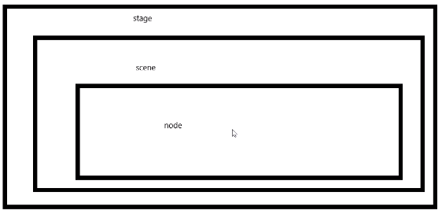

# **JAVAFX** 草稿

作者:子墨


## 一、简介

> 什么是JavaFX

- javafx是java的一个类库，用来开发桌面程序的一套类库
- javafx从jdk8开始就不在内置在jdk里面。需要单独下载
- JavaFX 的外观可以自定义。层叠样式表（CSS）将应用的外观与功能分离，让程序员可以更专注于编码。美工可以简单地通过 CSS 来自定义应用程序的外观。


>  准备工作

- 为了方便我们使用JDK8来对JavafX进行学习
- 如果你的不是JDK8请升级或降级来达到JDK8，或者下载JavaFX的类库来进行开发
- 我们使用工具为IDEA

[Maven](https://openjfx.cn/openjfx-docs/#maven)

[Gradle](https://openjfx.cn/openjfx-docs/#gradle)

[API](https://openjfx.cn/javadoc/15/)

## 二、我的第一个程序HelloWorld

##### 1. 第一个程序

文档：https://openjfx.cn/openjfx-docs/

1. 继承 javafx.application.Application 类 并实现里面的方法
2. 在main方法里运行应用程序`launch(args);`
3. 在start方法里面让窗口显示出来，并设置标题

```java
import javafx.application.Application;
import javafx.stage.Stage;
/**
 * 这是我的第一个程序
 */

public class Main extends Application {
    public static void main(String[] args) {
        //运行
        launch(args);
    }
    @Override
    public void start(Stage primaryStage) throws Exception {
        primaryStage.show();//显示窗口
        primaryStage.setTitle("HelloWorld");//设置标题
    }
}
```


##### 2. javaFX的各种启动方式

1. 继承Application，通过launch方法运行

```java
public class Main extends Application {
    public static void main(String[] args) {
        //运行
        launch(args);
    }
    @Override
    public void start(Stage primaryStage) throws Exception {
        primaryStage.show();//显示窗口
        primaryStage.setTitle("HelloWorld");//设置标题
    }
}
```


2. 继承Application，通过静态launch方法运行

```java
public class Main extends Application {
    public static void main(String[] args) {
        //运行
        Application.launch(args);
    }
    @Override
    public void start(Stage primaryStage) throws Exception {
        primaryStage.show();//显示窗口
        primaryStage.setTitle("HelloWorld");//设置标题
    }
}
```


3.通过静态launch方法运行继承Application的类

```java
public class MyJavaFX extends Application {
    @Override
    public void start(Stage primaryStage) throws Exception {
        primaryStage.show();//显示窗口
        primaryStage.setTitle("HelloWorld");//设置标题
    }
}
```

```java
public class Main  {

    public static void main(String[] args) {
        //运行
        MyJavaFX.launch(MyJavaFX.class,args);
    }
}
```


##### 3. javaFX的生命周期

```java
public class MyJavaFX extends Application {
    @Override
    public void init() throws Exception {
        System.out.println("Application实现类init()方法执行，执行线程为: "+Thread.currentThread().getName());
    }
    @Override
    public void start(Stage primaryStage) throws Exception {
        primaryStage.show();//显示窗口
        primaryStage.setTitle("HelloWorld");//设置标题
        System.out.println("Application实现类start方法执行，执行线程为: "+Thread.currentThread().getName());
    }
    @Override
    public void stop() throws Exception {
        System.out.println("Application实现类 stop()方法执行，执行线程为: "+Thread.currentThread().getName());
    }
}
```

```
Main方法执行，执行线程为: main
Application实现类init()方法执行，执行线程为: JavaFX-Launcher
Application实现类start方法执行，执行线程为: JavaFX Application Thread
Application实现类 stop()方法执行，执行线程为: JavaFX Application Thread
```

通过观察发现，JavaFX程序进行了3个阶段( init--> start---> stop)，每个阶段都有自己的线程


## 三、窗体与模式

##### 1. Stage类介绍

```java
public class Stage  extends Window
    JavaFXStage类是顶级JavaFX容器。初级阶段由平台构建。该应用程序可以构造其他Stage对象。
    Stage对象必须在JavaFX Application Thread上构造和修改。
    JavaFX应用程序线程是在JavaFX运行时启动过程中创建的。有关更多信息，请参见Application类和Platform.startup(Runnable)方法。
    许多Stage属性是只读的，因为它们可以由基础平台在外部进行更改，因此不能绑定。
```

**说人话就是Stage可以创建窗体**

```java
import javafx.application.Application;
import javafx.scene.image.Image;
import javafx.stage.Stage;

public class Main extends Application {
    public static void main(String[] args) {
        launch(args);
    }
    @Override
    public void start(Stage primaryStage) throws Exception {
        primaryStage.setTitle("0");
        primaryStage.show();

        Stage s = new Stage();
        s.setTitle("1");
        s.show();

        Stage s2 = new Stage();
        s2.setTitle("2");
        s2.show();

        Stage s3 = new Stage();
        s3.setTitle("3");
        s3.show();
    }
}
```


##### 2. Stage类的方法

| 修饰符和类型                     | 方法                                                         | 描述                                                         |
| :------------------------------- | :----------------------------------------------------------- | :----------------------------------------------------------- |
| **`ReadOnlyBooleanProperty`**    | **`alwaysOnTopProperty()`****                                | **定义是否将`Stage`其保留在其他窗口之上。**                  |
| **`void`**                       | **`close()`****                                              | **关闭此`Stage`。(关闭窗口)**                                |
| `ObjectProperty<String>`         | `fullScreenExitHintProperty()`                               |                                                              |
| `ObjectProperty<KeyCombination>` | `fullScreenExitKeyProperty()`                                | 获取全屏退出键组合的属性。                                   |
| `ReadOnlyBooleanProperty`        | `fullScreenProperty()`                                       | 指定这是否`Stage`应为未装饰的全屏窗口。                      |
| **==get==**                      |                                                              |                                                              |
| `String`                         | `getFullScreenExitHint()`                                    | 获取属性fullScreenExitHint的值。                             |
| `KeyCombination`                 | `getFullScreenExitKeyCombination()`                          | 获取用于退出全屏模式的当前序列。                             |
| **`ObservableList<Image>`**      | **`getIcons()`**                                             | **获取窗口图标。 (primaryStage.getIcons().add(new Image(URL));来设置图标  图片要相对路径，绝对路径要file:C:\\...,网络也行，图片可以png格式)** |
| **`double`**                     | **`getMaxHeight()**`**                                       | **获取属性maxHeight的值。**                                  |
| **`double`**                     | **`getMaxWidth()**`**                                        | **获取属性maxWidth的值。**                                   |
| **`double`**                     | **`getMinHeight()**`**                                       | **获取属性minHeight的值。**                                  |
| **`double`**                     | **`getMinWidth()**`**                                        | **获取属性minWidth的值。**                                   |
| `Modality`                       | `getModality()`                                              | 检索此阶段的modality属性。                                   |
| `Window`                         | `getOwner()`                                                 | 检索此阶段的所有者窗口，对于未拥有的阶段，检索null。         |
| `StageStyle`                     | `getStyle()`                                                 | 检索此阶段的样式属性。                                       |
| `String`                         | `getTitle()`                                                 | 获取属性标题的值。                                           |
| `double`                         | `getWidth()`                                                 | 获取窗口宽度                                                 |
| `double`                         | `getHeight()`                                                | 获取窗口高度                                                 |
| `double`                         | `getY()`                                                     | 获取窗口的x轴                                                |
| `double`                         | `getY()`                                                     | 获取窗口的x轴                                                |
| **==分割==**                     |                                                              |                                                              |
| `ReadOnlyBooleanProperty`        | `iconifiedProperty()**`                                      | 定义是否`Stage`已图标化。                                    |
| **`void`**                       | **`initModality(Modality modality)`**                        | **指定此阶段的模式。**                                       |
| **`void`**                       | **`initOwner(Window owner)`**                                | **指定此阶段的所有者窗口，对于顶级无人阶段指定为null。**     |
| `void`                           | `initStyle(StageStyle style)`                                | 指定此阶段的样式。                                           |
| `boolean`                        | `isAlwaysOnTop()`                                            | 获取属性alwaysOnTop的值。                                    |
| `boolean`                        | `isFullScreen()`                                             | 获取属性fullScreen的值。                                     |
| `boolean`                        | `isIconified()**`                                            | 获取图标化的属性的值。                                       |
| `boolean`                        | `isMaximized()**`                                            | 获取最大化的属性值。                                         |
| **`boolean`**                    | **`isResizable()`**                                          | **获取可调整大小的属性的值。**                               |
| **`DoubleProperty`**             | **`maxHeightProperty()`**                                    | **定义this的最大高度`Stage`。**                              |
| **`ReadOnlyBooleanProperty`**    | **`maximizedProperty()`**                                    | **定义是否`Stage`最大化。**                                  |
| **`DoubleProperty`**             | **`maxWidthProperty()`**                                     | **定义this的最大宽度`Stage`。**                              |
| **`DoubleProperty`**             | **`minHeightProperty()`**                                    | **定义this的最小高度`Stage`。**                              |
| **`DoubleProperty`**             | **`minWidthProperty()`**                                     | **定义this的最小宽度`Stage`。**                              |
| **`BooleanProperty`**            | **`resizableProperty()`**                                    | **定义能否`Stage`由用户调整大小。**                          |
| **==set==**                      |                                                              |                                                              |
| `void`                           | `setAlwaysOnTop(boolean value)`                              | 设置窗口置顶，不能被其他窗口覆盖                             |
| `void`                           | `setFullScreen(boolean value)`                               | 设置属性fullScreen的值。                                     |
| `void`                           | `setFullScreenExitHint(String value)`                        | 指定当用户进入全屏模式时显示的文本，通常用于指示用户退出全屏模式的方式。 |
| `void`                           | `setFullScreenExitKeyCombination(KeyCombination keyCombination)` | 指定将允许用户退出全屏模式的KeyCombination。                 |
| `void`                           | `setIconified(boolean value)`                                | 设置图标化的属性的值。                                       |
| **`void`**                       | **`setMaxHeight(double value)`**                             | **设置窗口最大高度**                                         |
| **`void`**                       | **`setMaximized(boolean value)`**                            | **设置窗口为最大化。(false 设置最小化)   **                  |
| **`void`**                       | **`setMaxWidth(double value)`**                              | **设置窗口最大宽度。**                                       |
| **`void`**                       | **`setMinHeight(double value)`**                             | **设置窗口最小高度**                                         |
| **`void`**                       | **`setMinWidth(double value)`**                              | **设置窗口最小宽度**                                         |
| **`void`**                       | **`setResizable(boolean value)`**                            | **设置是否允许(用户)调整窗口大小。**                         |
| **`void`**                       | **setWidth(double value)**                                   | **设置窗口宽度**                                             |
| **`void`**                       | **setHeight(double value)**                                  | **设置窗口高度**                                             |
| **`void`**                       | **`setScene(Scene value)`**                                  | **指定此阶段要使用的场景。**                                 |
| **`void`**                       | **`setTitle(String value)`**                                 | **设置窗口的标题的。**                                       |
| `void`                           | `setX(double value)`                                         | 设置窗口x轴的。                                              |
| `void`                           | `setY(double value)`                                         | 设置窗口Y轴的。                                              |
| `void`                           | setOpacity(double value)                                     | 设置窗口透明度,取值范围[0,1]                                 |
| **==分割==**                     |                                                              |                                                              |
| **`void`**                       | **`show()`**                                                 | **尝试通过将可见性设置为true来显示此窗口**                   |
| **`void`**                       | **`showAndWait()`**                                          | **显示此阶段并等待其隐藏（关闭），然后返回到调用方。**       |
| **`StringProperty`**             | **`titleProperty()`**                                        | **定义的标题`Stage`。**                                      |
| **`void`**                       | **`toBack()`**                                               | **发送`Window`到后台。**                                     |
| **`void`**                       | **`toFront()`**                                              | **将`Window`前景带到前台。**                                 |


| 修饰符和类型           | 方法             | 描述                                                         |
| :--------------------- | :--------------- | :----------------------------------------------------------- |
| ReadOnlyDoubleProperty | heightProperty() | 窗口高度属性，可以给他添加监听器来对窗口高度进行监测和定义事件 |
| ReadOnlyDoubleProperty | widthProperty()  | 窗口高度属性，可以给他添加监听器来对窗口宽度进行监测和定义事件 |
| ReadOnlyDoubleProperty | yProperty()      | 窗口Y轴属性,可以给他添加监听器来对窗口Y轴进行监测和定义事件  |
| ReadOnlyDoubleProperty | xProperty()      | 窗口Y轴属性,可以给他添加监听器来对窗口x轴进行监测和定义事件  |

```java
//监听窗口x位置
primaryStage.xProperty().addListener(new ChangeListener<Number>() {
    @Override
    public void changed(ObservableValue<? extends Number> observable, Number oldValue, Number newValue) {
        System.out.print("窗体X轴发生变化   : ");
        System.out.println(oldValue+" ==变为==>  "+newValue);
    }
});

//监听窗口y位置
primaryStage.yProperty().addListener(new ChangeListener<Number>() {
    @Override
    public void changed(ObservableValue<? extends Number> observable, Number oldValue, Number newValue) {
        System.out.print("窗体y轴发生变化   : ");
        System.out.println(oldValue+" ==变为==>  "+newValue);
    }
});

//监听窗体高度
primaryStage.heightProperty().addListener(new ChangeListener<Number>() {
    @Override
    public void changed(ObservableValue<? extends Number> observable, Number oldValue, Number newValue) {
        System.out.print("窗体高度发生变化   : ");
        System.out.println(oldValue+" ==变为==>  "+newValue);
    }
});

//监听窗体宽度
primaryStage.widthProperty().addListener(new ChangeListener<Number>() {
    @Override
    public void changed(ObservableValue<? extends Number> observable, Number oldValue, Number newValue) {
        System.out.print("窗体宽度发生变化   : ");
        System.out.println(oldValue+" ==变为==>  "+newValue);
    }
});
```


##### 3. 窗口风格

Stage具有以下样式之一：

- `StageStyle.DECORATED` -具有纯白色背景和平台装饰的舞台。**默认**
- `StageStyle.UNDECORATED` -具有纯白色背景且没有装饰的舞台。透明背景
- `StageStyle.TRANSPARENT` -具有透明背景且没有装饰的舞台。透明背景
- `StageStyle.UTILITY` -具有纯白色背景和最少平台装饰的舞台。类似弹窗只有一个关闭按钮

```java
@Override
public void start(Stage primaryStage) throws Exception {
    primaryStage.setTitle("风格");

    primaryStage.initStyle(StageStyle.DECORATED);//具有纯白色背景和平台装饰的舞台。 默认
    //        primaryStage.initStyle(StageStyle.UNDECORATED);//具有纯白色背景且没有装饰的舞台。
    //        primaryStage.initStyle(StageStyle.TRANSPARENT);//具有透明背景且没有装饰的舞台。
    //        primaryStage.initStyle(StageStyle.UTILITY);//具有纯白色背景和最少平台装饰的舞台。

    primaryStage.show();
}
```


##### 4. 窗口类型(模态)

阶段具有以下方式之一：

- `Modality.NONE` -一个不阻止任何其他窗口的阶段。（默认）
- `Modality.WINDOW_MODAL`-阻止输入事件从其所有者（父级）传递到其根的所有窗口的阶段。它的根是没有所有者的最近的祖先窗口。（这是一个弹窗，设置后不能操作弹窗的主窗口）
- `Modality.APPLICATION_MODAL` -阻止输入事件从同一应用程序传递到所有窗口的阶段，除了其子层次结构中的事件。（这是一个弹窗，设置后不能操作本应用内其他窗口）

当窗口被模式阶段阻塞时，将保留其相对于其祖先的Z顺序，并且不接收任何输入事件和窗口激活事件，但会继续进行动画处理并正常渲染。请注意，显示模式阶段并不一定会阻止调用方。`show()`无论阶段的方式如何，该 方法都会立即返回。`showAndWait()`如果需要阻止调用者，直到隐藏（关闭）模态阶段，请使用此方法。必须先初始化模态，然后才能使该阶段可见。


```java
    @Override
    public void start(Stage primaryStage) throws Exception {
        primaryStage.setTitle("风格和模态");
        primaryStage.show();


        Stage s = new Stage();
//        s.initModality(Modality.APPLICATION_MODAL);   //（默认）
//        s.initModality(Modality.NONE);	//是一个弹窗，设置后不能操作本应用内其他窗口

        s.initModality(Modality.WINDOW_MODAL);//只能操作s和其他窗口不能操作primaryStage窗口
        s.initOwner(primaryStage);//为这个窗口设置主窗口
        s.show();

        Stage s2 = new Stage();
        s2.setTitle("s2");
        s2.show();

    }
```


#### 注意

1. 在窗口没显示之前是不能获取窗口的高，宽，x,y等。

```java
@Override
public void start(Stage primaryStage) throws Exception {
    System.out.println(primaryStage.getX());
    System.out.println(primaryStage.getWidth());
    primaryStage.show();
}
```

```
NaN
NaN
```


2. 关闭所有窗口后程序关闭，如果有窗口被隐藏没有关闭程序不会停止


## 四、工具类

### 1. Screen

###### ffjio反

描述图形目标（例如监视器）的特征。在桌面区域可以跨越多个物理屏幕设备的虚拟设备多屏幕环境中，`Screen`对象的边界 是相对于的`Screen.primary`。

| 修饰符和类型                    | 方法                | 描述                                   |
| :------------------------------ | :------------------ | :------------------------------------- |
| `Rectangle2D`                   | `getBounds()`       | 获取全部的范围屏幕。                   |
| `double`                        | `getDpi()`          | 获取此的分辨率（每英寸点数）`Screen`。 |
| `static Screen`                 | `getPrimary()`      | 主要的`Screen`。                       |
| `static ObservableList<Screen>` | `getScreens()`      | 可查看的当前可用列表`Screens`。        |
| `Rectangle2D`                   | `getVisualBounds()` | 获取可视范围内的屏幕                   |

```java
@Override
public void start(Stage primaryStage) throws Exception {
    Screen primary = Screen.getPrimary(); //获取主屏幕
    Rectangle2D bounds = primary.getBounds();//获取全部的范围屏幕。
    System.out.println("屏幕最大XY  :"+bounds.getMaxX()+" × "+ bounds.getMaxY());
    System.out.println("屏幕最大宽高 :"+bounds.getWidth()+" × "+ bounds.getHeight());

    Rectangle2D visualBounds = primary.getVisualBounds();//获取可视化范围的屏幕。
    System.out.println("可视屏幕的最大XY  :"+visualBounds.getMaxX()+" × "+ visualBounds.getMaxY());
    System.out.println("可视屏幕的最大宽高 :"+visualBounds.getWidth()+" × "+ visualBounds.getHeight());

    double dpi = primary.getDpi();//获取此的分辨率（每英寸点数)
    System.out.println("DPI ：" + dpi);

    Platform.exit();//退出程序
}
```


### 2. Platform

应用程序平台支持类。

- Platform和start方法是同一个线程 JavaFX Application Thread

| `static ReadOnlyBooleanProperty` | `accessibilityActiveProperty()`                | 指示可访问性是否处于活动状态。                               |
| :------------------------------- | ---------------------------------------------- | ------------------------------------------------------------ |
| `static Object`                  | `enterNestedEventLoop(Object key)`             | 输入一个嵌套的事件循环并阻塞，直到进行相应的exitNestedEventLoop调用为止。 |
| `static void`                    | `exit()`                                       | 使JavaFX应用程序终止。                                       |
| `static void`                    | `exitNestedEventLoop(Object key, Object rval)` | 退出嵌套事件循环并取消阻止相应enterNestedEventLoop的调用方。 |
| `static boolean`                 | `isAccessibilityActive()`                      | 获取属性accessibilityActive的值。                            |
| `static boolean`                 | `isFxApplicationThread()`                      | 如果调用线程是JavaFX Application Thread，则返回true。        |
| `static boolean`                 | `isImplicitExit()`                             | 获取implicitExit属性的值。                                   |
| `static boolean`                 | `isNestedLoopRunning()`                        | 检查嵌套事件循环是否正在运行，返回true表示一个嵌套事件循环，如果当前没有正在运行的嵌套事件循环，则返回false。 |
| `static boolean`                 | `isSupported(ConditionalFeature feature)`      | 查询平台是否支持特定的条件功能。                             |
| `static void`                    | `requestNextPulse()`                           | 请求Java运行时执行脉冲。                                     |
| `static void`                    | `runLater(Runnable runnable)`                  | 将来在某些未指定的时间在JavaFX Application Thread上运行指定的Runnable。 |
| `static void`                    | `setImplicitExit(boolean implicitExit)`        | 当窗口全部被关闭后是否退出程序                               |
| `static void`                    | `startup(Runnable runnable)`                   | 此方法启动JavaFX运行时。                                     |

```java
@Override
public void start(Stage primaryStage) throws Exception {
    //和start是一个线程 JavaFX Application Thread
    //将来在某些未指定的时间在JavaFX Application Thread上运行指定的Runnable。
    Platform.runLater(new Runnable() {
        @Override
        public void run() {
            System.out.println(Thread.currentThread().getName());
        }
    });
    System.out.println(Thread.currentThread().getName());

    //查询平台是否支持特定的条件功能。
    boolean supported = Platform.isSupported(ConditionalFeature.SCENE3D);
    System.out.println("当前电脑是否支持3d: "+supported);

    Platform.exit();//退出
}
```


## 五、Group  和 scene



组件要放在场景里面，场景放在窗体里面

Group  他是一个容器不是一个布局类，仅仅是容器而已

```java
@Override
public void start(Stage primaryStage) throws Exception {
    Group root = new Group();//组件节点
    Scene scene = new Scene(root);//场景
    primaryStage.setScene(scene);//窗体
}
```


> Group类方法

| 修饰符和类型           | 方法                                 | 描述                                                         |
| :--------------------- | :----------------------------------- | :----------------------------------------------------------- |
| `BooleanProperty`      | `autoSizeChildrenProperty()`         | 控制是否`Group`在布局过程中自动将所有可调整大小的子级调整为其首选大小。 |
| `ObservableList<Node>` | `getChildren()`                      | 获取此子项的列表`Group`。                                    |
| `boolean`              | `isAutoSizeChildren()`               | 获取属性autoSizeChildren的值。                               |
| `protected void`       | `layoutChildren()`                   | Group实现layoutChildren，以便在每个子项可调整大小的情况下将其大小调整为其首选大小。 |
| `double`               | `minHeight(double width)`            | 返回用于布局计算的节点的最小高度。                           |
| `double`               | `minWidth(double height)`            | 返回用于布局计算的节点的最小宽度。                           |
| `double`               | `prefHeight(double width)`           | 组将首选高度定义为只是其布局边界的高度，而后者又仅仅是其所有子项的布局边界的并集。 |
| `double`               | `prefWidth(double height)`           | 组将首选宽度定义为只是其布局范围的宽度，而宽度又仅仅是其所有子级的布局范围的并集。 |
| `void`                 | `setAutoSizeChildren(boolean value)` | 设置属性autoSizeChildren的值。                               |


>  Scene类方法

不全

```java
scene.setCursor(Cursor.CLOSED_HAND);//设置鼠标样式
scene.setCursor(Cursor.cursor("https://gimg2.baidu.com/image_search/src=http%3A%2F%2Fbpic.588ku.com%2Felement_origin_min_pic%2F17%2F11%2F27%2F754c03f5facafc06c9f68b0fbce3b6a2.jpg&refer=http%3A%2F%2Fbpic.588ku.com&app=2002&size=f9999,10000&q=a80&n=0&g=0n&fmt=jpeg?sec=1617342447&t=328fe965c396d4aad10ea7504457d2d6"));//设置鼠标样式  图片

//打开网页
HostServices host = getHostServices();
host.showDocument("www.baidu.com");
```


>  单击按键添加一个按键

```java
int i = 0;
@Override
public void start(Stage primaryStage) throws Exception {
    //按钮
    Button button = new Button();
    button.setText("点我");//添加文本
    //确定位置，如果不知道默认在左上角
    button.setLayoutX(170);
    button.setLayoutY(170);

    //组件节点
    Group root = new Group();
    root.getChildren().add(button);//添加控件
    //        root.getChildren().addAll(button);//批量添加控件
    root.setOpacity(1);//设置透明度
    root.setAutoSizeChildren(true);//设置是否给组件设置默认值，默认为true
    //        root.getChildren().remove(0);//清理控件
    //        root.getChildren().clear();//清理所有控件

    Object[] objects = root.getChildren().toArray(); //返回控件数组
    //设置监听，监听控件添加
    root.getChildren().addListener(new ListChangeListener<Node>() {
        @Override
        public void onChanged(Change<? extends Node> c) {
            System.out.println("当前控件数量： "+c.getList().size());
        }
    });

    
    //场景
    Scene scene = new Scene(root);
    //窗体
    primaryStage.setScene(scene);
    //设置单击事件
    button.setOnAction(new EventHandler<ActionEvent>() {
        @Override
        public void handle(ActionEvent event) {
            Button button1 = new Button("按钮" + i);
            button1.setLayoutY(i+50);
            root.getChildren().add(button1);
            i++;
        }
    });
    //设置窗体属性
    primaryStage.setTitle("嘿嘿");
    primaryStage.setWidth(400);
    primaryStage.setHeight(400);
    primaryStage.show();
}
```


## 六、控件

控件大多数继承自 `node` 所以控件之间大多数方法都是相同的，想要看一个控件的方法不光要看控件本身特有的方法还要看其父类的方法，这样才能便于记忆

控件的样式继承自Region，布局继承Labeled，控制继承Control

有些控件无法设置某些样式但是用css或其他可以设置

java.lang.Object

- **javafx.scene.Node**
  - javafx.scene.Parent
    - javafx.scene.layout.Region
      - javafx.scene.control.Control
        - ​	javafx.scene.control.Labeled

### 1. 按钮

#### 1.1 了解Button类

##### 构造方法

| 构造方法                            | 描述                                         |
| :---------------------------------- | :------------------------------------------- |
| `Button()`                          | 创建一个带有空字符串作为其标签的按钮。       |
| `Button(String text)`               | 创建一个带有指定文本作为标签的按钮。         |
| `Button(String text, Node graphic)` | 创建一个带有指定文本和图标作为其标签的按钮。 |


##### 方法

| 修饰符和类型        | 方法                              | 描述                                                         |
| :------------------ | :-------------------------------- | :----------------------------------------------------------- |
| `BooleanProperty`   | `cancelButtonProperty()`          | 如果场景中没有其他节点消耗它，则“取消按钮”是接收键盘VK_ESC按下的按钮。 |
| `protected Skin<?>` | `createDefaultSkin()`             | 为此控件创建默认外观的新实例。                               |
| `BooleanProperty`   | `defaultButtonProperty()`         | 如果场景中没有其他节点使用它，则默认按钮是接收键盘VK_ENTER按下的按钮。 |
| `void`              | `fire()`                          | 当用户手势指示应发生此按钮库的事件时调用。                   |
| `boolean`           | `isCancelButton()`                | 获取属性取消按钮的值。                                       |
| `boolean`           | `isDefaultButton()`               | 获取属性默认按钮的值。                                       |
| `void`              | `setCancelButton(boolean value)`  | 设置属性取消按钮的值。                                       |
| `void`              | `setDefaultButton(boolean value)` | 设置属性默认按钮的值。                                       |
| void                | setManaged(boolend b)             | 是否让控件消失                                               |
| void                | setVisible(boolend b)             | 隐藏控件                                                     |


##### 继承结构

java.lang.Object

- javafx.scene.Node
  - javafx.scene.Parent
    - javafx.scene.layout.Region
      - javafx.scene.control.Control
        - ​	javafx.scene.control.Labeled
          - ​	javafx.scene.control.ButtonBase
            - ​	javafx.scene.control.Button

##### javafx.scene.layout.Region

Region是所有基于JavaFX Node的UI控件以及所有布局容器的基类。它是可调整大小的父节点，可以从CSS设置样式。它可以有多个背景和边框。它旨在支持与JavaFX相关的尽可能多的CSS3规范，用于背景和边框。完整的规范可在[W3C获得](http://www.w3.org/TR/2012/CR-css3-background-20120724/)。


##### 实例

```java
@Override
public void start(Stage primaryStage) throws Exception {

    //设置scene
    Group root = new Group();
    Scene scene = new Scene(root);
    primaryStage.setScene(scene);

    //添加按键到节点
    root.getChildren().addAll(button1(),css());

    //设置窗体
    primaryStage.setTitle("按钮控件");
    primaryStage.setWidth(800);
    primaryStage.setHeight(800);
    primaryStage.show();
}

//定义一个按钮
Button button1 (){
    Button button = new Button("按钮1");
    //设置位置
    button.setLayoutY(100);
    button.setLayoutX(100);
    //设置大小
    button.setPrefHeight(200);
    button.setPrefWidth(200);
    //设置字体
    button.setFont(Font.font("楷体",20));
    //设置背景，可以查看类API进一步定制
    //红、绿、蓝、透明度  #00 00 00 00
    BackgroundFill fill = new BackgroundFill(Paint.valueOf("#ef5b9c"),new CornerRadii(25),new Insets(5));//颜色，圆角，偏移量(按钮离边框的距离 上下左右同一指定10)
    Background background = new Background(fill);
    button.setBackground(background);
    //设置边框
    BorderStroke borderStroke = new BorderStroke(Paint.valueOf("#009ad6"),BorderStrokeStyle.DASHED, new CornerRadii(30),
                                                 new BorderWidths(2),new Insets(0));//颜色，类型，圆角，宽度，[偏移量: 边框和按钮的距离]
    Border border = new Border(borderStroke);
    button.setBorder(border);

    return button;
}

//定义一个按钮 css 编写按钮样式 简单应用
Button css(){
    Button button = new Button("css");
    //设置位置
    button.setLayoutY(400);
    button.setLayoutX(400);
    //设置大小
    button.setPrefHeight(200);
    button.setPrefWidth(200);
    //设置字体
    button.setFont(Font.font("楷体",20));
    //css设置样式
    button.setStyle("-fx-background-color: #aaee00;" +  /* 设置按键背景颜色*/
                    "-fx-background-radius: 20;" +              /* 设置按键圆角颜色*/
                    "-fx-text-fill: #00eea0;"+                   /* 设置字体颜色*/
                    "-fx-border-style: dashed ;" +              /*设置边框*/
                    "-fx-border-color: #aa00EE;" +
                    "-fx-border-radius: 25;" +
                    "-fx-border-width: 2"
                   );

    return button;
}
```


#### 1.2 按钮事件

##### 单击事件

```java
Button b = new Button("按钮1");
b.setOnAction(new EventHandler<ActionEvent>() {
    @Override
    public void handle(ActionEvent event) {
        //获取被单击的按钮对象
        Button b = (Button) event.getSource();
        //获取这个按键的文本
        String text = b.getText();
        System.out.println(text+"被单击了");
    }
});
```

##### 多击事件

1. 为按键添加事件处理程序
   - addEventFilter();//父向子类传值
   - addEventHandler(); //子向父类传值
2. 参数传入鼠标单击事件`MouseEvent.MOUSE_CLICKED`(鼠标其他事件看MouseEvent去)
3. 添加一个事件处理内部类`EventHandler`，事件填鼠标事件`MouseEvent`,实现handle()方法
4. event.getClickCount() 获取鼠标单击次数
5. **注意导包 ，导入javafx的包，其他的不要**

```java
//为按钮添加多击事件
Button b = new Button("按钮1");
//       b.addEventFilter();//父向子类传值
//       b.addEventHandler(); //子向父类传值
/*
   MouseEvent 鼠标事件
   MOUSE_CLICKED 点击事件
   注意导包
*/
b.addEventHandler(MouseEvent.MOUSE_CLICKED,new EventHandler<MouseEvent>(){
    @Override
    public void handle(MouseEvent event) {
        System.out.println(((Button)event.getSource()).getText()+"被单击了");
        if (event.getClickCount()==2) System.out.println(((Button)event.getSource()).getText()+"被双击了");
        if (event.getClickCount()==3) System.out.println(((Button)event.getSource()).getText()+"被三击了");
    }
});
```


##### 鼠标按键绑定

1. 为按键添加事件处理程序
   - addEventFilter();//父向子类传值
   - addEventHandler(); //子向父类传值
2. 参数传入鼠标单击事件`MouseEvent.MOUSE_CLICKED`(鼠标其他事件看MouseEvent去)
3. 添加一个事件处理内部类`EventHandler`，事件填鼠标事件`MouseEvent`,实现handle()方法
4. event.getClickCount() 获取鼠标单击次数
5. event.getButton() 获取被鼠标的哪个键点击了 （返回枚举类型）
   - event.getButton().name()   返回字符串类型
6. MouseButton.PRIMARY  获取鼠标的左键返回枚举类型）
   - MouseButton.PRIMARY.name()  返回字符串类型
7. 如果按键被左键双击就执行    if ((event.getClickCount()==2) && (event.getButton().name()).equals(MouseButton.PRIMARY.name()))
8. **注意导包 ，导入javafx的包，其他的不要**

```java
//为按钮添加多击事件
Button b = new Button("按钮1");

/*
   MouseEvent 鼠标事件
   MOUSE_CLICKED 点击事件
   event.getButton().name()   返回字符串类型
   MouseButton.PRIMARY.name()  返回字符串类型
   event.getClickCount() 获取鼠标单击次数
   注意导包
*/
b.addEventHandler(MouseEvent.MOUSE_CLICKED,new EventHandler<MouseEvent>(){
    @Override
    public void handle(MouseEvent event) {
        if ((event.getClickCount()==2) && (event.getButton().name()).equals(MouseButton.PRIMARY.name())){
                    System.out.println("按钮被左键双击");
         }
    }
});
```


> 按键监听

1. 设置监听
   - setOnKeyPressed  监听键盘按键按下
   - setOnKeyReleased 监听键盘按键释放
2. event.getCode() 获取键盘按下的键 (返回枚举)
   - event.getCode().name() 	(返回字符串)
   - event.getCode().getName()  (返回字符串)
3. KeyCode.S  (返回枚举)
   - KeyCode.S.name() 	(返回字符串)
   - KeyCode.S.getName()  (返回字符串)

```java
//按键按下
b.setOnKeyPressed(new EventHandler<KeyEvent>() {
    @Override
    public void handle(KeyEvent event) {
        //                if (event.getCode().name().equals("S")){
        //                    System.out.println("S 被按下");
        //                }
        if (event.getCode().getName().equals(KeyCode.S.getName())){
            System.out.println("S 被按下");
        }
    }
});


//按键释放
b.setOnKeyReleased(new EventHandler<KeyEvent>() {
    @Override
    public void handle(KeyEvent event) {
        if (event.getCode().getName().equals(KeyCode.S.getName())){
            System.out.println("S 被释放");
        }
    }
});
```


##### 设置快捷键

**第一种：**

```java
Button b1 =new  Button("new");
KeyCodeCombination kc1 = new KeyCodeCombination(KeyCode.W, KeyCodeCombination.CONTROL_DOWN);
Mnemonic mnemonic1 = new Mnemonic(b1, kc1);
scene.addMnemonic(mnemonic1);
解析：
KeyCodeCombination是一个继承KeyCombination的一个类这个创建KeyCodeCombination的对象，在构造方法内写入快件键的按键。
Mnemonic类似于监听器绑定的东西，你创建了监听器你需要绑定控件，new一个Mnemonic的对象就行了。
```

**第二种：(几乎没用过)**

```java
Button b1 =new  Button("new");
KeyCodeCombination kc1 = new KeyCodeCombination("W", KeyCodeCombination.CONTROL_DOWN);
Mnemonic mnemonic1 = new Mnemonic(b1, kc1);
scene.addMnemonic(mnemonic1);
解析：
这个方法与上一个比，只是改变了KeyCodeCombination构造方法的内容,直接用字符串的形式也是可以的。
```

**第三种：(推荐使用)**


```java
KeyCodeCombination kc1 = new KeyCodeCombination(KeyCode.W, KeyCodeCombination.CONTROL_DOWN);
    scene.getAccelerators().put(kc1, new Runnable() {

        @Override
        public void run() {
            System.out.println("事件");
        }
});
解析：
这个方法非常灵活,但是你会发现他没有和按钮绑定，也就是说，他可以设置全局的快捷方式。如果需要和按钮绑定，方法很简单，调用按钮的方法就行了！(可以用封装的方法)
还可以用b1.fire()哦 他会去点击按钮
注意：他不是创建了新的线程。
```


### 2. 输入框

文本输入组件，允许用户输入单行未格式化的文本。与JavaFX的早期版本不同，TextField控件不提供对多行输入的支持，但这是控件的唯一目的[`TextArea`](https://openjfx.cn/javadoc/15/javafx.controls/javafx/scene/control/TextArea.html)。另外，如果您想要一种格式的富文本编辑，则还有一个 [`HTMLEditor`](https://openjfx.cn/javadoc/15/javafx.web/javafx/scene/web/HTMLEditor.html)控件。

TextField支持在TextField[`prompt text`](https://openjfx.cn/javadoc/15/javafx.controls/javafx/scene/control/TextInputControl.html#promptTextProperty()) 中不存在时[`text`](https://openjfx.cn/javadoc/15/javafx.controls/javafx/scene/control/TextInputControl.html#textProperty())（通过用户或通过编程设置）向用户显示的概念。这是一种通知用户有关文本字段中预期内容的有用方法，而无需诉诸[`tooltips`](https://openjfx.cn/javadoc/15/javafx.controls/javafx/scene/control/Tooltip.html)或在屏幕上进行[`labels`](https://openjfx.cn/javadoc/15/javafx.controls/javafx/scene/control/Label.html)。

##### 继承

java.lang.Object

- **javafx.scene.Node**
  - javafx.scene.Parent
    - **javafx.scene.layout.Region**
      - javafx.scene.control.Control
        - javafx.scene.control.TextInputControl
          - javafx.scene.control.TextField


##### 方法

| 修饰符和类型                                      | 方法                                           | 描述                                                         |
| :------------------------------------------------ | :--------------------------------------------- | :----------------------------------------------------------- |
| `ObjectProperty<Pos>`                             | `alignmentProperty()`                          | 指定当TextField中有空白时如何对齐文本。                      |
| `protected Skin<?>`                               | `createDefaultSkin()`                          | 为此控件创建默认外观的新实例。                               |
| `Pos`                                             | `getAlignment()`                               | 获取属性对齐方式的值。                                       |
| `CharSequence`                                    | `getCharacters()`                              | 返回支持文本字段内容的字符序列。                             |
| `static List<CssMetaData<? extends Styleable,?>>` | `getClassCssMetaData()`                        |                                                              |
| `List<CssMetaData<? extends Styleable,?>>`        | `getControlCssMetaData()`                      |                                                              |
| `EventHandler<ActionEvent>`                       | `getOnAction()`                                | 获取属性onAction的值。                                       |
| `int`                                             | `getPrefColumnCount()`                         | 获取属性prefColumnCount的值。                                |
| `ObjectProperty<EventHandler<ActionEvent>>`       | `onActionProperty()`                           | 与此文本字段关联的操作处理程序，或者`null`如果未分配任何操作处理程序， 则为该操作处理程序。 |
| `IntegerProperty`                                 | `prefColumnCountProperty()`                    | 文本列的首选数量。                                           |
| `void`                                            | `setAlignment(Pos value)`                      | 设置属性对齐方式的值。                                       |
| `void`                                            | `setOnAction(EventHandler<ActionEvent> value)` | 设置属性onAction的值。                                       |
| `void`                                            | `setPrefColumnCount(int value)`                | 设置属性prefColumnCount的值。                                |


##### 例子

```java
@Override
public void start(Stage primaryStage) throws Exception {
    Group root = new Group();
    //输入框
    TextField text = addSelectedText(addTestInputEvents(getText()));
    root.getChildren().addAll(addEventHandlers(text));

    Scene scene = new Scene(root);
    primaryStage.setScene(scene);
    primaryStage.setTitle("输入框");
    primaryStage.setHeight(800);
    primaryStage.setWidth(800);
    primaryStage.show();
}

//创建一个输入框
TextField getText(){
    TextField text = new TextField();
    //给输入框添加文本
    text.setText("");
    //设置位置
    text.setLayoutX(100);
    text.setLayoutY(100);
    //设置提示信息
    text.setTooltip(getTip());
    //设置提示文本
    text.setPromptText("请输入7个字文本");
    //让输入框失去焦点
    text.setFocusTraversable(false);

    return text;
}

//创建一个提示信息
Tooltip getTip(){
    Tooltip tip  = new Tooltip();
    //设置提示内容
    tip.setText("这是一个输入框");
    //设置字体
    tip.setFont(Font.font("楷体",12));
    //设置提示框的颜色
    tip.setStyle("-fx-background-color: #aaee0088;" +  /* 设置提示信息颜色*/
                 "-fx-background-radius: 20;" +              /* 设置提示信息颜色*/
                 "-fx-text-fill: #272727;"+                   /* 设置字体颜色*/
                 "-fx-border-style: dashed ;" +              /*设置边框*/
                 "-fx-border-color: #aa00EE;" +
                 "-fx-border-radius: 25;" +
                 "-fx-border-width: 2");
    return tip;
}

//输入框输入监听
//监听输入框的输入的内容
TextField addTestInputEvents(TextField text){
    text.textProperty().addListener(new ChangeListener<String>() {
        @Override
        public void changed(ObservableValue<? extends String> observable, String oldValue, String newValue) {
            System.out.println("文本框内容: "+newValue);
            //判断如果用户输入字符大于7个就让设置输入框内容为上一次的内容
            //禁止输入7个字符以上
            if (newValue.length()>7){
                text.setText(oldValue);
            }
        }
    });
    return  text;
}

//输入框文本选择监听
//监听输入框中被选择的内容是什么
TextField addSelectedText(TextField text){
    text.selectedTextProperty().addListener(new ChangeListener<String>() {
        @Override
        public void changed(ObservableValue<? extends String> observable, String oldValue, String newValue) {
            System.out.println("文本框选择了: "+newValue);
        }
    });
    return  text;
}

//文本框事件处理
//这里处理单击事件
TextField addEventHandlers(TextField text){
    text.addEventHandler(MouseEvent.MOUSE_PRESSED, new EventHandler<MouseEvent>() {
        @Override
        public void handle(MouseEvent event) {
            System.out.println("输入框被单击了");
        }
    });
    return  text;
}
```


### 3. 密码框

##### 继承

- [java.lang.Object](https://docs.oracle.com/en/java/javase/12/docs/api/java.base/java/lang/Object.html?is-external=true)
  - [javafx.scene.Node](https://openjfx.cn/javadoc/15/javafx.graphics/javafx/scene/Node.html)
    - [javafx.scene.Parent](https://openjfx.cn/javadoc/15/javafx.graphics/javafx/scene/Parent.html)
      - [javafx.scene.layout.Region](https://openjfx.cn/javadoc/15/javafx.graphics/javafx/scene/layout/Region.html)
        - [javafx.scene.control.Control](https://openjfx.cn/javadoc/15/javafx.controls/javafx/scene/control/Control.html)
          - [javafx.scene.control.TextInputControl](https://openjfx.cn/javadoc/15/javafx.controls/javafx/scene/control/TextInputControl.html)
            - [javafx.scene.control.TextField](https://openjfx.cn/javadoc/15/javafx.controls/javafx/scene/control/TextField.html)
              - javafx.scene.control.PasswordField

##### 方法

| 修饰符和类型 | 方法                                                         | 描述                               |
| :----------- | :----------------------------------------------------------- | :--------------------------------- |
| `void`       | `copy()`                                                     | 对PasswordField不执行任何操作。    |
| `void`       | `cut()`                                                      | 对PasswordField不执行任何操作。    |
| `Object`     | `queryAccessibleAttribute(AccessibleAttribute attribute, Object... parameters)` | 辅助技术调用此方法以请求属性的值。 |

##### 例子

```java
@Override
public void start(Stage primaryStage) throws Exception {
    Group root = new Group();
    //密码框
    PasswordField psd = getPsd(); //创建密码框的方法
    psd = addPsdInputEvents(psd);//添加输入事件
    psd = addSelectedText(psd);//添加选择事件
    psd = addEventHandlers(psd);//添加单击事件
    root.getChildren().addAll(psd);

    Scene scene = new Scene(root);
    primaryStage.setScene(scene);
    primaryStage.setTitle("密码框");
    primaryStage.setHeight(800);
    primaryStage.setWidth(800);
    primaryStage.show();
}

//创建一个密码框
PasswordField getPsd(){
    PasswordField psd = new PasswordField();
    //给密码框添加文本
    psd.setText("");
    //设置位置
    psd.setLayoutX(100);
    psd.setLayoutY(100);
    //设置提示信息
    psd.setTooltip(getTip());
    //设置提示文本
    psd.setPromptText("请输入密码");
    //让输入框失去焦点
    psd.setFocusTraversable(false);

    return psd;
}

//创建一个提示信息
Tooltip getTip(){
    Tooltip tip  = new Tooltip();
    //设置提示内容
    tip.setText("限制7个字符");
    //设置字体
    tip.setFont(Font.font("楷体",12));
    //设置提示框的颜色
    tip.setStyle("-fx-background-color: #aaee0088;" +  /* 设置提示信息颜色*/
                 "-fx-background-radius: 20;" +              /* 设置提示信息颜色*/
                 "-fx-text-fill: #272727;"+                   /* 设置字体颜色*/
                 "-fx-border-style: dashed ;" +              /*设置边框*/
                 "-fx-border-color: #aa00EE;" +
                 "-fx-border-radius: 25;" +
                 "-fx-border-width: 2");
    return tip;
}

//密码框输入监听
//监听密码框的输入的内容
PasswordField addPsdInputEvents(PasswordField psd){
    psd.textProperty().addListener(new ChangeListener<String>() {
        @Override
        public void changed(ObservableValue<? extends String> observable, String oldValue, String newValue) {
            System.out.println("密码框内容: "+newValue);
            //判断如果用户输入字符大于7个就让设置输入框内容为上一次的内容
            //禁止输入7个字符以上
            if (newValue.length()>7){
                psd.setText(oldValue);
            }
        }
    });
    return  psd;
}

//密码框文本选择监听
//监听输密码框中被选择的内容是什么
PasswordField addSelectedText(PasswordField psd){
    psd.selectedTextProperty().addListener(new ChangeListener<String>() {
        @Override
        public void changed(ObservableValue<? extends String> observable, String oldValue, String newValue) {
            System.out.println("密码框选择了: "+newValue);
        }
    });
    return  psd;
}

//密码框事件处理
//这里处理单击事件
PasswordField addEventHandlers(PasswordField psd){
    psd.addEventHandler(MouseEvent.MOUSE_PRESSED, new EventHandler<MouseEvent>() {
        @Override
        public void handle(MouseEvent event) {
            System.out.println("密码框被单击了");
        }
    });
    return  psd;
}
```


### 4.  标签

标签是不可编辑的文本控件。标签对于显示适合特定空间的文本很有用，因此可能需要使用省略号或截断符来调整字符串的大小以适合文本。标签也很有用，因为它们可以具有助记符，如果使用助记符，它将把焦点发送到列为该`labelFor`属性目标的控件。

标签将focusTraversable设置为false。

##### 继承

- [java.lang.Object](https://docs.oracle.com/en/java/javase/12/docs/api/java.base/java/lang/Object.html?is-external=true)
  - [javafx.scene.Node](https://openjfx.cn/javadoc/15/javafx.graphics/javafx/scene/Node.html)
    - [javafx.scene.Parent](https://openjfx.cn/javadoc/15/javafx.graphics/javafx/scene/Parent.html)
      - [javafx.scene.layout.Region](https://openjfx.cn/javadoc/15/javafx.graphics/javafx/scene/layout/Region.html)
        - [javafx.scene.control.Control](https://openjfx.cn/javadoc/15/javafx.controls/javafx/scene/control/Control.html)
          - [javafx.scene.control.Labeled](https://openjfx.cn/javadoc/15/javafx.controls/javafx/scene/control/Labeled.html)
            - javafx.scene.control.Label

##### 属性

| Type                   | Property   | Description                        |
| :--------------------- | :--------- | :--------------------------------- |
| `ObjectProperty<Node>` | `labelFor` | 标签可以充当其他控件或节点的标签。 |

##### 方法

| 修饰符和类型           | 方法                           | 描述                                                         |
| :--------------------- | :----------------------------- | :----------------------------------------------------------- |
| `protected Skin<?>`    | `createDefaultSkin()`          | 为此控件创建默认外观的新实例。                               |
| `protected Boolean`    | `getInitialFocusTraversable()` | 返回此控件的初始焦点可遍历状态，供JavaFX CSS引擎用来正确设置其初始值。 |
| `Node`                 | `getLabelFor()`                | 获取属性labelFor的值。                                       |
| `ObjectProperty<Node>` | `labelForProperty()`           | 标签可以充当其他控件或节点的标签。                           |
| `void`                 | `setLabelFor(Node value)`      | 设置属性labelFor的值。                                       |

##### 例子

### 控件END


## 七、布局

### **1. [AnchorPane](https://openjfx.cn/javadoc/15/javafx.graphics/javafx/scene/layout/AnchorPane.html#())**

- 锚点布局/绝对布局，在布局中不允许子级(控件)自己设置位置。
- 可以对布局类进行设置和美化
- 可以在布局了里面添加一个布局类，不局限于控件，由于子级布局类没有宽和高所以不可见(对子级布局类设置背景颜色)
- 如果子布局里面有控件那么我们根布局是无法直接控制那个控件的因为那个控件只受到子布局影响
- 布局时对子级四边设置锚点后会托管子级的宽高
- 如果对子布局不设置宽高，位置等子布局会不可见
- 用法与Group类似
- 这里不给例子了，因为没啥东西

##### 继承

- [java.lang.Object](https://docs.oracle.com/en/java/javase/12/docs/api/java.base/java/lang/Object.html?is-external=true)
  - [javafx.scene.Node](https://openjfx.cn/javadoc/15/javafx.graphics/javafx/scene/Node.html)
    - [javafx.scene.Parent](https://openjfx.cn/javadoc/15/javafx.graphics/javafx/scene/Parent.html)
      - [javafx.scene.layout.Region](https://openjfx.cn/javadoc/15/javafx.graphics/javafx/scene/layout/Region.html)
        - [javafx.scene.layout.Pane](https://openjfx.cn/javadoc/15/javafx.graphics/javafx/scene/layout/Pane.html)
          - javafx.scene.layout.AnchorPane


##### 方法

| 修饰符和类型       | 方法                                        | 描述                                                         |
| :----------------- | :------------------------------------------ | :----------------------------------------------------------- |
| `static void`      | `clearConstraints(Node child)`              | 从子节点删除所有锚定窗格约束。                               |
| `protected double` | `computeMinHeight(double width)`            | 计算该区域的最小高度。                                       |
| `protected double` | `computeMinWidth(double height)`            | 计算该区域的最小宽度。                                       |
| `protected double` | `computePrefHeight(double width)`           | 计算给定宽度下该区域的首选高度；区域子类应重写此方法，以根据其内容和布局策略返回适当的值。 |
| `protected double` | `computePrefWidth(double height)`           | 对于给定的高度，计算该区域的首选宽度。                       |
| `static Double`    | `getBottomAnchor(Node child)`               | 如果设置，则返回子项的底部锚点约束。                         |
| `static Double`    | `getLeftAnchor(Node child)`                 | 返回孩子的左锚约束（如果已设置）。                           |
| `static Double`    | `getRightAnchor(Node child)`                | 返回孩子的右锚约束（如果已设置）。                           |
| `static Double`    | `getTopAnchor(Node child)`                  | 如果设置，则返回子项的顶部锚点约束。                         |
| `protected void`   | `layoutChildren()`                          | 在布局通行证期间调用以在此布局子级 `Parent`。                |
| `static void`      | `setBottomAnchor(Node child, Double value)` | 设置锚窗格中包含的子项与底部的距离                           |
| `static void`      | `setLeftAnchor(Node child, Double value)`   | 设置在锚窗格中时为孩子设置左锚的距离                         |
| `static void`      | `setRightAnchor(Node child, Double value)`  | 设置在锚窗格中时为孩子设置正确的锚的距离                     |
| `static void`      | `setTopAnchor(Node child, Double value)`    | 在锚定窗格中包含该子级时，设置子项的顶部锚定的距离           |


## 拓展

### 颜色

```
//红、绿、蓝、透明度  #00 00 00 00
```

