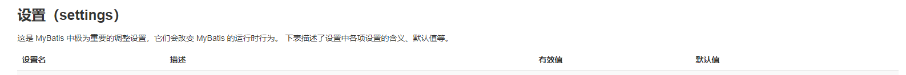
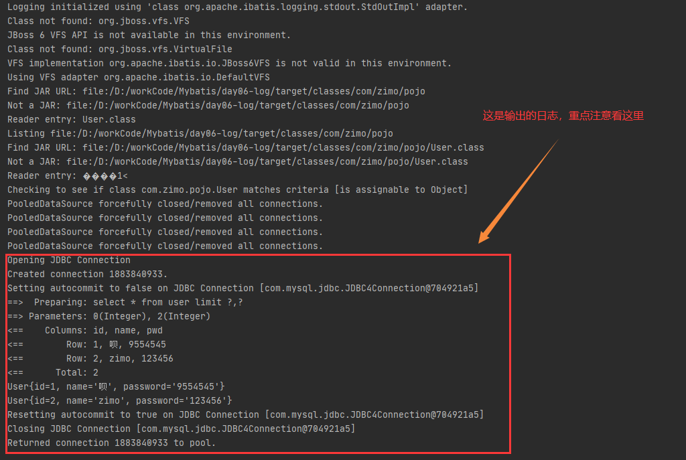

# MyBatis

Mysql 5.7 下载:https://cdn.mysql.com//archives/mysql-5.7/mysql-5.7.19-winx64.zip

MyBatis-9.28  官网文档:https://mybatis.org/mybatis-3/zh/index.html

github：https://github.com/mybatis/mybatis-3

github中文源码注释:https://github.com/tuguangquan/mybatis

## 一、初识Mybatis

### 1.简介

* MyBatis 是一款优秀的**持久层框架**
* 它支持自定义 SQL、存储过程以及高级映射。
* **MyBatis 免除了几乎所有的 JDBC 代码以及设置参数和获取结果集的工作**。
* MyBatis 可以通过简单的 XML 或注解来配置和映射原始类型、接口和 Java POJO（Plain Old Java Objects，普通老式 Java 对象）为数据库中的记录。
* MyBatis 原本是**apache**的一个[开源项目](https://baike.baidu.com/item/开源项目/3406069)**iBatis**, 2010年这个[项目](https://baike.baidu.com/item/项目/477803)由apache software foundation 迁移到了[google code](https://baike.baidu.com/item/google code/2346604)，并且改名为MyBatis 。**2013年11月迁移到[Github](https://baike.baidu.com/item/Github/10145341)。**

### 2.持久化

数据持久化

-  持久化就是将程序的数据在持久状态和瞬时状态的转化
-  内存：断电即失

**为什么要持久化**

- 有一些对象，不能让他丢掉
- 内存太贵

### 3.持久层

- 完成持久化工作的代码块
- 层界限十分明显

### 4.为什么需要MyBatis？

- 帮助程序员将数据存入数据库中
- 方便
- 将传统复杂的JDBC简化，自动化的框架
- 使用的人多
- 优点
  - 简单易学
  - 灵活
  - 解除sql与程序代码的耦合
  - 提供映射标签，支持对象与数据库的orm字段关系映射
  - 提供对象关系映射标签，支持对象关系组建维护
  - 提供xml标签，支持编写动态sql

## 二、Maven仓库坐标

```xml
<!-- mysql驱动  -->
<dependency>
    <groupId>mysql</groupId>
    <artifactId>mysql-connector-java</artifactId>
    <version>5.1.46</version>
</dependency>

<!-- https://mvnrepository.com/artifact/org.mybatis/mybatis -->
<!-- mybatis  -->
<dependency>
    <groupId>org.mybatis</groupId>
    <artifactId>mybatis</artifactId>
    <version>3.5.2</version>
</dependency>
```

## 三、第一个Mybatis的程序 HelloWord

### 1. 搭建环境

* 数据库 mybatis

```mysql
# 创建 mybatis 数据库
CREATE DATABASE mybatis;
USE mybatis;

# 创建表
CREATE TABLE USER(
	# 非空主键
	id INT(20) NOT NULL PRIMARY KEY,
	# 默认空值
	NAME VARCHAR(30) DEFAULT NULL,
	# 默认空值
	pwd VARCHAR (30) DEFAULT NULL
	# 设置默认编码
)ENGINE=INNODB DEFAULT CHARSET=utf8;

#添加数据
INSERT INTO USER 
(id,NAME,pwd) 
VALUES 
(1,'子墨','123456'),
(2,'zimo','123456'),
(3,'紫陌','123456'),
(4,'张三','123456'),
(5,'李四','123456');

```

- pom.xml 导包

```xml
<!-- mysql驱动  -->
<dependency>
    <groupId>mysql</groupId>
    <artifactId>mysql-connector-java</artifactId>
    <version>5.1.46</version>
</dependency>

<!-- mybatis  -->
<dependency>
    <groupId>org.mybatis</groupId>
    <artifactId>mybatis</artifactId>
    <version>3.5.2</version>
</dependency>

<!-- junit  -->
<dependency>
    <groupId>junit</groupId>
    <artifactId>junit</artifactId>
    <version>4.12</version>
    <scope>test</scope>
</dependency>
```

### 2. 编写代码

- resources/mybatis-config.xml

```xml
<?xml version="1.0" encoding="UTF-8" ?>
<!DOCTYPE configuration
        PUBLIC "-//mybatis.org//DTD Config 3.0//EN"
        "http://mybatis.org/dtd/mybatis-3-config.dtd">
<!--核心配置文件-->
<configuration>
<!--  环境们  -->
    <environments default="development">
        <environment id="development">
            <!--  使用的是JDBC的事务管理  -->
            <transactionManager type="JDBC"/>
            <dataSource type="POOLED">
                <!--  驱动  -->
                <property name="driver" value="com.mysql.jdbc.Driver"/>
                <!--  数据库地址  -->
                <!--
                连接:jdbc:mysql://localhost:3306
                数据库: mybatis
                安全连接： useSSL=true
                转义&：&amp;
                设置编码:useUnicode=true&amp;characterEncoding=UTF-8
                -->
                <property name="url" value="jdbc:mysql://localhost:3306/mybatis?useSSL=true&amp;useUnicode=true&amp;characterEncoding=UTF-8"/>
                <!--  用户名  -->
                <property name="username" value="root"/>
                <!--  密码  -->
                <property name="password" value="123"/>
            </dataSource>
        </environment>
    </environments>


</configuration>
```


- com.zimo.utils.MybatisUtils	工具类用来获取 SqlSession 对象

```java
//从SqlSessionFactory 对象获取 SqlSession 对象
public class MybatisUtils {
    private static String resource;
    private static InputStream inputStream;
    private static SqlSessionFactory sqlSessionFactory;

    static {
        try {
            //获取 SqlSessionFactory 对象
            resource ="mybatis-config.xml";
            inputStream = Resources.getResourceAsStream(resource);
            sqlSessionFactory = new SqlSessionFactoryBuilder().build(inputStream);
        } catch (IOException e){
            e.printStackTrace();
        }
    }

    //获取 SqlSession 对象
    public static SqlSession getSqlSession(){
        return sqlSessionFactory.openSession();
    }

}
```


- DAO 层
- com.zimo.dao.UserDao

```java
//mapper
public interface UserDao {
    //里面存储User对象相当于数据库中的每一条记录
    List<User> getUserList();
}
```

- UserMapper.xml

```xml
<?xml version="1.0" encoding="UTF-8" ?>
<!DOCTYPE mapper
        PUBLIC "-//mybatis.org//DTD Mapper 3.0//EN"
        "http://mybatis.org/dtd/mybatis-3-mapper.dtd">
<!-- namespace = 绑定一个对应的Dao/mapper接口-->
<!-- 绑定com.zimo.dao.UserDao 接口-->
<mapper namespace="com.zimo.dao.UserDao">

<!--  select 查找语句 :查询mybatis下的user字段 -->
<!--  执行后的结果放入 getUserList 中 -->
<!--  resultType:返回一个结果,参数填返回的类型，他的类型是User 所以放入User的全限定名  -->
<!--  resultType：返回多个结果 -->
    <select id="getUserList" resultType="com.zimo.pojo.User">
        select  * from mybatis.user;
    </select>

</mapper>
```


- POJO
- com.zimo.pojo.User

```java
//每一个User对象都对应着一条数据库记录
public class User {
    //这里的属性对应数据库表中文档每一个字段
    private int id;
    private String name;
    private String pwd;
    
    //....
    //省略get/set、toSting、有参构造、无参构造方法
}
```


### 3. 测试

- com.zimo.dao.UserDaoTest


```java
@Test
    public void test(){
        //获取SqlSession 对象
        SqlSession sqlSession = null;

        try {
            //获取SqlSession 对象
            sqlSession = MybatisUtils.getSqlSession();
            //执行SQL

            //方式一:getMapper
            UserDao mapper = sqlSession.getMapper(UserDao.class);
            List<User> userList = mapper.getUserList();

            //方式二（不建议使用,方法佼老）：
//        List<User> userList = sqlSession.selectList("com.zimo.dao.UserDao.getUserList");

            //输出结果
            for (User u:userList) {
                System.out.println(u);
            }
        }catch (Exception e){

        }finally {
            //关闭sqlsession
            sqlSession.close();
        }
    }
```


### 4. 注意: 

1. **未将UserDao注册到注册中心之中**

   

   每一个Mapper.XML都需要在MyBatis核心配置文件中注册

```java
org.apache.ibatis.binding.BindingException: Type interface com.zimo.dao.UserDao is not known to the MapperRegistry.
```

​	

​	resources/mybatis-config.xml 添加：

```xml
<!--  每一个Mapper.XML都需要在MyBatis核心配置文件中注册  -->
<mappers>
    <mapper resource="com\zimo\dao\UserMapper.xml" />
</mappers>
```


2. **找不到Mapper.XML配置文件**

```xml
The error may exist in com\zimo\dao\UserMapper.xml
```

- 解决方案：
  - 这是Maven的资源过滤问题：写的配置文件无法被导致或生效的问题

- **pom.xml** 中添加如下代码：

```xml
<!--maven的资源过滤问题-->
<build>
    <resources>
        <resource>
            <directory>src/main/resources</directory>
            <includes>
                <include>**/*.properties</include>
                <include>**/*.xml</include>
            </includes>
            <filtering>true</filtering>
        </resource>
        <resource>
            <directory>src/main/java</directory>
            <includes>
                <include>**/*.properties</include>
                <include>**/*.xml</include>
            </includes>
            <filtering>true</filtering>
        </resource>
    </resources>
</build>
```

-  刷新Maven
- 如果不生效在所有的pom文件都放一份


### SqlSession

- 每个基于 MyBatis 的应用都是以一个 **SqlSessionFactory 的实例为核心**的。
- **SqlSessionFactory 的实例可以通过 SqlSessionFactoryBuilder 获得**。
- 而 **SqlSessionFactoryBuilder 则可以从 XML 配置文件或一个预先配置的 Configuration 实例**来构建出 SqlSessionFactory 实例。
- **从 SqlSessionFactory 中获取 SqlSession**(**SqlSession 提供了在数据库执行 SQL 命令所需的所有方法**。你可以通过 SqlSession 实例来直接执行已映射的 SQL 语句。)
- SqlSession不是线程安全的

**获取路线：**

**配置==>SqlSessionFactoryBuilder ==> SqlSessionFactory ==>SqlSession**


SqlSession执行sql（通过注解或xml）


## 四、CRUD（增删改查）

### 1. 搭建环境与测试测试代码

环境与上面**三章**的测试环境大约一致

测试代码沿用上面三章的代码，并修改其中部分代码

- 将UserDao改为UserMapper
- UserMapper.xml中修改namespace

####  namespac

namespace中的包名要与接口名一直，当接口改名后一定要改配置文件中的namespac

```xml
<!-- namespace = 绑定一个对应的Dao/mapper接口-->
<!-- 绑定com.zimo.dao.UserMapper 接口绑定-->
<mapper namespace="com.zimo.dao.UserMapper">
```


### 2. select

- dao/UserMapper.xml

```xml
<!--根据ID查询记录-->
    <select id="getUserByID" parameterType="int" resultType="com.zimo.pojo.User">
        select  * from mybatis.user where id=#{id};
    </select>
```

> 参数说明：
>
> 1. id ： 对应namespace中的方法名
> 2. resultType： sql语句执行的返回值
> 3. parameterType： 参数类型(#{id} 是参数)


- com.zimo.dao.UserMapper

```java
//mapper
public interface UserMapper {
    //里面存储User对象相当于数据库中的每一条记录
    //查询所有用户
    List<User> getUserList();

    //根据ID查询用户
    User getUserByID(int id);
}
```

- 测试：


```java
    @Test
    public void getUserID(){
        SqlSession sqlSession = MybatisUtils.getSqlSession();

        //方式一:getMapper
        //获得接口
        UserMapper mapper = sqlSession.getMapper(UserMapper.class);
        //调用接口方法获取ID为1的记录
        User user = mapper.getUserByID(1);
        
        System.out.println(user);
        sqlSession.close();
    }
```

结果：

```java
User{id=1, name='子墨', pwd='123456'}
```


### 3. insert

- dao/UserMapper.xml

```xml
<!--  插入一个用户  -->
<!--  对象中的属性可以直接取出来  (#{id},#{name},#{pwd})-->
    <insert id="addUser"    parameterType="com.zimo.pojo.User">
            insert into mybatis.user (id,name,pwd) value (#{id},#{name},#{pwd})
    </insert>
```

> 参数说明：
>
> 1. id ： 对应namespace中的方法名
> 2. parameterType： 参数类型(#{id} 是参数)


- com.zimo.dao.UserMapper

```java
//mapper
public interface UserMapper {
    //里面存储User对象相当于数据库中的每一条记录
    //查询所有用户
    List<User> getUserList();

    //根据ID查询用户
    User getUserByID(int id);

    //插入一个用户
    int addUser(User user);
}
```


- 测试:


```java
    @Test
    public void addUser(){
        //获取sqlSession 对象
        SqlSession sqlSession = MybatisUtils.getSqlSession();
        //获得接口
        UserMapper mapper = sqlSession.getMapper(UserMapper.class);
        //new 一个用户
        User user =new User(6,"白金","666");
        //调用接口方法，插入数据
        int i = mapper.addUser(user);
        if(i>0) System.out.println("插入成功");

        //提交事务
        //如果不提交的话，数据插入不进去
        sqlSession.commit();
        //关闭流
        sqlSession.close();

        //打印表中所以的记录
        test();
    }
```

结果: 

```java
插入成功
User{id=1, name='子墨', pwd='123456'}
User{id=2, name='zimo', pwd='123456'}
User{id=3, name='紫陌', pwd='123456'}
User{id=4, name='张三', pwd='123456'}
User{id=5, name='李四', pwd='123456'}
User{id=6, name='白金', pwd='666'}
```


### 4. update

- com.zimo.dao.UserMapper

```java
//更新一条记录
int updateUser(User user);
```


- dao/UserMapper.xml

```xml
<!--  根据ID修改记录  -->
    <update id="updateUser" parameterType="com.zimo.pojo.User">
        update mybatis.user set  name =#{name },pwd=#{pwd}   where id=#{id} ;
    </update>
```


- 测试：

```java
 @Test
    public  void update(){
        //获取sqlSession 对象
        SqlSession sqlSession = MybatisUtils.getSqlSession();
        //获得接口
        UserMapper mapper = sqlSession.getMapper(UserMapper.class);
        //new 一个用户
        User user =new User();
        user.setId(1);
        user.setPwd("9554545");
        //调用接口方法，修改数据
        int i = mapper.updateUser(user);
        if(i>0) System.out.println("修改成功");

        //提交事务
        //如果不提交的话，数据插入不进去
        sqlSession.commit();
        //关闭流
        sqlSession.close();

        test();
    }
```


### 5. delete

- com.zimo.dao.UserMapper

```java
//删除一个用户
int deleteUser(int id)
```


- dao/UserMapper.xml

```xml
<!--  根据ID删除用户  -->
    <delete id="deleteUser" parameterType="int" >
        delete from user where id =#{id}
    </delete>
```


- 测试：

```java
 @Test
    public  void delete(){
        //获取sqlSession 对象
        SqlSession sqlSession = MybatisUtils.getSqlSession();
        //获得接口
        UserMapper mapper = sqlSession.getMapper(UserMapper.class);

        //调用接口方法，删除数据
        int i = mapper.deleteUser(5);
        if(i>0) System.out.println("删除成功");

        //提交事务
        //如果不提交的话，数据插入不进去
        sqlSession.commit();
        //关闭流
        sqlSession.close();

        test();
    }
```


### 6. Map

通过map来进行CRUD(赋值)操作,而不是直接new对象，通过对象进行操作

尽管这也是不规范的但是这样做好处有三个:

- new一个对象，对象可能非常大，导致无用对象没有被GC就先内存爆炸
- 只需要对需要的值进行赋值，不需要的不用赋值。这也就不用像new对象一样将所有的属性通过构造方法赋值不管这个属于用到没用到。(虽然可以用set方法进行赋值~小声bb)
- 用map不比用对象清晰啊，而且这也更加容易进行CV工程了（笑）


#### 代码

- com.zimo.dao.UserMapper

```java
//通过map插入对象
int  addUserMap(Map<String,Object> map);
```


- dao/UserMapper.xml

```xml
<!--  插入一个用户  -->
<!--  Map中的值可以通过key直接取出来  (#{ID},#{name},#{password})-->
<insert id="addUserMap"    parameterType="map">
    insert into mybatis.user (id,name,pwd) value (#{ID},#{name},#{password})
</insert>
```

>注意:
>
>- **parameterType="map"**
>
>- Map中的值可以**通过key直接取出来**
>- 在Test中key为ID，那么就要写#{ID} 否则不会获取到值得

- Test

```java
@Test
    public void addUserMap(){
        //获取sqlSession 对象
        SqlSession sqlSession = MybatisUtils.getSqlSession();
        //获得接口
        UserMapper mapper = sqlSession.getMapper(UserMapper.class);
        //new 一个Map
        Map<String,Object> map = new HashMap<String, Object>();
        map.put("ID",5);
        map.put("name","张伍");
        map.put("password","65656526");
        //调用接口方法，插入数据
        int i = mapper.addUserMap(map);
        if(i>0) System.out.println("插入成功");

        //提交事务
        //如果不提交的话，数据插入不进去
        sqlSession.commit();
        //关闭流
        sqlSession.close();

        //打印表中所以的记录
        test();
    }
```


### 7. like

模糊查询

- com.zimo.dao.UserMapper

```java
//模糊查询用户
List<User> getLikeUseName(String value);
```


- dao/UserMapper.xml

```xml
<!--  模糊查询  -->
<!--   基础类型 parameterType 可以省略 -->
<select id="getLikeUseName" resultType="com.zimo.pojo.User">
    select * from user where name like #{value}
</select>
```


- Test

```java
@Test
    public void getLikeUserName(){
        SqlSession sqlSession = MybatisUtils.getSqlSession();

        //方式一:getMapper
        //获得接口
        UserMapper mapper = sqlSession.getMapper(UserMapper.class);
        //调用接口方法获取ID为1的记录
        List<User> likeUseName = mapper.getLikeUseName("%张%");

        //输出结果
        for (User u:likeUseName) {
            System.out.println(u);
        }

        sqlSession.close();
    }
```


在SQL拼接有可能会被sql注入,如

```xml
<select id="getLikeUseName" resultType="com.zimo.pojo.User">
    select * from user where name like "%" #{value} "%"
</select>
```


### 注意总结：

- Mybatis默认开启事务所以在对数据库进行操作是要提交事务
- 用来第三章的代码框架，在对数据库进行CRUD操作的时候，我们轻松了不少，因为我们要执行条sql分三步走，先在接口定义方法，在配置文件定义sql 最后我们调用这个sql进行操作
- parameterType="int" 像这种 parameterType=一个基本类型的可以省略不写


## 五、配置解析

### 1. 核心配置文件

mybatis可以配置多套环境通过default="设置默认环境" 可以指定默认环境

**不过要记住：尽管可以配置多个环境，但每个 SqlSessionFactory 实例只能选择一种环境。**

所以，如果你想连接两个数据库，就需要创建两个 SqlSessionFactory 实例，每个数据库对应一个。


### 2. 环境配置

**environments 元素定义了如何配置环境。**

```xml
<!--   development环境     -->
<environment id="development">
    <!--  设置事务管理  ：JDBC | MANAGED -->
    <transactionManager type="JDBC"/>
    <!-- 数据源:连接数据库 type="POOLED | UNPOOLED | UNDI"
    POOLED:有链接池子，默认10个连接数
    UNPOOLED:没链接池子
    -->
    <dataSource type="POOLED">
        <!--  驱动  -->
        <property name="driver" value="com.mysql.jdbc.Driver"/>
        <!--  数据库地址  -->
        <property name="url" value="jdbc:mysql://localhost:3306/mybatis?useSSL=true&amp;useUnicode=true&amp;characterEncoding=UTF-8"/>
        <!--  用户名  -->
        <property name="username" value="root"/>
        <!--  密码  -->
        <property name="password" value="123"/>
    </dataSource>
</environment>
```

注意一些关键点:

- 默认使用的环境 ID（比如：default="development"）。
- 每个 environment 元素定义的环境 ID（比如：id="development"）。
- 事务管理器的配置（比如：type="JDBC"）。
- 数据源的配置（比如：type="POOLED"）。

默认环境和环境 ID 顾名思义。 环境可以随意命名，但务必保证默认的环境 ID 要匹配其中一个环境 ID。


### 3. 属性（properties）

这些属性可以在外部进行配置，并可以进行动态替换。既可以在典型的 Java 属性文件中配置这些属性，也可以在 properties 元素的子元素中设置【db.properties 】


编写一个配置文件

- db.properties

```java
driver=com.mysql.jdbc.Driver
url=jdbc:mysql://localhost:3306/mybatis?useSSL=true&useUnicode=true&characterEncoding=UTF-8
username=root
password=123
```


引入外部配置文件(注意在xml中，所有的标签都可以规定其顺序，所以properties必须写在前面)

```xml
<!--  引入外部配置文件  -->
<properties resource="db.properties"></properties>
```


```xml
<!--   development环境     -->
<environment id="development">
 <!--   test环境     -->
<environment id="test">
    <transactionManager type="JDBC"/>
    <dataSource type="POOLED">
        <property name="driver" value="${driver}"/>
        <property name="url" value="${url}"/>
        <property name="username" value="${username}"/>
        <property name="password" value="${password}"/>
    </dataSource>
</environment>
<environment id="development">
```


1. 注意这里的`${password}` 里面的内容要对应properties的`password`，假设properties里`pwd=123`，那么`<property name="password" value="${pwd}"/>`

2. `<properties resource="db.properties"></properties>`里面有两个子标签`name`和`password`如果用了他们那么db.properties里就不用写密码和name了。如果配置文件里面写了，切子标签也有，那么程序会使用配置文件里面的姓名和密码


### 4. 别名

类型别名可为 Java 类型设置一个缩写名字。 它仅用于 XML 配置，意在降低冗余的全限定类名书写。

- 定义带核心配置文件里面
- typeAliases的位置在第三个

1. 给实体类起别名

```xml
<!--  别名  -->
<typeAliases>
	<typeAlias type="com.zimo.pojo.User" alias="User"/>
</typeAliases>
```

2. 扫描一个包

会使用 类的首字母小写的非限定类名来作为它的别名

```xml
<typeAliases>
    <package name="com.zimo.pojo"/>
</typeAliases>
```

3. 注解:若有注解，则别名为其注解值。

```java
@Alias("author")
public class User {
    ...
}
```


### <a href="https://mybatis.org/mybatis-3/zh/configuration.html#settings">5. 设置</a>

这是 MyBatis 中极为重要的调整设置，它们会改变 MyBatis 的运行时行为。 

这里没写出来，用时去官网(点击设置即可打开页面)，一般用不到，对于我来说


### 6. 其他设置

- [typeHandlers（类型处理器）](https://mybatis.org/mybatis-3/zh/configuration.html#typeHandlers)
- [objectFactory（对象工厂）](https://mybatis.org/mybatis-3/zh/configuration.html#objectFactory
- [plugins（插件）](https://mybatis.org/mybatis-3/zh/configuration.html#plugins)


### 7. 映射器

告诉核心配置文件去哪里找mappers.xml

1. 使用相对于类路径的资源引用

```xml
<!-- 使用相对于类路径的资源引用 -->
<mappers>
  <mapper resource="com\zimo\dao\UserMapper.xml"/>
</mappers>
```

2. 使用完全限定资源定位符（URL）

```xml
<!-- 使用完全限定资源定位符（URL） 不建议用 -->
<mappers>
  <mapper url="file:///var/mappers/AuthorMapper.xml"/>
</mappers>
```

4. 使用class

```xml
<!-- 使用映射器接口实现类的完全限定类名 -->
<mappers>
	<mapper class="com.zimo.dao.UserMapper"/>
</mappers>
```

>注意:
>
>接口必须和Mapper配置文件同名，必须在同一包下

```xml
<!-- 将包内的映射器接口实现全部注册为映射器 -->
<mappers>
	 <package name="com.zimo.dao" />
</mappers>
```

> 注意:
>
> 接口必须和Mapper配置文件同名，必须在同一包下


## 六、resultMap

> 1. `resultMap` 元素是 MyBatis 中最重要最强大的元素。它可以让你从 90% 的 JDBC `ResultSets` 数据提取代码中解放出来，并在一些情形下允许你进行一些 JDBC 不支持的操作。实际上，在为一些比如连接的复杂语句编写映射代码的时候，一份 `resultMap` 能够代替实现同等功能的数千行代码。ResultMap 的设计思想是，对简单的语句做到零配置，对于复杂一点的语句，只需要描述语句之间的关系就行了。
>2. 他能够解决实体类(User)属性名(password)与数据表(user)字段名(pwd)不一致引起的null问题
> 3. resultMap 更高级的玩法见第十一章节以后的内容


### 1. 测试代码:

-  com.zimo.pojo.User

```java
public class User {
    //这里的属性对应数据库表中文档每一个字段
    private int id;
    private String name;
    private String password;
	// 省略get/set toString 有参构造，无参构造
}

```

- dao/UserMapper.xml

```xml
<?xml version="1.0" encoding="UTF-8" ?>
<!DOCTYPE mapper
        PUBLIC "-//mybatis.org//DTD Mapper 3.0//EN"
        "http://mybatis.org/dtd/mybatis-3-mapper.dtd">
<!-- namespace = 绑定一个对应的Dao/mapper接口-->
<!-- 绑定com.zimo.dao.UserDao 接口-->
<mapper namespace="com.zimo.dao.UserMapper">
    <!-- 根据ID获取记录 -->
    <select id="getUserByID" resultType="com.zimo.pojo.User">
        select  id,name,pwd from mybatis.user where id=#{id};
    </select>
</mapper>
```

- com.zimo.dao.UserMapper

```java
//mapper
public interface UserMapper {
    //根据ID查用户
    User getUserByID(int id);
}
```


- 测试  Test	

```java
@Test
public void test(){
    SqlSession sqlSession = MybatisUtils.getSqlSession();
    
    UserMapper mapper = sqlSession.getMapper(UserMapper.class);
    User userByID = mapper.getUserByID(4);
    System.out.println(userByID.toString());
    
    sqlSession.close();
}
```


- 其余代码安装往常代码(第三章第一、二节)不变


#### 1.1 测试结果

```java
User{id=4, name='张三', password='null'}
```


通过这个案例我们可已看到，当User类中的属性名与数据表中的字段不一致会导致，不一样的属性值为null


### 2. 解决方案一: 通过SQL起别名的方式

- dao/UserMapper.xml

```xml
<select id="getUserByID" resultType="com.zimo.pojo.User">
    select  id,name,pwd as password from mybatis.user where id=#{id};
</select>
```

- 测试

```java
User{id=4, name='张三', password='123456'}
```


### 3. 解决方案二: 今天的主角	resultMap

- dao/UserMapper.xml

```xml
    <!--
        结果映射：
            将sql的字段名映射到实体类中的属性名中
     -->
    <resultMap id="UserMap" type="com.zimo.pojo.User">
        <result column="id"     property="id" />
        <result column="name"   property="name"/>
        <result column="pwd"    property="password"/>
    </resultMap>

    <!--使用resultMap，他的值是<resultMap/> 这个标签的ID-->
    <select id="getUserMapByID" resultMap="UserMap">
        select  id,name,pwd from mybatis.user where id=#{id};
    </select>
```

-  com.zimo.dao.UserMapper

```java
User getUserMapByID(int id);
```

- Test

```java
@Test
    public void test(){
        //获取sqlSeeion对象
        SqlSession sqlSession = MybatisUtils.getSqlSession();
		//获取mapper
        UserMapper mapper = sqlSession.getMapper(UserMapper.class);
		//执行sql
        User user = mapper.getUserMapByID(4);
        System.out.println(user.toString());
		//关闭
        sqlSession.close();
    }
```


- 结果

```java
User{id=4, name='张三', password='123456'}
```


## 七、分页查询

### 1. Limit

#### 1.1 SQL语法

```sql
SELECT * from user limit startIndex,pageSize;

从startIndex(不包含startIndex)开始向后查询pageSize个记录
```

#### 1.2 代码

- dao/UserMapper.xml

```xml
<!--
    结果映射：
        将sql的字段名映射到实体类中的属性名中
    -->
<resultMap id="UserMap" type="com.zimo.pojo.User">
    <result column="id"     property="id" />
    <result column="name"   property="name"/>
    <result column="pwd"    property="password"/>
</resultMap>

<!--分页查询:返回值map，结果集映射UserMap-->
<select id="getLimit" parameterType="map" resultMap="UserMap">
    select * from user limit #{startIndex},#{pageSize}
</select>
```


-  com.zimo.dao.UserMapper

```java
//分页查询
List<User> getLimit(Map<String,Object> map);
```


- Test

```java
  @Test
    public void test(){
        //获取sqlSession对象
        SqlSession sqlSession = MybatisUtils.getSqlSession();

        UserMapper mapper = sqlSession.getMapper(UserMapper.class);

        //创建map对象
        HashMap<String, Object> map = new HashMap<String, Object>();
        map.put("startIndex",0);
        map.put("pageSize",2);

        //调用执行
        List<User> limit = mapper.getLimit(map);

        //打印结果
        for (User u:limit) {
            System.out.println(u);
        }

        sqlSession.close();
    }
```


- 结果

```java
User{id=1, name='呗', password='9554545'}
User{id=2, name='zimo', password='123456'}
```


### 2. RowBounds

- dao/UserMapper.xml

```xml
<!--   RowBounds分页查询 -->
<select id="getRowBounds" resultMap="UserMap">
    select * from user
</select>
```


-  com.zimo.dao.UserMapper

```java
//RowBounds分页查询
List<User> getRowBounds(Map<String,Object> map);
```


- Test

```java
@Test
public void test2(){
    //获取sqlSession对象
    SqlSession sqlSession = MybatisUtils.getSqlSession();
    //RowBounds 实现					[1,2]
    RowBounds rowBounds = new RowBounds(1, 2);

    //通过java代码层面实现分页
    List<User> list = sqlSession.selectList("com.zimo.dao.UserMapper.getRowBounds",null,rowBounds);

    for (User user : list) {
        System.out.println(user);
    }

    sqlSession.close();
}
```


- 结果

```java
User{id=2, name='zimo', password='123456'}
User{id=3, name='紫陌', password='123456'}
```


### 3. PageHelp

PageHelp是一个分页插件，能帮助你分页（废话

官网:https://pagehelper.github.io/

文档:https://pagehelper.github.io/docs/


## 八、日志

log4j2配置详解(节点和输出格式):https://blog.csdn.net/q176782/article/details/78288734

书接上回(第五章)，在那时我们稍微提到过setting，在这里我们将会用到setting里面的其中一项 logimpl 他是一个日志工厂可以帮助你打印日志更好的追踪程序运行




| 设置名  | 描述                                                  | 有效值                                                       | 默认值 |
| :------ | :---------------------------------------------------- | :----------------------------------------------------------- | :----- |
| logImpl | 指定 MyBatis 所用日志的具体实现，未指定时将自动查找。 | SLF4J \| LOG4J \| LOG4J2 \| JDK_LOGGING \| COMMONS_LOGGING \| STDOUT_LOGGING \| NO_LOGGING | 未设置 |

> SLF4J 
>
> LOG4J: 第三方【重点】
>
> LOG4J2 
>
> JDK_LOGGING : java自带的
>
> COMMONS_LOGGING
>
> STDOUT_LOGGING : mybatis自带的【重点】
>
> NO_LOGGING


### 1. 设置  STDOUT_LOGGING

- mybatis-config.xml

```xml
<!--  设置  -->
<settings>
    <!--设置日志工厂并设置其值-->
    <setting name="logImpl" value="STDOUT_LOGGING"/>
</settings>
```

**注意：setting的位置顺序,如果顺序不对会报错**

- 测试 Test 

- 结果




### 2. 设置 log4j

**Log4j是[Apache](https://baike.baidu.com/item/Apache/8512995)的一个开源项目**，通过使用Log4j，我们可以控制**日志信息输送的目的地是[控制台](https://baike.baidu.com/item/控制台/2438626)、文件、[GUI](https://baike.baidu.com/item/GUI)组件，**甚至是套接口服务器、[NT](https://baike.baidu.com/item/NT/3443842)的事件记录器、[UNIX](https://baike.baidu.com/item/UNIX) [Syslog](https://baike.baidu.com/item/Syslog)[守护进程](https://baike.baidu.com/item/守护进程/966835)等；

我们也**可以控制每一条日志的输出格式**；

通过定义每一条日志信息的级别，我们能够更加细致地控制日志的生成过程。最令人感兴趣的就是，这些可以通过一个**[配置文件](https://baike.baidu.com/item/配置文件/286550)来灵活地进行配置**，而不需要修改应用的代码。

1. 导包

```xml
<!-- https://mvnrepository.com/artifact/log4j/log4j -->
<dependency>
    <groupId>log4j</groupId>
    <artifactId>log4j</artifactId>
    <version>1.2.17</version>
</dependency>
```

#### 2. 创建log4j配置文件

- log4j.properties		配置文件这种东西随便在网上CV一份就行

```properties
# 将等级为DEBUG的日志信息输出到console和file这两个目的地，console和file的定义在下面的代码
log4j.rootLogger=DEBUG,console,file

# 控制台输出的相关设置
log4j.appender.console = org.apache.log4j.ConsoleAppender
# 使用System.out 进行输出
log4j.appender.console.Target = System.out
# DEBUG级别的输出
log4j.appender.console.Threshold=DEBUG
log4j.appender.console.layout = org.apache.log4j.PatternLayout
# 日志的格式
log4j.appender.console.layout.ConversionPattern=[%c]-%m%n


# 文件输出的相关设置
log4j.appender.file = org.apache.log4j.RollingFileAppender
# 文件输出位置
log4j.appender.file.File=./src/test/log/zimoMybatis.log
# 文件最大的大小，超过或另外创建
log4j.appender.file.MaxFileSize=10mb
# DEBUG输出
log4j.appender.file.Threshold=DEBUG
log4j.appender.file.layout=org.apache.log4j.PatternLayout
# 输出格式
# log4j.appender.file.layout.ConversionPattern=[%p][%d{yy-MM-dd}][%c]%m%n
log4j.appender.file.layout.ConversionPattern=[%p][%d{yyyy-MM-dd HH:mm:ss}][%L]-[%c][%t]%m%n


### 输出信息到控制抬 ###
#log4j.appender.stdout = org.apache.log4j.ConsoleAppender
#log4j.appender.stdout.Target = System.out
#log4j.appender.stdout.layout = org.apache.log4j.PatternLayout
#log4j.appender.stdout.layout.ConversionPattern = [%-5p] %d{yyyy-MM-dd HH:mm:ss,SSS} method:%l%n%m%n
 
### 输出DEBUG 级别以上的日志到=E://logs/error.log ###
#log4j.appender.D = org.apache.log4j.DailyRollingFileAppender
#log4j.appender.D.File = E://logs/log.log
#log4j.appender.D.Append = true
#log4j.appender.D.Threshold = DEBUG 
#log4j.appender.D.layout = org.apache.log4j.PatternLayout
#log4j.appender.D.layout.ConversionPattern = %-d{yyyy-MM-dd HH:mm:ss}  [ %t:%r ] - [ %p ]  %m%n
 
### 输出ERROR 级别以上的日志到=E://logs/error.log ###
#log4j.appender.E = org.apache.log4j.DailyRollingFileAppender
#log4j.appender.E.File =E://logs/error.log 
#log4j.appender.E.Append = true
##log4j.appender.E.Threshold = ERROR 
#log4j.appender.E.layout = org.apache.log4j.PatternLayout

# Appender 为日志输出目的地，Log4j提供的appender有以下几种：
#org.apache.log4j.ConsoleAppender（控制台），
#org.apache.log4j.FileAppender（文件），
#org.apache.log4j.DailyRollingFileAppender（每天产生一个日志文件），
#org.apache.log4j.RollingFileAppender（文件大小到达指定尺寸的时候产生一个新的文件），
#org.apache.log4j.WriterAppender（将日志信息以流格式发送到任意指定的地方）

#Layout：日志输出格式，Log4j提供的layout有以下几种：
#org.apache.log4j.HTMLLayout（以HTML表格形式布局），
#org.apache.log4j.PatternLayout（可以灵活地指定布局模式），
#org.apache.log4j.SimpleLayout（包含日志信息的级别和信息字符串），
#org.apache.log4j.TTCCLayout（包含日志产生的时间、线程、类别等等信息）


# 输出级别和地点设置
#log4j.rootLogger=DEBUG,console,file,A1
#log4j.appender.A1.Threshold=INFO
#log4j.appender.A1=org.apache.log4j.ConsoleAppender  
#log4j.appender.A1.layout=org.apache.log4j.PatternLayout  
#log4j.appender.A1.layout.ConversionPattern=[%p][%d{HH:mm:ss}]-[%c] %m%n

# 日志输出级别
log4j.logger.org.mybatis=DEBUG
log4j.logger.java.sql=DEBUG
log4j.logger.java.sql.Statement=DEBUG
log4j.logger.java.sql.ResultSet=DEBUG
log4j.logger.java.sql.PreparedStatement=DEBUG
```


#### 3. 进行设置

```xml
<!--  设置  -->
<settings>
    <!--设置日志工厂并设置其值-->
    <setting name="logImpl" value="LOG4J"/>
</settings>
```


#### 4. 运行结果


#### 5. 使用LOG4J

输出自己的日志

1. 获取对象
2. 输出信息


* Test

```java
    @Test
    public void logTest(){
        //注意导包不要导错
        //获取logger对象： 传入当前类的class，这样代表这个类输出的日志信息
        Logger logger = Logger.getLogger(MyTest.class);

        //logger有三个日志级别，info，debug，error。你可以根据你的情况来选择输出
        logger.info("info...");
        logger.debug("debug...");
        logger.error("error...");
    }
```


结果

```java
[MyTest]-info...
[MyTest]-debug...
[MyTest]-error...
```


### 3. 门面slf4j

slf4j是什么？slf4j只是定义了一组日志接口，但并未提供任何实现，既然这样，为什么要用slf4j呢？log4j不是已经满足要求了吗？

　　是的，log4j满足了要求，但是，日志框架并不只有log4j一个，你喜欢用log4j，有的人可能更喜欢logback，有的人甚至用jdk自带的日志框架，这种情况下，如果你要依赖别人的jar，整个系统就用了两个日志框架，如果你依赖10个jar，每个jar用的日志框架都不同，岂不是一个工程用了10个日志框架，那就乱了！

　　如果你的代码使用slf4j的接口，具体日志实现框架你喜欢用log4j，其他人的代码也用slf4j的接口，具体实现未知，那你依赖其他人jar包时，整个工程就只会用到log4j日志框架，这是一种典型的门面模式应用，与jvm思想相同，我们面向slf4j写日志代码，slf4j处理具体日志实现框架之间的差异，正如我们面向jvm写java代码，jvm处理操作系统之间的差异，结果就是，一处编写，到处运行。况且，现在越来越多的开源工具都在用slf4j了

　　那么，怎么用slf4j呢？

　　首先，得弄到slf4j的jar包，maven依赖如下，log4j配置过程完全不变

```xml
<dependency>
    <groupId>org.slf4j</groupId>
    <artifactId>slf4j-api</artifactId>
    <version>1.7.21</version>
</dependency>
```

　　然后，弄到slf4j与log4j的关联jar包，通过这个东西，将对slf4j接口的调用转换为对log4j的调用，不同的日志实现框架，这个转换工具不同

```xml
<dependency>
    <groupId>org.slf4j</groupId>
    <artifactId>slf4j-log4j12</artifactId>
    <version>1.7.21</version>
</dependency>
```

　　当然了，slf4j-log4j12这个包肯定依赖了slf4j和log4j，所以使用slf4j+log4j的组合只要配置上面这一个依赖就够了

　　最后，代码里声明logger要改一下，原来使用log4j是这样的

```java
import org.apache.log4j.Logger;
class Test {
    final Logger log = Logger.getLogger(Test.class);
    public void test() {
        log.info("hello this is log4j info log");
    }
}
```

　　现在要改成这样

```java
import org.slf4j.Logger;
import org.slf4j.LoggerFactory;
class Test {
    Logger log = LoggerFactory.getLogger(Test.class);
    public void test() {
        log.info("hello, my name is {}", "chengyi");
    }
}
```

　　依赖的Logger变了，而且，slf4j的api还能使用占位符，很方便


## 九、注解

当注解和配置文件共存时，优先执行配置文件得内容

一定要使用class映射器加载类，否则注解不会执行

### 1. 注解说明:

> - @Param("id")
>   - **@Param注解的作用是给参数命名，参数命名后就能根据名字得到参数值，正确的将参数传入sql语句中** 。
>   - 只能作用在参数上
>   - 当只有一个参数时可以省略
> - @Select("SQL")：查找
> - @Insert("SQL")：插入
> - @Delete("SQL")：删除
> - @Update("SQL")：更新


### 2. 代码测试

环境与第一章类似，只是修改部分代码

1. 删除com.zimo.dao.UserMapper.xml

2. com.zimo.dao.UserDao更名为com.zimo.dao.UserMapper

   

- mybatis-config.xml

```xml
<!-- 使用映射器接口实现类的完全限定类名 否则注解无法使用-->
<mappers>
	<mapper class="com.zimo.dao.UserMapper"/>
</mappers>
```


- com.zimo.dao.UserMapper

```java
@Select("select id,name,pwd from user where id = #{id}")
User getUserByID(@Param("id") int id);


//插入语句：这里使用了三个参数的方式，也可以用一个参数（对象）来实现，参考下面的addUser2
//因为使用了@Param("password")，所以在SQL里要写 #{password})
@Insert("insert into mybatis.user (id,name,pwd) value (#{id},#{name},#{password})")
int addUser(@Param("id") int id,@Param("name") String name,@Param("password")String password);

//这里的(sql)参数名称要与(User)类的属性名称一致
@Insert("insert into mybatis.user (id,name,pwd) value (#{id},#{name},#{pwd})")
int addUser(User user);

@Delete("delete from user where id =#{id}")
int delete(int id);

@Update("update mybatis.user set  name =#{name },pwd=#{pwd}   where id=#{id}")
int updateUser(User user);
```


- Test

```java
SqlSession sqlSession = MybatisUtils.getSqlSession();
UserMapper mapper = sqlSession.getMapper(UserMapper.class);

int i = mapper.addUser(7, "马月月", "azga45aa4541815gtfh");

User userByID = mapper.getUserByID(7);
System.out.println(userByID);

sqlSession.commit();
sqlSession.close();
```


## 十、复杂环境搭建

接下来我们需要搭建一个比较复杂的环境，以来应付接下来学习。

在此之前我们还需要了解一下实体间的一些关系。

一对一，多对一，多对多.请自行百度


### 1. SQL

1. sql

```sql
CREATE TABLE `teacher` (
  `id` INT(10) NOT NULL,
  `name` VARCHAR(30) DEFAULT NULL,
  PRIMARY KEY (`id`)
) ENGINE=INNODB DEFAULT CHARSET=utf8

INSERT INTO teacher(`id`, `name`) VALUES (1, '秦老师'); 

CREATE TABLE `student` (
  `id` INT(10) NOT NULL,
  `name` VARCHAR(30) DEFAULT NULL,
  `tid` INT(10) DEFAULT NULL,
  PRIMARY KEY (`id`),
  KEY `fktid` (`tid`),
  CONSTRAINT `fktid` FOREIGN KEY (`tid`) REFERENCES `teacher` (`id`)
) ENGINE=INNODB DEFAULT CHARSET=utf8 ;

INSERT INTO `student` (`id`, `name`, `tid`) VALUES ('1', '小明', '1'); 
INSERT INTO `student` (`id`, `name`, `tid`) VALUES ('2', '小红', '1'); 
INSERT INTO `student` (`id`, `name`, `tid`) VALUES ('3', '小张', '1'); 
INSERT INTO `student` (`id`, `name`, `tid`) VALUES ('4', '小李', '1'); 
INSERT INTO `student` (`id`, `name`, `tid`) VALUES ('5', '小王', '1');
```


### 2. java

#### com.zimo.dao

* StudentMapper

```java
public interface StudentMapper {
}
```


* TeacherMapper

```java
public interface TeacherMapper {
}
```


#### com.zimo.pojo

- Student

```java
package com.zimo.pojo;

public class Student {
    private int id;
    private String name;
    //学生需要关联一个老师
    private Teacher teacher;
    
    //省略  get set toSting 有参构造 无参构造
}

```


- Teacher

```java
public class Teacher {
    private int id;
    private String name;
	//省略  get set toSting 有参构造 无参构造
}

```


#### com.zimo.utils

- MybatisUtils

```java
public class MybatisUtils {
    private static String resource;
    private static InputStream inputStream;
    private static SqlSessionFactory sqlSessionFactory;

    static {
        try {
            //获取 SqlSessionFactory 对象
            resource ="mybatis-config.xml";
            inputStream = Resources.getResourceAsStream(resource);
            sqlSessionFactory = new SqlSessionFactoryBuilder().build(inputStream);
        } catch (IOException e){
            e.printStackTrace();
        }
    }
    //获取 SqlSession 对象
    public static SqlSession getSqlSession(){
        return sqlSessionFactory.openSession();
    }
}
```


### 3. resources

#### 1. db.properties

```properties
driver=com.mysql.jdbc.Driver
url=jdbc:mysql://localhost:3306/mybatis?useSSL=true&useUnicode=true&characterEncoding=UTF-8
username=root
password=123
```


#### 2. log4j.properties

```properties
# 将等级为DEBUG的日志信息输出到console和file这两个目的地，console和file的定义在下面的代码
log4j.rootLogger=DEBUG,console,file

# 控制台输出的相关设置
log4j.appender.console = org.apache.log4j.ConsoleAppender
# 使用System.out 进行输出
log4j.appender.console.Target = System.out
# DEBUG级别的输出
log4j.appender.console.Threshold=DEBUG
log4j.appender.console.layout = org.apache.log4j.PatternLayout
# 日志的格式
log4j.appender.console.layout.ConversionPattern=[%c]-%m%n


# 文件输出的相关设置
log4j.appender.file = org.apache.log4j.RollingFileAppender
# 文件输出位置
log4j.appender.file.File=./src/test/log/zimoMybatis.txt
# 文件最大的大小，超过或另外创建
log4j.appender.file.MaxFileSize=10mb
# DEBUG输出
log4j.appender.file.Threshold=DEBUG
log4j.appender.file.layout=org.apache.log4j.PatternLayout
# 输出格式
log4j.appender.file.layout.ConversionPattern=[%p][%d{yy-MM-dd}][%c]%m%n


# 日志输出级别
log4j.logger.org.mybatis=DEBUG
log4j.logger.java.sql=DEBUG
log4j.logger.java.sql.Statement=DEBUG
log4j.logger.java.sql.ResultSet=DEBUG
log4j.logger.java.sql.PreparedStatement=DEBUG
```


#### 3. mybatis-config.xml

```xml
<?xml version="1.0" encoding="UTF-8" ?>
<!DOCTYPE configuration
        PUBLIC "-//mybatis.org//DTD Config 3.0//EN"
        "http://mybatis.org/dtd/mybatis-3-config.dtd">
<!--核心配置文件-->
<configuration>

<!--  引入外部配置文件  -->
    <properties resource="db.properties"></properties>

<!--  设置  -->
<settings>
    <!--设置日志工厂并设置其值-->
    <setting name="logImpl" value="LOG4J"/>
</settings>

    <!--设置别名 -->
    <typeAliases>
        <package name="com.zimo.pojo"/>
    </typeAliases>

        
<!--  default="设置默认环境"  -->
    <environments default="test">

        <!--   development环境     -->
        <environment id="development">
            <!--  设置事务管理  ：JDBC | MANAGED -->
            <transactionManager type="JDBC"/>
            <!-- 数据源:连接数据库 type="POOLED | UNPOOLED | UNDI"
            POOLED:有链接池子，默认10个连接数
            UNPOOLED:没链接池子
            -->
            <dataSource type="POOLED">
                <!--  驱动  -->
                <property name="driver" value="com.mysql.jdbc.Driver"/>
                <!--  数据库地址  -->
                <property name="url" value="jdbc:mysql://localhost:3306/mybatis?useSSL=true&amp;useUnicode=true&amp;characterEncoding=UTF-8"/>
                <!--  用户名  -->
                <property name="username" value="root"/>
                <!--  密码  -->
                <property name="password" value="123"/>
            </dataSource>
        </environment>

        <!--   test环境     -->
        <environment id="test">
            <transactionManager type="JDBC"/>
            <dataSource type="POOLED">
                <property name="driver" value="${driver}"/>
                <property name="url" value="${url}"/>
                <property name="username" value="${username}"/>
                <property name="password" value="${password}"/>
            </dataSource>
        </environment>

    </environments>

<!--  每一个Mapper.XML都需要在MyBatis核心配置文件中注册  -->
    <mappers>
        <mapper resource="com/zimo/dao/TeacherMapper.xml"/>
        <mapper resource="com/zimo/dao/StudentMapper.xml"/>
    </mappers>
</configuration>
```


#### com.zimo.dao

- StudentMapper.xml

```xml
<?xml version="1.0" encoding="UTF-8" ?>
<!DOCTYPE mapper
        PUBLIC "-//mybatis.org//DTD Mapper 3.0//EN"
        "http://mybatis.org/dtd/mybatis-3-mapper.dtd">


<mapper namespace="com.zimo.dao.StudentMapper">

</mapper>
```


- TeacherMapper.xml

```xml
<?xml version="1.0" encoding="UTF-8" ?>
<!DOCTYPE mapper
        PUBLIC "-//mybatis.org//DTD Mapper 3.0//EN"
        "http://mybatis.org/dtd/mybatis-3-mapper.dtd">


<mapper namespace="com.zimo.dao.TeacherMapper">

    <select id="getTeacher" resultType="teacher">
        select * from teacher where id=#{id}
    </select>

</mapper>
```


## 十一、 多对一处理

### 1. 需求：

查询所有的学生信息，以及对应的老师信息.

(直接写获取不到student中的teacher，所以teacher为null)

sql:

```sql
SELECT s.id,s.name,t.name FROM student s,teacher t WHERE s.tid=t.`id`;
```


### 2. 按照查询嵌套处理

- StudentMapper.xml

```xml
<!--
        思路:     按照查询嵌套处理
            1. 查询所有的学生信息
            2. 根据查询出来的学生的tid，寻找老师

    -->

    <resultMap id="StudentTeacher" type="Student">
        <result property="id" column="id"/>
        <result property="name" column="name"/>

            <!-- 复杂的属性，我们需要单独处理     对象:association      集合:collection-->
        <!--
            property="teacher" column="tid" 将Student的属性名与数据库的字段名对应起来
            javaType="Teacher"  说明这个对象是谁
            select="getTeacher"  去查询老师这个表
        -->
        <association property="teacher" column="tid" javaType="Teacher" select="getTeacher"/>
    </resultMap>


    <select id="getStudent" resultMap="StudentTeacher">
        SELECT * FROM student
    </select>

    <select id="getTeacher" resultType="teacher">
        SELECT * FROM teacher where id= #{id}
    </select>
```


- com.zimo.dao.StudentMapper

```java
//查询所有的学生信息，以及对应的老师信息.
public List<Student> getStudent();
```


- Test

```java
@Test
    public void test(){
        SqlSession sqlSession = MybatisUtils.getSqlSession();
        StudentMapper mapper = sqlSession.getMapper(StudentMapper.class);

        List<Student> student = mapper.getStudent();
        for (Student student1 : student) {
            System.out.println(student1);
        }
        sqlSession.commit();
        sqlSession.close();
    }
```


结果:

```
...
Student{id=1, name='小明', teacher=Teacher{id=1, name='秦老师'}}
Student{id=2, name='小红', teacher=Teacher{id=1, name='秦老师'}}
Student{id=3, name='小张', teacher=Teacher{id=1, name='秦老师'}}
Student{id=4, name='小李', teacher=Teacher{id=1, name='秦老师'}}
Student{id=5, name='小王', teacher=Teacher{id=1, name='秦老师'}}
...
```


### 3. 按照结果嵌套处理

- StudentMapper.xml

```xml
<!--方法二： 按照结果嵌套处理-->

<resultMap id="StudentTeacher" type="student">
    <!--将类的属性和数据库表字段对应起来，因为表的字段起了别名所以这里对应别名-->
    <result property="id" column="sid"/>
    <result property="name" column="sname"/>
    <association property="teacher" javaType="Teacher">
        <result property="name" column="tname"/>
    </association>
</resultMap>


<select id="getStudent" resultMap="StudentTeacher">
    SELECT
    s.id sid,
    s.name sname,
    t.name tname
    FROM
    student s,
    teacher t
    WHERE s.tid=t.`id`;
</select>
```


- 测试

```
...
Student{id=1, name='小明', teacher=Teacher{id=0, name='秦老师'}}
Student{id=2, name='小红', teacher=Teacher{id=0, name='秦老师'}}
Student{id=3, name='小张', teacher=Teacher{id=0, name='秦老师'}}
Student{id=4, name='小李', teacher=Teacher{id=0, name='秦老师'}}
Student{id=5, name='小王', teacher=Teacher{id=0, name='秦老师'}}
...
```


## 十二、一对多处理


## 十三、 Spring整合Mybatis

MyBatis-Spring： http://mybatis.org/spring/zh/index.html


### 1. 导包

- pom.xml

```xml
<dependency>
  <groupId>org.mybatis</groupId>
  <artifactId>mybatis-spring</artifactId>
  <version>2.0.6</version>
</dependency>
```


```xml
<!--spring的数据库驱动，没有他就无法操作数据库-->
<dependency>
    <groupId>org.springframework</groupId>
    <artifactId>spring-jdbc</artifactId>
    <version>5.1.9.RELEASE</version>
</dependency>
```


### 2. 测试代码

#### resource

- spring-dao.xml

```xml
<?xml version="1.0" encoding="UTF-8"?>
<beans xmlns="http://www.springframework.org/schema/beans"
       xmlns:xsi="http://www.w3.org/2001/XMLSchema-instance"
       xmlns:aop="http://www.springframework.org/schema/aop"
       xsi:schemaLocation="http://www.springframework.org/schema/beans
       http://www.springframework.org/schema/beans/spring-beans.xsd
       http://www.springframework.org/schema/aop
       http://www.springframework.org/schema/aop/spring-aop.xsd">

        <!--配置数据源-->
        <!--DataSource:使用spring的数据源来替换mybatis的数据源配置 -->
    <bean id="dataSource" class="org.springframework.jdbc.datasource.DriverManagerDataSource">
        <!--  驱动  -->
        <property name="driverClassName" value="com.mysql.jdbc.Driver"/>
        <!--  数据库地址  -->
        <property name="url" value="jdbc:mysql://localhost:3306/mybatis?useSSL=true&amp;useUnicode=true&amp;characterEncoding=UTF-8"/>
        <!--  用户名  -->
        <property name="username" value="root"/>
        <!--  密码  -->
        <property name="password" value="123"/>
    </bean>


    <!--sqlSessionFactory-->
    <bean id="sqlSessionFactory" class="org.mybatis.spring.SqlSessionFactoryBean">
        <property name="dataSource" ref="dataSource" />
        <!--绑定mybatis的配置文件-->
        <!--绑定mybatis的核心配置文件，这样一些设置就可以在mybatis的核心配置文件里面进行(简洁)，当然在这里也可以。-->
        <property name="configLocation" value="classpath:mybatis-config.xml"/>
        <!--绑定Mapper.xml-->
        <property name="mapperLocations" value="classpath:com/zimo/mapper/*.xml"/>
    </bean>


    <!--SqlSessionTemplate就是我们使用的sqlSession-->
    <bean id="sqlSession" class="org.mybatis.spring.SqlSessionTemplate">
        <!--在SqlSessionTemplate 中没有set方法所以只能用构造器注入sqlSessionFactory-->
        <constructor-arg index="0" ref="sqlSessionFactory"/>
    </bean>


    <!--  userMapper：这个可以放在applicationContext.xml 里面，applicationContext.xml通过<import> 来引用spring-dao.xml  -->
    <bean id="userMapper" class="com.zimo.mapper.UserMapperImpl">
        <property name="sqlSession" ref="sqlSession"/>
    </bean>
</beans>
```


- mybatis-config.xml

```xml
<?xml version="1.0" encoding="UTF-8" ?>
<!DOCTYPE configuration
        PUBLIC "-//mybatis.org//DTD Config 3.0//EN"
        "http://mybatis.org/dtd/mybatis-3-config.dtd">

<!--核心配置文件-->
<configuration>

<!--  设置  -->
<settings>
    <!--&lt;!&ndash;设置日志工厂并设置其值&ndash;&gt;-->
    <!--<setting name="logImpl" value="LOG4J"/>-->
    <!--是否开启驼峰命名自动映射，即从经典数据库列名 A_COLUMN 映射到经典 Java 属性名 aColumn。-->
    <setting name="mapUnderscoreToCamelCase" value="true"/>
</settings>

<!--设置别名 -->
<typeAliases>
    <package name="com.zimo.pojo"/>
</typeAliases>

</configuration>
```


#### com.zimo.mapper

- UserMapper.xml

```xml
<?xml version="1.0" encoding="UTF-8" ?>
<!DOCTYPE mapper
        PUBLIC "-//mybatis.org//DTD Mapper 3.0//EN"
        "http://mybatis.org/dtd/mybatis-3-mapper.dtd">
<mapper namespace="com.zimo.mapper.UserMapper">
    <select id="getUserList" resultType="user">
        select  * from mybatis.user;
    </select>
</mapper>
```


- UserMapper.class

```java
public interface UserMapper {
    List<User> getUserList();
}
```


- UserMapperImpl.class

```java
//我们多了一个实现类来实现UserMapper里的方法，这样更符合面向对象。
// 这个实现类去操作数据库，去做以前mybatis做的事情
public class UserMapperImpl  implements  UserMapper{
    //在原来我们所以的操作，都使用sqlSession来执行，现在动用SqlSessionTemplate
    private SqlSessionTemplate sqlSession;

    public void setSqlSession(SqlSessionTemplate sqlSession) {
        this.sqlSession = sqlSession;
    }

    @Override
    public List<User> getUserList() {
        UserMapper mapper = sqlSession.getMapper(UserMapper.class);
        return mapper.getUserList();
    }
}
```


#### com.zimo.pojo

- User.class

```java
 //这里的属性对应数据库表中文档每一个字段
    private int id;
    private String name;
    private String pwd;
// 省略set get等方法
```


#### Test

```java
@Test
public void test(){
    ApplicationContext applicationContext = new ClassPathXmlApplicationContext("spring-dao.xml");
    UserMapper userMapper = applicationContext.getBean("userMapper", UserMapper.class);

    List<User> userList = userMapper.getUserList();
    for (User user : userList) {
        System.out.println(user);
    }
}
```


### 3. 步骤总结

1. 导包
2. 配置数据源
3. bean注册sqlSessionFactory
4. 通过注入sqlSessionFactory来注册SqlSessionTemplate
5. SqlSessionTemplate和mybatis的SqlSession一毛一样
6. 创建mybatis的核心配置文件mybatis-config.xml
7. 创建User，UserMapper接口，UserMapper.xml配置文件
8. UserMapperImpl实现UserMapper接口 ，并留下一个set方法方便被注入SqlSessionTemplate
9. bean注册UserMapperImpl
10. 测试：
    1. 创建applicationContext
    2. getBean
    3. 调用方法
    4. 遍历结果


## 十四、Spring 事务


### 编程式事务

### 声明式事务

把他们丢入spring-dao.xml里面

```xml
 <!--配置声明式事务-->
    <!--要开启 Spring 的事务处理功能，在 Spring 的配置文件中创建一个 DataSourceTransactionManager 对象：-->
    <bean id="transactionManager" class="org.springframework.jdbc.datasource.DataSourceTransactionManager">
       <property name="dataSource" ref="dataSource"/>
    </bean>


    <!--结合AOP实现事务的织入-->
    <!--配置事务通知-->
    <tx:advice id="txAdvice" transaction-manager="transactionManager">
    <!--  给那些方法配置事务  -->
    <!--   配置事务的传播特性  propagation="REQUIRED"（默认）-->
        <tx:attributes>
            <tx:method name="add" />
            <tx:method name="delete"/>
            <tx:method name="*" propagation="REQUIRED"/>
        </tx:attributes>
    </tx:advice>

    <!--配置事务的切入-->
    <aop:config>
        <aop:pointcut id="txPointcut" expression="execution(* com.zimo.mapper.*.*(..))"/>
        <aop:advisor advice-ref="txAdvice" pointcut-ref="txPointcut"/>
    </aop:config>
```


- com.zimo.mapper.UserMapper.xml

```xml
<!--  插入一个用户  -->
<!--  对象中的属性可以直接取出来  (#{id},#{name},#{pwd})-->
<insert id="add"    parameterType="com.zimo.pojo.User">
    insert into mybatis.user (id,name,pwd) value (#{id},#{name},#{pwd})
</insert>
```


- com.zimo.mapper.UserMapper

```java
//mapper
public interface UserMapper {
    List<User> getUserList();

    int add(User user);
}
```


- com.zimo.mapper.UserMapperImpl

```java
    @Override
    public int add(User user) {
        UserMapper mapper = sqlSession.getMapper(UserMapper.class);
        mapper.add(user);
        int a=1/0;
        return 0;
    }
```


- Test

```java
@Test
public void test2(){
    ApplicationContext applicationContext = new ClassPathXmlApplicationContext("spring-dao.xml");
    UserMapper userMapper = applicationContext.getBean("userMapper", UserMapper.class);

    User user = new User(9, "uur", "pwdafad7a5");
    int add = userMapper.add(user);
    System.out.println(add);

}
```

测试结果：

开启事务插入失败，关闭事务插入成功


## 拓展:

### 1. ${} 与#{}的区别

a、#{}是预编译处理，${}是字符串替换。

b、Mybatis 在处理#{}时，会将 sql 中的#{}替换为?号，调用 PreparedStatement 的 set 方法来赋值；
c、Mybatis 在处理${}时，就是把${}替换成变量的值。
**d、使用#{}可以有效的防止 SQL 注入，提高系统安全性。**

----

### 2. 开启自动提交

```java
public static SqlSession getSqlSession(){
    SqlSessionFactory sqlSessionFactory  = (SqlSessionFactory)ctx.getBean("sqlSessionFactory");
    return sqlSessionFactory.openSession(true);
}
```


----

### 3. lombok

lombok是一个可以通过简单的注解的形式来帮助我们简化消除一些必须有但显得很臃肿的 Java 代码，lombok能够达到的效果就是在源码中不需要写一些通用的方法，但是在编译生成的字节码文件中会帮我们生成这些方法。

#### 下载lombok插件


#### 导入lombok包

```xml
<!-- https://mvnrepository.com/artifact/io.mateu/lombok -->
<dependency>
    <groupId>io.mateu</groupId>
    <artifactId>lombok</artifactId>
    <version>1.18.11.97</version>
</dependency>
```


#### 注解：

> @Getter and @Setter	：生成GET/SET方法
> @FieldNameConstants
> @ToString	：生成ToString方法
> @EqualsAndHashCode
> @AllArgsConstructor, 
>
> @RequiredArgsConstructor ：生成有参构造
>
> @NoArgsConstructor： 生成无参构造
> @Log, @Log4j, @Log4j2, @Slf4j, @XSlf4j, @CommonsLog, @JBossLog, @Flogger, @CustomLog
> @Data	:生成一堆方法包括set get tostring 
> @Builder
> @SuperBuilder
> @Singular
> @Delegate
> @Value
> @Accessors
> @Wither
> @With
> @SneakyThrows
> @val
> @var
> experimental @var
> @UtilityClass
> Lombok config system

### 4. 使用dynamic-datasource-spring-boot-starter做多数据源

# END

