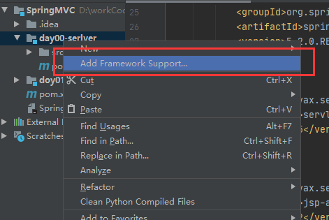
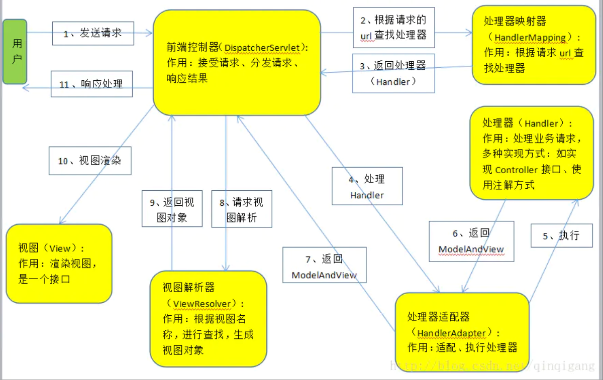

# SpringMVC

作者: 子墨

参考：狂神说SpringMVC、百度百科


# 一、MVC架构


> 简介

经典MVC模式中，M是指业务模型，V是指用户界面，C则是控制器，使用MVC的目的是将M和V的实现[代码](https://baike.baidu.com/item/代码/86048)分离，从而使同一个程序可以使用不同的表现形式。其中，View的定义比较清晰，就是用户界面。


> MVC含义

**V:** 即**View**视图是指用户看到并与之交互的界面。比如由html元素组成的网页界面，或者软件的客户端界面。MVC的好处之一在于它能为应用程序处理很多不同的视图。在视图中其实没有真正的处理发生，它只是作为一种输出数据并允许用户操纵的方式。

**M:** 即**model**模型代表一个存取数据的对象或 JAVA POJO。它也可以带有逻辑，在数据变化时更新控制器。

**C:** 即**controller**控制器是指控制器接受用户的输入并调用模型和视图去完成用户的需求，控制器本身不输出任何东西和做任何处理。它只是接收请求并决定调用哪个模型构件去处理请求，然后再确定用哪个视图来显示返回的数据。


> MVC框架做了什么

1. 将URL映射到java类或java类的方法
2. 封装用户提交的数据
3. 处理请求--调用相关的业务逻辑处理--封装相应的数据
4. 将响应的数据进行渲染 .jsp/html 等表示层数据


# 二、回顾Servlet

### 0. 创建一个maven项目

记得设置maven的下载源

### 1. 导入依赖

导入的文件不光是Servlet要用，后面的SpringMVC也要用

```xml
<dependency>
    <groupId>junit</groupId>
    <artifactId>junit</artifactId>
    <version>4.12</version>
    <scope>test</scope>
</dependency>

<dependency>
    <groupId>org.springframework</groupId>
    <artifactId>spring-webmvc</artifactId>
    <version>5.2.0.RELEASE</version>
</dependency>

<dependency>
    <groupId>javax.servlet</groupId>
    <artifactId>servlet-api</artifactId>
    <version>2.5</version>
</dependency>

<dependency>
    <groupId>javax.servlet.jsp</groupId>
    <artifactId>jsp-api</artifactId>
    <version>2.2</version>
</dependency>

<dependency>
    <groupId>javax.servlet</groupId>
    <artifactId>jstl</artifactId>
    <version>1.2</version>
</dependency>
```


### 2. 添加框架支持

右键项目--->	Add Framework Support...   --->	Web Application (4.0) 前面打钩	




### 4. 添加Tomcat


### 5. 代码

> index.jsp

```html
<%--from表单向/hello提交数据，/hello处理数据并转发给test.jsp进行展示--%>
<form action="/hello" method="post">
    <input type="text" name="method">
    <input type="submit">
</form>
```

> WEB-INF\jsp\test.jsp

```jsp
<%@ page contentType="text/html;charset=UTF-8" language="java" %>
<html>
<head>
    <title>Title</title>
</head>
<body>
     <%--接受数据并展示在页面上--%>
	${msg}
</body>
</html>
```


> com.zimo.servlet.HelloServlet

```java
public class HelloServlet extends HttpServlet {
    protected void doPost(HttpServletRequest request, HttpServletResponse response) throws ServletException, IOException {
        // 1.获取前端参数
        String var = request.getParameter("method");
        if (var.equals("add"))  request.getSession().setAttribute("msg","执行了add方法");
        if (var.equals("delete"))  request.getSession().setAttribute("msg","执行了delete方法");
        // 2.调用业务层
        // 3.（返回）视图转发或者重定向
        request.getRequestDispatcher("/WEB-INF/jsp/test.jsp").forward(request,response);
    }

    protected void doGet(HttpServletRequest request, HttpServletResponse response) throws ServletException, IOException {
        doPost(request,response);
    }
}
```


> web.xml

```xml
<?xml version="1.0" encoding="UTF-8"?>
<web-app xmlns="http://xmlns.jcp.org/xml/ns/javaee"
         xmlns:xsi="http://www.w3.org/2001/XMLSchema-instance"
         xsi:schemaLocation="http://xmlns.jcp.org/xml/ns/javaee http://xmlns.jcp.org/xml/ns/javaee/web-app_4_0.xsd"
         version="4.0">

    <!--配置servlet-->
    <servlet>
        <servlet-name>hello</servlet-name>
        <servlet-class>com.zimo.servlet.HelloServlet</servlet-class>
    </servlet>
    <servlet-mapping>
        <servlet-name>hello</servlet-name>
        <url-pattern>/hello</url-pattern>
    </servlet-mapping>

    <!--超时时间-->
    <!--<session-config>-->
    <!--    <session-timeout>15</session-timeout>-->
    <!--</session-config>-->


    <!--欢迎页-->
    <!--<welcome-file-list>-->
    <!--    <welcome-file></welcome-file>-->
    <!--</welcome-file-list>-->

</web-app>
```


### 注意:

- **WEB-INF**包下面的内容用户不能直接访问,但是可以通过转发来间接访问
- 访问不到hello：检查URL路径是否正确 http://localhost:8080/项目名/hello
- 创建maven时选择webapp，然后删除这个项目另起一个新项目后一些莫名的bug消失了（大雾）


# 三、初识SpringMVC

 Spring Web MVC是一种基于Java的实现了Web MVC设计模式的请求驱动类型的轻量级Web框架。Spring MVC属于SpringFrameWork的后续产品，已经融合在Spring Web Flow里面。


> springMVC原理图


### 1. spring mvc的特点

1.他是基于组件技术的,全部是应用对象,无论是控制器或视图,还是业务对象的类都是java组件,并且和spring提供的其他基础结构紧密集成.

2.不依赖于servlet Api

3.可以使用任意一种视图技术,不仅仅是jsp.

4.支持各种请求资源的映射策略.

5.是易于扩展的.

### 2. spring mvc的工作流程

1.用户提交请求至前端控制器DispatcharServlet

2.DispatcharServlet控制器查询一个或多个handlerMaping,找到处理请求的controller

3.DispatcharServlet控制器将请求提交到controller

4.controller进行业务逻辑处理后,返回ModelAndView对象,该对象本身包含了视图对象的信息

5.DispatcherServlet控制器查询一个或多个ViewResoler视图解析器,找到ModelAndView对象指定的视图对象.

6.视图负责将结果返回到客户端.



执行流程再分析
1. DispatcherServlet表示前置控制器，是整个SpringMVC的控制中心。用户发出请求， DispatcherServlet接收请求并拦截请求。   我们假设请求的url为 : http://localhost:8080/SpringMVC/hello 如上url拆分成三部分： http://localhost:8080服务器域名 SpringMVC部署在服务器上的web站点 hello表示控制器 通过分析，如上url表示为：请求位于服务器localhost:8080上的SpringMVC站点的hello控制器。   
2.  HandlerMapping为处理器映射。DispatcherServlet调用HandlerMapping,HandlerMapping根据 请求url查找Handler。 
3. HandlerExecution表示具体的Handler,其主要作用是根据url查找控制器，如上url被查找控制器 为：hello。 
4.  HandlerExecution将解析后的信息传递给DispatcherServlet,如解析控制器映射等。
5. HandlerAdapter表示处理器适配器，其按照特定的规则去执行Handler。 
6.  Handler让具体的Controller执行。 
7.  Controller将具体的执行信息返回给HandlerAdapter,如ModelAndView。
8.  HandlerAdapter将视图逻辑名或模型传递给DispatcherServlet。
9. DispatcherServlet调用视图解析器(ViewResolver)来解析HandlerAdapter传递的逻辑视图名。
10. 视图解析器将解析的逻辑视图名传给DispatcherServlet。
11. DispatcherServlet根据视图解析器解析的视图结果，调用具体的视图。
12.  最终视图呈现给用户。
      在这里先听一遍原理，不理解没有关系，我们马上来写一个对应的代码实现大家就明白了，如果不明 白，那就写10遍，没有笨人，只有懒人！ 


>  DispatcharServlet  是什么？

他就是HttpServlet


> 为什么会出现控制器?

在SpringMVC 中，控制器Controller 负责处理由DispatcherServlet 分发的请求，它把用户请求的数据经过业务处理层处理之后封装成一个Model ，然后再把该Model 返回给对应的View 进行展示。


### 3. 代码

1. 记得创建maven项目
2. 添加web框架支持
3. 还有导包

> /WEB-INF/web.xml

#### 1. 配置web.xml 

注册DispatcherServlet

```xml
<!--1. 注册DispatcherServlet-->
<servlet>
    <servlet-name>springmvc</servlet-name>
    <servlet-class>org.springframework.web.servlet.DispatcherServlet</servlet-class>
    <!--关联一个SpringMVC的配置文件: [servlet-name]-servlet.xml -->
    <init-param>
        <param-name>contextConfigLocation</param-name>
        <param-value>classpath*:springmvc-servlet.xml</param-value>
    </init-param>
    <!--启动级别-1-->
    <load-on-startup>1</load-on-startup>
</servlet>
<!--/ 匹配所有的请求;(不包括.jsp)-->
<!--/* 匹配所有的请求;(包括.jsp)-->
<!--所有的请求都要经过该servlet-->
<servlet-mapping>
    <servlet-name>springmvc</servlet-name>
    <url-pattern>/</url-pattern>
</servlet-mapping>
```


> resources/springmvc-servlet.xml

#### 2. 编写SpringMVC 的 配置文件

名称：springmvc-servlet.xml : [servletname]-servlet.xml 说明，这里的名称要求是按照官方来的

```xml
<!--正常不用写这两个东西-->
<!--添加 处理映射器-->
<bean class="org.springframework.web.servlet.handler.BeanNameUrlHandlerMapping"/>
<!--添加 处理适配器-->
<bean class="org.springframework.web.servlet.mvc.SimpleControllerHandlerAdapter"/>

<!--视图解析器：DispatcherServlet给他的ModelAndView-->
<bean class="org.springframework.web.servlet.view.InternalResourceViewResolver" id="internalResourceViewResolver">
    <!--前缀-->
    <property name="prefix" value="/WEB-INF/jsp/"/>
    <!--后缀-->
    <property name="suffix" value=".jsp"/>
</bean>

```


> com.zimo.controller.HelloController

####  3. 编写Controller

编写我们要操作业务Controller ，要么实现Controller接口，要么增加注解；需要返回一个 ModelAndView，装数据，封视图；

```java
public class HelloController implements Controller {

    @Override
    public ModelAndView handleRequest(HttpServletRequest httpServletRequest, HttpServletResponse httpServletResponse) throws Exception {
        //ModelAndView 模型和视图
        ModelAndView mv = new ModelAndView();

        //封装对象，放入ModelAndView中。
        mv.addObject("msg","HelloSpringMVC!!!!!!");
        //封装要跳转的视图，放入ModelAndView中
        mv.setViewName("hello");//他会被视图解析器拼成: /WEB-INF/jsp/hello.jsp


        return mv;
    }
}
```

**导包要注意一下!!!!!!**


> resources/springmvc-servlet.xml

#### 4. 注册bean

 将自己的类交给SpringIOC容器，注册bean

```xml
<!--Handler-->
<bean id="/hello" class="com.zimo.controller.HelloController"/>
```


> /WEB-INF/jsp/hello.jsp

#### 5. 写jsp

写要跳转的jsp页面，显示ModelandView存放的数据，以及我们的正常页面；

```jsp
<%@ page contentType="text/html;charset=UTF-8" language="java" %>
<html>
<head>
    <title>Title</title>
</head>
<body>
    ${msg}
</body>
</html>
```


### 4. 运行代码 （解决404）

#### 1. 添加jar包

为了防止idea不自动导包，导致访问不到页面404


#### 2. 配置Tomcat


#### 3. 运行

结果


==运行后注意URL地址==


# 四、SpringMVC注解

#### 1. 新建项目

新建一个maven项目，或者新建一个Moudle

#### 2. 引入依赖

在pom.xml文件引入相关的依赖：主要有Spring框架核心库、Spring MVC、servlet , JSTL等。我们在父依赖中已经引入了！ 也就是前面的回顾Servlet阶段

#### 3. 开启静态资源过滤

在pom.xml中写入(父、子文件都要写)

```xml
<!--maven的资源过滤问题-->
<build>
    <resources>
        <resource>
            <directory>src/main/resources</directory>
            <includes>
                <include>**/*.properties</include>
                <include>**/*.xml</include>
            </includes>
            <filtering>true</filtering>
        </resource>
        <resource>
            <directory>src/main/java</directory>
            <includes>
                <include>**/*.properties</include>
                <include>**/*.xml</include>
            </includes>
            <filtering>true</filtering>
        </resource>
    </resources>
</build>
```


#### 4. 添加框架支持

右键项目--->	Add Framework Support...   --->	Web Application (4.0) 前面打钩	

#### 5. 配置web.xml 

注意点： 

- 注意web.xml版本问题，要最新版！

-  注册DispatcherServlet 关联SpringMVC的配置文件 

- 启动级别为1 
- 映射路径为 / 【不要用/*，会404】


web.xml

```xml
<?xml version="1.0" encoding="UTF-8"?>
<web-app xmlns="http://xmlns.jcp.org/xml/ns/javaee"
         xmlns:xsi="http://www.w3.org/2001/XMLSchema-instance"
         xsi:schemaLocation="http://xmlns.jcp.org/xml/ns/javaee http://xmlns.jcp.org/xml/ns/javaee/web-app_4_0.xsd"
         version="4.0">
    
        <!--1. 注册DispatcherServlet-->
        <servlet>
            <servlet-name>springmvc</servlet-name>
            <servlet-class>org.springframework.web.servlet.DispatcherServlet</servlet-class>
            <!--通过初始化参数指定SpringMVC配置文件的位置，进行关联-->
            <init-param>
                <param-name>contextConfigLocation</param-name>
                <param-value>classpath*:springmvc-servlet.xml</param-value>
            </init-param>
            <!-- 启动顺序，数字越小，启动越早 -->
            <load-on-startup>1</load-on-startup>
        </servlet>
        <!--/ 匹配所有的请求;(不包括.jsp)-->
        <!--/* 匹配所有的请求;(包括.jsp)-->
        <!--所有的请求都要经过该servlet-->
        <servlet-mapping>
            <servlet-name>springmvc</servlet-name>
            <url-pattern>/</url-pattern>
        </servlet-mapping>
    
</web-app>
```


#### 6. 添加Spring MVC配置文件 

- 让IOC的注解生效 

- 静态资源过滤 ：HTML . JS . CSS . 图片 ， 视频 ..... 

- MVC的注解驱动 

- 配置视图解析器 


在resource目录下添加springmvc-servlet.xml配置文件，配置的形式与Spring容器配置基本类似， 为了支持基于注解的IOC，设置了自动扫描包的功能，具体配置信息如下

```xml
<?xml version="1.0" encoding="UTF-8"?>
<beans xmlns="http://www.springframework.org/schema/beans"
       xmlns:xsi="http://www.w3.org/2001/XMLSchema-instance"
       xmlns:context="http://www.springframework.org/schema/context"
       xmlns:mvc="http://www.springframework.org/schema/mvc"
       xsi:schemaLocation="http://www.springframework.org/schema/beans
        http://www.springframework.org/schema/beans/spring-beans-4.2.xsd
        http://www.springframework.org/schema/mvc
        http://www.springframework.org/schema/mvc/spring-mvc-4.2.xsd
        http://www.springframework.org/schema/context
        http://www.springframework.org/schema/context/spring-context-4.2.xsd">

        <!--注意要导入约束-->

        <!-- 自动扫描包，让指定包下的注解生效,由IOC容器统一管理 -->
        <context:component-scan base-package="com.zimo.controller"/>

        <!-- 让Spring MVC不处理静态资源 -->
        <mvc:default-servlet-handler />

        <!--
        支持mvc注解驱动
        在spring中一般采用@RequestMapping注解来完成映射关系
        要想使@RequestMapping注解生效
        必须向上下文中注册DefaultAnnotationHandlerMapping
        和一个AnnotationMethodHandlerAdapter实例
        这两个实例分别在类级别和方法级别处理。
        而annotation-driven配置帮助我们自动完成上述两个实例的注入。
        -->
        <mvc:annotation-driven />


            <!-- 视图解析器 -->
        <bean class="org.springframework.web.servlet.view.InternalResourceViewResolver "
              id="internalResourceViewResolver">
            <!-- 前缀 -->
            <property name="prefix" value="/WEB-INF/jsp/" />
            <!-- 后缀 -->
            <property name="suffix" value=".jsp" />
        </bean>
</beans>
```

在视图解析器中我们把所有的视图都存放在/WEB-INF/目录下，这样可以保证视图安全，因为这个 目录下的文件，客户端不能直接访问。 

#### 5. 代码

##### 1. 创建Controller

编写一个Java控制类： com.zimo.controller.HelloController , 注意编码规范

```java
import org.springframework.stereotype.Controller;
import org.springframework.ui.Model;
import org.springframework.web.bind.annotation.RequestMapping;

@Controller
//这个也可以不写这个注解，不写下面的地址就写: 项目名/hello
@RequestMapping("/HelloController")
public class HelloController {

    //真实访问地址 : 项目名/HelloController/hello
    @RequestMapping("/hello")
    public String hello(Model model){
        //向模型中添加属性msg与值，可以在JSP页面中取出并渲染
        model.addAttribute("msg","hello,SpringMVC");

        return "hello";//   WEB-INF/jsp/hello.jsp
    }
}
```


##### 2. hello.jsp

WEB-INF/jsp/hello.jsp

```jsp
<%@ page contentType="text/html;charset=UTF-8" language="java" %>
<html>
<head>
    <title>Title</title>
</head>
<body>
        ${msg}
</body>
</html>
```


#### 6. 运行代码

##### 1. 添加Tomcat

这里不过多解释，详情见回顾Servlet的添加Tomcat

##### 2. 配置Tomcat

这里不过多解释，详情见回顾Servlet的添加Tomcat

##### 3. 导入所需的包

这里不过多解释，详情见初识SpringMVC的添加jar包

##### 4. 启动Tomcat

##### 5. 访问网站

注意访问网站的网址为 ： 项目名/HelloController/hello


#### 7. / 和 /* 的区别：

 < url-pattern > / </ url-pattern > 不会匹配到.jsp， 只针对我们编写的请求； 即：.jsp 不会进入spring的 DispatcherServlet类 。 < url-pattern > /* </ url-pattern > 会匹配 *.jsp， 会出现返回 jsp视图 时再次进入spring的DispatcherServlet 类，导致找不到对应的 controller所以报404错。 


### 8. 总结

通过上面两章我们发现创建一个能玩的SpringMVC无外乎这几个步骤

1. 创建Maven项目添加web框架（创建web项目），导入所需的包
2. 配置web.xml , 注册DispatcherServlet 
3. 编写springmvc的配置文件 
4. 接下来就是去创建对应的控制类 , Controller 
5.  最后完善前端视图和controller之间的对应 
6. 测试运行调试. 使用springMVC必须配置的三大件： 处理器映射器、处理器适配器、视图解析器 通常，我们只需要手动配置视图解析器，而处理器映射器和处理器适配器只需要开启注解驱动即可，而 省去了大段的xml配置


# 五、关于SpringMVC的那些事

### 1. Controller 

- 控制器Controller 控制器复杂提供访问应用程序的行为，通常通过接口定义或注解定义两种方法实现。
- 控制器负责解析用户的请求并将其转换为一个模型。 
- 在Spring MVC中一个控制器类可以包含多个方法 
- 在Spring MVC中，对于Controller的配置方式有很多种


>  使用接口开发

Controller是一个接口，在org.springframework.web.servlet.mvc包下，接口中只有一个方法；

```java
//实现该接口的类获得控制器功能
public interface Controller {
//处理请求且返回一个模型与视图对象
ModelAndView handleRequest(HttpServletRequest var1, HttpServletResponse var2) throws Exception;
}
```

使用接口开发的话要配置Controller的实现的bean到配置文件中。并且还要有视图解析器，当然处理适配器、处理映射器这两个不用写

> 使用注解开发

```java
@Controller 在类上面有这个注解那就是控制器
@RequestMapping("/HelloController") 这个注解是用来指定访问路径的，通常放在类或方法上(方法上必须有，类可以没有)，用在类上面是是指该路径为父路径
```

使用注解开发不需要配置bean，但是也必须要配置视图解析器。还有**自动扫描包**、**静态资源过滤**、**注解驱动**


-----

### 2. RestFul风格

> 简介

RESTFUL是一种网络应用程序的设计风格和开发方式，基于[HTTP](https://baike.baidu.com/item/HTTP/243074)，可以使用[XML](https://baike.baidu.com/item/XML/86251)格式定义或[JSON](https://baike.baidu.com/item/JSON/2462549)格式定义。RESTFUL适用于移动互联网厂商作为业务接口的场景，实现第三方[OTT](https://baike.baidu.com/item/OTT/9960940)调用移动网络资源的功能，动作类型为新增、变更、删除所调用资源。

说人话就是他是一种URL的风格。比如：

```http
正常URL  			http：//www.baidu.com?admin=root&paw=123456
RestFul风格  		http：//www.baidu.com/root/123456
```

通过观察发现RestFul风格呢他更加简洁安全。


> 特点


> 对比

注意该项目是在第四章基础上进行的修改

####  1. 正常传参

- com.zimo.controller.HelloController

```java
@Controller
public class HelloController {
    // 接收前端的参数，并返回结果
    @RequestMapping("/add")
    public String hello(int a,int b,Model model){

        int r = a+b;

        //向模型中添加属性msg与值，可以在JSP页面中取出并渲染
        model.addAttribute("msg","结果为： "+r);

        return "hello";//   WEB-INF/jsp/hello.jsp
    }
}

```

前端访问： http://localhost:8080/add?a=1&b=2	成功输出


#### 2. RestFul风格

- com.zimo.controller.HelloController

```java
@Controller
public class HelloController {
	//RestFul风格
    // 接收前端的参数，并返回结果
    @RequestMapping("/add2/{a}/{b}")
    public String hello2(@PathVariable int a,@PathVariable int b, Model model){
        int r = a+b;
        //向模型中添加属性msg与值，可以在JSP页面中取出并渲染
        model.addAttribute("msg","结果为： "+r);
        return "hello";//   WEB-INF/jsp/hello.jsp
    }
}
```

```java
@PathVariable 注解，让方法参数的值对应绑定到一个URI模板变量上. 也就是add2/1/2   传来的值1给a，值2给b
```

前端访问http://localhost:8080/add2/1/2  成功输出


#### 3. 使用method属性指定请求类型 

用于约束请求的类型，可以收窄请求范围。指定请求谓词的类型如GET, POST, HEAD, OPTIONS, PUT, PATCH, DELETE, TRACE等

指定方法后只能通过对应的方法请求，否则会返回405。如：指定GET后只能用GET请求，指定POST后只能用POST请求，指定DELETE后只能用DELETE请求


例子：

当出现路径一样的时候，会根据HTTP方法来执行不同的java方法

```java
@Controller
@RequestMapping("/c2")
public class HelloController2 {
	//下面两种注解都可以
//    @RequestMapping(value = "/add/{a}/{b}",method = RequestMethod.GET)
    @GetMapping("/add/{a}/{b}")
    public String add(@PathVariable int a, @PathVariable int b, Model model){
        //向模型中添加属性msg与值，可以在JSP页面中取出并渲染
        model.addAttribute("msg","通过get方法访问成功!"+" 结果为: "+a+b);
        return "hello";
    }
    
    @PostMapping("/add/{a}/{b}")
    public String add2(@PathVariable int a, @PathVariable int b, Model model){
        //向模型中添加属性msg与值，可以在JSP页面中取出并渲染
        model.addAttribute("msg","通过post方法访问成功!"+" 结果为: "+a+b);
        return "hello";
    }
}
```

前端通过GET方法访问http://localhost:8080/c2/add/1/2   成功输出


所有的地址栏请求默认都会是 HTTP GET 类型的。

 方法级别的注解变体有如下几个： 

组合注解 

```java
@GetMapping
@PostMapping
@PutMapping
@DeleteMapping
@PatchMapping
```

@GetMapping 是一个组合注解 它所扮演的是 @RequestMapping(method =RequestMethod.GET) 的一个快捷方式。 平时使用的会比较多！


### 3. 结果(视图)跳转方式

这里介绍了三种跳转方式

1. ModelAndView 就是通过SpringMVC视图解析器的方式跳转
2. 通过Servlet的方式跳转
3. SpringMVC(不通过视图解析器)的方式跳转

在这个小节里我们代码是没有写的，所以这里就只有一些例子而已

> ModelAndView 

设置ModelAndView对象 , 根据view的名称 , 和视图解析器跳到指定的页面 . 页面 : {视图解析器前缀} + viewName +{视图解析器后缀}


```xml
<!-- 视图解析器 -->
<bean
class="org.springframework.web.servlet.view.InternalResourceViewResolver"
id="internalResourceViewResolver">
<!-- 前缀 -->
<property name="prefix" value="/WEB-INF/jsp/" />
<!-- 后缀 -->
<property name="suffix" value=".jsp" />
</bean>

```

对应的controller类

```java
public class ControllerTest1 implements Controller {
    public ModelAndView handleRequest(HttpServletRequest httpServletRequest,
    HttpServletResponse httpServletResponse) throws Exception {
    //返回一个模型视图对象
    ModelAndView mv = new ModelAndView();
    mv.addObject("msg","ControllerTest1");
    mv.setViewName("test");
    return mv;
    }
}
```


> ServletAPI 

通过设置ServletAPI , 不需要视图解析器 . 

1. 通过HttpServletResponse进行输出 
2.  通过HttpServletResponse实现重定向 
3.  通过HttpServletResponse实现转发

```java
@Controller
public class ResultGo {
    @RequestMapping("/result/t1")
    public void test1(HttpServletRequest req, HttpServletResponse rsp)
    throws IOException {
    rsp.getWriter().println("Hello,Spring BY servlet API");
    }
    @RequestMapping("/result/t2")
    public void test2(HttpServletRequest req, HttpServletResponse rsp)
    throws IOException {
    rsp.sendRedirect("/index.jsp");
    }
    @RequestMapping("/result/t3")
    public void test3(HttpServletRequest req, HttpServletResponse rsp)
    throws Exception {
    //转发
    req.setAttribute("msg","/result/t3");
    req.getRequestDispatcher("/WEB-INF/jsp/test.jsp").forward(req,rsp);
    }
}
```


> SpringMVC 

**通过SpringMVC来实现转发和重定向 - 无需视图解析器；**

测试前，需要将视图解析器注释掉

```java
@Controller
public class ResultSpringMVC {
    @RequestMapping("/rsm/t1")
    public String test1(){
    //转发
    return "/index.jsp";
    }
    @RequestMapping("/rsm/t2")
    public String test2(){
    //转发二
    return "forward:/index.jsp";
    }
    @RequestMapping("/rsm/t3")
    public String test3(){
    //重定向
    return "redirect:/index.jsp";
    }
}
```

**通过SpringMVC来实现转发和重定向 - 有视图解析器；** 

重定向 , 不需要视图解析器 , 本质就是重新请求一个新地方嘛 , 所以注意路径问题. 可以重定向到另外一个请求实现 .


```java
@Controller
public class ResultSpringMVC2 {
    @RequestMapping("/rsm2/t1")
    public String test1(){
    //转发
    return "test";
    }
    @RequestMapping("/rsm2/t2")
    public String test2(){
    //重定向
    return "redirect:/index.jsp";
    //return "redirect:hello.do"; //hello.do为另一个请求/
    }
}
```


### 4. 数据处理

在这一小节中我们学习对传值的处理，防止前端传入非法的值，和怎么将前端传来的值封装成一个对象。以及将后端的数据传回前端(jsp)

> 处理提交数据

**1、提交的域名称和处理方法的参数名一致**

```java
@Controller
public class VarController {
    @RequestMapping("/name")
    public String name(String name, Model model){
        //向模型中添加属性msg与值，可以在JSP页面中取出并渲染
        model.addAttribute("msg",name);
        return "hello";//   WEB-INF/jsp/hello.jsp
    }
}

```
前端传值

```
提交数据 : http://localhost:8080/name?name=子墨
参数name为子墨

提交数据http://localhost:8080/name?sb=6666
方法也会被执行，但是方法参数name为null
```


**2、提交的域名称和处理方法的参数名不一致**

处理方法 :

```java
//@RequestParam("username") : username提交的域的名称 .
@RequestMapping("/name")
public String name(@RequestParam("username") String name, Model model){
    //向模型中添加属性msg与值，可以在JSP页面中取出并渲染
    model.addAttribute("msg",name);
    System.out.println(name);
    return "hello";//   WEB-INF/jsp/hello.jsp
}
```

前端传值

```
提交数据 : http://localhost:8080/name?username=子墨
前端返回正确的值

提交数据 : http://localhost:8080/name?name=子墨
服务器返回400

提交数据http://localhost:8080/name?sb=6666
服务器返回400
```

```
@RequestParam("参数名")	接收一个参数名的值，并将值交给被这个注解修饰的变量。
注意:
用了@RequestParam就不能传乱七八糟的值了，只能传RequestParam对应的参数名，否则会返回400
```


**3、提交(接收)的是一个对象**

要求提交的表单域和对象的属性名一致  , 参数使用对象即可

1、实体类

```java
public class User {
   private int id;
   private String name;
   private int age;
   //构造
   //get/set
   //tostring()
}
```

2、提交数据 : http://localhost:8080/mvc04/user?name=kuangshen&id=1&age=15

3、处理方法 :

```java
@RequestMapping("/user")
public String user(User user){
   System.out.println(user);
   return "hello";
}
```

后台输出 : User { id=1, name='kuangshen', age=15 }

说明：如果使用对象的话，前端传递的参数名和对象名必须一致，否则就是null。


>  数据显示到前端

**第一种 : 通过ModelAndView**

我们前面一直都是如此 (实现Controller接口). 就不过多解释

```java
public class ControllerTest1 implements Controller {

   public ModelAndView handleRequest(HttpServletRequest httpServletRequest, HttpServletResponse httpServletResponse) throws Exception {
       //返回一个模型视图对象
       ModelAndView mv = new ModelAndView();
       mv.addObject("msg","ControllerTest1");
       mv.setViewName("test");
       return mv;
  }
}
```


**第二种 : 通过ModelMap**

ModelMap

```java
@RequestMapping("/hello")
public String hello(@RequestParam("username") String name, ModelMap model){
   //封装要显示到视图中的数据
   //相当于req.setAttribute("name",name);
   model.addAttribute("name",name);
   System.out.println(name);
   return "hello";
}
```


**第三种 : 通过Model**

Model

```java
@RequestMapping("/ct2/hello")
public String hello(@RequestParam("username") String name, Model model){
   //封装要显示到视图中的数据
   //相当于req.setAttribute("name",name);
   model.addAttribute("msg",name);
   System.out.println(name);
   return "test";
}
```


>  对比 数据显示到前端 的三种方式

就对于新手而言简单来说使用区别就是：

```
Model 只有寥寥几个方法只适合用于储存数据，简化了新手对于Model对象的操作和理解；

ModelMap 继承了 LinkedMap ，除了实现了自身的一些方法，同样的继承 LinkedMap 的方法和特性；

ModelAndView 可以在储存数据的同时，可以进行设置返回的逻辑视图，进行控制展示层的跳转。
```

当然更多的以后开发考虑的更多的是性能和优化，就不能单单仅限于此的了解。

**请使用80%的时间打好扎实的基础，剩下18%的时间研究框架，2%的时间去学点英文，框架的官方文档永远是最好的教程。**


### 5. 乱码问题

测试步骤：

1、我们可以在首页编写一个提交的表单

```jsp
<form action="/e/t" method="post">
 <input type="text" name="name">
 <input type="submit">
</form>
```

2、后台编写对应的处理类

```java
@Controller
public class Encoding {
   @RequestMapping("/e/t")
   public String test(Model model,String name){
       model.addAttribute("msg",name); //获取表单提交的值
       return "test"; //跳转到test页面显示输入的值
  }
}
```

3、输入中文测试，发现乱码


不得不说，乱码问题是在我们开发中十分常见的问题，也是让我们程序猿比较头大的问题！

以前乱码问题通过过滤器解决 , 而SpringMVC给我们提供了一个过滤器 , 可以在web.xml中配置 .

修改了xml文件需要重启服务器！

```xml
<filter>
   <filter-name>encoding</filter-name>
   <filter-class>org.springframework.web.filter.CharacterEncodingFilter</filter-class>
   <init-param>
       <param-name>encoding</param-name>
       <param-value>utf-8</param-value>
   </init-param>
</filter>
<!-- 这里要注意/和/*的区别 -->
<filter-mapping>
   <filter-name>encoding</filter-name>
   <url-pattern>/*</url-pattern>
</filter-mapping>
```

但是我们发现 , 有些极端情况下.这个过滤器对get的支持不好 .

处理方法 :

1、修改tomcat配置文件 ：设置编码！

```xml
<Connector URIEncoding="utf-8" port="8080" protocol="HTTP/1.1"
          connectionTimeout="20000"
          redirectPort="8443" />
```

2、自定义过滤器

```java
package com.kuang.filter;

import javax.servlet.*;
import javax.servlet.http.HttpServletRequest;
import javax.servlet.http.HttpServletRequestWrapper;
import javax.servlet.http.HttpServletResponse;
import java.io.IOException;
import java.io.UnsupportedEncodingException;
import java.util.Map;

/**
* 解决get和post请求 全部乱码的过滤器
*/
public class GenericEncodingFilter implements Filter {

   @Override
   public void destroy() {
  }

   @Override
   public void doFilter(ServletRequest request, ServletResponse response, FilterChain chain) throws IOException, ServletException {
       //处理response的字符编码
       HttpServletResponse myResponse=(HttpServletResponse) response;
       myResponse.setContentType("text/html;charset=UTF-8");

       // 转型为与协议相关对象
       HttpServletRequest httpServletRequest = (HttpServletRequest) request;
       // 对request包装增强
       HttpServletRequest myrequest = new MyRequest(httpServletRequest);
       chain.doFilter(myrequest, response);
  }

   @Override
   public void init(FilterConfig filterConfig) throws ServletException {
  }

}

//自定义request对象，HttpServletRequest的包装类
class MyRequest extends HttpServletRequestWrapper {

   private HttpServletRequest request;
   //是否编码的标记
   private boolean hasEncode;
   //定义一个可以传入HttpServletRequest对象的构造函数，以便对其进行装饰
   public MyRequest(HttpServletRequest request) {
       super(request);// super必须写
       this.request = request;
  }

   // 对需要增强方法 进行覆盖
   @Override
   public Map getParameterMap() {
       // 先获得请求方式
       String method = request.getMethod();
       if (method.equalsIgnoreCase("post")) {
           // post请求
           try {
               // 处理post乱码
               request.setCharacterEncoding("utf-8");
               return request.getParameterMap();
          } catch (UnsupportedEncodingException e) {
               e.printStackTrace();
          }
      } else if (method.equalsIgnoreCase("get")) {
           // get请求
           Map<String, String[]> parameterMap = request.getParameterMap();
           if (!hasEncode) { // 确保get手动编码逻辑只运行一次
               for (String parameterName : parameterMap.keySet()) {
                   String[] values = parameterMap.get(parameterName);
                   if (values != null) {
                       for (int i = 0; i < values.length; i++) {
                           try {
                               // 处理get乱码
                               values[i] = new String(values[i]
                                      .getBytes("ISO-8859-1"), "utf-8");
                          } catch (UnsupportedEncodingException e) {
                               e.printStackTrace();
                          }
                      }
                  }
              }
               hasEncode = true;
          }
           return parameterMap;
      }
       return super.getParameterMap();
  }

   //取一个值
   @Override
   public String getParameter(String name) {
       Map<String, String[]> parameterMap = getParameterMap();
       String[] values = parameterMap.get(name);
       if (values == null) {
           return null;
      }
       return values[0]; // 取回参数的第一个值
  }

   //取所有值
   @Override
   public String[] getParameterValues(String name) {
       Map<String, String[]> parameterMap = getParameterMap();
       String[] values = parameterMap.get(name);
       return values;
  }
}
```

这个也是我在网上找的一些大神写的，一般情况下，SpringMVC默认的乱码处理就已经能够很好的解决了！

**然后在web.xml中配置这个过滤器即可！**

乱码问题，需要平时多注意，在尽可能能设置编码的地方，都设置为统一编码 UTF-8！


# 六、返回JSON

**@RestController** 将这个注解放在类或方法上面SpringMVC就知道你要**返回一个JSON字符串**

> Controller返回JSON数据

**Jackson**应该是目前比较好的json解析工具了

当然工具不止这一个，比如还有阿里巴巴的 fastjson 等等。

我们这里使用**Jackson**，使用它需要导入它的jar包；

### 1. 导包

```xml
<!-- https://mvnrepository.com/artifact/com.fasterxml.jackson.core/jackson-core -->
<dependency>
   <groupId>com.fasterxml.jackson.core</groupId>
   <artifactId>jackson-databind</artifactId>
   <version>2.9.8</version>
</dependency>
```

### 2. 配置  web.xml


```xml
<?xml version="1.0" encoding="UTF-8"?>
<web-app xmlns="http://xmlns.jcp.org/xml/ns/javaee"
        xmlns:xsi="http://www.w3.org/2001/XMLSchema-instance"
        xsi:schemaLocation="http://xmlns.jcp.org/xml/ns/javaee http://xmlns.jcp.org/xml/ns/javaee/web-app_4_0.xsd"
        version="4.0">

   <!--1.注册servlet-->
   <servlet>
       <servlet-name>SpringMVC</servlet-name>
       <servlet-class>org.springframework.web.servlet.DispatcherServlet</servlet-class>
       <!--通过初始化参数指定SpringMVC配置文件的位置，进行关联-->
       <init-param>
           <param-name>contextConfigLocation</param-name>
           <param-value>classpath:springmvc-servlet.xml</param-value>
       </init-param>
       <!-- 启动顺序，数字越小，启动越早 -->
       <load-on-startup>1</load-on-startup>
   </servlet>

   <!--所有请求都会被springmvc拦截 -->
   <servlet-mapping>
       <servlet-name>SpringMVC</servlet-name>
       <url-pattern>/</url-pattern>
   </servlet-mapping>

    <!-- 过滤所以请求并设置编码 -->
   <filter>
       <filter-name>encoding</filter-name>
       <filter-class>org.springframework.web.filter.CharacterEncodingFilter</filter-class>
       <init-param>
           <param-name>encoding</param-name>
           <param-value>utf-8</param-value>
       </init-param>
   </filter>
   <filter-mapping>
       <filter-name>encoding</filter-name>
       <url-pattern>/</url-pattern>
   </filter-mapping>

</web-app>
```

### 3. 配置springmvc-servlet.xml

```xml
<?xml version="1.0" encoding="UTF-8"?>
<beans xmlns="http://www.springframework.org/schema/beans"
      xmlns:xsi="http://www.w3.org/2001/XMLSchema-instance"
      xmlns:context="http://www.springframework.org/schema/context"
      xmlns:mvc="http://www.springframework.org/schema/mvc"
      xsi:schemaLocation="http://www.springframework.org/schema/beans
       http://www.springframework.org/schema/beans/spring-beans.xsd
       http://www.springframework.org/schema/context
       https://www.springframework.org/schema/context/spring-context.xsd
       http://www.springframework.org/schema/mvc
       https://www.springframework.org/schema/mvc/spring-mvc.xsd">

   <!-- 自动扫描指定的包，下面所有注解类交给IOC容器管理 -->
   <context:component-scan base-package="com.zimo.controller"/>

   <!-- 视图解析器 -->
   <bean class="org.springframework.web.servlet.view.InternalResourceViewResolver"
         id="internalResourceViewResolver">
       <!-- 前缀 -->
       <property name="prefix" value="/WEB-INF/jsp/" />
       <!-- 后缀 -->
       <property name="suffix" value=".jsp" />
   </bean>

</beans>
```


### 3. 代码

#### 1. com.zimo.pojo.User

我们随便编写一个User的实体类，然后我们去编写我们的测试Controller；

```java
package com.zimo.pojo;

import lombok.AllArgsConstructor;
import lombok.Data;
import lombok.NoArgsConstructor;

//需要导入lombok。如果没有lombok就老老实实的写 get/set/有参构造/无参构造/toString 吧
@Data
@AllArgsConstructor
@NoArgsConstructor
public class User {

   private String name;
   private int age;
   private String sex;
   
}
```


#### 2. com.zimo.controller.UserController

这里我们需要两个新东西，一个是@ResponseBody，一个是ObjectMapper对象，我们看下具体的用法

编写一个Controller；

```java
@Controller
public class UserController {

   @RequestMapping("/json1")
   @ResponseBody
   public String json1() throws JsonProcessingException {
       //创建一个jackson的对象映射器，用来解析数据
       ObjectMapper mapper = new ObjectMapper();
       //创建一个对象
       User user = new User("秦疆1号", 3, "男");
       //将我们的对象解析成为json格式
       String str = mapper.writeValueAsString(user);
       //由于@ResponseBody注解，这里会将str转成json格式返回；十分方便
       return str;
  }

}
```

#### 3. 配置Tomcat ， 启动测试

http://localhost:8080/json1


### 4. 解决乱码

发现出现了乱码问题，我们需要设置一下他的编码格式为utf-8，以及它返回的类型；

通过@RequestMaping的produces属性来实现，修改下代码

```java
//produces:指定响应体返回类型和编码
@RequestMapping(value = "/json1",produces = "application/json;charset=utf-8")
```

再次测试， http://localhost:8080/json1 ， 乱码问题OK！


**【注意：使用json记得处理乱码问题】**

> 代码优化

**乱码统一解决**

上一种方法比较麻烦，如果项目中有许多请求则每一个都要添加，可以通过Spring配置统一指定，这样就不用每次都去处理了！

我们可以在springmvc的配置文件上添加一段消息StringHttpMessageConverter转换配置！

```xml
<mvc:annotation-driven>
   <mvc:message-converters register-defaults="true">
       <bean class="org.springframework.http.converter.StringHttpMessageConverter">
           <constructor-arg value="UTF-8"/>
       </bean>
       <bean class="org.springframework.http.converter.json.MappingJackson2HttpMessageConverter">
           <property name="objectMapper">
               <bean class="org.springframework.http.converter.json.Jackson2ObjectMapperFactoryBean">
                   <property name="failOnEmptyBeans" value="false"/>
               </bean>
           </property>
       </bean>
   </mvc:message-converters>
</mvc:annotation-driven>
```


### 5. 返回json字符串统一解决

在类上直接使用 **@RestController** ，这样子，里面所有的方法都只会返回 json 字符串了，不用再每一个都添加@ResponseBody ！我们在前后端分离开发中，一般都使用 @RestController ，十分便捷！

```java
@RestController
public class UserController {

   //produces:指定响应体返回类型和编码
   @RequestMapping(value = "/json1")
   public String json1() throws JsonProcessingException {
       //创建一个jackson的对象映射器，用来解析数据
       ObjectMapper mapper = new ObjectMapper();
       //创建一个对象
       User user = new User("秦疆1号", 3, "男");
       //将我们的对象解析成为json格式
       String str = mapper.writeValueAsString(user);
       //由于@ResponseBody注解，这里会将str转成json格式返回；十分方便
       return str;
  }

}
```

启动tomcat测试，结果都正常输出！


### 6. 测试集合输出

增加一个新的方法

```java
@RequestMapping("/json2")
public String json2() throws JsonProcessingException {

   //创建一个jackson的对象映射器，用来解析数据
   ObjectMapper mapper = new ObjectMapper();
   //创建一个对象
   User user1 = new User("秦疆1号", 3, "男");
   User user2 = new User("秦疆2号", 3, "男");
   User user3 = new User("秦疆3号", 3, "男");
   User user4 = new User("秦疆4号", 3, "男");
   List<User> list = new ArrayList<User>();
   list.add(user1);
   list.add(user2);
   list.add(user3);
   list.add(user4);

   //将我们的对象解析成为json格式
   String str = mapper.writeValueAsString(list);
   return str;
}
```

运行结果 : 十分完美，没有任何问题！


### 7. 输出时间对象

增加一个新的方法

```java
@RequestMapping("/json3")
public String json3() throws JsonProcessingException {

   ObjectMapper mapper = new ObjectMapper();

   //创建时间一个对象，java.util.Date
   Date date = new Date();
   //将我们的对象解析成为json格式
   String str = mapper.writeValueAsString(date);
   return str;
}
```

运行结果 :


- 默认日期格式会变成一个数字，是1970年1月1日到当前日期的毫秒数！
- Jackson 默认是会把时间转成timestamps形式

**解决方案：取消timestamps形式 ， 自定义时间格式**

```java
@RequestMapping("/json4")
public String json4() throws JsonProcessingException {

   ObjectMapper mapper = new ObjectMapper();

   //不使用时间戳的方式
   mapper.configure(SerializationFeature.WRITE_DATES_AS_TIMESTAMPS, false);
   //自定义日期格式对象
   SimpleDateFormat sdf = new SimpleDateFormat("yyyy-MM-dd HH:mm:ss");
   //指定日期格式
   mapper.setDateFormat(sdf);

   Date date = new Date();
   String str = mapper.writeValueAsString(date);

   return str;
}
```

运行结果 : 成功的输出了时间！


> 抽取为工具类

**如果要经常使用的话，这样是比较麻烦的，我们可以将这些代码封装到一个工具类中；我们去编写下**

```java
package com.kuang.utils;

import com.fasterxml.jackson.core.JsonProcessingException;
import com.fasterxml.jackson.databind.ObjectMapper;
import com.fasterxml.jackson.databind.SerializationFeature;

import java.text.SimpleDateFormat;

public class JsonUtils {
   
   public static String getJson(Object object) {
       return getJson(object,"yyyy-MM-dd HH:mm:ss");
  }

   public static String getJson(Object object,String dateFormat) {
       ObjectMapper mapper = new ObjectMapper();
       //不使用时间差的方式
       mapper.configure(SerializationFeature.WRITE_DATES_AS_TIMESTAMPS, false);
       //自定义日期格式对象
       SimpleDateFormat sdf = new SimpleDateFormat(dateFormat);
       //指定日期格式
       mapper.setDateFormat(sdf);
       try {
           return mapper.writeValueAsString(object);
      } catch (JsonProcessingException e) {
           e.printStackTrace();
      }
       return null;
  }
}
```

我们使用工具类，代码就更加简洁了！

```java
@RequestMapping("/json5")
public String json5() throws JsonProcessingException {
   Date date = new Date();
   String json = JsonUtils.getJson(date);
   return json;
}
```

大功告成！完美！

# 七、ssm框架初步整合

- 注意个个配置文件的作用
- 每个配置文件直接的关联，以及先后逻辑作用
- 注意Spring和Mybatis之间的整合，实现，配置


## 1. 环境搭建

### 1. 数据库环境

创建一个存放书籍数据的数据库表

```mysql
CREATE DATABASE `ssmbuild`;

USE `ssmbuild`;

DROP TABLE IF EXISTS `books`;

CREATE TABLE `books` (
`bookID` INT(10) NOT NULL AUTO_INCREMENT COMMENT '书id',
`bookName` VARCHAR(100) NOT NULL COMMENT '书名',
`bookCounts` INT(11) NOT NULL COMMENT '数量',
`detail` VARCHAR(200) NOT NULL COMMENT '描述',
KEY `bookID` (`bookID`)
) ENGINE=INNODB DEFAULT CHARSET=utf8

INSERT  INTO `books`(`bookID`,`bookName`,`bookCounts`,`detail`)VALUES
(1,'Java',1,'从入门到放弃'),
(2,'MySQL',10,'从删库到跑路'),
(3,'Linux',5,'从进门到进牢');
```


### 2.基本环境搭建

新建一Maven项目！ssmbuild ， 添加web的支持

>  导入相关的pom依赖！

```xml
<dependencies>
   <!--Junit-->
   <dependency>
       <groupId>junit</groupId>
       <artifactId>junit</artifactId>
       <version>4.12</version>
   </dependency>
   <!--数据库驱动-->
   <dependency>
       <groupId>mysql</groupId>
       <artifactId>mysql-connector-java</artifactId>
       <version>5.1.47</version>
   </dependency>
   <!-- 数据库连接池 -->
   <dependency>
       <groupId>com.mchange</groupId>
       <artifactId>c3p0</artifactId>
       <version>0.9.5.2</version>
   </dependency>

   <!--Servlet - JSP -->
   <dependency>
       <groupId>javax.servlet</groupId>
       <artifactId>servlet-api</artifactId>
       <version>2.5</version>
   </dependency>
   <dependency>
       <groupId>javax.servlet.jsp</groupId>
       <artifactId>jsp-api</artifactId>
       <version>2.2</version>
   </dependency>
   <dependency>
       <groupId>javax.servlet</groupId>
       <artifactId>jstl</artifactId>
       <version>1.2</version>
   </dependency>

   <!--Mybatis-->
   <dependency>
       <groupId>org.mybatis</groupId>
       <artifactId>mybatis</artifactId>
       <version>3.5.2</version>
   </dependency>
   <dependency>
       <groupId>org.mybatis</groupId>
       <artifactId>mybatis-spring</artifactId>
       <version>2.0.2</version>
   </dependency>

   <!--Spring-->
   <dependency>
       <groupId>org.springframework</groupId>
       <artifactId>spring-webmvc</artifactId>
       <version>5.1.9.RELEASE</version>
   </dependency>
   <dependency>
       <groupId>org.springframework</groupId>
       <artifactId>spring-jdbc</artifactId>
       <version>5.1.9.RELEASE</version>
   </dependency>
</dependencies>
```

> Maven资源过滤设置

```xml
<build>
   <resources>
       <resource>
           <directory>src/main/java</directory>
           <includes>
               <include>**/*.properties</include>
               <include>**/*.xml</include>
           </includes>
           <filtering>false</filtering>
       </resource>
       <resource>
           <directory>src/main/resources</directory>
           <includes>
               <include>**/*.properties</include>
               <include>**/*.xml</include>
           </includes>
           <filtering>false</filtering>
       </resource>
   </resources>
</build>
```

> 建立基本结构和配置框架！

- com.zimo.pojo

- com.zimo.dao

- com.zimo.service

- com.zimo.controller

- mybatis-config.xml

  ```xml
  <?xml version="1.0" encoding="UTF-8" ?>
  <!DOCTYPE configuration
         PUBLIC "-//mybatis.org//DTD Config 3.0//EN"
         "http://mybatis.org/dtd/mybatis-3-config.dtd">
  <configuration>
  
  </configuration>
  ```

- applicationContext.xml

  ```xml
  <?xml version="1.0" encoding="UTF-8"?>
  <beans xmlns="http://www.springframework.org/schema/beans"
        xmlns:xsi="http://www.w3.org/2001/XMLSchema-instance"
        xsi:schemaLocation="http://www.springframework.org/schema/beans
         http://www.springframework.org/schema/beans/spring-beans.xsd">
  
  </beans>
  ```


2. Mybatis层编写

> 配置文件

1、数据库配置文件 **database.properties**

```properties
jdbc.driver=com.mysql.jdbc.Driver
# mysql 8.+以上还要配置时区   &serverTimezone=Asia/Shanghai
jdbc.url=jdbc:mysql://localhost:3306/ssmbuild?useSSL=true&useUnicode=true&characterEncoding=utf8
jdbc.username=root
jdbc.password=123456
```

2、IDEA关联数据库

3、编写MyBatis的核心配置文件

```xml
<?xml version="1.0" encoding="UTF-8" ?>
<!DOCTYPE configuration
       PUBLIC "-//mybatis.org//DTD Config 3.0//EN"
       "http://mybatis.org/dtd/mybatis-3-config.dtd">
<configuration>
   <!-- 起别名 -->
   <typeAliases>
       <package name="com.zimo.pojo"/>
   </typeAliases>
    <!-- 注册Mapper到配置文件 -->
   <mappers>
       <mapper resource="com/zimo/dao/BookMapper.xml"/>
   </mappers>

</configuration>
```


> 编写实体类

4、编写数据库对应的实体类 com.kuang.pojo.Books

使用lombok插件！

```java
package com.zimo.pojo;

import lombok.AllArgsConstructor;
import lombok.Data;
import lombok.NoArgsConstructor;

@Data
@AllArgsConstructor
@NoArgsConstructor
public class Books {
   
   private int bookID;
   private String bookName;
   private int bookCounts;
   private String detail;
   
}
```


> 编写Mapper

5、编写Dao层的 Mapper接口！

```java
package com.zimo.dao;

import com.zimo.pojo.Books;
import java.util.List;

public interface BookMapper {

   //增加一个Book
   int addBook(Books book);

   //根据id删除一个Book
   int deleteBookById(int id);

   //更新Book
   int updateBook(Books books);

   //根据id查询,返回一个Book
   Books queryBookById(int id);

   //查询全部Book,返回list集合
   List<Books> queryAllBook();

}
```

6、编写接口对应的 Mapper.xml 文件。需要导入MyBatis的包；

BookMapper.xml

```xml
<?xml version="1.0" encoding="UTF-8" ?>
<!DOCTYPE mapper
       PUBLIC "-//mybatis.org//DTD Mapper 3.0//EN"
       "http://mybatis.org/dtd/mybatis-3-mapper.dtd">

<mapper namespace="com.zimo.dao.BookMapper">

   <!--增加一个Book-->
   <insert id="addBook" parameterType="Books">
      insert into ssmbuild.books(bookName,bookCounts,detail)
      values (#{bookName}, #{bookCounts}, #{detail})
   </insert>

   <!--根据id删除一个Book-->
   <delete id="deleteBookById" parameterType="int">
      delete from ssmbuild.books where bookID=#{bookID}
   </delete>

   <!--更新Book-->
   <update id="updateBook" parameterType="Books">
      update ssmbuild.books
      set bookName = #{bookName},bookCounts = #{bookCounts},detail = #{detail}
      where bookID = #{bookID}
   </update>

   <!--根据id查询,返回一个Book-->
   <select id="queryBookById" resultType="Books">
      select * from ssmbuild.books
      where bookID = #{bookID}
   </select>

   <!--查询全部Book-->
   <select id="queryAllBook" resultType="Books">
      SELECT * from ssmbuild.books
   </select>

</mapper>
```


> Service层的Mapper实现类和接口

7、编写Service层的接口和实现类

接口：

```java
package com.zimo.service;

import com.zimo.pojo.Books;

import java.util.List;

//BookService:底下需要去实现,调用dao层
public interface BookService {
   //增加一个Book
   int addBook(Books book);
   //根据id删除一个Book
   int deleteBookById(int id);
   //更新Book
   int updateBook(Books books);
   //根据id查询,返回一个Book
   Books queryBookById(int id);
   //查询全部Book,返回list集合
   List<Books> queryAllBook();
}
```

实现类：

```java
package com.zimo.service;

import com.zimo.dao.BookMapper;
import com.zimo.pojo.Books;
import java.util.List;

public class BookServiceImpl implements BookService {

   //调用dao层的操作，设置一个set接口，方便Spring管理
   private BookMapper bookMapper;

   public void setBookMapper(BookMapper bookMapper) {
       this.bookMapper = bookMapper;
  }
   
   public int addBook(Books book) {
       return bookMapper.addBook(book);
  }
   
   public int deleteBookById(int id) {
       return bookMapper.deleteBookById(id);
  }
   
   public int updateBook(Books books) {
       return bookMapper.updateBook(books);
  }
   
   public Books queryBookById(int id) {
       return bookMapper.queryBookById(id);
  }
   
   public List<Books> queryAllBook() {
       return bookMapper.queryAllBook();
  }
}
```

**OK，到此，底层需求操作编写完毕！**


## 2. Spring层

1、配置**Spring整合MyBatis**，我们这里数据源使用c3p0连接池；

2、我们去编写Spring整合Mybatis的相关的配置文件；spring-dao.xml

```xml
<?xml version="1.0" encoding="UTF-8"?>
<beans xmlns="http://www.springframework.org/schema/beans"
      xmlns:xsi="http://www.w3.org/2001/XMLSchema-instance"
      xmlns:context="http://www.springframework.org/schema/context"
      xsi:schemaLocation="http://www.springframework.org/schema/beans
       http://www.springframework.org/schema/beans/spring-beans.xsd
       http://www.springframework.org/schema/context
       https://www.springframework.org/schema/context/spring-context.xsd">

   <!-- 配置整合mybatis -->
   <!-- 1.关联数据库文件 -->
   <context:property-placeholder location="classpath:database.properties"/>

   <!-- 2.数据库连接池 -->
   <!--数据库连接池
       dbcp 半自动化操作 不能自动连接
       c3p0 自动化操作（自动的加载配置文件 并且设置到对象里面）
   -->
   <bean id="dataSource" class="com.mchange.v2.c3p0.ComboPooledDataSource">
       <!-- 配置连接池属性 -->
       <property name="driverClass" value="${jdbc.driver}"/>
       <property name="jdbcUrl" value="${jdbc.url}"/>
       <property name="user" value="${jdbc.username}"/>
       <property name="password" value="${jdbc.password}"/>

       <!-- c3p0连接池的私有属性 -->
       <property name="maxPoolSize" value="30"/>
       <property name="minPoolSize" value="10"/>
       <!-- 关闭连接后不自动commit -->
       <property name="autoCommitOnClose" value="false"/>
       <!-- 获取连接超时时间 -->
       <property name="checkoutTimeout" value="10000"/>
       <!-- 当获取连接失败重试次数 -->
       <property name="acquireRetryAttempts" value="2"/>
   </bean>

   <!-- 3.配置SqlSessionFactory对象 -->
   <bean id="sqlSessionFactory" class="org.mybatis.spring.SqlSessionFactoryBean">
       <!-- 注入数据库连接池 -->
       <property name="dataSource" ref="dataSource"/>
       <!-- 配置MyBaties全局配置文件:mybatis-config.xml -->
       <property name="configLocation" value="classpath:mybatis-config.xml"/>
   </bean>

   <!-- 4.配置扫描Dao接口包，动态实现Dao接口注入到spring容器中 -->
   <!--解释 ：https://www.cnblogs.com/jpfss/p/7799806.html-->
   <bean class="org.mybatis.spring.mapper.MapperScannerConfigurer">
       <!-- 注入sqlSessionFactory -->
       <property name="sqlSessionFactoryBeanName" value="sqlSessionFactory"/>
       <!-- 给出需要扫描Dao接口包 -->
       <property name="basePackage" value="com.zimo.dao"/>
   </bean>

</beans>
```

3、**Spring整合service层**

```xml
<?xml version="1.0" encoding="UTF-8"?>
<beans xmlns="http://www.springframework.org/schema/beans"
      xmlns:xsi="http://www.w3.org/2001/XMLSchema-instance"
      xmlns:context="http://www.springframework.org/schema/context"
      xsi:schemaLocation="http://www.springframework.org/schema/beans
   http://www.springframework.org/schema/beans/spring-beans.xsd
   http://www.springframework.org/schema/context
   http://www.springframework.org/schema/context/spring-context.xsd">

   <!-- 扫描service相关的bean -->
   <context:component-scan base-package="com.zimo.service" />

   <!--BookServiceImpl注入到IOC容器中-->
   <bean id="BookServiceImpl" class="com.zimo.service.BookServiceImpl">
       <property name="bookMapper" ref="bookMapper"/>
   </bean>

   <!-- 配置事务管理器 -->
   <bean id="transactionManager" class="org.springframework.jdbc.datasource.DataSourceTransactionManager">
       <!-- 注入数据库连接池 -->
       <property name="dataSource" ref="dataSource" />
   </bean>

</beans>
```

Spring层搞定！再次理解一下，Spring就是一个大杂烩，一个容器！对吧！


## 3. SpringMVC层

1、**web.xml**

```xml
<?xml version="1.0" encoding="UTF-8"?>
<web-app xmlns="http://xmlns.jcp.org/xml/ns/javaee"
        xmlns:xsi="http://www.w3.org/2001/XMLSchema-instance"
        xsi:schemaLocation="http://xmlns.jcp.org/xml/ns/javaee http://xmlns.jcp.org/xml/ns/javaee/web-app_4_0.xsd"
        version="4.0">

   <!--DispatcherServlet-->
   <servlet>
       <servlet-name>DispatcherServlet</servlet-name>
       <servlet-class>org.springframework.web.servlet.DispatcherServlet</servlet-class>
       <init-param>
           <param-name>contextConfigLocation</param-name>
           <!--一定要注意:我们这里加载的是总的配置文件，之前被这里坑了！-->  
           <param-value>classpath:applicationContext.xml</param-value>
       </init-param>
       <load-on-startup>1</load-on-startup>
   </servlet>
   <servlet-mapping>
       <servlet-name>DispatcherServlet</servlet-name>
       <url-pattern>/</url-pattern>
   </servlet-mapping>

   <!--encodingFilter-->
   <filter>
       <filter-name>encodingFilter</filter-name>
       <filter-class>
          org.springframework.web.filter.CharacterEncodingFilter
       </filter-class>
       <init-param>
           <param-name>encoding</param-name>
           <param-value>utf-8</param-value>
       </init-param>
   </filter>
   <filter-mapping>
       <filter-name>encodingFilter</filter-name>
       <url-pattern>/*</url-pattern>
   </filter-mapping>
   
   <!--Session过期时间-->
   <session-config>
       <session-timeout>15</session-timeout>
   </session-config>
   
</web-app>
```

2、**spring-mvc.xml**

```xml
<?xml version="1.0" encoding="UTF-8"?>
<beans xmlns="http://www.springframework.org/schema/beans"
      xmlns:xsi="http://www.w3.org/2001/XMLSchema-instance"
      xmlns:context="http://www.springframework.org/schema/context"
      xmlns:mvc="http://www.springframework.org/schema/mvc"
      xsi:schemaLocation="http://www.springframework.org/schema/beans
   http://www.springframework.org/schema/beans/spring-beans.xsd
   http://www.springframework.org/schema/context
   http://www.springframework.org/schema/context/spring-context.xsd
   http://www.springframework.org/schema/mvc
   https://www.springframework.org/schema/mvc/spring-mvc.xsd">

   <!-- 配置SpringMVC -->
   <!-- 1.开启SpringMVC注解驱动 -->
   <mvc:annotation-driven />
   <!-- 2.静态资源默认servlet配置-->
   <mvc:default-servlet-handler/>

   <!-- 3.配置jsp 显示ViewResolver视图解析器 -->
   <bean class="org.springframework.web.servlet.view.InternalResourceViewResolver">
       <property name="viewClass" value="org.springframework.web.servlet.view.JstlView" />
       <property name="prefix" value="/WEB-INF/jsp/" />
       <property name="suffix" value=".jsp" />
   </bean>

   <!-- 4.扫描web相关的bean -->
   <context:component-scan base-package="com.zimo.controller" />

</beans>
```

3、**Spring配置整合文件，applicationContext.xml**

```xml
<?xml version="1.0" encoding="UTF-8"?>
<beans xmlns="http://www.springframework.org/schema/beans"
      xmlns:xsi="http://www.w3.org/2001/XMLSchema-instance"
      xsi:schemaLocation="http://www.springframework.org/schema/beans
       http://www.springframework.org/schema/beans/spring-beans.xsd">

   <import resource="spring-dao.xml"/>
   <import resource="spring-service.xml"/>
   <import resource="spring-mvc.xml"/>
   
</beans>
```

**配置文件，暂时结束！Controller 和 视图层编写**

1、BookController 类编写 ， 方法一：查询全部书籍

```java
@Controller
@RequestMapping("/book")
public class BookController {

   @Autowired
   @Qualifier("BookServiceImpl")
   private BookService bookService;

   @RequestMapping("/allBook")
   public String list(Model model) {
       List<Books> list = bookService.queryAllBook();
       model.addAttribute("list", list);
       return "allBook";
  }
}
```

2、编写首页 **index.jsp**

```jsp
<%@ page language="java" contentType="text/html; charset=UTF-8" pageEncoding="UTF-8" %>
<!DOCTYPE HTML>
<html>
<head>
   <title>首页</title>
   <style type="text/css">
       a {
           text-decoration: none;
           color: black;
           font-size: 18px;
      }
       h3 {
           width: 180px;
           height: 38px;
           margin: 100px auto;
           text-align: center;
           line-height: 38px;
           background: deepskyblue;
           border-radius: 4px;
      }
   </style>
</head>
<body>

<h3>
   <a href="${pageContext.request.contextPath}/book/allBook">点击进入列表页</a>
</h3>
</body>
</html>
```

3、书籍列表页面 **allbook.jsp**

```jsp
<%@ taglib prefix="c" uri="http://java.sun.com/jsp/jstl/core" %>
<%@ page contentType="text/html;charset=UTF-8" language="java" %>
<html>
<head>
   <title>书籍列表</title>
   <meta name="viewport" content="width=device-width, initial-scale=1.0">
   <!-- 引入 Bootstrap -->
   <link href="https://cdn.bootcss.com/bootstrap/3.3.7/css/bootstrap.min.css" rel="stylesheet">
</head>
<body>

<div class="container">

   <div class="row clearfix">
       <div class="col-md-12 column">
           <div class="page-header">
               <h1>
                   <small>书籍列表 —— 显示所有书籍</small>
               </h1>
           </div>
       </div>
   </div>

   <div class="row">
       <div class="col-md-4 column">
           <a class="btn btn-primary" href="${pageContext.request.contextPath}/book/toAddBook">新增</a>
       </div>
   </div>

   <div class="row clearfix">
       <div class="col-md-12 column">
           <table class="table table-hover table-striped">
               <thead>
               <tr>
                   <th>书籍编号</th>
                   <th>书籍名字</th>
                   <th>书籍数量</th>
                   <th>书籍详情</th>
                   <th>操作</th>
               </tr>
               </thead>

               <tbody>
               <c:forEach var="book" items="${requestScope.get('list')}">
                   <tr>
                       <td>${book.getBookID()}</td>
                       <td>${book.getBookName()}</td>
                       <td>${book.getBookCounts()}</td>
                       <td>${book.getDetail()}</td>
                       <td>
                           <a href="${pageContext.request.contextPath}/book/toUpdateBook?id=${book.getBookID()}">更改</a> |
                           <a href="${pageContext.request.contextPath}/book/del/${book.getBookID()}">删除</a>
                       </td>
                   </tr>
               </c:forEach>
               </tbody>
           </table>
       </div>
   </div>
</div>
```

4、BookController 类编写 ， 方法二：添加书籍

```java
@RequestMapping("/toAddBook")
public String toAddPaper() {
   return "addBook";
}

@RequestMapping("/addBook")
public String addPaper(Books books) {
   System.out.println(books);
   bookService.addBook(books);
   return "redirect:/book/allBook";
}
```

5、添加书籍页面：**addBook.jsp**

```jsp
<%@ taglib prefix="c" uri="http://java.sun.com/jsp/jstl/core" %>
<%@ page contentType="text/html;charset=UTF-8" language="java" %>

<html>
<head>
   <title>新增书籍</title>
   <meta name="viewport" content="width=device-width, initial-scale=1.0">
   <!-- 引入 Bootstrap -->
   <link href="https://cdn.bootcss.com/bootstrap/3.3.7/css/bootstrap.min.css" rel="stylesheet">
</head>
<body>
<div class="container">

   <div class="row clearfix">
       <div class="col-md-12 column">
           <div class="page-header">
               <h1>
                   <small>新增书籍</small>
               </h1>
           </div>
       </div>
   </div>
   <form action="${pageContext.request.contextPath}/book/addBook" method="post">
      书籍名称：<input type="text" name="bookName"><br><br><br>
      书籍数量：<input type="text" name="bookCounts"><br><br><br>
      书籍详情：<input type="text" name="detail"><br><br><br>
       <input type="submit" value="添加">
   </form>

</div>
```

6、BookController 类编写 ， 方法三：修改书籍

```java
@RequestMapping("/toUpdateBook")
public String toUpdateBook(Model model, int id) {
   Books books = bookService.queryBookById(id);
   System.out.println(books);
   model.addAttribute("book",books );
   return "updateBook";
}

@RequestMapping("/updateBook")
public String updateBook(Model model, Books book) {
   System.out.println(book);
   bookService.updateBook(book);
   Books books = bookService.queryBookById(book.getBookID());
   model.addAttribute("books", books);
   return "redirect:/book/allBook";
}
```

7、修改书籍页面  **updateBook.jsp**

```jsp
<%@ taglib prefix="c" uri="http://java.sun.com/jsp/jstl/core" %>
<%@ page contentType="text/html;charset=UTF-8" language="java" %>
<html>
<head>
   <title>修改信息</title>
   <meta name="viewport" content="width=device-width, initial-scale=1.0">
   <!-- 引入 Bootstrap -->
   <link href="https://cdn.bootcss.com/bootstrap/3.3.7/css/bootstrap.min.css" rel="stylesheet">
</head>
<body>
<div class="container">

   <div class="row clearfix">
       <div class="col-md-12 column">
           <div class="page-header">
               <h1>
                   <small>修改信息</small>
               </h1>
           </div>
       </div>
   </div>

   <form action="${pageContext.request.contextPath}/book/updateBook" method="post">
       <input type="hidden" name="bookID" value="${book.getBookID()}"/>
      书籍名称：<input type="text" name="bookName" value="${book.getBookName()}"/>
      书籍数量：<input type="text" name="bookCounts" value="${book.getBookCounts()}"/>
      书籍详情：<input type="text" name="detail" value="${book.getDetail() }"/>
       <input type="submit" value="提交"/>
   </form>

</div>
```

8、BookController 类编写 ， 方法四：删除书籍

```java
@RequestMapping("/del/{bookId}")
public String deleteBook(@PathVariable("bookId") int id) {
   bookService.deleteBookById(id);
   return "redirect:/book/allBook";
}
```

**配置Tomcat，进行运行！**

到目前为止，这个SSM项目整合已经完全的OK了，可以直接运行进行测试！这个练习十分的重要，大家需要保证，不看任何东西，自己也可以完整的实现出来！

**项目结构图** 


.png)

## 4. 小结及展望

这个是同学们的第一个SSM整合案例，一定要烂熟于心！

SSM框架的重要程度是不言而喻的，学到这里，大家已经可以进行基本网站的单独开发。但是这只是增删改查的基本操作。可以说学到这里，大家才算是真正的步入了后台开发的门。也就是能找一个后台相关工作的底线。

或许很多人，工作就做这些事情，但是对于个人的提高来说，还远远不够！

我们后面还要学习一些 SpringMVC 的知识！

- Ajax  和  Json
- 文件上传和下载
- 拦截器

前路漫漫，认真坚持最重要！


# 八、Ajax

# END