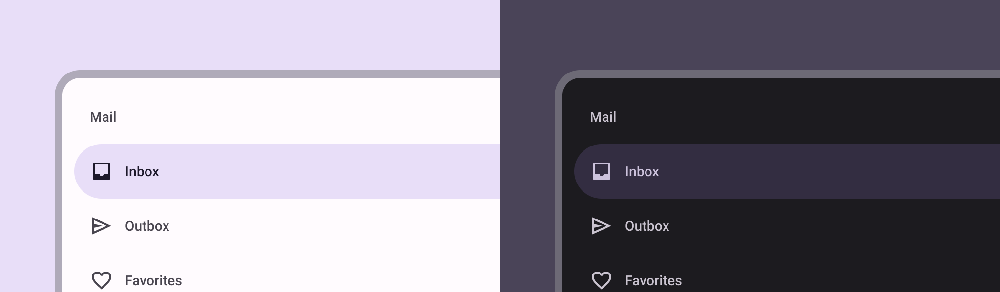

# Compose-Multiplatform

Compose Multiplatform 是 JetBrains 为桌面平台（macOS，Linux，Windows）和Web编写Kotlin UI框架

工具网站: 

* Material 3 UI： https://developer.android.google.cn/jetpack/androidx/releases/compose-material3?hl=zh_tw
* 组件与函数的查询网站：https://www.composables.com/
* Compose JVM: https://github.com/JetBrains/compose-multiplatform/blob/master/tutorials/README.md
* Compose Andorid: https://developer.android.google.cn/jetpack/compose/tutorial?hl=zh-cn
* 性能优化: https://juejin.cn/post/7306802651010105344?searchId=20240113204924BDAD4D1A3940B6E9F331
* 响应式布局: https://juejin.cn/post/7307838693145903138?searchId=20240113204911F202EF8610E9B5E697D6
* compose 中文教程: https://jetpackcompose.cn/docs/

如何构建工程:

1. 使用 IDEA 的 Compose-Multiplatform
2. 使用[网站引导](https://kmp.jetbrains.com/)，他可以构建多个平台的compose

工程示例:

1. 菜谱[APP](https://github.com/SEAbdulbasit/recipe-app)多端应用 （Android Studio）
2. IDEA中[多端环境](https://juejin.cn/post/7103085706674700318)

文章:

1. [MVI](https://juejin.cn/post/7141269750277439496) 架构
2. [Compose](https://juejin.cn/post/7176437908935540797) 为什么可以跨平台
3. 


# 一、笔记

## 1. 图像

**图片加载与与使用并主要使用 Image 组件**

### 1.1 加载 Resources 图片

> 示例

```kotlin
Image(
     /*加载位于Resources/sample.png的图片*/
    painter = painterResource("sample.png"),
    /*无障碍服务用于描述此图像所代表内容的文本。除非此图像用于装饰目的，并且不代表用户可以采取的有意义的操作，否则应始终提供此图像。此文本应进行本地化，例如使用 androidx.compose.ui.res.stringResource 或类似文本*/
    contentDescription = "Sample", 
    /*用于调整布局算法或绘制装饰内容（例如背景）的修改器*/
    modifier = Modifier.fillMaxSize()
)
```

> 封装的工具类

```kotlin
@Composable
fun ImageForResources(
    resourcesPath: String,
    contentDescription: String? = File(resourcesPath).name,
    modifier: Modifier = Modifier,
    alignment: Alignment = Alignment.Center,
    contentScale: ContentScale = ContentScale.Fit,
    alpha: Float = DefaultAlpha,
    colorFilter: ColorFilter? = null,
) {
    Image(painterResource(resourcesPath), contentDescription, modifier, alignment, contentScale, alpha, colorFilter)
}
```


### 1.2 通过 File 进行加载

没有方法能够加载文件到 Image 组件，你需要方法对其进行封装。

##### 1.2.1 加载资源

你最应该的就是先加载资源并转为对应的格式

> 1. loadImageBitmap(inputStream) 
>
>    * 从给定inputStream的 加载和解码ImageBitmap。
>    *  inputStream 应包含 Skia 支持的格式（BMP、GIF、HEIF、ICO、JPEG、PNG、WBMP、WebP）的编码光栅图像
>    * 返回类型为 ImageBitmap ：不可以直接使用。你需要转换为Painter
>      * BitmapPainter(it)
>
> 2. loadSvgPainter(inputStream, density) 
>
>    * inputStream - 输入流来加载 SVG 资源。所有字节都将从此流中读取，但在此方法之后不会关闭流。
>    * density - 密度，用于设置 Painter 的固有大小。
>    * 如果以指定大小绘制图像，则密度将不起作用
>    * 返回类型为 Painter : 可以直接使用
>
> 3. loadXmlImageVector(InputSource(inputStream), density)
>
>    * XML 矢量图像
>
>    * inputSource - 用于加载 XML 矢量图像的输入源。将自动关闭。
>
>    * density - 密度，将用于设置 ImageVector 的默认大小。如果以指定大小绘制图像，则密度将不起作用。
>
>    * 返回类型为 ImageVector : 不可以直接使用。你需要转换为Painter
>
>      * ```kotlin
>        // rememberVectorPainter 主要代码
>        VectorPainter().apple{ 
>        	val image = imageVector
>        	val density = LocalDensity.current
>            val widthPx = with(density) { image.defaultWidth.toPx() }
>            val heightPx = with(density) { image.defaultHeight.toPx() }
>        
>            val vpWidth = if (image.viewportWidth.isNaN()) widthPx else viewportWidth
>            val vpHeight = if (image.viewportHeight.isNaN()) heightPx else viewportHeight
>        
>            val intrinsicColorFilter = remember(image.tintColor, image.tintBlendMode) {
>                if (image.tintColor != Color.Unspecified) {
>                    ColorFilter.tint(image.tintColor, image.tintBlendMode)
>                } else {
>                    null
>                }
>            }
>            //设置参数
>            size = Size(widthPx, heightPx)
>            this.autoMirror = image.autoMirror
>            this.intrinsicColorFilter = intrinsicColorFilter
>            RenderVector(image.name, vpWidth, vpHeight, { _, _ -> RenderVectorGroup(group = image.root) })
>        }
>        ```
>      *  或者使用 rememberVectorPainter(it) 


##### 1.2.2 异步加载

**异步的 Image 组件: **

```kotlin
@Composable
fun <T> AsyncImage(
    load: suspend () -> T,
    contentDescription: String,
    modifier: Modifier = Modifier,
    contentScale: ContentScale = ContentScale.Fit,
) {
    // 使用 `produceState` 函数从 IO 协程加载异步资源，并将其状态安全地应用于 Compose 组件的状态管理。
    // `produceState` 是一个函数，它会创建一个可以被 Compose 系统观察并自动更新 UI 的状态对象。
    // 当其内部的计算结果发生变化时，依赖于此状态的所有 Composable 部件将会重新组合（recompose）。
    val image: T? by produceState<T?>(null) {
        value = withContext(Dispatchers.IO) {
            try {
                load()
            } catch (e: IOException) {
                // instead of printing to console, you can also write this to log,
                // or show some error placeholder
                e.printStackTrace()
                null
            }
        }
    }

    if (image != null) {
        val painter = when (image!!) {
            is ImageBitmap -> BitmapPainter(image!! as ImageBitmap)
            is Painter -> image
            is ImageVector -> rememberVectorPainter(image!! as ImageVector)
            else -> {
                throw IllegalArgumentException("Unsupported image type: $image")
            }
        } as Painter
        Image(
            painter = remember {painter },
            contentDescription = contentDescription,
            contentScale = contentScale,
            modifier = modifier
        )
    }
}
```


**使用示例:**

```kotlin
//注意这里使用的是 singleWindowApplication 于 application 一致
fun main() = singleWindowApplication {
    val density = LocalDensity.current
    Column {

        AsyncImage(
            load = {
                loadSvgPainter(
                    "https://raw.githubusercontent.com/JetBrains/compose-multiplatform/master/artwork/idea-logo.svg",
                    density
                )
            },
            contentDescription = "Idea logo",
            contentScale = ContentScale.FillWidth,
            modifier = Modifier.width(200.dp)
        )

    }
}


/* Loading from file with java.io API */

fun loadImageBitmap(file: File): ImageBitmap =
    file.inputStream().buffered().use { loadImageBitmap(it) }

fun loadSvgPainter(file: File, density: Density): Painter =
    file.inputStream().buffered().use { loadSvgPainter(it, density) }

fun loadXmlImageVector(file: File, density: Density): ImageVector =
    file.inputStream().buffered().use { loadXmlImageVector(InputSource(it), density) }

/* Loading from network with java.net API */

fun loadImageBitmap(url: String): ImageBitmap =
    URL(url).openStream().buffered().use(::loadImageBitmap)

fun loadSvgPainter(url: String, density: Density): Painter =
    URL(url).openStream().buffered().use { loadSvgPainter(it, density) }

fun loadXmlImageVector(url: String, density: Density): ImageVector =
    URL(url).openStream().buffered().use { loadXmlImageVector(InputSource(it), density) }

/* Loading from network with Ktor client API (https://ktor.io/docs/client.html). */

/*

suspend fun loadImageBitmap(url: String): ImageBitmap =
    urlStream(url).use(::loadImageBitmap)

suspend fun loadSvgPainter(url: String, density: Density): Painter =
    urlStream(url).use { loadSvgPainter(it, density) }

suspend fun loadXmlImageVector(url: String, density: Density): ImageVector =
    urlStream(url).use { loadXmlImageVector(InputSource(it), density) }

@OptIn(KtorExperimentalAPI::class)
private suspend fun urlStream(url: String) = HttpClient(CIO).use {
    ByteArrayInputStream(it.get(url))
}

 */
```

### 1.3 Canvas

**使用 Canvas 绘制图像**

```kotlin
fun main() = singleWindowApplication {
    val density = LocalDensity.current // to calculate the intrinsic size of vector images (SVG, XML)

    val sample = remember {
        useResource("sample.png", ::loadImageBitmap)
    }
    val ideaLogo = remember {
        useResource("idea-logo.svg") { loadSvgPainter(it, density) }
    }
    val composeLogo = rememberVectorPainter(
        remember {
            useResource("compose-logo.xml") { loadXmlImageVector(InputSource(it), density) }
        }
    )

    Canvas(
        modifier = Modifier.fillMaxSize()
    ) {
        drawIntoCanvas { canvas ->
            canvas.withSave {
                //绘制图片
                canvas.drawImage(sample, Offset.Zero, Paint())
                canvas.translate(sample.width.toFloat(), 0f)
                //绘制矢量图
                with(ideaLogo) {
                    draw(ideaLogo.intrinsicSize)
                }
                //绘制矢量图
                canvas.translate(ideaLogo.intrinsicSize.width, 0f)
                with(composeLogo) {
                    draw(Size(100f, 100f))
                }
            }
        }
    }
}
```


### 1.4 设置应用图标

##### 1.4.1 Win/Linux

```kotlin
fun main() = application {
    Window(
        onCloseRequest = ::exitApplication,
        icon = painterResource("sample.png")
    ) {
        App()
    }
}
```

##### 1.4.2 macOS

您应该更改[build.gradle中的图标](https://github.com/JetBrains/compose-multiplatform/blob/master/tutorials/Native_distributions_and_local_execution#app-icon), 需要以操作系统特定的格式提供：

- `.icns`对于 macOS；
- `.ico`对于 Windows；
- `.png`对于Linux。

```kotlin
compose.desktop {
    application {
        nativeDistributions {
            macOS {
                iconFile.set(project.file("icon.icns"))
            }
            windows {
                iconFile.set(project.file("icon.ico"))
            }
            linux {
                iconFile.set(project.file("icon.png"))
            }
        }
    }
}
```

##### 1.4.3 单窗口

使用时`singleWindowApplication`，可以采用以下方法：

```kotlin
fun main() = singleWindowApplication(icon = BitmapPainter(useResource("sample.png", ::loadImageBitmap))) {
	//....
}
```

##### 1.4.4 应用程序托盘图标

```kotlin
fun main() = application {
    val icon = painterResource("sample.png")

    Tray(
        icon = icon,
        menu = {
            Item("Quit App", onClick = ::exitApplication)
        }
    )

    Window(onCloseRequest = ::exitApplication, icon = icon) {
        Image(
            painter = icon,
            contentDescription = "Icon",
            modifier = Modifier.fillMaxSize()
        )
    }
}
```

### 1.5 绘制 Painter

```kotlin
object AboutIcon : Painter() {
    override val intrinsicSize = Size(256f, 256f)

    override fun DrawScope.onDraw() {
        drawOval(Color(0xFFFFA500))
    }
}
```

## 2. 鼠标事件

### 2.1. 单机事件

```kotlin
//仅支持主按钮（鼠标左键）和触摸事件
Modifier.combinedClickable(
    enabled =  true,//起用事件
    onClick = {
        text = "Click! ${count++}"
    },
    onDoubleClick = {
        text = "Double click! ${count++}"
    },
    onLongClick = {
        text = "Long click! ${count++}"
    }
   
)
```

```kotlin
//目前仅适用于桌面 JVM 平台
Modifier.onClick(enabled =  false) {
    text = "Click! ${count++}"
}
```

完整示例

```kotlin
fun main() = singleWindowApplication {
    var count by remember { mutableStateOf(0) }
    Box(contentAlignment = Alignment.Center, modifier = Modifier.fillMaxWidth()) {
        var text by remember { mutableStateOf("Click magenta box!") }
        Column {
            @OptIn(ExperimentalFoundationApi::class)
            Box(
                modifier = Modifier
                    .background(Color.Magenta)
                    .fillMaxWidth(0.7f)
                    .fillMaxHeight(0.2f)
                    .combinedClickable(
                        onClick = {
                            text = "Click! ${count++}"
                        },
                        onDoubleClick = {
                            text = "Double click! ${count++}"
                        },
                        onLongClick = {
                            text = "Long click! ${count++}"
                        }
                    )
            )
            Text(text = text, fontSize = 40.sp)
        }
    }
}
```


### 2.2 移动事件

```kotlin
//鼠标移动 仅限桌面
Modifier.onPointerEvent(PointerEventType.Move) {
    val position = it.changes.first().position //鼠标当前位置
} 
//鼠标进入 仅限桌面 
.onPointerEvent(PointerEventType.Enter) { active = true }
//鼠标离开 仅限桌面
.onPointerEvent(PointerEventType.Exit) { active = false },
```

示例

```kotlin
@OptIn(ExperimentalComposeUiApi::class)
fun main() = singleWindowApplication {
    var color by remember { mutableStateOf(Color(0, 0, 0)) }
    Box(
        modifier = Modifier
            .wrapContentSize(Alignment.Center)
            .fillMaxSize()
            .background(color = color)
            .onPointerEvent(PointerEventType.Move) {
                val position = it.changes.first().position
                color = Color(position.x.toInt() % 256, position.y.toInt() % 256, 0)
            }
    )
}
```

### 2.3 滚轮事件

```kotlin
//仅限桌面
Modifier.onPointerEvent(PointerEventType.Scroll) {
    number += it.changes.first().scrollDelta.y
}
```

### 2.4 其他鼠标事件

请查阅 `androidx.compose.ui.input.pointer.PointerEventType.Companion` 移动事件与滚轮事件都是来自于他，使用方式也与上面一致**（仅限桌面）**

**如果不使用该事件那么就使用原始的方式监听**

该方式是稳定的并且多平台

```kotlin
Modifier.pointerInput(Unit) {
    awaitPointerEventScope {
        println(this)
        while (true) {
            val event = awaitPointerEvent()
            val position = event.changes.first().position
            //如果该事件不是鼠标移动就执行任务
            if (event.type != PointerEventType.Move) {
                list.add(0, "${event.type} $position")
            }
        }
    }
}
```

### 2.5 转为 AWT 事件

Compose for Desktop 使用底层的 Swing 并允许访问原始 AWT 事件**（仅限桌面）**：

```kotlin
it.awtEventOrNull // 获取 AWT 事件
```

完整示例

```kotlin
@OptIn(ExperimentalComposeUiApi::class)
fun main() = singleWindowApplication {
    var text by remember { mutableStateOf("") }

    Box(
        Modifier
            .fillMaxSize()
            .onPointerEvent(PointerEventType.Press) {
                val awtEventOrNull: MouseEvent? = it.awtEventOrNull // 获取 AWT 事件
                text = awtEventOrNull?.locationOnScreen?.toString().orEmpty()
            },
        contentAlignment = Alignment.Center
    ) {
        Text(text)
    }
}
```

### 2.6 onDrag 

> **仅适用于桌面 JVM 平台**

`Modifier.onDrag`允许配置应触发拖动的指针（请参阅`matcher: PointerMatcher`）。

```kotlin
@OptIn(ExperimentalFoundationApi::class)
fun main() = singleWindowApplication {
    val windowInfo = LocalWindowInfo.current

    Column {
        var topBoxOffset by remember { mutableStateOf(Offset(0f, 0f)) }

        Box(modifier = Modifier.offset {
            IntOffset(topBoxOffset.x.toInt(), topBoxOffset.y.toInt())
        }.size(100.dp)
            .background(Color.Green)
            .onDrag { // all default: enabled = true, matcher = PointerMatcher.Primary (left mouse button)
                topBoxOffset += it
            }
        ) {
            Text(text = "Drag with LMB", modifier = Modifier.align(Alignment.Center))
        }

        var bottomBoxOffset by remember { mutableStateOf(Offset(0f, 0f)) }

        Box(modifier = Modifier.offset {
            IntOffset(bottomBoxOffset.x.toInt(), bottomBoxOffset.y.toInt())
        }.size(100.dp)
            .background(Color.LightGray)
            .onDrag(
                enabled = true,
                matcher = PointerMatcher.mouse(PointerButton.Secondary), // right mouse button
                onDragStart = {
                    println("Gray Box: drag start")
                },
                onDragEnd = {
                    println("Gray Box: drag end")
                }
            ) {
                val keyboardModifiers = windowInfo.keyboardModifiers
                bottomBoxOffset += if (keyboardModifiers.isCtrlPressed) it * 2f else it
            }
        ) {
            Text(text = "Drag with RMB,\ntry with CTRL", modifier = Modifier.align(Alignment.Center))
        }
    }
}
```

使用其他方法

```kotlin
@OptIn(ExperimentalFoundationApi::class)
fun main() = singleWindowApplication {
    var topBoxOffset by remember { mutableStateOf(Offset(0f, 0f)) }

    Box(modifier = Modifier.offset {
        IntOffset(topBoxOffset.x.toInt(), topBoxOffset.y.toInt())
    }.size(100.dp)
        .background(Color.Green)
        .pointerInput(Unit) {
            detectDragGestures(
                matcher = PointerMatcher.Primary
            ) {
                topBoxOffset += it
            }
        }
    ) {
        Text(text = "Drag with LMB", modifier = Modifier.align(Alignment.Center))
    }
}
```

## 3.布局

### 3.1 Row

水平布局: 在水平方向上排列其子组件，类似于 Android 中的 `LinearLayout` 设置为 `HORIZONTAL` 方向。

通过设置 `Arrangement.Horizontal` 参数，可以控制子组件在行内的排列方式，如居中（Center）、靠左对齐（Start）、靠右对齐（End）、等间距分布（SpaceEvenly、SpaceBetween、SpaceAround）等。

```kotlin
// Row 示例 Row 中的子组件（两个 Text）在水平方向上均匀分布且垂直居中对齐。
Row(
    modifier = Modifier.fillMaxWidth(),
    verticalAlignment = Alignment.CenterVertically,
    horizontalArrangement = Arrangement.SpaceBetween
) {
    Text("Left Text")
    Text("Right Text")
}
```

### 3.2 Column

垂直布局: 在垂直方向上排列其子组件，类似于 Android 中的 `LinearLayout` 设置为 `VERTICAL` 方向。

通过传入 `Arrangement.Vertical` 参数，可以决定子组件在列中的布局方式。

```kotlin
// Column 示例 Column 中的子组件（三个 Text）在垂直方向上等间距排列且水平居中对齐。
Column(
    modifier = Modifier.fillMaxHeight(),
    verticalArrangement = Arrangement.SpaceEvenly,
    horizontalAlignment = Alignment.CenterHorizontally
) {
    Text("Top Text")
    Text("Middle Text")
    Text("Bottom Text")
}
```

### 3.3 Box

帧布局： `Box`组件可以实现类似于Android中的`FrameLayout`的功能，它允许子组件重叠排列。

示例：

- `Box` 填充了整个屏幕空间。
- 首先有一个灰色背景文本在整个Box中居中显示。
- 然后有一张图片也居中显示在Box中，可能与文本重叠。
- 最后，一个按钮放置在Box的右上角（默认情况下，若要精确控制位置，需要结合Modifier.offset(x, y)或其他布局组合使用）。

```kotlin
Box(
    modifier = Modifier.fillMaxSize(),
    contentAlignment = Alignment.Center,
    propagateMinConstraints = false, //传入的最小约束是否应传递给内容。 设置为 false
) {
    Text("Background Text", color = Color.Gray)
    Image(painterResource(id = R.drawable.some_image), contentDescription = "An Image")
    Button(onClick = { /* doSomething() */ }) {
        Text("Top Right Button")
    }
}
```


### 3.4 自定义布局

`Layout` 是一个用于创建自定义布局的组件。它允许您定义如何测量和摆放其子元素的逻辑

```kotlin
Layout(
    modifier = modifier, // modifier
    content = content // Composable 函数
) { measurables, constraints ->
	// measurables 是一个 List，其中包含要在布局中测量的子元素的信息。
	// constraints 是一个描述当前布局约束的对象，包括最小和最大宽度、最小和最大高度等。
    // 测量逻辑
	
    // 布局逻辑
    layout(constraints.maxWidth, constraints.maxHeight) {
        // 子元素的摆放逻辑
    }
}

```


### 3.5 自定义布局示例

```kotlin
@Composable
fun MyColumn(
    modifier: Modifier = Modifier,
    content: @Composable() () -> Unit,
) {
    // 使用 Layout 创建自定义列布局
    Layout(
        modifier = modifier,
        content = content
    ) { measurables, constraints ->
        // 1. 测量子元素
        val placeables = measurables.map { measurable ->
            measurable.measure(constraints)
        }

        // 2. 计算布局的宽度和高度
        val width = constraints.maxWidth // 布局的最大宽度约束。由父布局或者最宽控件等决定
        val height = placeables.sumBy { it.height } // 计算出所有的控件高度，并作为布局高度

        // 3. 布局子元素
        layout(width, height) {
            // 定义纵向布局中当前子元素的位置
            var yPosition = 0

            // 遍历并布局每个子元素
            placeables.forEach { placeable ->
            	// 注意设置的控件的xy坐标是相对于当前布局的
                // 将子元素放置在正确的位置（垂直方向）
                placeable.placeRelative(0, yPosition)

                // 更新 yPosition，以便放置下一个子元素
                yPosition += placeable.height
            }
        }
    }
}


fun main(){
	//使用方式与Column 一致
    MyColumn(
        modifier = Modifier.fillMaxSize(),
    ) {
        Text("Item 1", modifier = Modifier.fillMaxWidth().height(50.dp))
        Text("Item 2", modifier = Modifier.fillMaxWidth().height(50.dp))
    }
}
```


### 3.6 ConstraintLayout

>  约束布局

ConstraintLayout的核心思想是基于约束（constraints）来定位和调整子视图（views）的位置和大小。开发者可以为每个子视图指定相对于其兄弟视图、父容器边缘或者其他指南线（guidelines）的位置约束。通过这种方式，即使在不同的屏幕尺寸和设备方向上，布局也能保持预期的设计效果。

需要引入

```text
implementation "androidx.constraintlayout:constraintlayout-compose:1.0.0-beta02" 
```

教程: https://github.com/androidx/constraintlayout/wiki/Introduction-to-ConstraintLayout-in-compose

> 简单示例

1. **引用 (References)**: 引用是使用 `createRefs()` 或 `createRefFor()` 创建的。这些引用是 ConstraintLayout 中可组合项的标识符，每个UI元素都需要有一个与之关联的引用。引用充当元素的唯一标识符，并用于在布局中指定约束条件。

   示例：

   ```
   val refs = createRefs()
   val buttonRef = refs.createRefFor(button)
   val textViewRef = refs.createRefFor(textView)
   ```

2. **约束条件 (Constraints)**: 约束条件定义了UI元素之间的关系，以及它们相对于父布局的位置。这些约束条件是使用 `constrainAs()` 修饰符提供的。该修饰符以引用作为参数，允许您在 lambda 主体中指定元素的约束条件。

   示例：

   ```
   // 将按钮约束到引用的左上角，并指定宽度和高度
   button.constrainAs(buttonRef) {
       top.linkTo(parent.top)
       start.linkTo(parent.start)
       width = Dimension.wrapContent
       height = Dimension.wrapContent
   }
   ```

3. **约束条件的指定方法**: 约束条件是通过不同的方法指定的，例如 `linkTo()` 和其他有用的方法。这些方法允许您定义元素相对于其他元素的位置关系，如相对位置、边距等。

   示例：

   ```
   // 将文本视图的底部链接到按钮的顶部，并指定垂直边距
   textView.constrainAs(textViewRef) {
       top.linkTo(button.bottom)
       verticalMargin = 16.dp
   }
   ```

4. **父引用 (parent reference)**: 在约束条件中，`parent` 是一个现有的引用，用于指定对ConstraintLayout可组合项本身的约束条件。通过这个引用，您可以定义元素相对于父布局的位置。

   示例：

   ```
   // 将按钮的右侧链接到父布局的右侧
   button.constrainAs(buttonRef) {
       end.linkTo(parent.end)
   }
   ```


### 3.7 Spacer

`Spacer` 通常是指用于在布局中创建间距或空白区域的元素或组件。

```
 // 使用 Spacer 插入间距
Spacer(modifier = Modifier.height(16.dp))
```


### 3.8 BoxWithConstraints

`BoxWithConstraints`与 `Box` 使用方式完全一致，只是如官方所说，可以测量约束条件，例如：

```kotlin
@Composable
fun MainPage1() {
    BoxWithConstraints {
        // 在这里可以访问 constraints 对象
        val maxWidth = constraints.maxWidth
        val maxHeight = constraints.maxHeight

        // 根据 constraints 动态调整子元素的布局
        Box(
            modifier = Modifier
                .size(maxWidth / 2, maxHeight / 2)
                .background(Color.Green)
        ) {
            Text("My minHeight is $maxHeight while my maxWidth is $maxWidth")
        }
    }
}
```


### 3.9 对齐

布局组件可以使用 `verticalArrangement` 或者 `horizontalAlignment` 进行垂直和水平的布局

其他组件需要使用 `modifier` 的 `align` 进行。

需要注意的是，在 modifier 中布局需要根据控件所在的布局的类型进行适当的调整

**另外需要注意"Arrangement"和"Alignment"的区别**

### 3.9.1 Row

```kotlin
Row(modifier = Modifier.fillMaxWidth(),            
    horizontalArrangement = Arrangement.Center,//设置水平居中对齐
    verticalAlignment =  Alignment.CenterVertically//设置垂直居中对齐
   ) {
    Text(text = "text控件")
    Text(text = "text控件")
}

```


### 3.9.2 Column

```kotlin
Column(
    modifier = modifier().fillMaxSize(),
    verticalArrangement = Arrangement.Center,
    horizontalAlignment = Alignment.CenterHorizontally

) {
    //
    Text("无任何组件", modifier = modifier().align(alignment = Alignment.CenterHorizontally))
}
```


### 3.9.3 其他组件示例

1. 垂直布局Column 进行水平居中

```kotlin
Column(Modifier.fillMaxWidth()) {
    Text(text = "text控件",modifier = Modifier.align(alignment = Alignment.CenterHorizontally))
    Text(text = "text控件",modifier = Modifier.align(alignment = Alignment.CenterHorizontally))
}

```

2. 水平布局Row 进行垂直居中

```kotlin
Row{
    Text("无任何组件", modifier = modifier().align(alignment = Alignment.CenterVertically))
    //错误的，在 Row 布局中不能使用 Column 的对其属性
    Text("无任何组件", modifier = modifier().align(alignment = Alignment.CenterHorizontally))
}
```


## 4. 列表

### 4.1 LazyColumn

```
LazyColumn( 
    contentPadding = PaddingValues(horizontal = 16.dp, vertical = 8.dp), // 内边距
    verticalArrangement = Arrangement.spacedBy(4.dp),  item间距
    
) { 
			// 浮动列表的浮动标题，使用 LazyColumn 实现粘性标题
			stickyHeader {
                Text("我是标题", modifier = Modifier.background(Color.Cyan))
            }
			
			//数据填充
            //item 方式
//            repeat(1000) {
//                item {
//                    Text(it.toString())
//                }
//            }
            
            // 通过 items 生成 1000 个 item
//            items(1000){
//                Text(it.toString())
//            }

            // 通过 items 生成 list 个 item
            items(mutableListOf(1,2,3)){
                Text(it.toString())
            }
} 
```


### 4.a LazyVerticalGrid

`LazyVerticalGrid` 是 Jetpack Compose 中的一个函数，用于创建垂直方向上的懒加载网格布局。这个函数接受一些参数来配置网格的列数、样式、状态等。

通常用于: 卡片组，不分顺序的类表格展示

```kotlin
        LazyVerticalGrid(
            columns = GridCells.Adaptive(minSize = 128.dp) //每个单元格至少 minSize 具有空间
//            columns = GridCells.Fixed(3) //定义具有固定行数或列数的网格。
//            columns = GridCells.FixedSize(30.dp) //定义每行列固定宽度的网格
        ) {
            items(1000) { photo ->
                Text(photo.toString(), modifier = Modifier.fillMaxSize())
            }
        }
```

### 4.2 LazyRow

`LazyRow` 是 Jetpack Compose 中用于创建横向懒加载布局的函数。与 `LazyColumn` 和 `LazyVerticalGrid` 类似，它允许您在横向方向上以懒加载的方式排列项目。每个项目可以占据多个列，形成横向的布局。


```kotlin
@Composable
fun LazyRowExample() {
    val items = (0..20).toList()

    val listState = rememberLazyListState()

    LazyRow(
        state = listState,
        modifier = Modifier
            .fillMaxWidth()
            .padding(16.dp)
    ) {
        items(20) { index ->
            Box(
                modifier = Modifier
                    .size(100.dp, 150.dp)
                    .background(if (index % 2 == 0) Color.LightGray else Color.Gray)
            ) {
                Text(
                    text = index.toString(),
                    modifier = Modifier
                        .fillMaxSize()
                        .padding(8.dp),
                    color = Color.White
                )
            }
        }
    }
}
```


### 4.3 滚动状态

`Modifier.verticalScroll(rememberScrollState())` 是 Jetpack Compose 中用于在垂直方向上添加滚动功能的修饰符。它的作用是将包含在此修饰符内的 Compose 组件包裹成一个可垂直滚动的区域。


1. **`Modifier.verticalScroll`**:
- `Modifier.verticalScroll` 是一个修饰符，表示在垂直方向上启用滚动功能。
	- 使用该修饰符时，其子元素会被包裹在一个可滚动的容器中，可以在垂直方向上滚动内容。
	- 与之对应的有 `horizontalScroll`

2. **`rememberScrollState()`**:
- `rememberScrollState()` 是一个 Compose 中的记忆状态（remember state）函数，用于创建一个可记忆的滚动状态对象。
	- 这个滚动状态对象跟踪滚动的位置，并在 Compose 中保留其状态，以便在重新构建时恢复到之前的滚动位置。
	- 使用 `rememberScrollState()` 是为了确保在 Compose 中的重新构建（例如屏幕旋转）时不会失去滚动位置。
	- 注意如果是 `LazyColumn` 或者 `LazyRow`  请使用 `rememberLazyListState ` 而不是 `rememberScrollState`
3. 滚动到特定项

```kotlin
val listState = rememberLazyListState() //注意使用的组件类型为 Lazy
// 在点击时调用 scrollToItem，将滚动位置滚动到特定项
listState.scrollToItem(index)
```

4. 滚动特定的像素

```kotlin
val scope = rememberCoroutineScope()
scope.launch{
    withIO {
    	//注意他们需要在协程内
		state.scrollTo(88)
		state.animateScrollTo(88) //带有像素的滚动
    }
}
```


### 4.4 Column

```kotlin
Column(
    modifier = Modifier.verticalScroll(rememberScrollState())
) {
    repeat(100){
        Text("Text - $it")
    }
}
```


## 5. Modifier 

### 5.1 修饰符顺序

**需要注意官方描述的“有序的”一词，由于`Modifier`的使用方式是链式的，所以属性定义的先后顺序会影响到UI的展示效果。**

```kotlin
@Composable
fun RoundButton() {
    Box(
        modifier = Modifier
            .width(300.dp)
            .height(90.dp)
            .background(Color(0xFF3ADF00), shape = RoundedCornerShape(50))
            .padding(20.dp),
        contentAlignment = Alignment.Center){
        Text(text = "RoundButton",color = Color.White)
    }
}

```

由于`background`在`padding`前，所以`Modifier`会先给`Box`设置背景，然后再设置边距


同理，将`background`与`padding`顺序替换，效果则如下：


通过查看`Modifier`的源码实现可以发现，在我们通过链式点点点叠加属性的过程中,`Modifier`会创建一个`CombinedModifier`将旧的和新的属性组合在一起，合成一个单独的`Modifier`，相当于给被修饰的组件套上了一层又一层的`Modifier`,这也是`Modifier`为有序的原因。

### 5.2 拓展性

```kotlin
@Stable
fun Modifier.padding(all: Dp) =
    this.then(
        PaddingModifier(
            start = all,
            top = all,
            end = all,
            bottom = all,
            rtlAware = true,
            inspectorInfo = debugInspectorInfo {
                name = "padding"
                value = all
            }
        )
    )

```

可以发现，`padding()`是`Modifier`的一个拓展函数，它调用了`Modifier`的 `then()` 函数，而这个 `then()` 需要接收一个`Modifier`对象，而`PaddingModifier`就是这个对象。


### 5.3 API

[官方文档](https://link.juejin.cn/?target=https%3A%2F%2Fdeveloper.android.google.cn%2Freference%2Fkotlin%2Fandroidx%2Fcompose%2Fui%2FModifier%23public-functions_1)

#### 5.3.1 宽&高

| 属性名                                                       | 含义                                                         |
| ------------------------------------------------------------ | ------------------------------------------------------------ |
| Modifier.`width`(width: Dp)                                  | 设置自身的宽度，单位`dp`                                     |
| Modifier.`fillMaxWidth`(fraction: Float = 1f)                | 默认横向填充满父容器的宽度，参数可以控制宽度的比例。例如0.5就是当前元素占父元素宽度的一半 |
| Modifier.`wrapContentWidth`(align: Alignment.Horizontal = Alignment.CenterHorizontally, unbounded: Boolean = false) | 根据**子级**元素的宽度来确定自身的宽度，如果自身设置了最小宽度的话则会被忽略。当`unbounded`参数为`true`的时候，自身设置了最大宽度的话也会被忽略 |
| ------------------------------------                         | -----------------------------------------                    |
| Modifier.`height`(height: Dp)                                | 设置自身的高度，单位`dp`                                     |
| Modifier.`fillMaxHeight`(fraction: Float = 1f)               | 默认纵向填充满父容器的宽度，参数可以控制宽度的比例。例如0.5就是当前元素占父元素高度的一半 |
| Modifier.`wrapContentHeight`(align: Alignment.Vertical = Alignment.CenterVertically, unbounded: Boolean = false) | 根据**子级**元素的高度来确定自身的高度，如果自身设置了最小高度的话则会被忽略。当`unbounded`参数为`true`的时候，自身设置了最大高度的话也会被忽略 |
| ------------------------------------                         | -----------------------------------------                    |
| Modifier.`size`(size: Dp)                                    | 设置自的宽高，单位`dp`                                       |
| Modifier.`size`(width: Dp, height: Dp)                       | 设置自的宽高，单位`dp`                                       |
| Modifier.`fillMaxSize`(fraction: Float = 1f)                 | 默认填充满父容器，参数可以控制比例。例如`0.5`就是当前元素占父元素的一半 |
| Modifier.`wrapContentSize`(align: Alignment = Alignment.Center, unbounded: Boolean = false) | 根据**子级**元素的宽高来确定自身的宽高，如果自身设置了最小宽高的话则会被忽略。当`unbounded`参数为`true`的时候，自身设置了最大宽高的话也会被忽略 |

#### 5.3.2 间距

| 属性名                                                       | 含义                                                         |
| ------------------------------------------------------------ | ------------------------------------------------------------ |
| Modifier.`padding`(start: Dp = 0.dp, top: Dp = 0.dp, end: Dp = 0.dp, bottom: Dp = 0.dp) | 分别在四个方向上设置填充                                     |
| Modifier.`padding`(horizontal: Dp = 0.dp, vertical: Dp = 0.dp) | 分别在横向和纵向上设置填充                                   |
| Modifier.`padding`(all: Dp)                                  | 统一设置所有方向上的填充                                     |
| Modifier.`padding`(padding: PaddingValues)                   | 根据参数`PaddingValues`来设置填充，`PaddingValues`参数可以理解为以上三种方式的封装 |

#### 5.3.3 绘制

| 属性名                                                       | 含义                                                         |
| ------------------------------------------------------------ | ------------------------------------------------------------ |
| Modifier.`alpha`(alpha: Float)                               | 不透明度，范围从0-1                                          |
| Modifier.`clip`(shape: Shape)                                | 裁剪为相应的形状，例如`shape = RoundedCornerShape(20)` 表示裁剪为`20%`圆角的矩形。 |
| Modifier.`shadow`(elevation: Dp, shape: Shape = RectangleShape, clip: Boolean = elevation > 0.dp) | 绘制阴影效果                                                 |
| Modifier.`rotate`(degrees: Float)                            | 设置视图围绕其中心旋转的角度                                 |
| Modifier.`scale`(scale: Float)                               | 设置视图的缩放比例                                           |
| Modifier.`scale`(scaleX: Float, scaleY: Float)               | 设置视图的缩放比例                                           |

#### 5.3.4 背景&边框

| 属性名                                                       | 含义                                  |
| ------------------------------------------------------------ | ------------------------------------- |
| Modifier.`background`(color: Color, shape: Shape = RectangleShape) | 设置背景色                            |
| Modifier.`background`(brush: Brush, shape: Shape = RectangleShape, alpha: Float = 1.0f) | 使用Brush来设置背景色，例如渐变色效果 |
| Modifier.`border`(border: BorderStroke, shape: Shape = RectangleShape) | 绘制指定形状的边框                    |
| Modifier.`border`(width: Dp, color: Color, shape: Shape = RectangleShape) | 绘制指定宽度、颜色、形状的边框        |
| Modifier.`border`(width: Dp, brush: Brush, shape: Shape)     | 绘制指定宽度、brush、形状的边框       |

#### 5.3.5 行为

| 属性名                                                       | 含义                               |
| ------------------------------------------------------------ | ---------------------------------- |
| Modifier.`clickable`( enabled: Boolean = true, onClickLabel: String? = null, role: Role? =null, onClick: () -> Unit) | 点击事件                           |
| Modifier.`combinedClickable`( enabled: Boolean = true,onClickLabel: String? = null,role: Role? = null,onLongClickLabel: String? = null,onLongClick: () -> Unit = null,onDoubleClick: () -> Unit = null,onClick: () -> Unit) | 组合点击事件，包括单击、长按、双击 |
| Modifier.`horizontalScroll`(state: ScrollState, enabled: Boolean = true, reverseScrolling: Boolean = false) | 使组件支持横向滚动模式             |
| Modifier.`verticalScroll`(state: ScrollState, enabled: Boolean = true, reverseScrolling: Boolean = false) | 使组件支持纵向滚动模式             |


## 6. 动画

https://developer.android.com/jetpack/compose/tutorial?hl=zh-cn

### 6.1 值动画

值动画是在一段时间内改变数值的过程，用于实现在界面上平滑、渐变地过渡某个属性的效果。在计算机图形学和用户界面设计中，值动画常被用于实现一些视觉效果，比如渐变、移动、缩放、颜色变化等。

在Compose中，通过使用`animate*`系列函数，可以方便地创建和执行值动画。这些函数会在目标值发生变化时自动启动动画，然后平滑地过渡到新的值。值动画的过程是由Compose框架自动处理的，无需手动指定每一帧的细节。

**简单来说就是从一个值过渡到另外一个值，因为这个原因所以值动画不是所有值都能用的，需要特定的函数进行**

#### 6.1.1 单值动画

1. **`animateFloatAsState`**: 创建一个 `Float` 类型的动画状态。当目标值发生变化时，会自动启动动画来平滑过渡。

    ```kotlin
    val animatedValue by animateFloatAsState(targetValue)
    ```

2. **`animateIntAsState`**: 创建一个 `Int` 类型的动画状态。与 `animateFloatAsState` 类似，用于整数值的动画。

    ```kotlin
    val animatedValue by animateIntAsState(targetValue)
    ```

3. **`animateColorAsState`**: 创建一个 `Color` 类型的动画状态，用于处理颜色值的动画。

    ```kotlin
    val animatedColor by animateColorAsState(targetColor)
    ```

4. **`animateContentSize`**: 用于处理内容大小的动画，当内容大小发生变化时，会自动启动动画。

    ```kotlin
    Box(
        modifier = Modifier
            .size(animateContentSize())
            .background(Color.Blue)
    ) {
        // Content goes here
    }
    ```

5. **`animateDpAsState`**: 创建一个 `Dp`（像素密度独立像素）类型的动画状态，用于处理尺寸的动画。

    ```kotlin
    val animatedSize by animateDpAsState(targetSize)
    ```

6. **`animationValueAsState`** 可以对所有值进行动画，但是需要自行实现

这些函数可以在 Compose 中使用，使得在 UI 中实现平滑的动画效果变得更加简单。值得注意的是，这些动画函数返回的是 Compose 中的 `State` 对象，因此它们可以直接用于 Compose 中的可组合函数。

参数列表: 

> targetValue - 动画的目标值
> animationSpec- 将用于随时间改变值的动画效果
>
>  * tween ： 具有给定持续时间、延迟和缓动曲线的配置。
>    	* durationMillis - 动画规范的持续时间
>       	* delayMillis - 动画在开始之前等待的时间（以毫秒为单位）
>       	* easing - 用于在开始和结束之间插值的缓动曲线
> * spring： 自然的、有弹性的动画过渡
>   * dampingRatio - 弹簧的阻尼比。 Spring.DampingRatioNoBouncy 默认情况下。
>   * stiffness - 弹簧的刚度。 Spring.StiffnessMedium 默认情况下。
>   * visibilityThreshold - （可选）指定可见性阈值。
> * snap
> * infiniteRepeatable
> * repeatable
> * keyframes
>
> label - 一个可选标签，用于与 Android Studio 中的其他动画区分开来。
> finishedListener - 一个可选的侦听器，用于在动画完成时收到通知

```kotlin
val targetColor = remember { mutableStateOf(Color(0xFF888888)) }
val color by animateColorAsState(targetColor.value)

Text(
    "简单值动画",
    modifier = Modifier
    .fillMaxSize()
    .background(color)
    .onClick {
        targetColor.value = Color.Red
    }
)
```


##### animationValueAsState 自行实现动画

> 我们定义一个对象叫CustomSize，CustomSize有宽高属性，然后我们对CustomSize去做改变。从而实现动画。代码如下：点击红色的Box，宽高会从200dp动画过度到80dp，再点击会从80dp过度到200dp

```kotlin
class CustomSize(val width: Dp, val height:Dp)

@Preview
@Composable
fun customTwoWayConvert(){
    val big = remember() {
        mutableStateOf(true)
    }
    val sizeState:CustomSize by animateValueAsState<CustomSize, AnimationVector2D>(
        targetValue = if(big.value) CustomSize(200.dp,200.dp) else CustomSize(80.dp,80.dp),
        TwoWayConverter(
            convertFromVector = {
                CustomSize(it.v1.dp,it.v2.dp)
            },
            convertToVector = {
                AnimationVector2D(it.width.value,it.height.value)
            }
        )
    )
    Column() {
        Box(modifier = Modifier.size(sizeState.width,sizeState.height).clickable {
            big.value = !big.value
        }.background(Color.Red))
    }
}
```


#### 6.1.2 多值动画

在Compose中，多值动画（Multi-Value Animations）通常是指同时对多个属性进行动画处理。Compose框架提供了`animate`和`animate*`系列函数，允许你通过一个动画控制器（`AnimationSpec`）来同时对多个属性进行动画。

一种常见的使用情景是使用`animate`函数，将多个属性放在一个 lambda 表达式中进行处理。这样，当其中任何一个属性发生变化时，都会触发整个动画。

在 Compose 动画中，`updateTransition` 是一个用于创建多个属性动画的强大函数。它返回一个 `Transition` 对象，该对象允许你定义和控制多个属性的动画。

> updateTransition( targetState: T,label: String? = null)

```kotlin

@OptIn(ExperimentalFoundationApi::class, ExperimentalStdlibApi::class)
fun main() = singleWindowApplication {
    val state by remember {
        mutableStateOf(
            Values(
                Color.Red,
                100.dp,
                100.dp
            )
        )
    }

    val transition = updateTransition(state)

    val color by transition.animateColor(
        transitionSpec = {
            //使用动画效果
            tween<Color>(2000)
        }
    ) { state.color }
    val width by transition.animateDp { state.width }
    val height by transition.animateDp { state.height }

    Column(
        modifier = Modifier
            .width(width)
            .height(height)
            .background(color)
            .onClick {
                state.color = Color.Green
                state.width += 100.dp
                state.height += 100.dp
            }
    ) {
        Text("多值动画")
    }
}

class Values(
    c: Color,
    w: Dp,
    h: Dp,
) {
    private var cc: MutableState<Color>
    private var ww: MutableState<Dp>
    private var hh: MutableState<Dp>

    var color: Color
        get() = cc.value
        set(value) {
            cc.value = value
        }

    var width: Dp
        get() = ww.value
        set(value) {
            ww.value = value
        }
    var height: Dp
        get() = hh.value
        set(value) {
            hh.value = value
        }

    init {
        cc = mutableStateOf(c)
        ww = mutableStateOf(w)
        hh = mutableStateOf(h)
    }
}
```


>  updateTransition(targetState: T,label: String? = null)

```kotlin
val a by animateColorAsState(cc)
val transition = updateTransition(a)
```


### 6.2 内容动画

#### 6.2.1 内容大小动画

**animateContentSize**

> * animationSpec 动画规范（默认是spring弹簧效果）可以有如下几种实现
>   * spring()，tween()，keyframes()，repeatable()，infiniteRepeatable()，snap() 后面内容讲到AnimationSpec我们再细讲这几个方法。
>
> * finishedListener 完成动画的回调

```kotlin
fun main() = singleWindowApplication {
    val expand = remember {
        mutableStateOf(true)
    }
    Column(
        horizontalAlignment = Alignment.CenterHorizontally,
        modifier = Modifier.fillMaxSize()
    ) {

        Button(onClick = {
            expand.value = !expand.value
        },modifier = Modifier.padding(vertical = 10.dp)) {
            Text(text =  if(expand.value) "收起" else "展开")
        }

        Box(
   			modifier = Modifier
                .background(Color.Blue)
                .padding(horizontal = 5.dp)
                .animateContentSize( //添加动画
                    finishedListener = {
                            initialValue, targetValue ->
                })
        ) {
            Text(text = "探清水河，桃叶儿尖上尖，柳叶儿遮满了天，在其位这位名阿公，细听我来言呐。此事啊，发生在京西南电厂啊，南电厂火器营有一位宋老三啊，提起那宋老三，两口子落平川，一生啊无有儿，所生女婵娟啊，小女啊年长啊一十六啊，取了个乳名，名字叫大连啊，姑娘叫大连，俊俏好容颜",color = Color.White,
                maxLines = if(expand.value) 100 else 1,lineHeight = 20.sp,fontSize = 15.sp,overflow = TextOverflow.Ellipsis)
        }

    }

}
```

#### 6.2.2 内容切换动画

Crossfade动画的使用时机，是在内容切换的时候，去使用。

```
@Composable
fun <T> Crossfade(
    targetState: T,
    modifier: Modifier = Modifier,
    animationSpec: FiniteAnimationSpec<Float> = tween(),
    content: @Composable (T) -> Unit
){...}

```

* targetState 是表示目标布局的状态。每次更改时，都会触发动画。

* modifier 修饰符

* animationSpec 动画规范。默认是tween。跟上面一致

* content 内容 举例：内容的切换，比如点击一个按钮，把一个文本变成一个图片。代码如下：

```kotlin

enum class ContentStyle{
    IMAGE,
    TEXT
}

@Preview
@Composable
fun crossfadeTest(){
    val contentStyle = remember {
        mutableStateOf(ContentStyle.TEXT)
    }
    Column(
        horizontalAlignment = Alignment.CenterHorizontally,
        modifier = Modifier.fillMaxSize()
    ) {

        Button(onClick = {
            contentStyle.value = if(contentStyle.value==ContentStyle.TEXT) ContentStyle.IMAGE else ContentStyle.TEXT
        },modifier = Modifier.padding(vertical = 10.dp)) {
            Text(text =  if(contentStyle.value==ContentStyle.TEXT) "变成图片" else "变成文本")
        }

        Crossfade(
            targetState = contentStyle,
            animationSpec = tween(durationMillis = 3000,easing = LinearEasing)
        ) {
            when(it.value){
                // 文本
                ContentStyle.TEXT->{
                    Text(text =  "我是海绵宝宝的文本")
                }
                // 图片
                ContentStyle.IMAGE->{
                    Image(Icons.Filled.Home, contentDescription = "")
                }
            }
        }
    }
}
```


### 6.3 可见性动画

```
@ExperimentalAnimationApi
@Composable
fun AnimatedVisibility(
    visible: Boolean,
    modifier: Modifier = Modifier,
    enter: EnterTransition = fadeIn() + expandIn(),
    exit: ExitTransition = shrinkOut() + fadeOut(),
    initiallyVisible: Boolean = visible,
    content: @Composable () -> Unit
) {
    AnimatedVisibilityImpl(visible, modifier, enter, exit, initiallyVisible, content)
}

```

visible 显示还是隐藏

modifier 修饰符 之前文章讲过[Modifier用法详解](https://juejin.cn/post/6950197175095656462)

enter 进入的动画 EnterTransition有几种获取方式

- fadeIn()
- slideIn()
- expandIn()
- expandHorizontally()
- expandVertically()
- slideInHorizontally()
- slideInVertically()

exit 退出的动画 ExitTransition有几种获取方式

- fadeOut()
- slideOut()
- shrinkOut()
- shrinkHorizontally()
- shrinkVertically()
- slideOutHorizontally()
- slideOutVertically()

initiallyVisible 控制是否应设置入场的动画，默认值是visible。

content 包含的内容 举例：比如一个按钮去控制按钮下面内容的显示隐藏，（动画效果可以自行替换）代码如下

```kotlin
@Preview
@Composable
fun animatedVisibilityTest() {
    val visible = remember {
        mutableStateOf(true)
    }
    Column(
        horizontalAlignment = Alignment.CenterHorizontally,
        modifier = Modifier.fillMaxSize()
    ) {

        Button(onClick = {
            visible.value = !visible.value
        }, modifier = Modifier.padding(vertical = 10.dp)) {
            Text(text = if (visible.value) "隐藏" else "显示")
        }

        AnimatedVisibility(
            visible = visible.value,
            enter = fadeIn(),
            exit = fadeOut()
        ) {
            Row(
                verticalAlignment = Alignment.CenterVertically
            ) {
                Icon(imageVector = Icons.Filled.Lock, contentDescription = "")
                Text(modifier = Modifier.padding(start = 5.dp), text = "HI")
            }
        }
    }
}

```


### 6.4 重复动画

InfiniteTransition 可以像 Transition 一样保存一个或多个子动画，但是，这些动画一进入组合阶段就开始运行，除非被移除，否则不会停止，当我们的动画是无限动画的时候，可以使用rememberInfiniteTransition。

```
@Composable
fun rememberInfiniteTransition(): InfiniteTransition {
    val infiniteTransition = remember { InfiniteTransition() }
    infiniteTransition.run()
    return infiniteTransition
}

```

我们可以使用 rememberInfiniteTransition 创建 InfiniteTransition 实例。InfiniteTransition通过使用 animateColor，animateFloat，animateValue 添加子动画。 animateColor,animateFloat,animateValue代码如下：

```kotlin
@Composable
fun InfiniteTransition.animateColor(
    initialValue: Color,
    targetValue: Color,
    animationSpec: InfiniteRepeatableSpec<Color>
): State<Color> {
    val converter = remember {
        (Color.VectorConverter)(targetValue.colorSpace)
    }
    return animateValue(initialValue, targetValue, converter, animationSpec)
}

@Composable
fun InfiniteTransition.animateFloat(
    initialValue: Float,
    targetValue: Float,
    animationSpec: InfiniteRepeatableSpec<Float>
): State<Float> =
    animateValue(initialValue, targetValue, Float.VectorConverter, animationSpec)


```


### 6.5 Animatable

`Animatable` 是一个能够提供初始值的基础 `API`， `animate*AsState` 系列 API 其内部均使用 `Animatable` 定制完成的。当你希望对自定义的数据类型进行动画计算时，可以选择使用 `Animatable` 来完成

方法如下:

```kotlin
// 下面是任何类型的
@Suppress("NotCloseable")
class Animatable<T, V : AnimationVector>(
    initialValue: T,
    val typeConverter: TwoWayConverter<T, V>,
    private val visibilityThreshold: T? = null
){...}

// 下面是Float的
fun Animatable(
    initialValue: Float,
    visibilityThreshold: Float = Spring.DefaultDisplacementThreshold
) = Animatable(
    initialValue,
    Float.VectorConverter,
    visibilityThreshold
)

// 下面是Color的。
fun Animatable(initialValue: Color): Animatable<Color, AnimationVector4D> =
    Animatable(initialValue, (Color.VectorConverter)(initialValue.colorSpace))

```

参数如下: 

> initialValue 是初始值
>
> typeConverter 是类型转换器 类型转换器compose有帮我们默认实现了如下几种。
>
> - Float.VectorConverter
> - Int.VectorConverter
> - Dp.VectorConverter
> - Rect.VectorConverter
> - DpOffset.VectorConverter
> - Size.VectorConverter
> - IntOffset.VectorConverter
> - IntSize.VectorConverter
>
> 由于Animatable对Float有做了封装，所以当我们创建一个Float改变的Animatable的时候，我们可以直接 val anim = Animatable(0f)
>
> 由于Animatable对color有做了封装，所以当我们创建一个Color改变的Animatable的时候，我们可以直接 val anim = Animatable(Color.Red)
>
> 而当我们创建一个Dp的时候，如下 val anim = Animatable(48.dp,Dp.VectorConverter) 我们需要额外去写一个VectorConverter。这个Dp.VectorConverter就是类型转换器。


例子1:

> 一个红色的Box。点击会从200dp过度到100dp，点击又会从100dp过度回200dp

```kotlin
@SuppressLint("UnrememberedAnimatable")
@Preview
@Composable
fun animatableTest(){
    val big = remember {
        mutableStateOf(true)
    }
    Column(){
        val anim = remember() {
            Animatable(100.dp,Dp.VectorConverter)
        }
        LaunchedEffect(big.value, block = {
            anim.animateTo(if(big.value) 200.dp else 100.dp)
        })
        Box(modifier = Modifier
            .size(anim.value)
            .clickable {
                big.value = !big.value
            }
            .background(Color.Red))
    }
}

```

例子2:

> 而如果我们想要点击的时候，先把初始化变化到250dp，再去从250dp过度到100dp。
>
> 使用snapTo去设置一个初始值，snapTo方法是会直接变化到某个值，而不会有执行动画。而animateTo会有动画

```kotlin
@SuppressLint("UnrememberedAnimatable")
@Preview
@Composable
fun animatableTest(){
    val big = remember {
        mutableStateOf(true)
    }
    Column(){
        val anim = remember() {
            Animatable(100.dp,Dp.VectorConverter)
        }
        LaunchedEffect(big.value, block = {
            anim.snapTo(if(big.value) 250.dp else 0.dp)
            anim.animateTo(if(big.value) 200.dp else 100.dp)
        })
        Box(modifier = Modifier
            .size(anim.value)
            .clickable {
                big.value = !big.value
            }
            .background(Color.Red))
    }
}
```

例子3：

> 自定义类型的例子

```kotlin

class CustomSize(val width:Dp,val height:Dp)

@Preview
@Composable
fun customAnimationTest(){
    val big = remember() {
        mutableStateOf(true)
    }

    val customAnimation = remember{
        Animatable<CustomSize,AnimationVector2D>(initialValue = if(big.value) CustomSize(200.dp,200.dp) else CustomSize(80.dp,80.dp),TwoWayConverter(
            convertFromVector = {
                CustomSize(it.v1.dp,it.v2.dp)
            },
            convertToVector = {
                AnimationVector2D(it.width.value,it.height.value)
            }
        ))
    }
    LaunchedEffect(big.value, block = {
        customAnimation.animateTo(if(big.value) CustomSize(80.dp,80.dp) else CustomSize(200.dp,200.dp))
    })

    Column() {
        Box(modifier = Modifier
            .size(customAnimation.value.width, customAnimation.value.height)
            .clickable {
                big.value = !big.value
            }
            .background(Color.Red))
    }
}

```


### 6.6 自定义动画

许多动画 `API` 通常接受参数来定制它的行为。

#### 6.6.1 AnimationSpec

大多数动画 `API` 允许开发者通过一个可选的 `AnimationSpec` 参数来定制动画规格。

```kotlin
val alpha: Float by animateFloatAsState(
    targetValue = if (enabled) 1f else 0.5f,
    // 配置动画的持续时间和缓和度
    animationSpec = tween(durationMillis = 300, easing = FastOutSlowInEasing)
)
```

有不同种类的 `AnimationSpec` 用于创建不同类型的动画。

##### **spring**

`spring` 在起始值和结束值之间创建一个基于物理学的动画。它需要 `2` 个参数：阻尼率和刚度。

`dampingRatio` 定义了弹簧的反弹程度。默认值是 `Spring.DampingRatioNoBouncy`。


`stiffness` 定义了弹簧向最终值移动的速度。默认值是 `Spring.StiffnessMedium`。

```kotlin
val value by animateFloatAsState(
    targetValue = 1f,
    animationSpec = spring(
        dampingRatio = Spring.DampingRatioHighBouncy,
        stiffness = Spring.StiffnessMedium
    )
)
```


`spring` 可以比基于持续时间的 `AnimationSpec` 类型更顺利地处理中断，因为它保证了目标值在动画中变化时速度的连续性。 `spring` 被许多动画 `API` 用作默认的 `AnimationSpec`，如 `animate*AsState` 和 `updateTransition` 。

##### **tween**

`tween` 在指定的 `durationMillis` 上使用缓和曲线在开始和结束值之间进行动画。更多信息请看 [Easing](https://developer.android.com/jetpack/compose/animation#easing)。你也可以指定 `delayMillis` 来推迟动画的开始时间。

```kotlin
val value by animateFloatAsState(
    targetValue = 1f,
    animationSpec = tween(
        durationMillis = 300,
        delayMillis = 50,
        easing = LinearOutSlowInEasing
    )
)
```


##### **keyframes**

`keyframes` 的动画基于动画持续时间中不同时间戳指定的快照值。在任何时候，动画值将在两个 `keyframes` 值之间插值。对于这些 `keyframes` 中的每一个，可以指定 `Easing` 来决定插值曲线。

指定 `0` 毫秒处和持续时间处的数值是可选的。如果你不指定这些值，它们将分别默认为动画的开始和结束值。

```kotlin
val value by animateFloatAsState(
    targetValue = 1f,
    animationSpec = keyframes {
        durationMillis = 375
        0.0f at 0 with LinearOutSlowInEasing
        0.2f at 15 with FastOutLinearInEasing
        0.4f at 75
        0.4f at 225
    }
)
```


##### **repeatable**

`repeatable` 重复运行一个基于持续时间的动画（比如 `Tween` 或关键帧），直到它达到指定的迭代次数。你可以通过 `repeatMode` 参数来指定动画是否应该从开始 `RepeatMode.Restart` 或从结束 `RepeatMode.Reverse` 开始重复。

##### **infiniteRepeatable**

`infiniteRepeatable` 和 `repeatable` 一样，但它会重复无限次的迭代。

```kotlin
val value by animateFloatAsState(
    targetValue = 1f,
    animationSpec = infiniteRepeatable(
        animation = tween(durationMillis = 300),
        repeatMode = RepeatMode.Reverse
    )
)
```


在使用 `ComposeTestRule` 的测试中，使用 `infiniteRepeatable` 的动画不会被运行。该组件将使用每个动画值的初始值进行渲染。

##### **snap**

`snap` 是一个特殊的 `AnimationSpec`，可以立即将值切换到结束值。你可以指定 `delayMillis`，以便延迟动画的开始。

```kotlin
val value by animateFloatAsState(
    targetValue = 1f,
    animationSpec = snap(delayMillis = 50)
)
```

#### 6.6.2 Easing 

基于持续时间的 `AnimationSpec` 操作（如 `tween` 或 `keyframes`）使用 `Easing` 来调整动画的分数。这允许动画值加速和减速，而不是以一个恒定的速度移动。分数是一个介于 `0`（开始）和 `1.0`（结束）之间的数值，表示动画的当前点。

`Easing` 实际上是一个函数，它接收一个介于 `0` 和 `1.0` 之间的分数值并返回一个浮点数。返回的值可以在边界之外，以表示过冲或下冲的情况。一个自定义的 `Easing` 可以像下面的代码一样被创建。


```kotlin
val CustomEasing = Easing { fraction -> fraction * fraction }

@Composable
fun EasingUsage() {
    val value by animateFloatAsState(
        targetValue = 1f,
        animationSpec = tween(
            durationMillis = 300,
            easing = CustomEasing
        )
    )
    // … …
}
```


`Compose` 提供了几个内置的 `Easing` 功能，涵盖了大多数使用情况。请参阅 [Speed Material Design](https://material.io/design/motion/speed.html#easing)，了解更多关于根据你的情况使用何种 `Easing` 的信息。

- FastOutSlowInEasing
- LinearOutSlowInEasing
- FastOutLinearEasing
- LinearEasing
- CubicBezierEasing


#### 6.6.3 AnimationVector

大多数 `Compose` 的动画 `API` 都支持 `Float`、`Color`、`Dp` 和其他基本数据类型作为开箱即用的动画值，但你有时需要对其他数据类型进行动画处理，包括你自定义的数据。在动画制作过程中，任何动画值都被表示为一个 `AnimationVector`。该值通过相应的 `TwoWayConverter` 转换为 `AnimationVector`，反之亦然，这样核心动画系统就可以统一处理它们。例如，一个 `Int` 被表示为一个 `AnimationVector1D`，它持有一个浮点值。`Int` 的 `TwoWayConverter` 看起来像这样。

```kotlin
val IntToVector: TwoWayConverter<Int, AnimationVector1D> =
    TwoWayConverter({ AnimationVector1D(it.toFloat()) }, { it.value.toInt() })
```


颜色本质上是一组 `4` 个值，红、绿、蓝和透明度，所以颜色被转换为一个 `AnimationVector4D`，持有 `4` 个浮点值。通过这种方式，动画中使用的每一种数据类型都被转换为 `AnimationVector1D`、`AnimationVector2D`、`AnimationVector3D` 或 `AnimationVector4D`，取决于其维度。这使得对象的不同组件可以独立地被动画化，每个组件都有自己的速度跟踪。基本数据类型的内置转换器可以使用 `Color.VectorConverter`、`Dp`、`VectorConverter` 等访问。

当你想添加对一个新的数据类型作为动画值的支持时，你可以创建你自己的 `TwoWayConverter` 并将其提供给 `API`。例如，你可以使用 `animateValueAsState` 来使你的自定义数据类型产生动画，像这样。

```kotlin
data class MySize(val width: Dp, val height: Dp)

@Composable
fun MyAnimation(targetSize: MySize) {
    val animSize: MySize by animateValueAsState<MySize, AnimationVector2D>(
        targetSize,
        TwoWayConverter(
            convertToVector = { size: MySize ->
                // 从每个 Dp 字段中提取一个浮动值。
                AnimationVector2D(size.width.value, size.height.value)
            },
            convertFromVector = { vector: AnimationVector2D ->
                MySize(vector.v1.dp, vector.v2.dp)
            }
        )
    )
}
```


### 6.7 手势动画

与单独处理动画相比，当我们处理触摸事件和动画时，有几件事我们必须考虑到。首先，当触摸事件开始时，我们可能需要中断正在进行的动画，因为用户互动应该有最高的优先权。

在下面的例子中，我们用一个 `Animatable` 来表示一个圆形组件的偏移位置。触摸事件是用 `pointerInput` 修改器来处理的。当我们检测到一个新的轻敲事件时，我们调用 `animateTo` 来将偏移值动画化到轻敲位置。敲击事件也可以在动画中发生，在这种情况下，`animateTo` 中断正在进行的动画，并开始动画到新的目标位置，同时保持中断的动画的速度。

```kotlin
@Composable
fun Gesture() {
    val offset = remember { Animatable(Offset(0f, 0f), Offset.VectorConverter) }
    Box(
        modifier = Modifier
            .fillMaxSize()
            .pointerInput(Unit) {
                coroutineScope {
                    while (true) {
                        // 检测一个点击头事件并获得其位置。
                        val position = awaitPointerEventScope {
                            awaitFirstDown().position
                        }
                        println(position)
                        launch {
                            // 应用到点击的位置。
                            offset.animateTo(position)
                        }
                    }
                }
            }
    ) {
        Button(onClick = {},modifier = Modifier.offset(offset.value.x.dp, offset.value.y.dp)){
            Text("Hello, world!",)
        }
    }
}
```

另一个常见的模式是我们需要将动画值与来自触摸事件的值同步，例如拖动。在下面的例子中，我们看到 "轻扫解散" 作为一个修改器来实现（而不是使用 `SwipeToDismiss` 的组合）。该元素的水平偏移被表示为一个`Animatable`。这个 `API` 有一个在手势动画中有用的特性。它的值可以被触摸事件以及动画所改变。当我们收到一个触摸事件时，我们通过 `stop` 方法停止 `Animatable`，这样任何正在进行的动画就被拦截了。

在一个拖动事件中，我们用 `snapTo` 来更新 `Animatable` 的值，即从触摸事件中计算出来的值。对于拖动，`compose` 提供了 `VelocityTracker` 来记录拖动事件并计算出速度。速度可以直接反馈给`animateDecay`，用于制作翻转动画。当我们想把偏移值滑回到原始位置时，我们用 `animateTo` 方法指定目标偏移值为 `0f`。


```kotlin
fun Modifier.swipeToDismiss(
    onDismissed: () -> Unit
): Modifier = composed {
    val offsetX = remember { Animatable(0f) }
    pointerInput(Unit) {
        val decay = splineBasedDecay<Float>(this)
        coroutineScope {
            while (true) {
                // 检测一个触摸事件。
                val pointerId = awaitPointerEventScope { awaitFirstDown().id }
                val velocityTracker = VelocityTracker()
                // 拦截一个正在进行的动画（如果有的话
                offsetX.stop()
                awaitPointerEventScope {
                    horizontalDrag(pointerId) { change ->
                        // 用触摸事件更新动画值。
                        launch {
                            offsetX.snapTo(
                                offsetX.value + change.positionChange().x
                            )
                        }
                        velocityTracker.addPosition(
                            change.uptimeMillis,
                            change.position
                        )
                    }
                }
                val velocity = velocityTracker.calculateVelocity().x
                val targetOffsetX = decay.calculateTargetValue(
                    offsetX.value,
                    velocity
                )
                // 当它到达边界时，动画停止。
                offsetX.updateBounds(
                    lowerBound = -size.width.toFloat(),
                    upperBound = size.width.toFloat()
                )
                launch {
                    if (targetOffsetX.absoluteValue <= size.width) {
                        // 速度不够；向后滑动。
                        offsetX.animateTo(
                            targetValue = 0f,
                            initialVelocity = velocity
                        )
                    } else {
                        // 该元素被刷掉了。
                        offsetX.animateDecay(velocity, decay)
                        onDismissed()
                    }
                }
            }
        }
    }
        .offset { IntOffset(offsetX.value.roundToInt(), 0) }
}
```


## 7. Material Design

`MaterialTheme` 是 Jetpack Compose 中用于定义 Material Design 风格的主题的一个重要组件。它包含了一系列用于定义颜色、形状、字体、尺寸等属性的函数。

在 Compose 中，你可以使用 `MaterialTheme` 来为你的 UI 元素设置 Material Design 风格。

```kotlin
MaterialTheme(
    colors = colors,
    typography = Typography,
    shapes = Shapes,
    content = content
)
```

Surface是Jetpack Compose的基本构建块之一。它是一个提供可视化空间以及处理高程、形状和边界的组件。Surface可以让开发人员控制阴影、边框、形状和背景色等元素的视觉效果。

```kotlin
MaterialTheme(
    colors = if (isSystemInDarkTheme()) darkColors() else lightColors(),
) {
    Surface(
        modifier = Modifier.fillMaxSize(),
    ){
        Column {
            Text("Hello1")
            CompositionLocalProvider(LocalContentAlpha provides ContentAlpha.medium) {
                Text("Hello2")
            }
            Divider()
            Text("Hello3", modifier = Modifier)

            Icon(Icons.Filled.Settings, null)
            Icon(Icons.Filled.Home, null)
            Icon(Icons.Filled.Search, null)
            Icon(Icons.Filled.Menu, null)
            Icon(Icons.Filled.ExitToApp, null)
            println(isSystemInDarkTheme())
        }
    }
}
```


### 7.1 Corlors

暗色配色：`darkColors()`

亮色配色：`lightColors()`

```kotlin
MaterialTheme(
    colors = darkColors(),
    //.....
)
```

通常配合 `isSystemInDarkTheme() `使用

```
MaterialTheme(
    colors = if(isSystemInDarkTheme()) darkColors() else lightColors(),
    //.....
)
```

> 如何自定义颜色

无论是`darkColors()` 还是 `lightColors()` 他们都是生成 `Colors`。因此你自己构建一个 `Colors` 即可

```kotlin
fun lightColors(
    primary: Color = Color(0xFF6200EE),
    primaryVariant: Color = Color(0xFF3700B3),
    secondary: Color = Color(0xFF03DAC6),
    secondaryVariant: Color = Color(0xFF018786),
    background: Color = Color.White,
    surface: Color = Color.White,
    error: Color = Color(0xFFB00020),
    onPrimary: Color = Color.White,
    onSecondary: Color = Color.Black,
    onBackground: Color = Color.Black,
    onSurface: Color = Color.Black,
    onError: Color = Color.White
): Colors = Colors(
    primary,
    primaryVariant,
    secondary,
    secondaryVariant,
    background,
    surface,
    error,
    onPrimary,
    onSecondary,
    onBackground,
    onSurface,
    onError,
    true
)
```


### 7.2 Typography

> `Compose` 使用 [`Typography`](https://link.juejin.cn/?target=https%3A%2F%2Fdeveloper.android.google.cn%2Freference%2Fkotlin%2Fandroidx%2Fcompose%2Fmaterial%2FTypography)、[`TextStyle`](https://link.juejin.cn/?target=https%3A%2F%2Fdeveloper.android.google.cn%2Freference%2Fkotlin%2Fandroidx%2Fcompose%2Fui%2Ftext%2FTextStyle) 和[字体相关](https://link.juejin.cn/?target=https%3A%2F%2Fdeveloper.android.google.cn%2Freference%2Fkotlin%2Fandroidx%2Fcompose%2Fui%2Ftext%2Ffont%2Fpackage-summary)类来实现字型系统。`Typography` 构造函数可以提供每种样式的默认值

`Typography`是用来统一管理和控制字体大小、样式等属性的，官方一样为我们定义了若干个属性并赋予了默认值：

```kotlin
@Immutable
class Typography internal constructor(
    val h1: TextStyle,
    val h2: TextStyle,
    val h3: TextStyle,
    val h4: TextStyle,
    val h5: TextStyle,
    val h6: TextStyle,
    val subtitle1: TextStyle,
    val subtitle2: TextStyle,
    val body1: TextStyle,
    val body2: TextStyle,
    val button: TextStyle,
    val caption: TextStyle,
    val overline: TextStyle
) {
...
}
```

通过`TextStyle`我们可以定义字体**大小、样式、字重**等多种属性：

```kotlin
@Immutable
class TextStyle(
    val color: Color = Color.Unspecified,
    val fontSize: TextUnit = TextUnit.Unspecified,
    val fontWeight: FontWeight? = null,
    val fontStyle: FontStyle? = null,
    val fontSynthesis: FontSynthesis? = null,
    val fontFamily: FontFamily? = null,
    val fontFeatureSettings: String? = null,
    val letterSpacing: TextUnit = TextUnit.Unspecified,
    val baselineShift: BaselineShift? = null,
    val textGeometricTransform: TextGeometricTransform? = null,
    val localeList: LocaleList? = null,
    val background: Color = Color.Unspecified,
    val textDecoration: TextDecoration? = null,
    val shadow: Shadow? = null,
    val textAlign: TextAlign? = null,
    val textDirection: TextDirection? = null,
    val lineHeight: TextUnit = TextUnit.Unspecified,
    val textIndent: TextIndent? = null
)
```


### 7.3 Shapes

与 `Colors` 、 `Typography` 一样，官方为我们提供了`Shapes`用来管理项目中使用到样式。

依旧来看看`Shapes`的源码：

```kotlin
@Immutable
class Shapes(
    /**
     * Shape used by small components like [Button] or [Snackbar]. Components like
     * [FloatingActionButton], [ExtendedFloatingActionButton] use this shape, but override
     * the corner size to be 50%. [TextField] uses this shape with overriding the bottom corners
     * to zero.
     */
    val small: CornerBasedShape = RoundedCornerShape(4.dp),
    /**
     * Shape used by medium components like [Card] or [AlertDialog].
     */
    val medium: CornerBasedShape = RoundedCornerShape(4.dp),
    /**
     * Shape used by large components like [ModalDrawer] or [ModalBottomSheetLayout].
     */
    val large: CornerBasedShape = RoundedCornerShape(0.dp)
) {
...
}
```

正如官方文档所说，`Shapes`提供了大、中、小三种形状配置，以便在同一语义下为不同大小的组件提供不同的样式；如果大、中、小满足不了你的需求，依旧可以给`Shapes`添加拓展属性来满足需求。 
 不过我认为`Shapes`在日常开发中意义不大，在编写页面时，直接在组件内使用各种`Shape`就好了，比如下面代码中 `Shape`的使用。

```kotlin
@Composable
fun RoundButton() {
    Box(
        modifier = Modifier
            .width(300.dp)
            .height(90.dp)
            .padding(20.dp)
            .background(Color(0xFF3ADF00), shape = RoundedCornerShape(50)),
       
        contentAlignment = Alignment.Center){
        Text(text = "RoundButton",color = Color.White)
    }
}
```

**`Compose`中`shape`有如下4个子类:**

> RoundedCornerShape

直接看效果`RoundedCornerShape(50)`


> CutCornerShape

直接看效果`CutCornerShape(50)`


> AbsoluteRoundedCornerShape

`AbsoluteRoundedCornerShape`和`RoundedCornerShape`差不多，官方的描述是：

描述带有圆角的矩形的形状。
 此形状不会自动镜像 中的角大小`LayoutDirection.Rtl`，`RoundedCornerShape`用于此形状的布局方向感知版本。


> AbsoluteCutCornerShape

`AbsoluteCutCornerShape`和`CutCornerShape`差不多，官方的描述是：

描述带有切角的矩形的形状。角尺寸代表切割长度 - 切割直角三角形的两条腿的大小。
 此形状不会自动镜像 中的角大小`LayoutDirection.Rtl`，`CutCornerShape`用于此形状的布局方向感知版本。


## 8. 状态

在 Compose 中，状态是用来跟踪应用程序的变化的数据。状态是不可变的，因此当状态发生变化时，Compose 会重新绘制相应的部分，以反映状态的最新值。在 Compose 中，有两种主要的状态：

1. **可观察状态（Observable State）**：  通过 `state` 和 `remember` 函数创建的状态，这些状态是 Compose 中的可观察对象。当可观察状态的值发生变化时，相关的 Composable 会被重新执行。

```kotlin
@Composable
fun Counter() {
    var count by remember { mutableStateOf(0) }

    Column(
        modifier = Modifier.fillMaxSize(),
        verticalArrangement = Arrangement.Center,
        horizontalAlignment = Alignment.CenterHorizontally
    ) {
        Text(text = "Count: $count")

        Button(onClick = {
            count++
        }) {
            Text("Increment")
        }
    }
}
```


2. **非可观察状态（Non-observable State）**： 通过普通的 Kotlin 变量来存储状态。这种状态不会触发 Compose 的重新绘制，因此在 Compose 中，状态的变化不会导致 UI 的更新。

```kotlin
@Composable
fun NonObservableCounter() {
    var count by remember { mutableStateOf(0) }

    Column(
        modifier = Modifier.fillMaxSize(),
        verticalArrangement = Arrangement.Center,
        horizontalAlignment = Alignment.CenterHorizontally
    ) {
        Text(text = "Count: $count")

        Button(onClick = {
            count++
        }) {
            Text("Increment")
        }

        // 注意：这里使用的是可观察状态，使用 remember 只是让该状态在内存中被记住，方便重绘的时候拿回值
        var nonObservableCount by mutableStateOf(0)
        // 注意：这里使用非可观察状态
        var nonObservableCount = 0 
        
        Text(text = "Non-observable Count: $nonObservableCount")

        Button(onClick = {
            nonObservableCount++
        }) {
            Text("Increment Non-observable")
        }
    }
}
```

3.**状态提升（State Hoisting）：** 当多个 Composable 之间需要共享状态时，状态提升是一种常见的模式。通过将状态提升到调用方，而不是在内部创建，可以确保多个 Composable 共享相同的状态。

该方式通常用于有多个不同的已经被封装好的组合式函数，你你需要将他们组合到一起就需要进行状态提示

```kotlin
@Composable
fun CounterApp() {
    var count by remember { mutableStateOf(0) }

    Column(
        modifier = Modifier.fillMaxSize(),
        verticalArrangement = Arrangement.Center,
        horizontalAlignment = Alignment.CenterHorizontally
    ) {
        Text(text = "Count: $count")

        Counter(
            count = count,
            onIncrement = {
                count++
            }
        )
        //其他状态提升的函数
    }
}

@Composable
fun Counter(
    count: Int,
    onIncrement: () -> Unit
) {
    Column(
        modifier = Modifier.fillMaxSize(),
        verticalArrangement = Arrangement.Center,
        horizontalAlignment = Alignment.CenterHorizontally
    ) {
        Text(text = "Count: $count")
		
        //传入上层的回调函数，该回调函数就是将当前函数内的状态提升到更高一级的函数中
        Button(onClick = onIncrement) {
            Text("Increment")
        }
    }
}
```


### 8.2 解构状态

`mutableStateOf(0)` 返回的是一个包含可观察状态的 `MutableState` 实例。通过解构声明，我们将这个实例拆分成两个变量：`count` 和 `setCount`。其中 `count` 是状态的值，而 `setCount` 是用于更新状态的函数。

与之相对比，`var count by remember { mutableStateOf(0) }` 是一种更常见的写法。在这种写法中，`count` 是一个可观察的状态，`remember { mutableStateOf(0) }` 返回的是一个 `MutableState` 实例，通过 `by` 关键字将这个状态委托给 `count` 变量。

两者的本质是一样的，只是使用解构声明的方式更为紧凑，而使用 `by` 关键字的方式更为传统。选择使用哪种写法取决于个人的喜好和代码的风格。

```kotlin
@Composable
fun NonObservableCounter() {
    val (count, setCount) = remember { mutableStateOf(0) }

    Column(
        modifier = Modifier.fillMaxSize(),
        verticalArrangement = Arrangement.Center,
        horizontalAlignment = Alignment.CenterHorizontally
    ) {
        Text(text = "Count: $count")

        Button(onClick = {
            setCount(count + 1)
        }) {
            Text("Increment")
        }
    }
}
```


### 8.3 重组


在 Jetpack Compose 中，**"重组"（recomposition）是指当界面中的数据发生变化时**，**Compose 框架会重新执行相关的 Composable 函数**，以便更新界面以反映最新的数据状态。重组是 Compose 中实现声明性 UI 更新的关键机制之一。

在 Compose 中，UI 是由 Composable 函数构建的，而 Composable 函数是纯函数，它们的输出仅由输入参数（通常是状态）决定。当传递给 Composable 函数的输入参数发生变化时，Compose 会调度重组，即重新执行相应的 Composable 函数以生成新的 UI。

这与传统的 Android 开发方式（比如使用 XML 布局）有很大的区别，传统方式中，需要手动更新视图的状态。而在 Compose 中，您只需改变状态，Composable 函数会在必要时自动重组以反映状态的变化。


### 8.4 remember

在 Jetpack Compose 中，`remember` 是一个用于创建可观察状态的函数。它的主要目的是在 Compose 中存储数据并确保在组件重新构建时保留该数据。

> `val value = remember { mutableStateOf(initialValue) }`
>
> `remember` 函数返回一个包含状态的 `MutableState` 实例，该实例是可观察的。当状态发生变化时，相关的 Composable 函数会重新执行以反映新的状态。当 `mutableStateOf `负责的内容发生变化时执行重组，并通过`remember `在内存中记住该变化的新值
>
> 在上面的例子中，`value` 是一个通过 `remember` 创建的可观察状态。这意味着，如果在 Compose 中修改了 `value` 的值，Compose 会自动调度重组，重新执行相关的 Composable 函数。
>
> `remember` 还有一个重要的特性，即在页面重新构建时，它会“记住”之前的状态值。这样可以确保在页面重建时恢复到之前的状态，而不是每次重新构建都重新初始化状态。

----

> Q：remember 是如何记住值的？

`remember` 函数在 Compose 中通过使用键（key）来标识和记住状态。键是一个任意类型的值，通常是与状态的唯一性有关的值。当键相同时，`remember` 会返回相同的 `MutableState` 实例，这就是它如何记住状态的机制。

在 `remember` 的内部实现中，键的比较是通过 `==` 运算符进行的。所以，如果两个键使用 `==` 运算符比较相等，那么它们被认为是相同的，`remember` 就会返回相同的 `MutableState` 实例。

例如，以下是使用 `remember` 创建两个具有相同键的状态的示例：

```
kotlinCopy codeval key1 = "myKey"

val state1 = remember(key1) { mutableStateOf(0) }
val state2 = remember(key1) { mutableStateOf(0) }
```

在这个例子中，`state1` 和 `state2` 具有相同的键 `key`，因此它们将返回相同的 `MutableState` 实例。这就是 `remember` 如何通过键来记住状态的方式。

在实际使用中，键通常是与状态的唯一性相关的值，比如 ID、字符串等。确保键在逻辑上是唯一的，以防止状态之间的混淆。

----

> Q: remember 默认key 是如何生成的?

如果在 `remember` 函数中没有传入键值，Compose 将会使用默认的键，该键基于 Composable **函数本身及其调用位置**。这个默认键会根据 Composable 函数的调用位置动态生成。

这里的关键点是，**Compose 会在组合树中的不同位置调用相同的 Composable 函数，但它们会被认为是不同的实例**，因为它们的调用位置不同。因此，即使没有显式传入键值，Compose 也会为每个 Composable 函数调用生成一个默认的、与调用位置相关的键。

这样，如果在同一个 Composable 函数内多次调用 `remember`，它们将拥有不同的默认键，因为它们的调用位置不同。

注:

> 1. 调用位置在 JVM 里面可以被获取，比如 StackTraceElement 等... 在 Compose 是否使用的是该方式则不确定
> 2. 判断Composeable 函数是通过 `currentComposer` 进行的
> 3. rememberSaveableStateHolder() 允许在释放子树之前保存为子树定义的 rememberSaveable 状态，以便下次可以使用恢复的状态将其组合回来


----

>  remember 有多个，并且功能不同

1. **`remember`：** 创建一个可观察的状态，用于保存组件的可变状态。
2. **`rememberCoroutineScope`：** 创建与组件生命周期关联的协程范围，用于在 Composable 函数内启动协程。
3. **`rememberWindowState`：** 保存窗口状态，例如对话框的位置和大小。
4. **`rememberUpdatedState`：** 创建一个经过优化的 `State` 实例，用于在副作用中更新状态时避免重组。
5. **`rememberDrawerState`：** 保存抽屉的状态，例如抽屉的打开/关闭状态。
6. .............


### 8.5 mutableStateOf

`mutableStateOf` 是 Jetpack Compose 中的一个函数，用于创建一个可观察的、可变的状态。这个状态可以在 Compose 中被观察到，并且当它的值发生变化时，相关的 Composable 将会自动重新执行以更新 UI。

具体而言，`mutableStateOf` 函数返回一个包含当前值的 `MutableState` 对象，以及一个用于修改该值的函数。通常，它与 `remember` 一起使用，以确保状态在 Composable 重新执行时不会被重新初始化。

> 其他

1. `mutableStateOf`: 创建一个包含初始值的可观察状态。
2. `mutableStateMapOf`: 创建一个包含初始键值对的可观察状态的 Map。
3. `mutableStateListOf`: 创建一个包含初始元素的可观察状态的 List。
4. `mutableDoubleStateOf`: 创建一个包含初始值的可观察 `Double` 类型状态。
5. `mutableFloatStateOf`: 创建一个包含初始值的可观察 `Float` 类型状态。
6. `mutableLongStateOf`: 创建一个包含初始值的可观察 `Long` 类型状态。
7. `mutableIntStateOf`: 创建一个包含初始值的可观察 `Int` 类型状态。
8. `derivedStateOf`: 创建一个派生状态，该状态的值依赖于其他可观察状态的值。

```kotlin
@Composable
fun DerivedStateExample() {
    var count by remember { mutableStateOf(0) }

    // 使用 derivedStateOf 创建一个派生状态
    val squaredCount = derivedStateOf {
        count * count
    }

    // UI 中显示派生状态的值
    Text("Count: $count, Squared Count: $squaredCount")

    // 当点击按钮时，count 的值增加，派生状态 squaredCount 会在这时重新计算
    Button(onClick = { count++ }) {
        Text("Increment Count")
    }
}
```


### 8.6 rememberSaveable

`rememberSaveable` 是 Jetpack Compose 中的一个记忆函数，用于在重新创建 Composable 时保留和恢复状态。与 `remember` 不同，`rememberSaveable` 会在 Compose 可以销毁和重新创建时持久化和还原状态。

使用 `rememberSaveable` 可以在屏幕旋转、配置更改等情况下，保留组件的状态，以防止丢失用户输入或其他重要数据。


### 8.7 报错至 Bundle

**`Bundle`：** 这是 Android 平台提供的一种机制，用于在不同组件之间传递数据和保存/恢复状态。通过将数据放入 `Bundle`，可以在 Activity、Fragment 之间进行传递，也可以用于保存和恢复组件的状态。

插件导入

```
id "org.jetbrains.kotlin.plugin.parcelize" version "1.5.10"
```


在 Android 中将对象保存到 `Bundle` 中的一些方法，特别是在使用 Compose 框架时。

1. **@Parcelize 注解：** 使用 `@Parcelize` 注解是最简单的解决方案。通过在对象类上添加这个注解，对象就会被标记为可被打包（Parcelize）的状态，可以在 `Bundle` 中进行传递。

   ```kotlin
   import kotlinx.android.parcel.Parcelize
   import android.os.Parcelable

   @Parcelize
   data class MyData(val name: String, val age: Int) : Parcelable
   ```

2. **MapSaver：** 如果由于某些原因 `@Parcelize` 不适用，可以使用 `MapSaver` 来自定义规则，定义如何将对象转换为系统可保存到 `Bundle` 的一组值。

   ```kotlin
   val mapSaver = MapSaver<MyData, Bundle>(
       save = { data -> bundleOf("name" to data.name, "age" to data.age) },
       restore = { bundle -> MyData(bundle.getString("name") ?: "", bundle.getInt("age")) }
   )
   ```

3. **ListSaver：** 如果要避免为映射定义键，可以使用 `ListSaver`，并将其索引用作键。

   ```kotlin
   val listSaver = ListSaver<MyData, Bundle>(
       save = { index, data -> bundleOf("name$index" to data.name, "age$index" to data.age) },
       restore = { index, bundle -> MyData(bundle.getString("name$index") ?: "", bundle.getInt("age$index")) }
   )
   ```


## 9. 组件

[Composables – All Jetpack Compose components and Modifiers in one place](https://www.composables.com/)

### 9.1 Text

在 Jetpack Compose 中，`Text` 组件用于显示静态文本。`Text` 可以显示纯文本，也可以通过设置样式来显示富文本。

### 9.2 ClickableText

`ClickableText` 是 Jetpack Compose 中的一个组件，用于在文本上添加点击事件。

在一些开发需求中，我们需要监听一个`Text`的某一段区域的`Touch`事件,比如：
请阅读并同意[《xxx用户使用协议》](https://link.juejin.cn/?target=),我们需要监听书名号内的文字的点击事件并进行跳转，`ClickableText`可以很轻松的帮我们做到这一点。

```kotlin
val text = androidx.compose.ui.text.AnnotatedString.Builder().apply {
    append("Hello")
}.toAnnotatedString()
ClickableText(
    text = text,
    onClick = { offset ->
       println("click $offset")
    }
)
```

#### 9.3 TextFiled

`TextField` 是一个用于接受用户输入的文本输入框组件

```kotlin
fun TextField(
    // 文字，另外一个构造函数可传入TextFieldValue
    value: String, 
    // 内容变化回调监听
    onValueChange: (TextFieldValue) -> Unit, 
    // 修饰符
    modifier: Modifier = Modifier, 
    // 是否可用
    enabled: Boolean = true,
    // 是否只读
    readOnly: Boolean = false, 
    // 文字样式
    textStyle: TextStyle = LocalTextStyle.current, 
    // 标签（一个辅助提示文案）
    label: @Composable (() -> Unit)? = null,
    // 内容占位符，类似于hint，组件处于焦点时显示
    placeholder: @Composable (() -> Unit)? = null,
    // 头部图标
    leadingIcon: @Composable (() -> Unit)? = null, 
    // 尾部图标
    trailingIcon: @Composable (() -> Unit)? = null,
    // 指定当前输入文本是否出错，如果为错，则会把文字和线框显示为红色来提示
    isError: Boolean = false,
    // 输入值样式，比如显示密码（PasswordVisualTransformation()）
    visualTransformation: VisualTransformation = VisualTransformation.None,
    // 定义软键盘上的返回键的功能，如 return/search 等
    keyboardOptions: KeyboardOptions = KeyboardOptions.Default,
    // 按下软键盘上 action 的回调
    keyboardActions: KeyboardActions = KeyboardActions(),
    // 是否单行显示
    singleLine: Boolean = false, 
    // 最大行数
    maxLines: Int = Int.MAX_VALUE, 
    // 表示一个由组件发出的交互流
    interactionSource: MutableInteractionSource = remember { MutableInteractionSource() }, 
    // 定义此文本框的形状(不包含背景)
    shape: Shape = MaterialTheme.shapes.small.copy(bottomEnd = ZeroCornerSize, bottomStart = ZeroCornerSize), 
    // 定义文字、光标等处于不同状态的颜色
    colors: TextFieldColors = TextFieldDefaults.textFieldColors() 
)

```


```kotlin
var phone by rememberSaveable { mutableStateOf("") }

//通过该方式可以在输出内容后，将界面重绘
TextField(value = phone, onValueChange = {
    phone = it
})
```


### 9.4 OutlinedTextField

`OutlinedTextField` 的构造参数与`TextFiled`完全一致，正如其名一样，它给输入框提供了外边框，所以`OutlinedTextField`与 `TextFiled`的区别仅为外观不一样。

### 9.5 BasicTextField

`BasicTextField` 更像是 xml 中的 `EditText` ，因为它没有其他的一些装饰，就是一个普通的输入框。其构可构造参数与 `TextFiled` 大致相同，下面列出独有的参数。

```kotlin
fun BasicTextField(
    ...
    //布局发生变化回调
    onTextLayout: (TextLayoutResult) -> Unit = {},
    // 画笔/画刷？ 
    cursorBrush: Brush = SolidColor(Color.Black), 
    // 定义装饰框
    decorationBox: @Composable (innerTextField: @Composable () -> Unit) -> Unit = 
    @Composable { innerTextField -> innerTextField() }
)
```


### 9.6 抽屉

#### 9.6.1 BottomDrawer (JVM)


使用示例

```kotlin
    val state = rememberBottomDrawerState(BottomDrawerValue.Closed)
    val coroutine = rememberCoroutineScope()
    BottomDrawer(
        drawerContent = {
            Text("Hi, drawerContent")
        },
        drawerState = state
    ){
        Text("Hi, World", modifier = Modifier.onClick {
            coroutine.launch {
                withIO {
                    state.open()
                }
            }
        })
    }
```


#### 9.6.2 ModalDrawer  (JVM)


使用示例

```kotlin
    val coroutine = rememberCoroutineScope()

    val drawerState = rememberDrawerState(DrawerValue.Closed)
    ModalDrawer(
        drawerContent = {
            Text("Hi, drawerContent")
        },
        drawerState = drawerState
    ){
        Text("Hi, World", modifier = Modifier.onClick {
            coroutine.launch {
                withIO {
                    drawerState.open()
                }
            }
        })
    }
```


#### 9.6.3 ModalDrawerSheet (Android)

模态导航抽屉内的内容 


#### 9.6.4 ModalNavigationDrawer (Android)

Material Design 导航抽屉。
导航抽屉提供对应用程序中目的地的符合人体工程学的访问。
模态导航抽屉使用 scrim 阻止与应用其余内容的交互。它们高于大多数应用的 UI，不会影响屏幕的布局网格。


#### 9.6.5 DismissibleDrawerSheet (Android)

可关闭的导航抽屉内的内容。

#### 9.6.6 DismissibleNavigationDrawer (Android)

Material Design 导航抽屉。
导航抽屉提供对应用程序中目的地的符合人体工程学的访问。它们通常位于应用内容旁边，并影响屏幕的布局网格。
!导航抽屉图像 
可忽略的标准抽屉可用于优先处理内容的布局（如照片库）或用户不太可能经常切换目标位置的应用。他们应该使用可见的导航菜单图标来打开和关闭抽屉。



#### 9.6.7 PermanentDrawerSheet (Android)

永久导航抽屉内的内容。

#### 9.6.8 PermanentNavigationDrawer (Android)

Material Design 导航永久抽屉。
导航抽屉提供对应用程序中目的地的符合人体工程学的访问。它们通常位于应用内容旁边，并影响屏幕的布局网格


#### 9.6.9 NavigationDrawerItem (Android)

Material Design 导航抽屉项目。
A NavigationDrawerItem 表示抽屉内的目标位置，可以是 ModalNavigationDrawer， PermanentNavigationDrawer 也可以 DismissibleNavigationDrawer是 。

#### 9.6.10 ModalBottomSheet  (Android)

Material Design 模态底板。
模态底表被用作移动设备上内联菜单或简单对话框的替代方法，尤其是在提供一长串操作项或项需要更长的描述和图标时。与对话框一样，模式底部工作表显示在应用内容的前面，在显示时禁用所有其他应用功能，并保留在屏幕上，直到确认、关闭或执行所需的操作。


### 9.7 线

`Divider` 是一个用于在 UI 中插入分隔线的组件。它可以在布局中水平或垂直地添加一条分隔线，以分隔不同部分或元素。`Divider` 主要用于创建一些视觉上的分隔效果，使界面更加清晰。

在在 Colum 中是横线，在Row 中需要进行配置样式

```kotlin
// 竖线
Divider(
    modifier = Modifier
    .fillMaxHeight()
    .width(1.dp)
    .background(Color.Gray)
)
```


### 9.10 Icon

相关组件

|                  | **蜜蜂**                                      | **描述**        |
| ---------------- | --------------------------------------------- | --------------- |
| **图标**         | `androidx.compose.material.Icon`              | 图标            |
|                  | `androidx.compose.material3.Icon`             | M3 图标         |
| **图标按钮**     | `androidx.compose.material.IconButton`        | 图标按钮        |
|                  | `androidx.compose.material3.IconButton`       | M3 图标按钮     |
| **图标切换按钮** | `androidx.compose.material.IconToggleButton`  | 图标切换按钮    |
|                  | `androidx.compose.material3.IconToggleButton` | M3 图标切换按钮 |


##### 阴影

按钮控件中的 elevation 参数是用于设置阴影的

Button的阴影参数是有有默认值的,我们也可以使用下面的方法进行数值的修改

```
ButtonDefaults.elevation(defaultElevation,pressedElevation,disabledElevation)
```

```
Button(
    enabled = true,
    onClick = { /*TODO*/ },
    elevation = ButtonDefaults.elevation(4.dp, 10.dp, 0.dp)
) {
    Text(text = "阴影按钮")
}
```


##### 形状

按钮控件中的 shape 参数是用于设置阴影的

>  常用形状

- `RoundedCornerShape` 圆角形状
- `CutCornerShape` 切角形状
- `AbsoluteRoundedCornerShape` 绝对圆角形状
- `AbsoluteCutCornerShape` 绝对切角形状

```
RoundedCornerShape(10.dp) //设置10dp的圆角
RoundedCornerShape(topStart = 5.dp,topEnd = 6.dp,bottomEnd = 10.dp,bottomStart = 10.dp)
```


##### 边框

按钮控件中的 border 参数是用于设置阴影的

```
BorderStroke(1.dp,color = Color.Black)
```


##### 颜色

> 按钮控件中的参数

* `backgroundColor`表示设置背景颜色
* `contentColor`表示设置内容颜色这里比如说是登录文本的颜色
* `disabledBackgroundColor`表示`enable`等于`false`的时候的背景颜色
* `disabledContentColor`表示`enable`等于`false`时候的内容的颜色


### 9.11 Icons

Compose内置了几十个常用的图标,我们使用枚举类型即可使用

Icons里面定了5种类型`Outlined` `Filled` `Sharp` `TwoTone` `Rounded`,可以根据自己的需要选择不同的类型,如填充型(Filled)或者是轮廓型(Outlined)

|              | **APIs**         | **Description** | **Preview**                                                  |
| ------------ | ---------------- | --------------- | ------------------------------------------------------------ |
| **Icons**    | `Icons`          | Icons           |                                                              |
| **Default**  | `Icons.Default`  | 默认图标        |         |
| **Filled**   | `Icons.Filled`   | 填充图标        |  |
| **Outlined** | `Icons.Outlined` | 概述的图标      |      |
| **Rounded**  | `Icons.Rounded`  | 圆形图标        |        |
| **Two tone** | `Icons.TwoTone`  | 两个音调图标    |      |
| **Sharp**    | `Icons.Sharp`    | 尖锐的图标      |            |

**注意：** `Icons.Default`是 的别名`Icons.Filled`。


```kotlin
Row() {
    Icon(Icons.Outlined.Settings, contentDescription = null, tint = Color.Red)
    Icon(Icons.Filled.Settings, contentDescription = null, tint = Color.Blue)
    Icon(Icons.Sharp.Settings, contentDescription = null, tint = Color.Green)
    Icon(Icons.TwoTone.Settings, contentDescription = null, tint = Color.Red)
    Icon(Icons.Rounded.Settings, contentDescription = null, tint = Color.Black)
}
```


不过默认常用的就那40几个,其他的图标就没有包含在内,当然,如果你想用的话,也有方法实现,需要导入`material-icons-extended`依赖即可

```kotlin
dependencies {
  ...
  implementation "androidx.compose.material:material-icons-extended:$compose_version"
}

```


### 9.16 弹窗

AlertDialog有十个参数
 1.`onDismissRequest` Dismiss的回调  单击“取消”按钮时，不会调用此选项。
 2.`modifier` 应用于对话框布局的修改器。
 3.`confirmButton` 确认按钮 要传入一个按钮的Compose控件 
 4.`dismissButton` 关闭对话框的按钮 要传入一个按钮的Compose控件
 5.`title` 标题
 6.`text` 显示有关对话框用途的详细信息的文本。默认的文本样式将是排版。`Typography.body2`
 7.`shape` 定义对话框的形状
 8.`backgroundColor` 背景色
 9.`contentColor` 为此对话框为其子级提供的首选内容颜色。
 10.`properties`用于自定义对话框行为的属性。


```kotlin
AlertDialog(
    onDismissRequest = {

    },

    title = {
        Text(text = "标题")
    },
    text = {
        Text(text = "副标题")
    },

    confirmButton = {
        TextButton(
            onClick = {

            },
            modifier = Modifier
            .padding(16.dp)
        ) {
            Text("按钮")
        }
    },
)
```


## 10. 菜单栏、托盘、通知

### 10.1 菜单栏

在桌面应用程序中，"顶层菜单"通常指的是应用程序的主菜单，包括文件、编辑、视图等菜单项。这些菜单通常位于应用程序的顶部边缘，通常是窗口的标题栏下方。在不同的操作系统和桌面环境中，顶层菜单的位置和外观可能会有所不同。

注: Compose 使用的菜单栏完全是 Swing 的

> API

`MenuBar` 用于为特定窗口创建和自定义菜单栏。

`Menu` 用于创建菜单

	* text: 菜单名称
	* mnemonic： 快捷键。当按下此键和 Alt 修饰符时 - 菜单将打开。如果在项目的文本中找到该字符，则该字符的第一个匹配项将带有下划线。
	* enabled ：是否启用菜单

`Item` 用于创建菜单项

	* text: 菜单项的名称
	* onClick：单击事件
	* shortcut： 快捷键

`CheckboxItem` 单选框

	* text: 菜单项的名称
	* checked - 复选框是选中还是取消选中
	* icon - 项目的图标
	* enabled - 这个项目是可以选择的
	* mnemonic : 快捷键。当按下此键和 Alt 修饰符时 - 菜单将将启用
	* shortcut： 快捷键
	* onCheckedChange - 单击复选框时调用的回调，因此请求的检查状态发生变化

`Separator()`

* 分隔符

> 示例

```kotlin
import androidx.compose.foundation.layout.Box
import androidx.compose.foundation.layout.fillMaxSize
import androidx.compose.material.Divider
import androidx.compose.material.Text
import androidx.compose.runtime.getValue
import androidx.compose.runtime.mutableStateOf
import androidx.compose.runtime.remember
import androidx.compose.runtime.setValue
import androidx.compose.ui.Alignment
import androidx.compose.ui.ExperimentalComposeUiApi
import androidx.compose.ui.Modifier
import androidx.compose.ui.geometry.Size
import androidx.compose.ui.graphics.Color
import androidx.compose.ui.graphics.drawscope.DrawScope
import androidx.compose.ui.graphics.painter.Painter
import androidx.compose.ui.input.key.Key
import androidx.compose.ui.input.key.KeyShortcut
import androidx.compose.ui.window.MenuBar
import androidx.compose.ui.window.Window
import androidx.compose.ui.window.application

@OptIn(ExperimentalComposeUiApi::class)
fun main() = application {
    var action by remember { mutableStateOf("Last action: None") }
    var isOpen by remember { mutableStateOf(true) }

    if (isOpen) {
        var isSubmenuShowing by remember { mutableStateOf(false) }

        Window(onCloseRequest = { isOpen = false }) {
            MenuBar {
                Menu("File", mnemonic = 'F') {
                    Item("Copy", onClick = { action = "Last action: Copy" }, shortcut = KeyShortcut(Key.C, ctrl = true))
                    Item("Paste", onClick = { action = "Last action: Paste" }, shortcut = KeyShortcut(Key.V, ctrl = true))
                }
                Menu("Actions", mnemonic = 'A') {
                    CheckboxItem(
                        "Advanced settings",
                        checked = isSubmenuShowing,
                        onCheckedChange = {
                            isSubmenuShowing = !isSubmenuShowing
                        }
                    )
                    if (isSubmenuShowing) {
                        Menu("Settings") {
                            Item("Setting 1", onClick = { action = "Last action: Setting 1" })
                            Item("Setting 2", onClick = { action = "Last action: Setting 2" })
                        }
                    }
                    Separator()
                    Item("About", icon = AboutIcon, onClick = { action = "Last action: About" })
                    Item("Exit", onClick = { isOpen = false }, shortcut = KeyShortcut(Key.Escape), mnemonic = 'E')
                }
            }

            Box(
                modifier = Modifier.fillMaxSize(),
                contentAlignment = Alignment.Center
            ) {
                Text(text = action)
            }
        }
    }
}

object AboutIcon : Painter() {
    override val intrinsicSize = Size(256f, 256f)

    override fun DrawScope.onDraw() {
        drawOval(Color(0xFFFFA500))
    }
}
```


### 10.2 托盘

1. `Tray` : 将托盘图标添加到平台任务栏（如果支持）。

   * icon - 托盘图标
   * state - 控制托盘和显示通知的状态
   * tooltip - 将向用户显示的提示/工具提示
   * menu - 托盘的上下文菜单，将在鼠标单击时显示给用户（右键单击 Windows，左键单击 macOs）。如果它不包含任何项目，则不会显示上下文菜单。
   * onAction - 用户单击托盘图标时执行的操作（在 Windows 上双击，在 macOS 上右键单击）

2. `Item`: 将项目添加到菜单

   * text - 将显示在菜单中的项目文本
   * icon - 项目的图标
   * enabled - 是否启用
   * mnemonic - 与键盘上的某个键相对应的字符。当按下此键时 - onClick 将被触发。如果在项目的文本中找到该字符，则该字符的第一个匹配项将带有下划线。
   * shortcut - 组合键，无需导航菜单层次结构即可触发 onClick 操作。
   * onClick - 用户单击项目时应执行的操作

   
> 示例

功能如下: 

1. 程序退出
   * 当托盘不展示，窗口不显示的时候，程序则退出
2. 窗口关闭但是程序不退出
3. 托盘中打开窗口
4. 推送通知
5. 回调更改界面
6. win双击托盘/macos右键托盘 : 打开窗口
7. exitApplication 退出程序

```kotlin
import androidx.compose.foundation.layout.Box
import androidx.compose.foundation.layout.fillMaxSize
import androidx.compose.material.Text
import androidx.compose.runtime.getValue
import androidx.compose.runtime.mutableStateOf
import androidx.compose.runtime.remember
import androidx.compose.runtime.setValue
import androidx.compose.ui.Alignment
import androidx.compose.ui.Modifier
import androidx.compose.ui.geometry.Offset
import androidx.compose.ui.geometry.Size
import androidx.compose.ui.graphics.Color
import androidx.compose.ui.graphics.drawscope.DrawScope
import androidx.compose.ui.graphics.painter.Painter
import androidx.compose.ui.window.*

fun main() = application {
    var count by remember { mutableStateOf(0) }
    //是否关闭程序
    var isOpen by remember { mutableStateOf(true) }
    //是否显示窗口
    var show by remember { mutableStateOf(true) }

    if (isOpen) {
        val trayState = rememberTrayState()
        val notification = rememberNotification("Notification", "Message from MyApp!", type = Notification.Type.Info)

        Tray(
            state = trayState,
            icon = MyAppIcon,
            onAction = {
                show = true
            }
        ) {
            Item(
                "Open Window",
                onClick = {
                    show = true
                }
            )
            Item(
                "Increment value",
                onClick = {
                    count++
                }
            )
            Item(
                "Send notification",
                onClick = {
                    trayState.sendNotification(notification)
                }
            )
            Item(
                "Exit",
                onClick = {
                    //当托盘不展示，窗口不显示的时候，程序则退出
                    isOpen = false
                    show = false
                }
            )
            Item(
                "Exit2",
                onClick = ::exitApplication
            )
        }
    }

    if (show) {
        Window(
            onCloseRequest = {
                show = false
                isOpen = true
            },
            icon = MyAppIcon,
            visible = true //是否显示窗体
        ) {
            // content
            Box(
                modifier = Modifier.fillMaxSize(),
                contentAlignment = Alignment.Center
            ) {
                Text(text = "Value: $count")
            }
        }
    }
}

object MyAppIcon : Painter() {
    override val intrinsicSize = Size(256f, 256f)

    override fun DrawScope.onDraw() {
        drawOval(Color.Green, Offset(size.width / 4, 0f), Size(size.width / 2f, size.height))
        drawOval(Color.Blue, Offset(0f, size.height / 4), Size(size.width, size.height / 2f))
        drawOval(Color.Red, Offset(size.width / 4, size.height / 4), Size(size.width / 2f, size.height / 2f))
    }
}
```


### 10.3 通知

通知需要有托盘的情况下才会发送并处理


```kotlin

fun main() = application {
    val trayState = rememberTrayState()
    val None = rememberNotification("Notification", "Message from MyApp!", type = Notification.Type.None)
    val Info = rememberNotification("Notification", "Message from MyApp!", type = Notification.Type.Info)
    val Warning = rememberNotification("Notification", "Message from MyApp!", type = Notification.Type.Warning)
    val Error = rememberNotification("Notification", "Message from MyApp!", type = Notification.Type.Error)

    Tray(
        state = trayState,
        icon = rememberVectorPainter(Icons.Filled.Info)
    ) {
    }

    Window(
        onCloseRequest = ::exitApplication,
    ) {
        Column {
            Button(onClick = {
                trayState.sendNotification(None)
            }) {
                Text("None")
            }
            Button(onClick = {
                trayState.sendNotification(Info)
            }) {
                Text("Info")
            }
            Button(onClick = {
                trayState.sendNotification(Warning)
            }) {
                Text("Warning")
            }
            Button(onClick = {
                trayState.sendNotification(Error)
            }) {
                Text("Error")
            }
        }
    }
}
```


### 10.4 自实现托盘

该实现特性:

* 解决中文乱码
* 更多的Swing 组件可以被放到托盘
* 允许你监听单击事件，并获取单击位置。方便你绘制类似于 Toolbox 的窗体
* 乱序的菜单项，除非你手动指定菜单顺序

```kotlin
package com.github.zimoyin.ui.tray

import androidx.compose.runtime.*
import androidx.compose.ui.geometry.Size
import androidx.compose.ui.graphics.painter.Painter
import androidx.compose.ui.graphics.toArgb
import androidx.compose.ui.graphics.toAwtImage
import androidx.compose.ui.unit.Density
import androidx.compose.ui.unit.LayoutDirection
import androidx.compose.ui.window.Notification
import androidx.compose.ui.window.TrayState
import androidx.compose.ui.window.rememberTrayState
import com.github.zimoyin.utils.IO
import kotlinx.coroutines.flow.launchIn
import kotlinx.coroutines.flow.onEach
import java.awt.*
import java.awt.event.MouseAdapter
import java.awt.event.MouseEvent
import java.awt.event.MouseListener
import java.util.*
import javax.swing.*
import javax.swing.border.Border

/**
 * 托盘窗口
 * 使用 JDialog 作为 JPopupMenu 载体。实现托盘菜单。
 * 允许在里面设置复杂菜单项，并解决了中文乱码问题。
 * 使用方式与 Tray() 接近
 *
 * @param icon 图标
 * @param tooltip 提示
 * @param state 控制托盘和显示通知的状态
 * @param onClick 菜单被鼠标单击时触发，无论是左键还是右键
 * @param onAction 菜单被双击时触发
 * @param onVisible 菜单显示时触发
 * @param onInvisible 菜单隐藏时触发
 * @param isSort 是否对菜单进行排序，默认为 false
 * @param setLookAndFeel 设置Swing 的皮肤。如果使用系统的皮肤请使用 UIManager.getSystemLookAndFeelClassName() 获取值
 * @param content 菜单内容
 */
@Composable
fun TrayWindow(
    icon: Painter,
    tooltip: String? = null,
    state: TrayState = rememberTrayState(),
    onClick: (TrayClickEvent) -> Unit = {},
    isSort: Boolean = false,
    onAction: () -> Unit = {},
    onVisible: () -> Unit = {},
    onInvisible: () -> Unit = {},
    style: ComponentStyle = ComponentStyle(),
    setLookAndFeel: String? = null,
    content: @Composable MenuScope.() -> Unit = {},
) {
    setLookAndFeel?.let { UIManager.setLookAndFeel(it) }


    val awtIcon = remember(icon) {
        icon.toAwtImage(GlobalDensity, GlobalLayoutDirection, iconSize)
    }

    val menuWindow = remember { JDialog() }.apply {
        isUndecorated = true
        //作为菜单载体不需要存在可以视的窗体
        setSize(0, 0)
    }

    val coroutineScopeR = rememberCoroutineScope()
    val onClickR by rememberUpdatedState(onClick)
    val onActionR by rememberUpdatedState(onAction)
    val contentR by rememberUpdatedState(content)
    val onVisibleR by rememberUpdatedState(onVisible)
    val onInvisibleR by rememberUpdatedState(onInvisible)

    //创建JPopupMenu
    val menu: JPopupMenu = remember {
        TrayMenu(
            onVisible = {
                menuWindow.isVisible = true
                onVisibleR()
            },
            onInvisible = {
                menuWindow.isVisible = false
                onInvisibleR()
            }
        )
    }.apply {
        style.setStyle2(this)
    }
    val menuScopeR by rememberUpdatedState(MenuScope(menu, isSort = isSort))

    //重绘菜单
    menu.removeAll()
    contentR(menuScopeR)
    val menuSizeR = calculationMenuSize(menu)


    val trayIcon = remember {
        TrayIcon(awtIcon).apply {
            isImageAutoSize = true
            //给托盘图标添加鼠标监听
            addMouseListener(object : MouseAdapter() {
                override fun mouseReleased(e: MouseEvent) {
                    val pointer = MouseInfo.getPointerInfo().location
                    onClickR(
                        TrayClickEvent(
                            e.x,
                            e.y,
                            pointer.x,
                            pointer.y,
                            ButtonType.createButtonType(e.button),
                            e.isPopupTrigger,
                            e
                        )
                    )
                    if (e.button == 3 && e.isPopupTrigger) {
                        openMenu(pointer, menuWindow, menu, menuSizeR)
                    }
                }
            })

            addActionListener {
                onActionR()
            }
        }
    }.apply {
        if (toolTip != tooltip) toolTip = tooltip
    }

    DisposableEffect(Unit) {
        // 将托盘图标添加到系统的托盘实例中
        SystemTray.getSystemTray().add(trayIcon)

        state.notificationFlow
            .onEach(trayIcon::displayMessage)
            .launchIn(coroutineScopeR)

        onDispose {
            menuWindow.dispose()
            SystemTray.getSystemTray().remove(trayIcon)
        }
    }
}

private fun TrayIcon.displayMessage(notification: Notification) {
    val messageType = when (notification.type) {
        Notification.Type.None -> TrayIcon.MessageType.NONE
        Notification.Type.Info -> TrayIcon.MessageType.INFO
        Notification.Type.Warning -> TrayIcon.MessageType.WARNING
        Notification.Type.Error -> TrayIcon.MessageType.ERROR
    }

    displayMessage(notification.title, notification.message, messageType)
}


/**
 * 弹出菜单
 * @param menuWindow 菜单绑定的容器
 * @param menu 菜单
 */
private fun openMenu(pointer: Point, menuWindow: JDialog, menu: JPopupMenu, menuSize: Dimension) {
    val x = pointer.x
    val y = pointer.y
    //右键点击弹出JPopupMenu绑定的载体以及JPopupMenu
    menuWindow.setLocation(x, y)
    menuWindow.isVisible = true
    menu.show(menuWindow, 3, 0 - (menuSize.height + 3))
}

/**
 * 点击事件
 */
data class TrayClickEvent(
    val x: Int,
    val y: Int,
    val mouseX: Int,
    val mouseY: Int,
    val buttonType: ButtonType,
    val isPopupTrigger: Boolean,
    val awtEvent: MouseEvent,
)

/**
 * 按钮类型
 */
enum class ButtonType {
    LEFT,
    RIGHT,
    UNDEFINED;

    companion object {
        fun createButtonType(button: Int): ButtonType = when (button) {
            1 -> LEFT
            3 -> RIGHT
            else -> UNDEFINED
        }
    }
}


/**
 * 计算菜单的尺寸
 */
fun calculationMenuSize(menu: JPopupMenu): Dimension {
    var menuHeight = 0
    var menuWidth = 0
    for (component in menu.components) {
        if (component is JMenuItem && component.isVisible) {
            val size = component.getPreferredSize()
            menuHeight += size.height
            menuWidth += size.width
        }
    }

    return Dimension(menuWidth, menuHeight)
}

/**
 * 菜单域，用于添加控件
 */
class MenuScope(val menu: JPopupMenu, val menuItem: JMenu? = null, var isSort: Boolean = false) {
    private fun Painter.toAwtImageIcon(): ImageIcon {
        return ImageIcon(toAwtImage(GlobalDensity, GlobalLayoutDirection))
    }


    companion object {
        private val orderMap = HashMap<Int, Int>()
        private val COM = HashMap<Int, HashSet<Order>>()
    }

    data class Order(
        val key: UUID,
        var order: Int,
    ) {
        override fun equals(other: Any?): Boolean {
            if (this === other) return true
            if (other !is Order) return false

            if (key != other.key) return false

            return true
        }

        override fun hashCode(): Int {
            return key.hashCode()
        }
    }


    fun getItemCount(): Int {
        return menuItem?.itemCount ?: menu.componentCount
    }

    private fun getOrderKey(): Int {
        return menuItem?.hashCode() ?: menu.hashCode()
    }

    @Composable
    private fun rememberOrder(): Int {
        if (!isSort) return -1
        val orderKey = getOrderKey()
        val key by remember { mutableStateOf(UUID.randomUUID()) }

        val list = COM.getOrPut(orderKey) {
            hashSetOf()
        }

        var order = list.lastOrNull { it.key == key }
        if (order == null) {
            order = Order(key, list.size)
            if (order.order <= getItemCount()) list.add(order)
            else order.order -= 1
        }

//        println("${if (menuItem != null) "menuItem" else "menu"} : $order itemCount: ${getItemCount()}   key: $key")
        return order.order
    }

    private fun removeOrder(order: Int) {
        if (order == -1) return
        val orderKey = getOrderKey()
        val list = COM[orderKey] ?: return
        if (list.isEmpty()) return
        list.removeIf {
            it.order == order
        }
        val result = list.filter {
            it.order >= order
        }.map {
            Order(it.key, it.order - 1)
        }
        result.forEach { rus ->
            list.removeIf {
                it.key == rus.key
            }
        }
        list.addAll(result)
    }

    /**
     * 通用菜单项
     *
     * @param text 菜单项文本内容，默认为 null
     * @param icon 菜单项图标，默认为 null
     * @param enabled 是否启用，默认为 true
     * @param mnemonic 快捷键字符，默认为 null
     * @param style 组件样式，默认为 [ComponentStyle]
     * @param orderIndex 菜单项排序索引，默认为 -1
     * @param onClick 点击菜单项时的回调函数
     */
    @Composable
    fun Item(
        text: String? = null,
        icon: Painter? = null,
        enabled: Boolean = true,
        mnemonic: Char? = null,
        style: ComponentStyle = ComponentStyle(),
        orderIndex: Int = -1,
        onClick: () -> Unit = {},
    ) {
        val order = if (orderIndex >= 0) {
            IO { initCustomSorting() }
            if (isSort) orderIndex else -1
        } else {
            rememberOrder()
        }

        fun createItem() = JMenuItem(text, icon?.toAwtImageIcon()).apply {
            addActionListener {
                if (isEnabled) onClick()
            }
            if (mnemonic != null) this.accelerator = KeyStroke.getKeyStroke(mnemonic.uppercaseChar())
            isEnabled = enabled
            style.setStyle(this)
//            println("text: $text  order: $order sort:$isSort")
            menuItem?.add(this, order) ?: menu.add(this, order)
        }

        var item by remember { mutableStateOf(createItem()) }

        LaunchedEffect(icon, text, enabled, onClick, style.id(), mnemonic, order) {
            menuItem?.remove(item) ?: menu.remove(item)
            item = createItem()
        }

        if (menuItem != null) {
            menuItem.remove(item)
            menuItem.add(item, order)
        }


        DisposableEffect(Unit) {
            onDispose {
                menuItem?.remove(item) ?: menu.remove(item)
                removeOrder(order)
            }
        }
    }


    /**
     * 文字标签
     *
     * @param text 标签文本内容
     * @param enabled 是否启用，默认为 true
     * @param mnemonic 快捷键字符，默认为 null
     * @param style 组件样式，默认为 [ComponentStyle]
     * @param orderIndex 标签排序索引，默认为 -1
     * @param onClick 点击标签时的回调函数
     */
    @Composable
    fun Label(
        text: String,
        enabled: Boolean = true,
        mnemonic: Char? = null,
        style: ComponentStyle = ComponentStyle(),
        orderIndex: Int = -1,
        onClick: () -> Unit = {},
    ) {
        Item(text, enabled = enabled, mnemonic = mnemonic, style = style, onClick = onClick, orderIndex = orderIndex)
    }

    /**
     * 分割线
     * @param orderIndex 排序序号，-1表示默认排序
     */
    @Composable
    fun Separator(orderIndex: Int = -1) {
        check(menuItem == null) { "Separator only support menu" }
        val order = if (orderIndex >= 0) {
            IO { initCustomSorting() }
            if (isSort) orderIndex else -1
        } else {
            rememberOrder()
        }
        val jSeparator = remember {
            JSeparator(SwingConstants.HORIZONTAL).apply {
                menu.add(this, order)
            }
        }
        DisposableEffect(Unit) {
            onDispose {
                menu.remove(jSeparator)
                removeOrder(order)
            }
        }
    }

    /**
     * 垂直分割线
     * @param orderIndex 排序序号，-1表示默认排序
     */
    @Composable
    fun VerticalSeparator(orderIndex: Int = -1) {
        check(menuItem == null) { "VerticalSeparator only support menu" }
        val order = if (orderIndex >= 0) {
            IO { initCustomSorting() }
            if (isSort) orderIndex else -1
        } else {
            rememberOrder()
        }
        val jSeparator = remember {
            JSeparator(SwingConstants.VERTICAL).apply {
                menu.add(this, order)
                removeOrder(order)
            }
        }

        DisposableEffect(Unit) {
            onDispose {
                menu.remove(jSeparator)
                removeOrder(order)
            }
        }
    }

    /**
     * 复选框菜单项
     *
     * @param text 菜单项文本内容，默认为 null
     * @param icon 菜单项图标，默认为 null
     * @param selected 是否选中，默认为 false
     * @param enabled 是否启用，默认为 true
     * @param mnemonic 快捷键字符，默认为 null
     * @param style 组件样式，默认为 [ComponentStyle]
     * @param orderIndex 菜单项排序索引，默认为 -1
     * @param onCheckedChange 复选框状态变化时的回调函数
     */
    @Composable
    fun CheckboxItem(
        text: String? = null,
        icon: Painter? = null,
        selected: Boolean = false,
        enabled: Boolean = true,
        mnemonic: Char? = null,
        style: ComponentStyle = ComponentStyle(),
        orderIndex: Int = -1,
        onCheckedChange: (Boolean) -> Unit = {},
    ) {
        val order = if (orderIndex >= 0) {
            IO { initCustomSorting() }
            if (isSort) orderIndex else -1
        } else {
            rememberOrder()
        }

        fun createItem() = JCheckBoxMenuItem(text, icon?.toAwtImageIcon(), selected).apply {
            addActionListener {
                onCheckedChange(isSelected)
            }
            if (mnemonic != null) this.accelerator = KeyStroke.getKeyStroke(mnemonic.uppercaseChar())
            isEnabled = enabled
            style.setStyle(this)
            menuItem?.add(this, order) ?: menu.add(this, order)
        }

        var item by remember { mutableStateOf(createItem()) }

        LaunchedEffect(icon, text, enabled, selected, style.id(), mnemonic, onCheckedChange, orderIndex) {
            menuItem?.remove(item) ?: menu.remove(item)
            item = createItem()
        }

        DisposableEffect(Unit) {
            onDispose {
                menuItem?.remove(item) ?: menu.remove(item)
                removeOrder(order)
            }
        }
    }

    /**
     * 单选按钮菜单项
     *
     * @param text 菜单项文本内容，默认为 null
     * @param icon 菜单项图标，默认为 null
     * @param selected 是否选中，默认为 false
     * @param enabled 是否启用，默认为 true
     * @param style 组件样式，默认为 [ComponentStyle]
     * @param orderIndex 菜单项排序索引，默认为 -1
     * @param onCheckedChange 单选按钮状态变化时的回调函数
     *
     */
    @Composable
    fun RadioButtonItem(
        text: String? = null,
        icon: Painter? = null,
        selected: Boolean = false,
        enabled: Boolean = true,
        style: ComponentStyle = ComponentStyle(),
        orderIndex: Int = -1,
        onCheckedChange: (Boolean) -> Unit = {},
    ) {
        val order = if (orderIndex >= 0) {
            IO { initCustomSorting() }
            if (isSort) orderIndex else -1
        } else {
            rememberOrder()
        }

        fun createItem() = JRadioButton(text, icon?.toAwtImageIcon(), selected).apply {
            addActionListener {
                onCheckedChange(isSelected)
            }
            isEnabled = enabled
            style.setStyle(this)
            menuItem?.add(this, order) ?: menu.add(this, order)
        }

        var item by remember {
            mutableStateOf(createItem())
        }

        LaunchedEffect(icon, text, enabled, selected, style.id(), onCheckedChange, orderIndex) {
            menuItem?.remove(item) ?: menu.remove(item)
            item = createItem()
        }

        DisposableEffect(Unit) {
            onDispose {
                menuItem?.remove(item) ?: menu.remove(item)
                removeOrder(order)
            }
        }
    }

    /**
     * 子菜单
     *
     * @param text 子菜单名称
     * @param visible 是否可见，默认为 true
     * @param enabled 是否启用，默认为 true
     * @param mnemonic 快捷键字符，默认为 null
     * @param style 组件样式，默认为 [ComponentStyle]
     * @param orderIndex 菜单项排序索引，默认为 -1
     * @param content 菜单内容的组合构建器
     *
     */
    @Composable
    fun Menu(
        text: String = "子菜单",
        visible: Boolean = true,
        enabled: Boolean = true,
        mnemonic: Char? = null,
        style: ComponentStyle = ComponentStyle(),
        orderIndex: Int = -1,
        content: @Composable MenuScope.() -> Unit,
    ) {
        val order = if (orderIndex >= 0) {
            IO { initCustomSorting() }
            if (isSort) orderIndex else -1
        } else {
            rememberOrder()
        }

        fun createItem() = JMenu(text).apply {
            isVisible = visible
            isEnabled = enabled

            if (mnemonic != null) this.accelerator = KeyStroke.getKeyStroke(mnemonic.uppercaseChar())
            style.setStyle(this)
            menuItem?.add(this, order) ?: menu.add(this, order)
        }

        var item by remember {
            mutableStateOf(createItem())
        }


        MenuScope(menu, item, isSort = isSort).apply {
            content(this)
        }

        LaunchedEffect(text, enabled, visible, style.id(), content, mnemonic, orderIndex) {
            menuItem?.remove(item) ?: menu.remove(item)
            item = createItem()
        }

        DisposableEffect(Unit) {
            onDispose {
                menuItem?.remove(item) ?: menu.remove(item)
                removeOrder(order)
            }
        }
    }

    @Deprecated("可能存在bug")
    @Composable
    fun Component(
        orderIndex: Int = -1,
        content: @Composable MenuScope.() -> Component,
    ) {
        val order = if (orderIndex >= 0) {
            IO { initCustomSorting() }
            if (isSort) orderIndex else -1
        } else {
            rememberOrder()
        }
        val item by rememberUpdatedState(content())

        DisposableEffect(order, content) {
            menuItem?.add(item, order) ?: menu.add(item, order)
            onDispose {
                menuItem?.remove(item) ?: menu.remove(item)
                removeOrder(order)
            }
        }
    }

    @Deprecated("可能存在bug")
    @Composable
    fun Component(
        orderIndex: Int = -1,
        component: Component,
    ) {
        val order = if (orderIndex >= 0) {
            IO { initCustomSorting() }
            if (isSort) orderIndex else -1
        } else {
            rememberOrder()
        }

        val item = remember { component }
        menuItem?.add(item, order) ?: menu.add(item, order)

        DisposableEffect(orderIndex, component) {
            onDispose {
                menuItem?.remove(item) ?: menu.remove(item)
                removeOrder(order)
            }
        }
    }


    /**
     * 初始化菜单排序
     */
    private fun initCustomSorting() {
        if (!isSort) return
        if (menu.components.count { !it.isVisible } <= 9) {
            for (i in 0..10) {
                menu.add(JMenuItem("Null").apply {
                    isVisible = false
                })
            }
        }

        if (menuItem != null) {
            var count = 0
            var composeCount = 0
            for (i in 0 until menuItem.itemCount) {
                if (!menuItem.getItem(i).isVisible) {
                    count++
                } else {
                    composeCount++
                }
            }
            if (count <= 9) {
                for (i in 0..10) {
                    menuItem.add(JMenuItem("Null").apply {
                        isVisible = false
                    })
                }
            }
        }
    }

}

/**
 * 菜单主体
 */
internal class TrayMenu(
    val onInvisible: () -> Unit = {},
    val onVisible: () -> Unit = {},
) : JPopupMenu() {
    init {
        setSize(100, 30)
    }

    override fun firePopupMenuWillBecomeInvisible() {
        onInvisible()
    }

    override fun firePopupMenuWillBecomeVisible() {
        super.firePopupMenuWillBecomeVisible()
        onVisible()
    }
}

/**
 * 组件样式
 */
data class ComponentStyle(
    /**
     * 组件字体
     */
    val font: Font? = null,
    /**
     * 组件背景色
     */
    val background: androidx.compose.ui.graphics.Color? = null,
    /**
     * 组件文字颜色
     */
    val foreground: androidx.compose.ui.graphics.Color? = null,
    /**
     * 组件边框
     */
    val border: Border? = null,
    /**
     * 组件边距
     */
    val margin: Insets? = null,
    /**
     * 组件位置
     */
    val bounds: Rectangle? = null,
    /**
     * 组件位置
     */
    val location: Point? = null,
    /**
     * 组件大小
     */
    val size: Dimension? = null,
) {
    private var color: Color? = background?.toAwtColor()

    /**
     * 鼠标进入事件
     */
    val onMouseEnter: (MouseEvent) -> Unit = {
        color = it.component.background
        it.component.background = color
    }

    /**
     * 鼠标离开事件
     */
    val onMouseExit: (MouseEvent) -> Unit = {
        it.component.background = color ?: Color.white
    }

    /**
     * 鼠标点击事件
     */
    val onMouseClick: (MouseEvent) -> Unit = {
    }

    /**
     * 鼠标按下事件
     */
    val onMousePressed: (MouseEvent) -> Unit = {
    }

    /**
     * 鼠标释放事件
     */
    val onMouseReleased: (MouseEvent) -> Unit = {
    }

    /**
     * 计算组件样式的唯一标识，注意部分样式未能计算到
     */
    fun id(): Int {
        val s = font?.hashCode().toString() +
                background?.toArgb().toString() +
                foreground?.toArgb().toString() +
                margin?.top.toString() + margin?.left?.toString() + margin?.bottom?.toString() + margin?.right?.toString() +
                bounds?.x?.toString() + bounds?.y.toString() + bounds?.height.toString() + bounds?.width.toString() +
                location?.x.toString() + location?.y.toString() +
                size?.height.toString() + size?.width.toString()

        return s.hashCode()
    }

    fun setStyle(component: AbstractButton) {
        val style = this
        if (font != null) component.font = font
        if (foreground != null) component.foreground = foreground.toAwtColor()
        if (background != null) component.background = background.toAwtColor()
        if (border != null) component.border = border
        if (size != null) component.size = this.size
        if (location != null) component.location = this.location
        if (margin != null) component.margin = margin
        if (bounds != null) component.bounds = bounds
        component.addMouseListener(object : MouseListener {
            override fun mouseClicked(e: MouseEvent) {
                style.onMouseClick(e)
            }

            override fun mousePressed(e: MouseEvent) {
                style.onMousePressed(e)
            }

            override fun mouseReleased(e: MouseEvent) {
                style.onMouseReleased(e)
            }

            override fun mouseEntered(e: MouseEvent) {
                style.onMouseEnter(e)
            }

            override fun mouseExited(e: MouseEvent) {
                style.onMouseExit(e)
            }
        })
    }

    fun setStyle2(component: JComponent) {
        val style = this
        if (font != null) component.font = font
        if (foreground != null) component.foreground = foreground.toAwtColor()
        if (background != null) component.background = background.toAwtColor()
        if (border != null) component.border = border
        if (size != null) component.size = this.size
        if (location != null) component.location = this.location
        if (bounds != null) component.bounds = bounds
        component.addMouseListener(object : MouseListener {
            override fun mouseClicked(e: MouseEvent) {
                style.onMouseClick(e)
            }

            override fun mousePressed(e: MouseEvent) {
                style.onMousePressed(e)
            }

            override fun mouseReleased(e: MouseEvent) {
                style.onMouseReleased(e)
            }

            override fun mouseEntered(e: MouseEvent) {
                style.onMouseEnter(e)
            }

            override fun mouseExited(e: MouseEvent) {
                style.onMouseExit(e)
            }
        })
    }
}


// 辅助函数
// 来自于 Compose 内部的函数，不确定是否会引发问题
internal val GlobalDensity
    get() = GraphicsEnvironment.getLocalGraphicsEnvironment()
        .defaultScreenDevice
        .defaultConfiguration
        .density
private val GraphicsConfiguration.density: Density
    get() = Density(
        defaultTransform.scaleX.toFloat(),
        fontScale = 1f
    )

internal val GlobalLayoutDirection get() = Locale.getDefault().layoutDirection
internal val Locale.layoutDirection: LayoutDirection
    get() = ComponentOrientation.getOrientation(this).layoutDirection
internal val ComponentOrientation.layoutDirection: LayoutDirection
    get() = when {
        isLeftToRight -> LayoutDirection.Ltr
        isHorizontal -> LayoutDirection.Rtl
        else -> LayoutDirection.Ltr
    }

internal val iconSize = when (DesktopPlatform.Current) {
    // https://doc.qt.io/qt-5/qtwidgets-desktop-systray-example.html (search 22x22)
    DesktopPlatform.Linux -> Size(22f, 22f)
    // https://doc.qt.io/qt-5/qtwidgets-desktop-systray-example.html (search 16x16)
    DesktopPlatform.Windows -> Size(16f, 16f)
    // https://medium.com/@acwrightdesign/creating-a-macos-menu-bar-application-using-swiftui-54572a5d5f87
    DesktopPlatform.MacOS -> Size(22f, 22f)
    DesktopPlatform.Unknown -> Size(32f, 32f)
}

enum class DesktopPlatform {
    Linux,
    Windows,
    MacOS,
    Unknown;

    companion object {
        /**
         * Identify OS on which the application is currently running.
         */
        val Current: DesktopPlatform by lazy {
            val name = System.getProperty("os.name")
            when {
                name?.startsWith("Linux") == true -> Linux
                name?.startsWith("Win") == true -> Windows
                name == "Mac OS X" -> MacOS
                else -> Unknown
            }
        }
    }
}

private fun androidx.compose.ui.graphics.Color.toAwtColor(): Color = Color(this.red, this.green, this.blue, this.alpha)
```


## 11. 滚动和滚动条

### 11.1 滚动条

您可以将滚动条应用于可滚动组件。滚动条和可滚动组件共享一个公共状态以相互同步。例如，`VerticalScrollbar`可以附加到`Modifier.verticalScroll`、 和`LazyColumn`，并且`HorizontalScrollbar`可以附加到`Modifier.horizontalScroll`和`LazyRow`。

```kotlin
package com.github.zimoyin.ui.tray

import androidx.compose.runtime.*
import androidx.compose.ui.geometry.Size
import androidx.compose.ui.graphics.painter.Painter
import androidx.compose.ui.graphics.toArgb
import androidx.compose.ui.graphics.toAwtImage
import androidx.compose.ui.unit.Density
import androidx.compose.ui.unit.LayoutDirection
import androidx.compose.ui.window.Notification
import androidx.compose.ui.window.TrayState
import androidx.compose.ui.window.rememberTrayState
import com.github.zimoyin.utils.IO
import kotlinx.coroutines.flow.launchIn
import kotlinx.coroutines.flow.onEach
import java.awt.*
import java.awt.event.MouseAdapter
import java.awt.event.MouseEvent
import java.awt.event.MouseListener
import java.util.*
import javax.swing.*
import javax.swing.border.Border

/**
 * 托盘窗口
 * 使用 JDialog 作为 JPopupMenu 载体。实现托盘菜单。
 * 允许在里面设置复杂菜单项，并解决了中文乱码问题。
 * 使用方式与 Tray() 接近
 *
 * @param icon 图标
 * @param tooltip 提示
 * @param state 控制托盘和显示通知的状态
 * @param onClick 菜单被鼠标单击时触发，无论是左键还是右键
 * @param onAction 菜单被双击时触发
 * @param onVisible 菜单显示时触发
 * @param onInvisible 菜单隐藏时触发
 * @param isSort 是否对菜单进行排序，默认为 false
 * @param setLookAndFeel 设置Swing 的皮肤。如果使用系统的皮肤请使用 UIManager.getSystemLookAndFeelClassName() 获取值
 * @param content 菜单内容
 */
@Composable
fun TrayWindow(
    icon: Painter,
    tooltip: String? = null,
    state: TrayState = rememberTrayState(),
    onClick: (TrayClickEvent) -> Unit = {},
    isSort: Boolean = false,
    onAction: () -> Unit = {},
    onVisible: () -> Unit = {},
    onInvisible: () -> Unit = {},
    style: ComponentStyle = ComponentStyle(),
    setLookAndFeel: String? = null,
    content: @Composable MenuScope.() -> Unit = {},
) {
    setLookAndFeel?.let { UIManager.setLookAndFeel(it) }


    val awtIcon = remember(icon) {
        icon.toAwtImage(GlobalDensity, GlobalLayoutDirection, iconSize)
    }

    val menuWindow = remember { JDialog() }.apply {
        isUndecorated = true
        //作为菜单载体不需要存在可以视的窗体
        setSize(0, 0)
    }

    val coroutineScopeR = rememberCoroutineScope()
    val onClickR by rememberUpdatedState(onClick)
    val onActionR by rememberUpdatedState(onAction)
    val contentR by rememberUpdatedState(content)
    val onVisibleR by rememberUpdatedState(onVisible)
    val onInvisibleR by rememberUpdatedState(onInvisible)

    //创建JPopupMenu
    val menu: JPopupMenu = remember {
        TrayMenu(
            onVisible = {
                menuWindow.isVisible = true
                onVisibleR()
            },
            onInvisible = {
                menuWindow.isVisible = false
                onInvisibleR()
            }
        )
    }.apply {
        style.setStyle2(this)
    }
    val menuScopeR by rememberUpdatedState(MenuScope(menu, isSort = isSort))

    //重绘菜单
    menu.removeAll()
    contentR(menuScopeR)
    val menuSizeR = calculationMenuSize(menu)


    val trayIcon = remember {
        TrayIcon(awtIcon).apply {
            isImageAutoSize = true
            //给托盘图标添加鼠标监听
            addMouseListener(object : MouseAdapter() {
                override fun mouseReleased(e: MouseEvent) {
                    val pointer = MouseInfo.getPointerInfo().location
                    onClickR(
                        TrayClickEvent(
                            e.x,
                            e.y,
                            pointer.x,
                            pointer.y,
                            ButtonType.createButtonType(e.button),
                            e.isPopupTrigger,
                            e
                        )
                    )
                    if (e.button == 3 && e.isPopupTrigger) {
                        openMenu(pointer, menuWindow, menu, menuSizeR)
                    }
                }
            })

            addActionListener {
                onActionR()
            }
        }
    }.apply {
        if (toolTip != tooltip) toolTip = tooltip
    }

    DisposableEffect(Unit) {
        // 将托盘图标添加到系统的托盘实例中
        SystemTray.getSystemTray().add(trayIcon)

        state.notificationFlow
            .onEach(trayIcon::displayMessage)
            .launchIn(coroutineScopeR)

        onDispose {
            menuWindow.dispose()
            SystemTray.getSystemTray().remove(trayIcon)
        }
    }
}

private fun TrayIcon.displayMessage(notification: Notification) {
    val messageType = when (notification.type) {
        Notification.Type.None -> TrayIcon.MessageType.NONE
        Notification.Type.Info -> TrayIcon.MessageType.INFO
        Notification.Type.Warning -> TrayIcon.MessageType.WARNING
        Notification.Type.Error -> TrayIcon.MessageType.ERROR
    }

    displayMessage(notification.title, notification.message, messageType)
}


/**
 * 弹出菜单
 * @param menuWindow 菜单绑定的容器
 * @param menu 菜单
 */
private fun openMenu(pointer: Point, menuWindow: JDialog, menu: JPopupMenu, menuSize: Dimension) {
    val x = pointer.x
    val y = pointer.y
    //右键点击弹出JPopupMenu绑定的载体以及JPopupMenu
    menuWindow.setLocation(x, y)
    menuWindow.isVisible = true
    menu.show(menuWindow, 3, 0 - (menuSize.height + 3))
}

/**
 * 点击事件
 */
data class TrayClickEvent(
    val x: Int,
    val y: Int,
    val mouseX: Int,
    val mouseY: Int,
    val buttonType: ButtonType,
    val isPopupTrigger: Boolean,
    val awtEvent: MouseEvent,
)

/**
 * 按钮类型
 */
enum class ButtonType {
    LEFT,
    RIGHT,
    UNDEFINED;

    companion object {
        fun createButtonType(button: Int): ButtonType = when (button) {
            1 -> LEFT
            3 -> RIGHT
            else -> UNDEFINED
        }
    }
}


/**
 * 计算菜单的尺寸
 */
fun calculationMenuSize(menu: JPopupMenu): Dimension {
    var menuHeight = 0
    var menuWidth = 0
    for (component in menu.components) {
        if (component is JMenuItem && component.isVisible) {
            val size = component.getPreferredSize()
            menuHeight += size.height
            menuWidth += size.width
        }
    }

    return Dimension(menuWidth, menuHeight)
}

/**
 * 菜单域，用于添加控件
 */
class MenuScope(val menu: JPopupMenu, val menuItem: JMenu? = null, var isSort: Boolean = false) {
    private fun Painter.toAwtImageIcon(): ImageIcon {
        return ImageIcon(toAwtImage(GlobalDensity, GlobalLayoutDirection))
    }


    companion object {
        private val orderMap = HashMap<Int, Int>()
        private val COM = HashMap<Int, HashSet<Order>>()
    }

    data class Order(
        val key: UUID,
        var order: Int,
    ) {
        override fun equals(other: Any?): Boolean {
            if (this === other) return true
            if (other !is Order) return false

            if (key != other.key) return false

            return true
        }

        override fun hashCode(): Int {
            return key.hashCode()
        }
    }


    fun getItemCount(): Int {
        return menuItem?.itemCount ?: menu.componentCount
    }

    private fun getOrderKey(): Int {
        return menuItem?.hashCode() ?: menu.hashCode()
    }

    @Composable
    private fun rememberOrder(): Int {
        if (!isSort) return -1
        val orderKey = getOrderKey()
        val key by remember { mutableStateOf(UUID.randomUUID()) }

        val list = COM.getOrPut(orderKey) {
            hashSetOf()
        }

        var order = list.lastOrNull { it.key == key }
        if (order == null) {
            order = Order(key, list.size)
            if (order.order <= getItemCount()) list.add(order)
            else order.order -= 1
        }

//        println("${if (menuItem != null) "menuItem" else "menu"} : $order itemCount: ${getItemCount()}   key: $key")
        return order.order
    }

    private fun removeOrder(order: Int) {
        if (order == -1) return
        val orderKey = getOrderKey()
        val list = COM[orderKey] ?: return
        if (list.isEmpty()) return
        list.removeIf {
            it.order == order
        }
        val result = list.filter {
            it.order >= order
        }.map {
            Order(it.key, it.order - 1)
        }
        result.forEach { rus ->
            list.removeIf {
                it.key == rus.key
            }
        }
        list.addAll(result)
    }

    /**
     * 通用菜单项
     *
     * @param text 菜单项文本内容，默认为 null
     * @param icon 菜单项图标，默认为 null
     * @param enabled 是否启用，默认为 true
     * @param mnemonic 快捷键字符，默认为 null
     * @param style 组件样式，默认为 [ComponentStyle]
     * @param orderIndex 菜单项排序索引，默认为 -1
     * @param onClick 点击菜单项时的回调函数
     */
    @Composable
    fun Item(
        text: String? = null,
        icon: Painter? = null,
        enabled: Boolean = true,
        mnemonic: Char? = null,
        style: ComponentStyle = ComponentStyle(),
        orderIndex: Int = -1,
        onClick: () -> Unit = {},
    ) {
        val order = if (orderIndex >= 0) {
            IO { initCustomSorting() }
            if (isSort) orderIndex else -1
        } else {
            rememberOrder()
        }

        fun createItem() = JMenuItem(text, icon?.toAwtImageIcon()).apply {
            addActionListener {
                if (isEnabled) onClick()
            }
            if (mnemonic != null) this.accelerator = KeyStroke.getKeyStroke(mnemonic.uppercaseChar())
            isEnabled = enabled
            style.setStyle(this)
//            println("text: $text  order: $order sort:$isSort")
            menuItem?.add(this, order) ?: menu.add(this, order)
        }

        var item by remember { mutableStateOf(createItem()) }

        LaunchedEffect(icon, text, enabled, onClick, style.id(), mnemonic, order) {
            menuItem?.remove(item) ?: menu.remove(item)
            item = createItem()
        }

        if (menuItem != null) {
            menuItem.remove(item)
            menuItem.add(item, order)
        }


        DisposableEffect(Unit) {
            onDispose {
                menuItem?.remove(item) ?: menu.remove(item)
                removeOrder(order)
            }
        }
    }


    /**
     * 文字标签
     *
     * @param text 标签文本内容
     * @param enabled 是否启用，默认为 true
     * @param mnemonic 快捷键字符，默认为 null
     * @param style 组件样式，默认为 [ComponentStyle]
     * @param orderIndex 标签排序索引，默认为 -1
     * @param onClick 点击标签时的回调函数
     */
    @Composable
    fun Label(
        text: String,
        enabled: Boolean = true,
        mnemonic: Char? = null,
        style: ComponentStyle = ComponentStyle(),
        orderIndex: Int = -1,
        onClick: () -> Unit = {},
    ) {
        Item(text, enabled = enabled, mnemonic = mnemonic, style = style, onClick = onClick, orderIndex = orderIndex)
    }

    /**
     * 分割线
     * @param orderIndex 排序序号，-1表示默认排序
     */
    @Composable
    fun Separator(orderIndex: Int = -1) {
        check(menuItem == null) { "Separator only support menu" }
        val order = if (orderIndex >= 0) {
            IO { initCustomSorting() }
            if (isSort) orderIndex else -1
        } else {
            rememberOrder()
        }
        val jSeparator = remember {
            JSeparator(SwingConstants.HORIZONTAL).apply {
                menu.add(this, order)
            }
        }
        DisposableEffect(Unit) {
            onDispose {
                menu.remove(jSeparator)
                removeOrder(order)
            }
        }
    }

    /**
     * 垂直分割线
     * @param orderIndex 排序序号，-1表示默认排序
     */
    @Composable
    fun VerticalSeparator(orderIndex: Int = -1) {
        check(menuItem == null) { "VerticalSeparator only support menu" }
        val order = if (orderIndex >= 0) {
            IO { initCustomSorting() }
            if (isSort) orderIndex else -1
        } else {
            rememberOrder()
        }
        val jSeparator = remember {
            JSeparator(SwingConstants.VERTICAL).apply {
                menu.add(this, order)
                removeOrder(order)
            }
        }

        DisposableEffect(Unit) {
            onDispose {
                menu.remove(jSeparator)
                removeOrder(order)
            }
        }
    }

    /**
     * 复选框菜单项
     *
     * @param text 菜单项文本内容，默认为 null
     * @param icon 菜单项图标，默认为 null
     * @param selected 是否选中，默认为 false
     * @param enabled 是否启用，默认为 true
     * @param mnemonic 快捷键字符，默认为 null
     * @param style 组件样式，默认为 [ComponentStyle]
     * @param orderIndex 菜单项排序索引，默认为 -1
     * @param onCheckedChange 复选框状态变化时的回调函数
     */
    @Composable
    fun CheckboxItem(
        text: String? = null,
        icon: Painter? = null,
        selected: Boolean = false,
        enabled: Boolean = true,
        mnemonic: Char? = null,
        style: ComponentStyle = ComponentStyle(),
        orderIndex: Int = -1,
        onCheckedChange: (Boolean) -> Unit = {},
    ) {
        val order = if (orderIndex >= 0) {
            IO { initCustomSorting() }
            if (isSort) orderIndex else -1
        } else {
            rememberOrder()
        }

        fun createItem() = JCheckBoxMenuItem(text, icon?.toAwtImageIcon(), selected).apply {
            addActionListener {
                onCheckedChange(isSelected)
            }
            if (mnemonic != null) this.accelerator = KeyStroke.getKeyStroke(mnemonic.uppercaseChar())
            isEnabled = enabled
            style.setStyle(this)
            menuItem?.add(this, order) ?: menu.add(this, order)
        }

        var item by remember { mutableStateOf(createItem()) }

        LaunchedEffect(icon, text, enabled, selected, style.id(), mnemonic, onCheckedChange, orderIndex) {
            menuItem?.remove(item) ?: menu.remove(item)
            item = createItem()
        }

        DisposableEffect(Unit) {
            onDispose {
                menuItem?.remove(item) ?: menu.remove(item)
                removeOrder(order)
            }
        }
    }

    /**
     * 单选按钮菜单项
     *
     * @param text 菜单项文本内容，默认为 null
     * @param icon 菜单项图标，默认为 null
     * @param selected 是否选中，默认为 false
     * @param enabled 是否启用，默认为 true
     * @param style 组件样式，默认为 [ComponentStyle]
     * @param orderIndex 菜单项排序索引，默认为 -1
     * @param onCheckedChange 单选按钮状态变化时的回调函数
     *
     */
    @Composable
    fun RadioButtonItem(
        text: String? = null,
        icon: Painter? = null,
        selected: Boolean = false,
        enabled: Boolean = true,
        style: ComponentStyle = ComponentStyle(),
        orderIndex: Int = -1,
        onCheckedChange: (Boolean) -> Unit = {},
    ) {
        val order = if (orderIndex >= 0) {
            IO { initCustomSorting() }
            if (isSort) orderIndex else -1
        } else {
            rememberOrder()
        }

        fun createItem() = JRadioButton(text, icon?.toAwtImageIcon(), selected).apply {
            addActionListener {
                onCheckedChange(isSelected)
            }
            isEnabled = enabled
            style.setStyle(this)
            menuItem?.add(this, order) ?: menu.add(this, order)
        }

        var item by remember {
            mutableStateOf(createItem())
        }

        LaunchedEffect(icon, text, enabled, selected, style.id(), onCheckedChange, orderIndex) {
            menuItem?.remove(item) ?: menu.remove(item)
            item = createItem()
        }

        DisposableEffect(Unit) {
            onDispose {
                menuItem?.remove(item) ?: menu.remove(item)
                removeOrder(order)
            }
        }
    }

    /**
     * 子菜单
     *
     * @param text 子菜单名称
     * @param visible 是否可见，默认为 true
     * @param enabled 是否启用，默认为 true
     * @param mnemonic 快捷键字符，默认为 null
     * @param style 组件样式，默认为 [ComponentStyle]
     * @param orderIndex 菜单项排序索引，默认为 -1
     * @param content 菜单内容的组合构建器
     *
     */
    @Composable
    fun Menu(
        text: String = "子菜单",
        visible: Boolean = true,
        enabled: Boolean = true,
        mnemonic: Char? = null,
        style: ComponentStyle = ComponentStyle(),
        orderIndex: Int = -1,
        content: @Composable MenuScope.() -> Unit,
    ) {
        val order = if (orderIndex >= 0) {
            IO { initCustomSorting() }
            if (isSort) orderIndex else -1
        } else {
            rememberOrder()
        }

        fun createItem() = JMenu(text).apply {
            isVisible = visible
            isEnabled = enabled

            if (mnemonic != null) this.accelerator = KeyStroke.getKeyStroke(mnemonic.uppercaseChar())
            style.setStyle(this)
            menuItem?.add(this, order) ?: menu.add(this, order)
        }

        var item by remember {
            mutableStateOf(createItem())
        }


        MenuScope(menu, item, isSort = isSort).apply {
            content(this)
        }

        LaunchedEffect(text, enabled, visible, style.id(), content, mnemonic, orderIndex) {
            menuItem?.remove(item) ?: menu.remove(item)
            item = createItem()
        }

        DisposableEffect(Unit) {
            onDispose {
                menuItem?.remove(item) ?: menu.remove(item)
                removeOrder(order)
            }
        }
    }

    @Deprecated("可能存在bug")
    @Composable
    fun Component(
        orderIndex: Int = -1,
        content: @Composable MenuScope.() -> Component,
    ) {
        val order = if (orderIndex >= 0) {
            IO { initCustomSorting() }
            if (isSort) orderIndex else -1
        } else {
            rememberOrder()
        }
        val item by rememberUpdatedState(content())

        DisposableEffect(order, content) {
            menuItem?.add(item, order) ?: menu.add(item, order)
            onDispose {
                menuItem?.remove(item) ?: menu.remove(item)
                removeOrder(order)
            }
        }
    }

    @Deprecated("可能存在bug")
    @Composable
    fun Component(
        orderIndex: Int = -1,
        component: Component,
    ) {
        val order = if (orderIndex >= 0) {
            IO { initCustomSorting() }
            if (isSort) orderIndex else -1
        } else {
            rememberOrder()
        }

        val item = remember { component }
        menuItem?.add(item, order) ?: menu.add(item, order)

        DisposableEffect(orderIndex, component) {
            onDispose {
                menuItem?.remove(item) ?: menu.remove(item)
                removeOrder(order)
            }
        }
    }


    /**
     * 初始化菜单排序
     */
    private fun initCustomSorting() {
        if (!isSort) return
        if (menu.components.count { !it.isVisible } <= 9) {
            for (i in 0..10) {
                menu.add(JMenuItem("Null").apply {
                    isVisible = false
                })
            }
        }

        if (menuItem != null) {
            var count = 0
            var composeCount = 0
            for (i in 0 until menuItem.itemCount) {
                if (!menuItem.getItem(i).isVisible) {
                    count++
                } else {
                    composeCount++
                }
            }
            if (count <= 9) {
                for (i in 0..10) {
                    menuItem.add(JMenuItem("Null").apply {
                        isVisible = false
                    })
                }
            }
        }
    }

}

/**
 * 菜单主体
 */
internal class TrayMenu(
    val onInvisible: () -> Unit = {},
    val onVisible: () -> Unit = {},
) : JPopupMenu() {
    init {
        setSize(100, 30)
    }

    override fun firePopupMenuWillBecomeInvisible() {
        onInvisible()
    }

    override fun firePopupMenuWillBecomeVisible() {
        super.firePopupMenuWillBecomeVisible()
        onVisible()
    }
}

/**
 * 组件样式
 */
data class ComponentStyle(
    /**
     * 组件字体
     */
    val font: Font? = null,
    /**
     * 组件背景色
     */
    val background: androidx.compose.ui.graphics.Color? = null,
    /**
     * 组件文字颜色
     */
    val foreground: androidx.compose.ui.graphics.Color? = null,
    /**
     * 组件边框
     */
    val border: Border? = null,
    /**
     * 组件边距
     */
    val margin: Insets? = null,
    /**
     * 组件位置
     */
    val bounds: Rectangle? = null,
    /**
     * 组件位置
     */
    val location: Point? = null,
    /**
     * 组件大小
     */
    val size: Dimension? = null,
) {
    private var color: Color? = background?.toAwtColor()

    /**
     * 鼠标进入事件
     */
    val onMouseEnter: (MouseEvent) -> Unit = { }

    /**
     * 鼠标离开事件
     */
    val onMouseExit: (MouseEvent) -> Unit = { }

    /**
     * 鼠标点击事件
     */
    val onMouseClick: (MouseEvent) -> Unit = { }

    /**
     * 鼠标按下事件
     */
    val onMousePressed: (MouseEvent) -> Unit = { }

    /**
     * 鼠标释放事件
     */
    val onMouseReleased: (MouseEvent) -> Unit = {}

    /**
     * 计算组件样式的唯一标识，注意部分样式未能计算到
     */
    fun id(): Int {
        val s = font?.hashCode().toString() +
                background?.toArgb().toString() +
                foreground?.toArgb().toString() +
                margin?.top.toString() + margin?.left?.toString() + margin?.bottom?.toString() + margin?.right?.toString() +
                bounds?.x?.toString() + bounds?.y.toString() + bounds?.height.toString() + bounds?.width.toString() +
                location?.x.toString() + location?.y.toString() +
                size?.height.toString() + size?.width.toString()

        return s.hashCode()
    }

    fun setStyle(component: AbstractButton) {
        val style = this
        if (font != null) component.font = font
        if (foreground != null) component.foreground = foreground.toAwtColor()
        if (background != null) component.background = background.toAwtColor()
        if (border != null) component.border = border
        if (size != null) component.size = this.size
        if (location != null) component.location = this.location
        if (margin != null) component.margin = margin
        if (bounds != null) component.bounds = bounds
        component.addMouseListener(object : MouseListener {
            override fun mouseClicked(e: MouseEvent) {
                style.onMouseClick(e)
            }

            override fun mousePressed(e: MouseEvent) {
                style.onMousePressed(e)
            }

            override fun mouseReleased(e: MouseEvent) {
                style.onMouseReleased(e)
            }

            override fun mouseEntered(e: MouseEvent) {
                style.onMouseEnter(e)
            }

            override fun mouseExited(e: MouseEvent) {
                style.onMouseExit(e)
            }
        })
    }

    fun setStyle2(component: JComponent) {
        val style = this
        if (font != null) component.font = font
        if (foreground != null) component.foreground = foreground.toAwtColor()
        if (background != null) component.background = background.toAwtColor()
        if (border != null) component.border = border
        if (size != null) component.size = this.size
        if (location != null) component.location = this.location
        if (bounds != null) component.bounds = bounds
        component.addMouseListener(object : MouseListener {
            override fun mouseClicked(e: MouseEvent) {
                style.onMouseClick(e)
            }

            override fun mousePressed(e: MouseEvent) {
                style.onMousePressed(e)
            }

            override fun mouseReleased(e: MouseEvent) {
                style.onMouseReleased(e)
            }

            override fun mouseEntered(e: MouseEvent) {
                style.onMouseEnter(e)
            }

            override fun mouseExited(e: MouseEvent) {
                style.onMouseExit(e)
            }
        })
    }
}


// 辅助函数
// 来自于 Compose 内部的函数，不确定是否会引发问题
internal val GlobalDensity
    get() = GraphicsEnvironment.getLocalGraphicsEnvironment()
        .defaultScreenDevice
        .defaultConfiguration
        .density
private val GraphicsConfiguration.density: Density
    get() = Density(
        defaultTransform.scaleX.toFloat(),
        fontScale = 1f
    )

internal val GlobalLayoutDirection get() = Locale.getDefault().layoutDirection
internal val Locale.layoutDirection: LayoutDirection
    get() = ComponentOrientation.getOrientation(this).layoutDirection
internal val ComponentOrientation.layoutDirection: LayoutDirection
    get() = when {
        isLeftToRight -> LayoutDirection.Ltr
        isHorizontal -> LayoutDirection.Rtl
        else -> LayoutDirection.Ltr
    }

internal val iconSize = when (DesktopPlatform.Current) {
    // https://doc.qt.io/qt-5/qtwidgets-desktop-systray-example.html (search 22x22)
    DesktopPlatform.Linux -> Size(22f, 22f)
    // https://doc.qt.io/qt-5/qtwidgets-desktop-systray-example.html (search 16x16)
    DesktopPlatform.Windows -> Size(16f, 16f)
    // https://medium.com/@acwrightdesign/creating-a-macos-menu-bar-application-using-swiftui-54572a5d5f87
    DesktopPlatform.MacOS -> Size(22f, 22f)
    DesktopPlatform.Unknown -> Size(32f, 32f)
}

enum class DesktopPlatform {
    Linux,
    Windows,
    MacOS,
    Unknown;

    companion object {
        /**
         * Identify OS on which the application is currently running.
         */
        val Current: DesktopPlatform by lazy {
            val name = System.getProperty("os.name")
            when {
                name?.startsWith("Linux") == true -> Linux
                name?.startsWith("Win") == true -> Windows
                name == "Mac OS X" -> MacOS
                else -> Unknown
            }
        }
    }
}

private fun androidx.compose.ui.graphics.Color.toAwtColor(): Color = Color(this.red, this.green, this.blue, this.alpha)
```


可以通过拖动滚动条并使用鼠标滚轮或触摸板来移动滚动条。可以通过侧击鼠标滚轮或按住 来执行鼠标滚轮的水平滚动`Shift`。

[](compose.assets/scrollbars.gif)

### 11.2 带滚动条的惰性可滚动组件

您可以将滚动条与惰性可滚动组件一起使用，例如`LazyColumn`.

```kotlin
import androidx.compose.foundation.VerticalScrollbar
import androidx.compose.foundation.background
import androidx.compose.foundation.layout.Box
import androidx.compose.foundation.layout.Spacer
import androidx.compose.foundation.layout.fillMaxHeight
import androidx.compose.foundation.layout.fillMaxSize
import androidx.compose.foundation.layout.fillMaxWidth
import androidx.compose.foundation.layout.height
import androidx.compose.foundation.layout.padding
import androidx.compose.foundation.lazy.LazyColumn
import androidx.compose.foundation.lazy.rememberLazyListState
import androidx.compose.foundation.rememberScrollbarAdapter
import androidx.compose.material.Text
import androidx.compose.runtime.Composable
import androidx.compose.ui.Alignment
import androidx.compose.ui.Modifier
import androidx.compose.ui.graphics.Color
import androidx.compose.ui.unit.dp
import androidx.compose.ui.window.Window
import androidx.compose.ui.window.application
import androidx.compose.ui.window.rememberWindowState

fun main() = application {
    Window(
        onCloseRequest = ::exitApplication,
        title = "Scrollbars",
        state = rememberWindowState(width = 250.dp, height = 400.dp)
    ) {
        LazyScrollable()
    }
}

@Composable
fun LazyScrollable() {
    Box(
        modifier = Modifier.fillMaxSize()
            .background(color = Color(180, 180, 180))
            .padding(10.dp)
    ) {

        val state = rememberLazyListState()

        LazyColumn(Modifier.fillMaxSize().padding(end = 12.dp), state) {
            items(1000) { x ->
                TextBox("Item #$x")
                Spacer(modifier = Modifier.height(5.dp))
            }
        }
        VerticalScrollbar(
            modifier = Modifier.align(Alignment.CenterEnd).fillMaxHeight(),
            adapter = rememberScrollbarAdapter(
                scrollState = state
            )
        )
    }
}

@Composable
fun TextBox(text: String = "Item") {
    Box(
        modifier = Modifier.height(32.dp)
            .fillMaxWidth()
            .background(color = Color(0, 0, 0, 20))
            .padding(start = 10.dp),
        contentAlignment = Alignment.CenterStart
    ) {
        Text(text = text)
    }
}
```


[](compose.assets/lazy_scrollbar.gif)

## 12. 工具提示

您可以使用 向任何组件添加工具提示`TooltipArea`。`TooltipArea`与 a 类似`Box`，但能够显示工具提示。

函数的主要参数`TooltipArea`：

- tooltip - 表示工具提示的可组合内容
- tooltipPlacement - 描述如何放置工具提示。您可以指定锚点（鼠标光标或组件）、偏移量和对齐方式
- 延迟 - 以毫秒为单位的时间延迟，之后将显示工具提示（默认为 500 毫秒）

```kotlin
import androidx.compose.foundation.ExperimentalFoundationApi
import androidx.compose.foundation.TooltipArea
import androidx.compose.foundation.TooltipPlacement
import androidx.compose.foundation.layout.Arrangement
import androidx.compose.foundation.layout.Column
import androidx.compose.foundation.layout.fillMaxSize
import androidx.compose.foundation.layout.padding
import androidx.compose.foundation.shape.RoundedCornerShape
import androidx.compose.material.Button
import androidx.compose.material.Surface
import androidx.compose.material.Text
import androidx.compose.ui.Alignment
import androidx.compose.ui.ExperimentalComposeUiApi
import androidx.compose.ui.Modifier
import androidx.compose.ui.draw.shadow
import androidx.compose.ui.graphics.Color
import androidx.compose.ui.unit.DpOffset
import androidx.compose.ui.unit.dp
import androidx.compose.ui.window.Window
import androidx.compose.ui.window.application
import androidx.compose.ui.window.rememberWindowState

@OptIn(ExperimentalComposeUiApi::class, ExperimentalFoundationApi::class)
fun main() = application {
    Window(
        onCloseRequest = ::exitApplication,
        title = "Tooltip Example",
        state = rememberWindowState(width = 300.dp, height = 300.dp)
    ) {
        val buttons = listOf("Button A", "Button B", "Button C", "Button D", "Button E", "Button F")
        Column(Modifier.fillMaxSize(), Arrangement.spacedBy(5.dp)) {
            buttons.forEachIndexed { index, name ->
                // wrap button in BoxWithTooltip
                TooltipArea(
                    tooltip = {
                        // composable tooltip content
                        Surface(
                            modifier = Modifier.shadow(4.dp),
                            color = Color(255, 255, 210),
                            shape = RoundedCornerShape(4.dp)
                        ) {
                            Text(
                                text = "Tooltip for ${name}",
                                modifier = Modifier.padding(10.dp)
                            )
                        }
                    },
                    modifier = Modifier.padding(start = 40.dp),
                    delayMillis = 600, // in milliseconds
                    tooltipPlacement = TooltipPlacement.CursorPoint(
                        alignment = Alignment.BottomEnd,
                        offset = if (index % 2 == 0) DpOffset(-16.dp, 0.dp) else DpOffset.Zero // tooltip offset
                    )
                ) {
                    Button(onClick = {}) { Text(text = name) }
                }
            }
        }
    }
}
```


## 13. 弹出式菜单

上下文菜单（Context Menu）是指在用户与应用程序的图形用户界面（GUI）中的某个特定位置（通常是鼠标右键单击或长按）时，显示出来的菜单。这种菜单通常包含与所点击位置或选择的对象相关的操作或选项。

### 13.1 默认上下文菜单

一些组件天生具有默认的上下文菜单

##### TextField 

```kotlin
val text = remember { mutableStateOf("Hello!") }
TextField(
    value = text.value,
    onValueChange = { text.value = it },
    label = { Text(text = "Input") }
)
```

##### Text

为文本组件启用标准上下文菜单类似 - 您只需使其可选择即可

```kotlin
SelectionContainer {
    Text("Hello World!")
}
```

##### 为上面的组件增添菜单项

* ContextMenuDataProvider
* ContextMenuItem

```kotlin
val text = remember { mutableStateOf("Hello!") }
ContextMenuDataProvider(
    items = {
        listOf(
            ContextMenuItem("User-defined Action") {/*do something here*/ },
            ContextMenuItem("Another user-defined action") {/*do something else*/ }
        )
    }
) {
    TextField(
        value = text.value,
        onValueChange = { text.value = it },
        label = { Text(text = "Input") }
    )

    Spacer(Modifier.height(16.dp))

    SelectionContainer {
        Text("Hello World!")
    }
}
```


##### 自定义文本上下文菜单

您可以覆盖应用程序中所有文本和文本字段的文本菜单，覆盖`TextContextMenu`

> 覆盖原本的上下文菜单

```kotlin

fun main() = singleWindowApplication {
    CustomTextMenuProvider {
        Column {
            SelectionContainer {
                Text("Hello, Compose!")
            }

            var text by remember { mutableStateOf("") }

            TextField(text, { text = it })
        }
    }
}

@OptIn(ExperimentalFoundationApi::class)
@Composable
fun CustomTextMenuProvider(content: @Composable () -> Unit) {
    CompositionLocalProvider(
        LocalTextContextMenu provides Default,
        content = content
    )
}

/**
 * 默认的上下文菜单，我在这里进行了汉化
 */
@OptIn(ExperimentalFoundationApi::class)
val Default = object : TextContextMenu {
    @Composable
    override fun Area(textManager: TextContextMenu.TextManager, state: ContextMenuState, content: @Composable () -> Unit) {
        val items = {
            listOfNotNull(
                textManager.cut?.let {
                    ContextMenuItem("剪切", it)
                },
                textManager.copy?.let {
                    ContextMenuItem("复制", it)
                },
                textManager.paste?.let {
                    ContextMenuItem("粘贴", it)
                },
                textManager.selectAll?.let {
                    ContextMenuItem("全选", it)
                },
            )
        }
        ContextMenuArea(items, state, content = content)
    }
}
```

> 覆盖原本的上下文菜单：在原本的基础上追加内容

```kotlin

fun main() = singleWindowApplication {
    CustomTextMenuProvider {
        Column {
            SelectionContainer {
                Text("Hello, Compose!")
            }

            var text by remember { mutableStateOf("") }

            TextField(text, { text = it })
        }
    }
}

@OptIn(ExperimentalFoundationApi::class)
@Composable
fun CustomTextMenuProvider(content: @Composable () -> Unit) {
    val textMenu = LocalTextContextMenu.current
    val uriHandler = LocalUriHandler.current
    CompositionLocalProvider(
        LocalTextContextMenu provides Reinforce(textMenu, uriHandler),
        content = content
    )
}

/**
 * 追加上下文菜单项
 */
@OptIn(ExperimentalFoundationApi::class)
fun Reinforce(textMenu: TextContextMenu, uriHandler: UriHandler) = object : TextContextMenu {
    @Composable
    override fun Area(
        textManager: TextContextMenu.TextManager,
        state: ContextMenuState,
        content: @Composable () -> Unit,
    ) {
        // 在这里，我们重用原始的 TextContextMenu，但向底部的项添加一个附加项。
        // 将项添加到上下文菜单项的层次结构中。例如，可用于自定义文本字段的上下文菜单。
        ContextMenuDataProvider(
            items = {
                val shortText = textManager.selectedText.crop()
                if (shortText.isNotEmpty()) {
                    val encoded = URLEncoder.encode(shortText, Charset.defaultCharset())
                    listOf(ContextMenuItem("查询 $shortText") {
                        uriHandler.openUri("https://google.com/search?q=$encoded")
                    })
                } else {
                    emptyList()
                }
            },
            content = {
                textMenu.Area(textManager, state, content = content)
            }
        )
    }
}

private fun AnnotatedString.crop() = if (length <= 5) toString() else "${take(5)}..."
```


> 覆盖原本的上下文菜单：在重写菜单项的基础上追加内容

```kotlin
fun main() = singleWindowApplication {
    CustomTextMenuProvider {
        Column {
            SelectionContainer {
                Text("Hello, Compose!")
            }

            var text by remember { mutableStateOf("") }

            TextField(text, { text = it })
        }
    }
}

@OptIn(ExperimentalFoundationApi::class)
@Composable
fun CustomTextMenuProvider(content: @Composable () -> Unit) {
    val textMenu = LocalTextContextMenu.current
    val uriHandler = LocalUriHandler.current
    CompositionLocalProvider(
        LocalTextContextMenu provides Reinforce(textMenu, uriHandler),
        content = content
    )
}

/**
 * 默认的上下文菜单，我在这里进行了汉化
 */
@OptIn(ExperimentalFoundationApi::class)
fun Reinforce(textMenu: TextContextMenu, uriHandler: UriHandler) = object : TextContextMenu {
    @Composable
    override fun Area(
        textManager: TextContextMenu.TextManager,
        state: ContextMenuState,
        content: @Composable () -> Unit,
    ) {
        val items = {
            mutableListOf(
                textManager.cut?.let {
                    ContextMenuItem("剪切", it)
                },
                textManager.copy?.let {
                    ContextMenuItem("复制", it)
                },
                textManager.paste?.let {
                    ContextMenuItem("粘贴", it)
                },
                textManager.selectAll?.let {
                    ContextMenuItem("全选", it)
                }
            ).apply {
                textManager.selectedText.let {
                    val shortText = it.crop()
                    if (shortText.isNotEmpty()) {
                        val encoded = URLEncoder.encode(shortText, Charset.defaultCharset())
                        //添加项
                        add(ContextMenuItem("查询 $shortText") {
                            uriHandler.openUri("https://google.com/search?q=$encoded")
                        })
                    }
                }

            }.filterNotNull()
        }
        ContextMenuArea(items, state, content = content)
    }
}

private fun AnnotatedString.crop() = if (length <= 5) toString() else "${take(5)}..."
```


### 13.2  任意区域的上下文菜单

可以为任意应用程序窗口区域创建上下文菜单。这是使用类似于 ContextMenuDataProvider 的 ContextMenuArea API 实现的。

注意：可以为任意区域设置上下文菜单，如果是组件也是可以被设置的

```kotlin
ContextMenuArea(items = {
    listOf(
        ContextMenuItem("User-defined Action") {/*do something here*/},
        ContextMenuItem("Another user-defined action") {/*do something else*/}
    )
}) {
    Box(modifier = Modifier.background(Color.Blue).height(100.dp).width(100.dp))
}
```


### 13.3 设置上下文菜单样式

上下文菜单的样式不符合 MaterialTheme。要更改其颜色，您应该赋值覆盖`LocalContextMenuRepresentation`

* 在下面的例子中，我们将上下文菜单的样式进行了取反。这充分证明了上下文菜单不受到 MaterialTheme 影响

```kotlin
fun main() = singleWindowApplication {
    isSystemInDarkTheme()
    MaterialTheme(
        colors = if (isSystemInDarkTheme()) darkColors() else lightColors()
    ) {
        val contextMenuRepresentation = if (!isSystemInDarkTheme()) {
            DarkDefaultContextMenuRepresentation
        } else {
            LightDefaultContextMenuRepresentation
        }
        CompositionLocalProvider(LocalContextMenuRepresentation provides contextMenuRepresentation) {
            Surface(Modifier.fillMaxSize()) {
                Box {
                    var value by remember { mutableStateOf("") }
                    TextField(value, { value = it })
                }
            }
        }
    }
}
```


### 13.4 Swing 互操作性

如果您要将 Compose 嵌入到现有应用程序中，您可能希望文本上下文菜单看起来与应用程序其他部分中的相同。为此，有`JPopupTextMenu`：

```kotlin
import androidx.compose.foundation.ExperimentalFoundationApi
import androidx.compose.foundation.layout.Column
import androidx.compose.foundation.text.JPopupTextMenu
import androidx.compose.foundation.text.LocalTextContextMenu
import androidx.compose.foundation.text.selection.SelectionContainer
import androidx.compose.material.Text
import androidx.compose.material.TextField
import androidx.compose.runtime.Composable
import androidx.compose.runtime.CompositionLocalProvider
import androidx.compose.runtime.getValue
import androidx.compose.runtime.mutableStateOf
import androidx.compose.runtime.remember
import androidx.compose.runtime.setValue
import androidx.compose.ui.awt.ComposePanel
import androidx.compose.ui.platform.LocalLocalization
import java.awt.Color
import java.awt.Component
import java.awt.Dimension
import java.awt.Graphics
import java.awt.event.KeyEvent
import java.awt.event.KeyEvent.CTRL_DOWN_MASK
import java.awt.event.KeyEvent.META_DOWN_MASK
import javax.swing.Icon
import javax.swing.JFrame
import javax.swing.JMenuItem
import javax.swing.JPopupMenu
import javax.swing.KeyStroke.getKeyStroke
import javax.swing.SwingUtilities
import org.jetbrains.skiko.hostOs

fun main() = SwingUtilities.invokeLater {
    val panel = ComposePanel()
    panel.setContent {
        JPopupTextMenuProvider(panel) {
            Column {
                SelectionContainer {
                    Text("Hello, Compose!")
                }

                var text by remember { mutableStateOf("") }

                TextField(text, { text = it })
            }
        }
    }

    val window = JFrame()
    window.contentPane.add(panel)
    window.size = Dimension(800, 600)
    window.isVisible = true
}

@OptIn(ExperimentalFoundationApi::class)
@Composable
fun JPopupTextMenuProvider(owner: Component, content: @Composable () -> Unit) {
    val localization = LocalLocalization.current
    CompositionLocalProvider(
        LocalTextContextMenu provides JPopupTextMenu(owner) { textManager, items ->
            JPopupMenu().apply {
                textManager.cut?.also {
                    add(
                        swingItem(localization.cut, Color.RED, KeyEvent.VK_X, it)
                    )
                }
                textManager.copy?.also {
                    add(
                        swingItem(localization.copy, Color.GREEN, KeyEvent.VK_C, it)
                    )
                }
                textManager.paste?.also {
                    add(
                        swingItem(localization.paste, Color.BLUE, KeyEvent.VK_V, it)
                    )
                }
                textManager.selectAll?.also {
                    add(JPopupMenu.Separator())
                    add(
                       swingItem(localization.selectAll, Color.BLACK, KeyEvent.VK_A, it)
                    )
                }
                
                // Here we add other items that can be defined additionaly in the other places of the application via ContextMenuDataProvider
                for (item in items) {
                    add(
                        JMenuItem(item.label).apply {
                            addActionListener { item.onClick() }
                        }
                    )
                }
            }
        },
        content = content
    )
}

private fun swingItem(
    label: String,
    color: Color,
    key: Int,
    onClick: () -> Unit
) = JMenuItem(label).apply {
    icon = circleIcon(color)
    accelerator = getKeyStroke(key, if (hostOs.isMacOS) META_DOWN_MASK else CTRL_DOWN_MASK)
    addActionListener { onClick() }
}

private fun circleIcon(color: Color) = object : Icon {
    override fun paintIcon(c: Component?, g: Graphics, x: Int, y: Int) {
        g.create().apply {
            this.color = color
            translate(16, 2)
            fillOval(0, 0, 16, 16)
        }
    }

    override fun getIconWidth() = 16

    override fun getIconHeight() = 16
}
```


## 14. 顶级窗口管理

在Compose 中有两种窗体

* 普通窗体
  * singleWindowApplication：单个窗体，只有一个窗体，并且不需要自定义关闭逻辑
  * application ： 应用程序窗体，可以包含多个窗体
* 模态窗体
  * DialogWindow

### 14.1 application

#### 14.1.1 打开和关闭窗口

创建窗口的主要函数是`Window`. 该函数应该在可组合范围内使用。创建可组合范围的最简单方法是使用以下`application`函数：

```
import androidx.compose.ui.window.Window
import androidx.compose.ui.window.application

fun main() = application {
    Window(onCloseRequest = ::exitApplication) {
        // Content
    }
}
```


`Window`是一个可组合函数，这意味着您可以以声明方式更改其属性：

```
import androidx.compose.material.Button
import androidx.compose.material.Text
import androidx.compose.runtime.getValue
import androidx.compose.runtime.mutableStateOf
import androidx.compose.runtime.remember
import androidx.compose.runtime.setValue
import androidx.compose.ui.window.Window
import androidx.compose.ui.window.application

fun main() = application {
    var fileName by remember { mutableStateOf("Untitled") }

    Window(onCloseRequest = ::exitApplication, title = "$fileName - Editor") {
        Button(onClick = { fileName = "note.txt" }) {
            Text("Save")
        }
    }
}
```


#### 14.1.2 打开和关闭窗口（有条件地）

您还可以使用简单的`if`语句关闭/打开窗口。

当`Window`离开合成时（`isPerformingTask`变成`false`） – 本机窗口自动关闭。

```
import androidx.compose.material.Text
import androidx.compose.runtime.LaunchedEffect
import androidx.compose.runtime.getValue
import androidx.compose.runtime.mutableStateOf
import androidx.compose.runtime.remember
import androidx.compose.runtime.setValue
import androidx.compose.ui.window.Window
import androidx.compose.ui.window.application
import kotlinx.coroutines.delay

fun main() = application {
    var isPerformingTask by remember { mutableStateOf(true) }

    LaunchedEffect(Unit) {
        delay(2000) // Do some heavy lifting
        isPerformingTask = false
    }

    if (isPerformingTask) {
        Window(onCloseRequest = ::exitApplication) {
            Text("Performing some tasks. Please wait!")
        }
    } else {
        Window(onCloseRequest = ::exitApplication) {
            Text("Hello, World!")
        }
    }
}
```


如果窗口在关闭时需要一些自定义逻辑（例如，显示对话框），您可以使用 覆盖关闭操作`onCloseRequest`。

我们使用声明式方法来代替关闭窗口的`window.close()`命令式方法 ( ) - 响应状态更改 ( `isOpen = false`) 来关闭窗口。

```
import androidx.compose.material.Button
import androidx.compose.material.Text
import androidx.compose.runtime.getValue
import androidx.compose.runtime.mutableStateOf
import androidx.compose.runtime.remember
import androidx.compose.runtime.setValue
import androidx.compose.ui.window.DialogWindow
import androidx.compose.ui.window.Window
import androidx.compose.ui.window.application

fun main() = application {
    var isOpen by remember { mutableStateOf(true) }
    var isAskingToClose by remember { mutableStateOf(false) }

    if (isOpen) {
        Window(
            onCloseRequest = { isAskingToClose = true }
        ) {
            if (isAskingToClose) {
                DialogWindow(
                    onCloseRequest = { isAskingToClose = false },
                    title = "Close the document without saving?",
                ) {
                    Button(
                        onClick = { isOpen = false }
                    ) {
                        Text("Yes")
                    }
                }
            }
        }
    }
}
```


#### 14.1.3 将窗口隐藏到托盘中

如果您不需要关闭窗口而只需将其隐藏（例如隐藏到托盘），则可以更改状态`windowState.isVisible`：

```
import androidx.compose.material.Text
import androidx.compose.runtime.LaunchedEffect
import androidx.compose.runtime.getValue
import androidx.compose.runtime.mutableStateOf
import androidx.compose.runtime.remember
import androidx.compose.runtime.setValue
import androidx.compose.ui.geometry.Size
import androidx.compose.ui.graphics.Color
import androidx.compose.ui.graphics.drawscope.DrawScope
import androidx.compose.ui.graphics.painter.Painter
import androidx.compose.ui.window.Tray
import androidx.compose.ui.window.Window
import androidx.compose.ui.window.application
import kotlinx.coroutines.delay

fun main() = application {
    var isVisible by remember { mutableStateOf(true) }

    Window(
        onCloseRequest = { isVisible = false },
        visible = isVisible,
        title = "Counter",
    ) {
        var counter by remember { mutableStateOf(0) }
        LaunchedEffect(Unit) {
            while (true) {
                counter++
                delay(1000)
            }
        }
        Text(counter.toString())
    }

    if (!isVisible) {
        Tray(
            TrayIcon,
            tooltip = "Counter",
            onAction = { isVisible = true },
            menu = {
                Item("Exit", onClick = ::exitApplication)
            },
        )
    }
}

object TrayIcon : Painter() {
    override val intrinsicSize = Size(256f, 256f)

    override fun DrawScope.onDraw() {
        drawOval(Color(0xFFFFA500))
    }
}
```


]

#### 14.1.4 打开和关闭多个窗口

如果应用程序有多个窗口，那么最好将其状态放入单独的类中，并打开/关闭窗口以响应`mutableStateListOf`更改（有关更复杂的用例，请参阅[记事本示例）：](https://github.com/JetBrains/compose-multiplatform/tree/master/examples/notepad)

```
import androidx.compose.runtime.Composable
import androidx.compose.runtime.key
import androidx.compose.runtime.mutableStateListOf
import androidx.compose.runtime.remember
import androidx.compose.ui.window.ApplicationScope
import androidx.compose.ui.window.MenuBar
import androidx.compose.ui.window.Window
import androidx.compose.ui.window.application

fun main() = application {
    val applicationState = remember { MyApplicationState() }

    for (window in applicationState.windows) {
        key(window) {
            MyWindow(window)
        }
    }
}

@Composable
private fun ApplicationScope.MyWindow(
    state: MyWindowState
) = Window(onCloseRequest = state::close, title = state.title) {
    MenuBar {
        Menu("File") {
            Item("New window", onClick = state.openNewWindow)
            Item("Exit", onClick = state.exit)
        }
    }
}

private class MyApplicationState {
    val windows = mutableStateListOf<MyWindowState>()

    init {
        windows += MyWindowState("Initial window")
    }

    fun openNewWindow() {
        windows += MyWindowState("Window ${windows.size}")
    }

    fun exit() {
        windows.clear()
    }

    private fun MyWindowState(
        title: String
    ) = MyWindowState(
        title,
        openNewWindow = ::openNewWindow,
        exit = ::exit,
        windows::remove
    )
}

private class MyWindowState(
    val title: String,
    val openNewWindow: () -> Unit,
    val exit: () -> Unit,
    private val close: (MyWindowState) -> Unit
) {
    fun close() = close(this)
}
```


 


### 14.2 singleWindowApplication

有一个用于创建单窗口应用程序的简化函数：

适用于以下情况：

- 你的应用程序只有一个窗口
- 你不需要自定义关闭逻辑
- 创建窗口后无需更改窗口参数

```kotlin
import androidx.compose.ui.window.singleWindowApplication

fun main() = singleWindowApplication {
    // Content
}
```


### 14.3 自适应窗口大小

通过将窗口 WindowSize 的一个或两个维度设置为 Dp.Unspecified，Compose for Desktop 将自动调整该维度中窗口的初始大小以适应其内容：

```kotlin
state = rememberWindowState(width = Dp.Unspecified, height = Dp.Unspecified),
```

```kotlin
fun main() = application {
    Window(
        onCloseRequest = ::exitApplication,
        state = rememberWindowState(width = Dp.Unspecified, height = Dp.Unspecified),
        title = "Adaptive",
        resizable = false
    ) {
        Column(Modifier.background(Color(0xFFEEEEEE))) {
            Row {
                Text("label 1", Modifier.size(100.dp, 100.dp).padding(10.dp).background(Color.White))
                Text("label 2", Modifier.size(150.dp, 200.dp).padding(5.dp).background(Color.White))
                Text("label 3", Modifier.size(200.dp, 300.dp).padding(25.dp).background(Color.White))
            }
        }
    }
}
```


### 14.4 操作窗体

> 更改窗口的状态（最大化、最小化、全屏、大小、位置）

通过 state 可以监听与修改窗体状态

```kotlin
 val state = rememberWindowState(placement = WindowPlacement.Maximized)
```

```kotlin
Window(onCloseRequest = ::exitApplication, state) {
	//....
}

```

* 最大化、最小化、全屏、大小、位置
* state.placement = WindowPlacement.Fullscreen
* state.placement = WindowPlacement.Floating
* state.placement = WindowPlacement.Maximized
* state.isMinimized = !state.isMinimized
* state.position = position.copy(x = state.position.x + 10.dp)
* state.size = state.size.copy(width = state.size.width + 10.dp)


>  监听窗口的状态

```kotlin
fun main() = application {
    val state = rememberWindowState()

    Window(onCloseRequest = ::exitApplication, state) {
        // Content

        LaunchedEffect(state) {
            snapshotFlow { state.size }
                .onEach(::onWindowResize)
                .launchIn(this)

            snapshotFlow { state.position }
                .filter { it.isSpecified }
                .onEach(::onWindowRelocate)
                .launchIn(this)
        }
    }
}

private fun onWindowResize(size: DpSize) {
    println("onWindowResize $size")
}

private fun onWindowRelocate(position: WindowPosition) {
    println("onWindowRelocate $position")
}
```


### 14.5 模态窗体

有两种类型的窗口——模态窗口和常规窗口

模态窗口类型。此类型会锁定其父窗口，直到用户完成使用它并关闭模式窗口。

```kotlin
DialogWindow(
    onCloseRequest = ::exitApplication, //与窗体的关闭一致
    state = rememberDialogState(position = WindowPosition(Alignment.Center))
) {
    // Dialog's content
}
```


### 14.6 Swing 互操作性

由于 Compose for Desktop 在底层使用 Swing，因此可以直接使用 Swing 创建窗口：

```kotlin
import androidx.compose.ui.awt.ComposeWindow
import java.awt.Dimension
import javax.swing.JFrame
import javax.swing.SwingUtilities

fun main() = SwingUtilities.invokeLater {
    ComposeWindow().apply {
        size = Dimension(300, 300)
        defaultCloseOperation = JFrame.DISPOSE_ON_CLOSE
        setContent {
            // Content
        }
        isVisible = true
    }
}
```

```kotlin
fun main() = SwingUtilities.invokeLater {
    val panel = ComposePanel()
    panel.setContent {
        Column {
            SelectionContainer {
                Text("Hello, Compose!")
            }

            var text by remember { mutableStateOf("") }

            TextField(text, { text = it })
        }
    }

    val window = JFrame()
    window.contentPane.add(panel)
    window.size = Dimension(800, 600)
    window.isVisible = true
}
```


您还可以在 Composable`Window`范围内访问 ComposeWindow：

```kotlin
import androidx.compose.runtime.LaunchedEffect
import androidx.compose.ui.window.singleWindowApplication
import java.awt.datatransfer.DataFlavor
import java.awt.dnd.DnDConstants
import java.awt.dnd.DropTarget
import java.awt.dnd.DropTargetAdapter
import java.awt.dnd.DropTargetDropEvent

fun main() = singleWindowApplication {
    LaunchedEffect(Unit) {
        window.dropTarget = DropTarget().apply {
            addDropTargetListener(object : DropTargetAdapter() {
                override fun drop(event: DropTargetDropEvent) {
                    event.acceptDrop(DnDConstants.ACTION_COPY);
                    val fileName = event.transferable.getTransferData(DataFlavor.javaFileListFlavor)
                    println(fileName)
                }
            })
        }
    }
}
```


如果您需要在 Swing 中实现的对话框，您可以将其包装到可组合函数中：

```kotlin
import androidx.compose.runtime.Composable
import androidx.compose.runtime.getValue
import androidx.compose.runtime.mutableStateOf
import androidx.compose.runtime.remember
import androidx.compose.runtime.setValue
import androidx.compose.ui.window.AwtWindow
import androidx.compose.ui.window.application
import java.awt.FileDialog
import java.awt.Frame

fun main() = application {
    var isOpen by remember { mutableStateOf(true) }

    if (isOpen) {
        FileDialog(
            onCloseRequest = {
                isOpen = false
                println("Result $it")
            }
        )
    }
}

@Composable
private fun FileDialog(
    parent: Frame? = null,
    onCloseRequest: (result: String?) -> Unit
) = AwtWindow(
    create = {
        object : FileDialog(parent, "Choose a file", LOAD) {
            override fun setVisible(value: Boolean) {
                super.setVisible(value)
                if (value) {
                    onCloseRequest(file)
                }
            }
        }
    },
    dispose = FileDialog::dispose
)
```


### 14.7 可拖动的窗口区域

如果您的窗口未装饰并且您想向其添加自定义可拖动标题栏（或使整个窗口可拖动），您可以使用`DraggableWindowArea`：

```
import androidx.compose.foundation.background
import androidx.compose.foundation.layout.Box
import androidx.compose.foundation.layout.fillMaxWidth
import androidx.compose.foundation.layout.height
import androidx.compose.foundation.window.WindowDraggableArea
import androidx.compose.ui.Modifier
import androidx.compose.ui.graphics.Color
import androidx.compose.ui.unit.dp
import androidx.compose.ui.window.Window
import androidx.compose.ui.window.application

fun main() = application {
    Window(onCloseRequest = ::exitApplication, undecorated = true) {
        WindowDraggableArea {
            Box(Modifier.fillMaxWidth().height(48.dp).background(Color.DarkGray))
        }
    }
}
```


请注意，只能在,和`WindowDraggableArea`内部使用。如果您需要在另一个可组合函数中使用它，请作为接收者传递：`singleWindowApplication``Window``DialogWindow``WindowScope`

```
import androidx.compose.foundation.background
import androidx.compose.foundation.layout.Box
import androidx.compose.foundation.layout.fillMaxWidth
import androidx.compose.foundation.layout.height
import androidx.compose.foundation.window.WindowDraggableArea
import androidx.compose.runtime.Composable
import androidx.compose.ui.Modifier
import androidx.compose.ui.graphics.Color
import androidx.compose.ui.unit.dp
import androidx.compose.ui.window.Window
import androidx.compose.ui.window.WindowScope
import androidx.compose.ui.window.application

fun main() = application {
    Window(onCloseRequest = ::exitApplication, undecorated = true) {
        AppWindowTitleBar()
    }
}

@Composable
private fun WindowScope.AppWindowTitleBar() = WindowDraggableArea {
    Box(Modifier.fillMaxWidth().height(48.dp).background(Color.DarkGray))
}
```


[


### 14.8 透明窗口

**允许制作自定义形式的窗口**

要创建透明窗口，只需将两个参数传递给 Window 函数即可：transparent=true和undecorate=true（不可能装饰透明窗口）。常见的场景是将透明窗口与自定义表单的 Surface 结合起来。下面是圆角窗口的示例。

```kotlin
import androidx.compose.foundation.layout.fillMaxSize
import androidx.compose.foundation.layout.padding
import androidx.compose.foundation.shape.RoundedCornerShape
import androidx.compose.material.Surface
import androidx.compose.runtime.mutableStateOf
import androidx.compose.runtime.remember
import androidx.compose.ui.Modifier
import androidx.compose.ui.draw.shadow
import androidx.compose.ui.graphics.Color
import androidx.compose.ui.unit.dp
import androidx.compose.ui.window.Window
import androidx.compose.ui.window.application
import androidx.compose.material.Text
import androidx.compose.runtime.*

fun main() = application {
    var isOpen by remember { mutableStateOf(true) }
    if (isOpen) {
        Window(
            onCloseRequest = { isOpen = false },
            title = "Transparent Window Example",
            transparent = true,
            undecorated = true, //transparent window must be undecorated
        ) {
            Surface(
                modifier = Modifier.fillMaxSize().padding(5.dp).shadow(3.dp, RoundedCornerShape(20.dp)),
                color = Color(55, 55, 55),
                shape = RoundedCornerShape(20.dp) //window has round corners now
            ) {
                Text("Hello World!", color = Color.White)
            }
        }
    }
}
```

**重要提示：窗口透明度是基于 JDK 实现实现的，其中包含Linux 上在不同密度的两个显示器之间移动窗口时的已知问题。因此，当您移动应用程序时，窗口将不再透明。对于这种情况，Compose 方面似乎无能为力。 [一个关于它的问题](https://github.com/JetBrains/compose-multiplatform/issues/1339) **


## 15. 键盘支持

### 15.1 事件处理程序

Compose for Desktop 中有两种处理按键事件的方法：

- 通过根据焦点元素设置事件处理程序
- 通过在窗口范围内设置事件处理程序

### 15.2 聚焦相关事件

它的工作方式与 Android 的 Compose 相同，有关详细信息，请参阅[API 参考](https://developer.android.com/reference/kotlin/androidx/compose/ui/input/key/package-summary#keyinputfilter)

最常见的用例是为活动控件（例如`TextField`. 您可以使用两者`onKeyEvent`，`onPreviewKeyEvent`但最后一个通常更适合定义快捷方式，同时它可以保证关键事件不会被子组件消耗。这是一个例子：

```kotlin
import androidx.compose.foundation.layout.Arrangement
import androidx.compose.foundation.layout.Column
import androidx.compose.foundation.layout.fillMaxSize
import androidx.compose.material.MaterialTheme
import androidx.compose.material.Text
import androidx.compose.material.TextField
import androidx.compose.runtime.getValue
import androidx.compose.runtime.mutableStateOf
import androidx.compose.runtime.remember
import androidx.compose.runtime.setValue
import androidx.compose.ui.ExperimentalComposeUiApi
import androidx.compose.ui.Modifier
import androidx.compose.ui.input.key.Key
import androidx.compose.ui.input.key.isCtrlPressed
import androidx.compose.ui.input.key.key
import androidx.compose.ui.input.key.onPreviewKeyEvent
import androidx.compose.ui.input.key.type
import androidx.compose.ui.input.key.KeyEventType
import androidx.compose.ui.unit.dp
import androidx.compose.ui.window.singleWindowApplication

@OptIn(ExperimentalComposeUiApi::class)
fun main() = singleWindowApplication {
    MaterialTheme {
        var consumedText by remember { mutableStateOf(0) }
        var text by remember { mutableStateOf("") }
        Column(Modifier.fillMaxSize(), Arrangement.spacedBy(5.dp)) {
            Text("Consumed text: $consumedText")
            TextField(
                value = text,
                onValueChange = { text = it },
                modifier = Modifier.onPreviewKeyEvent {
                    when {
                        (it.isCtrlPressed && it.key == Key.Minus && it.type == KeyEventType.KeyUp) -> {
                            consumedText -= text.length
                            text = ""
                            true
                        }
                        (it.isCtrlPressed && it.key == Key.Equals && it.type == KeyEventType.KeyUp) -> {
                            consumedText += text.length
                            text = ""
                            true
                        }
                        else -> false
                    }
                }
            )
        }
    }
}
```


注意注释`@OptIn(ExperimentalComposeUiApi::class)`。一些与按键相关的 API 仍然是 Compose 的实验性功能，以后可能会更改 API。因此需要使用特殊的注释来强调代码的实验性。


### 15.3 窗口范围的事件

`Window`，`singleWindowApplication`并且`Dialog`函数具有 a`onPreviewKeyEvent`和 a`onKeyEvent`属性。可以使用它们来定义在当前窗口中始终处于活动状态的键盘事件处理程序。您可能想使用`onPreviewKeyEvent`此处来拦截事件。这是一个例子：

```kotlin
import androidx.compose.foundation.layout.Arrangement
import androidx.compose.foundation.layout.Column
import androidx.compose.foundation.layout.fillMaxSize
import androidx.compose.foundation.layout.padding
import androidx.compose.material.Button
import androidx.compose.material.MaterialTheme
import androidx.compose.material.Text
import androidx.compose.runtime.Composable
import androidx.compose.runtime.getValue
import androidx.compose.runtime.mutableStateOf
import androidx.compose.runtime.remember
import androidx.compose.runtime.setValue
import androidx.compose.ui.ExperimentalComposeUiApi
import androidx.compose.ui.Modifier
import androidx.compose.ui.input.key.Key
import androidx.compose.ui.input.key.KeyEventType
import androidx.compose.ui.input.key.isCtrlPressed
import androidx.compose.ui.input.key.isShiftPressed
import androidx.compose.ui.input.key.key
import androidx.compose.ui.input.key.type
import androidx.compose.ui.unit.dp
import androidx.compose.ui.window.Dialog
import androidx.compose.ui.window.singleWindowApplication

private var cleared by mutableStateOf(false)

@OptIn(ExperimentalComposeUiApi::class)
fun main() = singleWindowApplication(
    onKeyEvent = {
        if (
            it.isCtrlPressed &&
            it.isShiftPressed &&
            it.key == Key.C &&
            it.type == KeyEventType.KeyDown
        ) {
            cleared = true
            true
        } else {
            false
        }
    }
) {
    MaterialTheme {
        if (cleared) {
            Text("The App was cleared!")
        } else {
            App()
        }
    }
}

@OptIn(ExperimentalComposeUiApi::class)
@Composable
fun App() {
    var isDialogOpen by remember { mutableStateOf(false) }

    if (isDialogOpen) {
        Dialog(
            onCloseRequest = { isDialogOpen = false },
            onPreviewKeyEvent = {
                if (it.key == Key.Escape && it.type == KeyEventType.KeyDown) {
                    isDialogOpen = false
                    true
                } else {
                    false
                }
            }) {
            Text("I'm dialog!")
        }
    }

    Column(Modifier.fillMaxSize(), Arrangement.spacedBy(5.dp)) {
        Button(
            modifier = Modifier.padding(4.dp),
            onClick = { isDialogOpen = true }
        ) {
            Text("Open dialog")
        }
    }
}
```


## 16. 选项卡焦点导航

在本教程中，我们将向您展示如何通过键盘快捷键`tab`和`shift + tab`.

### 16.1 默认`Next/Previous`选项卡导航

默认情况下，`Next/Previous`选项卡式导航按组合顺序（按外观顺序）移动焦点，要了解其工作原理，我们可以使用一些默认情况下已可聚焦的组件：`TextField`, `OutlinedTextField`, `BasicTextField`, 带有`Modifier.clickable`( `Button`, `IconButton`, `MenuItem`) 的组件。

```kotlin
import androidx.compose.ui.window.application
import androidx.compose.ui.window.Window
import androidx.compose.ui.window.WindowState
import androidx.compose.foundation.layout.Box
import androidx.compose.foundation.layout.Column
import androidx.compose.foundation.layout.fillMaxSize
import androidx.compose.foundation.layout.height
import androidx.compose.foundation.layout.padding
import androidx.compose.foundation.layout.Spacer
import androidx.compose.material.OutlinedTextField
import androidx.compose.runtime.mutableStateOf
import androidx.compose.runtime.remember
import androidx.compose.ui.Alignment
import androidx.compose.ui.Modifier
import androidx.compose.ui.unit.DpSize
import androidx.compose.ui.unit.dp

fun main() = application {
    Window(
        state = WindowState(size = DpSize(350.dp, 500.dp)),
        onCloseRequest = ::exitApplication
    ) {
        Box(
            modifier = Modifier.fillMaxSize(),
            contentAlignment = Alignment.Center
        ) {
            Column(
                modifier = Modifier.padding(50.dp)
            ) {
                for (x in 1..5) {
                    val text = remember { mutableStateOf("") }
                    OutlinedTextField(
                        value = text.value,
                        singleLine = true,
                        onValueChange = { text.value = it }
                    )
                    Spacer(modifier = Modifier.height(20.dp))
                }
            }
        }
    }
}
```


要使不可聚焦的组件可聚焦，您需要对`Modifier.focusable()`组件应用修改器。

```kotlin
import androidx.compose.foundation.background
import androidx.compose.ui.window.application
import androidx.compose.ui.window.Window
import androidx.compose.ui.window.WindowState
import androidx.compose.material.MaterialTheme
import androidx.compose.material.Text
import androidx.compose.foundation.focusable
import androidx.compose.foundation.interaction.collectIsFocusedAsState
import androidx.compose.foundation.interaction.MutableInteractionSource
import androidx.compose.foundation.layout.Box
import androidx.compose.foundation.layout.Column
import androidx.compose.foundation.layout.fillMaxSize
import androidx.compose.foundation.layout.height
import androidx.compose.foundation.layout.padding
import androidx.compose.foundation.layout.size
import androidx.compose.foundation.layout.Spacer
import androidx.compose.foundation.shape.RoundedCornerShape
import androidx.compose.runtime.Composable
import androidx.compose.runtime.mutableStateOf
import androidx.compose.runtime.remember
import androidx.compose.ui.Alignment
import androidx.compose.ui.graphics.Color
import androidx.compose.ui.graphics.lerp
import androidx.compose.ui.ExperimentalComposeUiApi
import androidx.compose.ui.Modifier
import androidx.compose.ui.draw.clip
import androidx.compose.ui.input.key.*
import androidx.compose.ui.input.pointer.PointerEventType
import androidx.compose.ui.input.pointer.onPointerEvent
import androidx.compose.ui.unit.dp
import androidx.compose.ui.unit.IntSize
import androidx.compose.ui.unit.DpSize

fun main() = application {
    Window(
        state = WindowState(size = DpSize(350.dp, 450.dp)),
        onCloseRequest = ::exitApplication
    ) {
        MaterialTheme(
            colors = MaterialTheme.colors.copy(
                primary = Color(10, 132, 232),
                secondary = Color(150, 232, 150)
            )
        ) {
            val clicks = remember { mutableStateOf(0) }
            Box(
                modifier = Modifier.fillMaxSize(),
                contentAlignment = Alignment.Center
            ) {
                Column(
                    modifier = Modifier.padding(40.dp)
                ) {
                    Text(text = "Clicks: ${clicks.value}")
                    Spacer(modifier = Modifier.height(20.dp))
                    for (x in 1..5) {
                        FocusableBox("Button $x", { clicks.value++ })
                        Spacer(modifier = Modifier.height(20.dp))
                    }
                }
            }
        }
    }
}

@OptIn(ExperimentalComposeUiApi::class)
@Composable
fun FocusableBox(
    text: String = "",
    onClick: () -> Unit = {},
    size: IntSize = IntSize(200, 35)
) {
    val keyPressedState = remember { mutableStateOf(false) }
    val interactionSource = remember { MutableInteractionSource() }
    val backgroundColor = if (interactionSource.collectIsFocusedAsState().value) {
        if (keyPressedState.value)
            lerp(MaterialTheme.colors.secondary, Color(64, 64, 64), 0.3f)
        else
            MaterialTheme.colors.secondary
    } else {
        MaterialTheme.colors.primary
    }
    Box(
        modifier = Modifier
            .clip(RoundedCornerShape(4.dp))
            .background(backgroundColor)
            .size(size.width.dp, size.height.dp)
            .onPointerEvent(PointerEventType.Press) { onClick() }
            .onPreviewKeyEvent {
                if (
                    it.key == Key.Enter ||
                    it.key == Key.Spacebar
                ) {
                    when (it.type) {
                        KeyEventType.KeyDown -> {
                            keyPressedState.value = true
                        }
                        KeyEventType.KeyUp -> {
                            keyPressedState.value = false
                            onClick.invoke()
                        }
                    }
                }
                false
            }
            .focusable(interactionSource = interactionSource),
        contentAlignment = Alignment.Center
    ) {
        Text(text = text, color = Color.White)
    }
}
```


### 16.2 设置顺序

要按自定义顺序移动焦点，我们需要创建一个`FocusRequester`并将`Modifier.focusOrder`修改器应用到您要导航的每个组件。

- `FocusRequester`发送改变焦点的请求。
- `Modifier.focusOrder`用于指定自定义焦点遍历顺序。

在下面的示例中，我们只需创建一个列表并为列表中的`FocusRequester`每个创建文本字段。当以相反顺序使用或键盘快捷键`FocusRequester`时，每个文本字段都会向列表中的上一个和下一个文本字段发送焦点请求。`shift + tab``tab`

```kotlin
import androidx.compose.ui.window.application
import androidx.compose.ui.window.Window
import androidx.compose.ui.window.WindowState
import androidx.compose.foundation.layout.Box
import androidx.compose.foundation.layout.Column
import androidx.compose.foundation.layout.fillMaxSize
import androidx.compose.foundation.layout.height
import androidx.compose.foundation.layout.padding
import androidx.compose.foundation.layout.Spacer
import androidx.compose.material.OutlinedTextField
import androidx.compose.runtime.mutableStateOf
import androidx.compose.runtime.remember
import androidx.compose.ui.focus.FocusRequester
import androidx.compose.ui.focus.focusOrder
import androidx.compose.ui.Alignment
import androidx.compose.ui.Modifier
import androidx.compose.ui.unit.DpSize
import androidx.compose.ui.unit.dp

fun main() = application {
    Window(
        state = WindowState(size = DpSize(350.dp, 500.dp)),
        onCloseRequest = ::exitApplication
    ) {
        val itemsList = remember { List(5) { FocusRequester() } }
        Box(
            modifier = Modifier.fillMaxSize(),
            contentAlignment = Alignment.Center
        ) {
            Column(
                modifier = Modifier.padding(50.dp)
            ) {
                itemsList.forEachIndexed { index, item ->
                    val text = remember { mutableStateOf("") }
                    OutlinedTextField(
                        value = text.value,
                        singleLine = true,
                        onValueChange = { text.value = it },
                        modifier = Modifier.focusOrder(item) {
                            // reverse order
                            next = if (index - 1 < 0) itemsList.last() else itemsList[index - 1]
                            previous = if (index + 1 == itemsList.size) itemsList.first() else itemsList[index + 1]
                        }
                    )
                    Spacer(modifier = Modifier.height(20.dp))
                }
            }
        }
    }
}
```


### 16.3 使组件成为焦点

为了使组件成为焦点，我们需要创建一个`FocusRequester`并将修饰符应用`Modifier.focusRequester`到您想要聚焦的组件上。使用`FocusRequester`，我们可以请求焦点，如下例所示：

```kotlin
import androidx.compose.ui.window.application
import androidx.compose.ui.window.Window
import androidx.compose.ui.window.WindowState
import androidx.compose.ui.window.WindowSize
import androidx.compose.foundation.focusable
import androidx.compose.foundation.layout.Box
import androidx.compose.foundation.layout.Column
import androidx.compose.foundation.layout.fillMaxSize
import androidx.compose.foundation.layout.fillMaxWidth
import androidx.compose.foundation.layout.height
import androidx.compose.foundation.layout.padding
import androidx.compose.foundation.layout.Spacer
import androidx.compose.material.Button
import androidx.compose.material.OutlinedTextField
import androidx.compose.material.Text
import androidx.compose.runtime.mutableStateOf
import androidx.compose.runtime.remember
import androidx.compose.ui.focus.FocusRequester
import androidx.compose.ui.focus.focusRequester
import androidx.compose.ui.Alignment
import androidx.compose.ui.Modifier
import androidx.compose.ui.unit.dp

fun main() = application {
    Window(
        state = WindowState(size = WindowSize(350.dp, 450.dp)),
        onCloseRequest = ::exitApplication
    ) {
        val buttonFocusRequester = remember { FocusRequester() }
        val textFieldFocusRequester = remember { FocusRequester() }
        val focusState = remember { mutableStateOf(false) }
        val text = remember { mutableStateOf("") }
        Box(
            modifier = Modifier.fillMaxSize(),
            contentAlignment = Alignment.Center
        ) {
            Column(
                modifier = Modifier.padding(50.dp)
            ) {
                Button(
                    onClick = {
                        focusState.value = !focusState.value
                        if (focusState.value) {
                            textFieldFocusRequester.requestFocus()
                        } else {
                            buttonFocusRequester.requestFocus()
                        }
                    },
                    modifier = Modifier.fillMaxWidth()
                        .focusRequester(buttonFocusRequester)
                        .focusable()
                ) {
                    Text(text = "Focus switcher")
                }
                Spacer(modifier = Modifier.height(20.dp))
                OutlinedTextField(
                    value = text.value,
                    singleLine = true,
                    onValueChange = { text.value = it },
                    modifier = Modifier
                        .focusRequester(textFieldFocusRequester)
                )
            }
        }
    }
}
```


### 16.4 已知问题

#### 16.4.1 Tab 键导航在多行文本字段中不起作用

```
Column {
    repeat(5) {
        var text by remember { mutableStateOf("Hello, World!") }

        OutlinedTextField(
            value = text,
            singleLine = false, // Pay attention here! Also, by default, singleLine is false.
            onValueChange = { text = it },
            modifier = Modifier.padding(8.dp)
        )
    }
}
```


当用户按下“Tab”键时，焦点不会切换到下一个可聚焦的组件。相反，添加了制表符。

#### 16.4.2 一个可能的解决方法

[Issues/109](https://github.com/JetBrains/compose-multiplatform/issues/109#issuecomment-1161705265)中提到了此解决方法。编写自定义Modifier.moveFocusOnTab：

```kotlin
import androidx.compose.foundation.layout.Column
import androidx.compose.foundation.layout.padding
import androidx.compose.material.OutlinedTextField
import androidx.compose.runtime.getValue
import androidx.compose.runtime.mutableStateOf
import androidx.compose.runtime.remember
import androidx.compose.runtime.setValue
import androidx.compose.ui.ExperimentalComposeUiApi
import androidx.compose.ui.Modifier
import androidx.compose.ui.composed
import androidx.compose.ui.focus.FocusDirection
import androidx.compose.ui.input.key.*
import androidx.compose.ui.platform.LocalFocusManager
import androidx.compose.ui.unit.dp
import androidx.compose.ui.window.singleWindowApplication

fun main() = singleWindowApplication {
    Column {
        repeat(5) {
            var text by remember { mutableStateOf("Hello, World!") }

            OutlinedTextField(
                value = text,
                singleLine = false, // Pay attention here! Also, by default, singleLine is false.
                onValueChange = { text = it },
                modifier = Modifier.padding(8.dp).moveFocusOnTab()
            )
        }
    }
}

@OptIn(ExperimentalComposeUiApi::class)
fun Modifier.moveFocusOnTab() = composed {
    val focusManager = LocalFocusManager.current
    onPreviewKeyEvent {
        if (it.type == KeyEventType.KeyDown && it.key == Key.Tab) {
            focusManager.moveFocus(
                if (it.isShiftPressed) FocusDirection.Previous else FocusDirection.Next
            )
            true
        } else {
            false
        }
    }
}
```


## 17. Navigation

1. Jetpack [Compose 导航库](https://developer.android.com/jetpack/compose/navigation)目前是仅适用于 Android 的库。
2. 但是目前个人开发了个**简易的导航库** 请见 [nav](nav) 文件夹。使用示例请见 [example](nav%2Fexample)
3.  [**Decompose**](https://github.com/arkivanov/Decompose) ：（支持导航）UI 和业务逻辑和导航逻辑三者严格分离。需要一定学习成本
4. [PreCompose](https://link.juejin.cn?target=https%3A%2F%2Fgithub.com%2FTlaster%2FPreCompose)：  是一个 Kotlin Multiplatform 库，目的是为了让 Kotlin 开发者能够像 Flutter 那样只需要写一套业务逻辑代码和一套 Compose UI 代码就可以在各个平台上运行，同时还能用上大家熟悉的 ViewModel 和 Navigation，目前支持 Android/iOS/Dekstop。
5. [Voyager](https://github.com/adrielcafe/voyager) ： [官方专为 Multiplatform  Compose](https://voyager.adriel.cafe/)构建并与 Jetpack Compose 无缝集成的**多平台**导航库。

## 18. Swing 互操作性

见文章: [与Swing互操作.md](与Swing互操作.md)

## 19. 无障碍

| 平台     | 地位                    |
| -------- | ----------------------- |
| 苹果系统 | 支持的                  |
| 视窗     | 支持 Java Access Bridge |
| Linux    | 不支持                  |

文章: https://github.com/JetBrains/compose-multiplatform/tree/master/tutorials/Accessibility


## 20. 构建本地发行版

见文章: [打包.md](打包.md)

## 21. 用户界面测试

Compose for Desktop 中的单元测试 API 与[Jetpack Compose Android 测试 API](https://developer.android.com/jetpack/compose/testing)几乎相同。我们强烈建议您在继续本教程之前先阅读该内容。

### 21.1 配置

要开始使用测试 API，您需要将依赖项添加`compose.uiTestJUnit4`到您的`build.gradle`文件并创建测试目录。

如果该模块仅适用于桌面（`kotlin("jvm")`已应用），请通过以下方式添加依赖项：

```
dependencies {
    testImplementation(compose.desktop.uiTestJUnit4)
    testImplementation(compose.desktop.currentOs)
}
```


测试目录将是`src/test/kotlin`

如果模块是多平台的（`kotlin(“multiplatform”)`已应用），请通过以下方式添加：

```
kotlin {
    sourceSets {
        val desktopTest by getting {
            dependencies {
                implementation(compose.desktop.uiTestJUnit4)
                implementation(compose.desktop.currentOs)
            }
        }
    }
}
```


测试目录将是`src/desktopTest/kotlin`

### 21.2 创建您的第一个测试

在测试目录中，创建一个名为的文件`ExampleTest.kt`并将以下代码粘贴到其中：

```
import androidx.compose.material.*
import androidx.compose.runtime.*
import androidx.compose.ui.Modifier
import androidx.compose.ui.test.*
import androidx.compose.ui.platform.testTag
import androidx.compose.ui.test.junit4.createComposeRule
import org.junit.Rule
import org.junit.Test

class ExampleTest {
    @get:Rule
    val rule = createComposeRule()

    @Test
    fun myTest(){
        rule.setContent {
            var text by remember { mutableStateOf("Hello") }
            Text(
                text = text,
                modifier = Modifier.testTag("text")
            )
            Button(
                onClick = { text = "Compose" },
                modifier = Modifier.testTag("button")
            ){
                Text("Click me")
            }
        }

        rule.onNodeWithTag("text").assertTextEquals("Hello")
        rule.onNodeWithTag("button").performClick()
        rule.onNodeWithTag("text").assertTextEquals("Compose")
    }
}
```


现在，您可以通过单击IDE 中的按钮或从命令行运行测试

```
./gradlew test
```

## 22. 隐式/显式参数

显式传参与隐式传参

**显式传参：** 这是一种直接通过函数参数传递数据的方式。您可以在 `@Composable` 函数的参数列表中声明参数，并在调用该函数时传递相应的参数。这是一种常见的传参方式，非常直观。

```kotlin
@Composable
fun MyComposable(name: String) {
    Text(text = "Hello, $name!")
}

// 调用
MyComposable(name = "John")
```

**隐式传参：** 在 Compose 中，有一种更灵活的方式是通过 `Ambient` 和 `CompositionLocal` 这样的机制来传递参数，这可以被认为是一种隐式传参。这使得参数可以在整个 Compose 层次结构中传递，而无需在每个函数调用中显式传递。

```kotlin
kotlinCopy code// 定义 Ambient
val currentNameAmbient = ambientOf<String>()

@Composable
fun MyComposable() {
    val name = currentNameAmbient.current
    Text(text = "Hello, $name!")
}

// 使用 Ambient 传递参数
Providers(currentNameAmbient provides "John") {
    MyComposable()
}
```


### 22.2  Composition Local

`CompositionLocal` 是 Jetpack Compose 中的一个机制，用于在组合树的不同层次中传递数据。它允许您在整个组合树中访问和修改特定类型的数据，而无需在每个函数调用中显式传递参数。

1. 传值

```kotlin
// 定义一个 CompositionLocal
val LocalName = compositionLocalOf<String> { error("No name provided") }

@Composable
fun Greeting() {
    // 从 CompositionLocal 中获取数据
    val name = LocalName.current
    Text(text = "Hello, $name!")
}

@Composable
fun App() {
    // 使用 CompositionLocalProvider 在特定的范围提供数据
    CompositionLocalProvider(LocalName provides "John") {
        Greeting() // 这里可以访问到 LocalName 中提供的数据
    }
}
```


2. 样式

LocalContentAlpha 这个参数表示内容的透明度，默认为 1.0，ContentAlpha.medium 表示 中等透明度，从源码中可以看出这个值是 0.74 或 0.60：

**- androidx.compose.material.ContentAlphaKt**

```kotlin
val medium: Float
    @Composable
    get() = contentAlpha(
        highContrastAlpha = HighContrastContentAlpha.medium,
        lowContrastAlpha = LowContrastContentAlpha.medium
    )
    
private object HighContrastContentAlpha {
    const val high: Float = 1.00f
    const val medium: Float = 0.74f
    const val disabled: Float = 0.38f
}

private object LowContrastContentAlpha {
    const val high: Float = 0.87f
    const val medium: Float = 0.60f
    const val disabled: Float = 0.38f
}
```


```kotlin
@Composable
fun HelloContent() {
    Column(modifier = Modifier.padding(16.dp)) {
        Text("Hello1")
        //通过 CompositionLocalProvider 进行隐式传参，将 LocalContentAlpha 设置为 ContentAlpha.medium。
        //CompositionLocalProvider(LocalContentAlpha.provides(ContentAlpha.medium)) {
        CompositionLocalProvider(LocalContentAlpha provides ContentAlpha.medium) {
            Text("Hello2")
        }
        Text("Hello3")
    }
}
```

在这个 CompositionLocalProvider 作用域中的所有控件的透明度都会变成中等透明度，而作用域外的所有控件则不会被影响。


### 22.3 自定义 Composition Local

接下来我们尝试仿照 LocalContentAlpha 制作一个 MyLocalContentAlpha。

首先定义 MyAlpha 数据类：

```kotlin
data class MyAlpha(val alpha: Float)
```

数据类中只包含一个 alpha 参数，表示透明度.

然后创建 MyContentAlpha 类：

```kotlin
object MyContentAlpha {
    val high = MyAlpha(1.0f)
    val medium = MyAlpha(0.74f)
}
```

这个类中定义了两个参数，high 表示完全不透明，medium 表示中等透明。

接下来定义 LocalMyContentAlpha 类：

```kotlin
val LocalMyContentAlpha = compositionLocalOf { MyContentAlpha.high }
```

通过 compositionLocalOf 构建出 CompositionLocal 对象。

创建 MyText 控件：

```kotlin
@Composable
fun MyText(text:String) {
    Text(text, modifier = Modifier.alpha(LocalMyContentAlpha.current.alpha))
}
```

MyText 控件中，使用 LocalMyContentAlpha.current.alpha 值作为 Text 的 alpha 值。

使用 CompositionLocal 隐式传参：

```kotlin
@Composable
fun HelloContent() {
    Column(modifier = Modifier.padding(16.dp)) {
        MyText("Hello1")
        CompositionLocalProvider(LocalMyContentAlpha.provides(MyContentAlpha.medium)) {
            MyText("Hello2")
        }
        MyText("Hello3")
    }
}
```

在这个例子中，同样是将中间的控件放在 CompositionLocalProvider 作用域中，以对其中的控件应用中等透明度。

运行程序，效果和刚才一模一样。

> 作者：wkxjc
> 链接：https://juejin.cn/post/7114659612946595876
> 来源：稀土掘金
> 著作权归作者所有。商业转载请联系作者获得授权，非商业转载请注明出处。