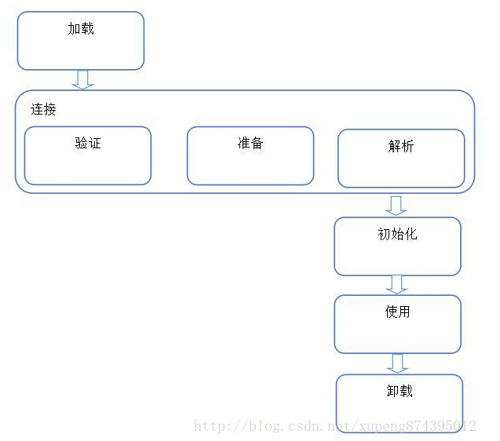
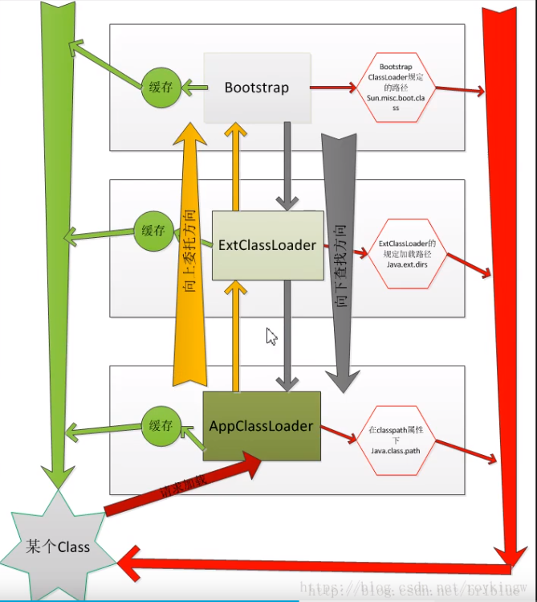
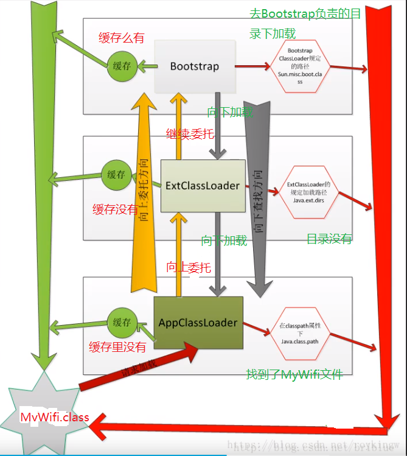
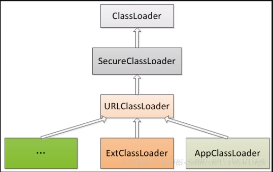
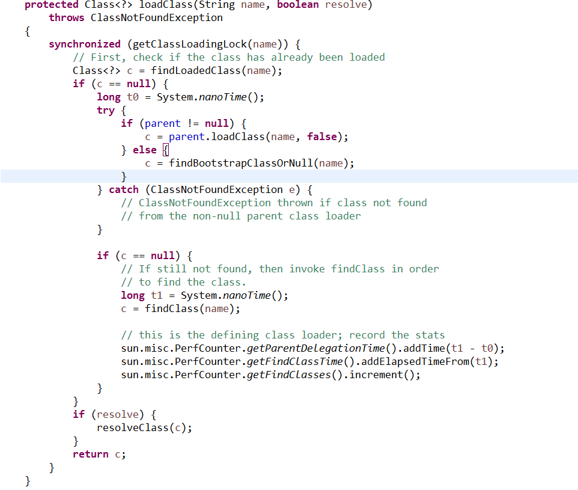
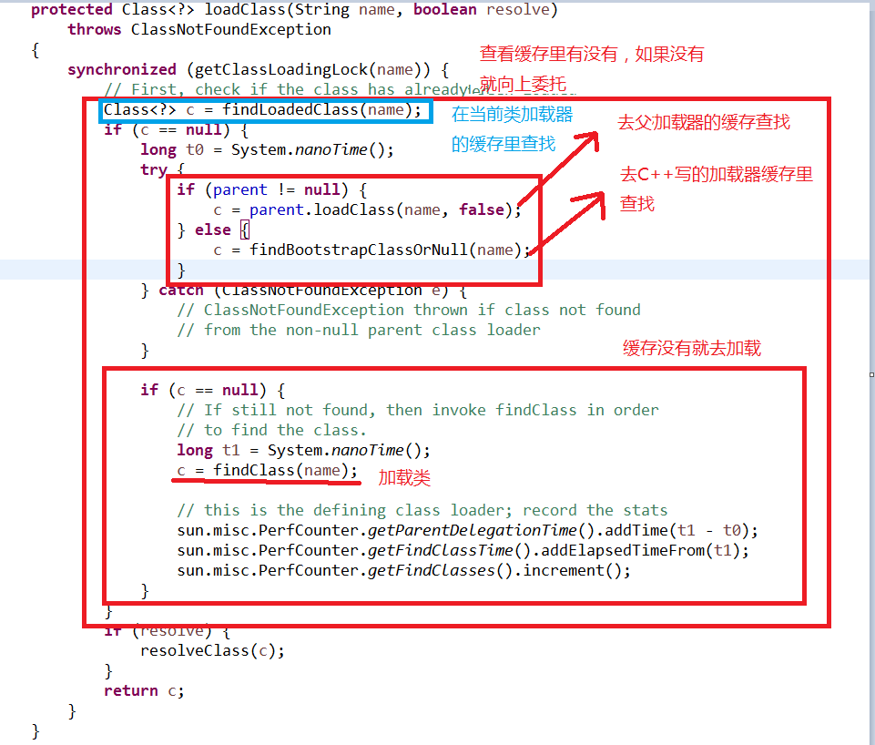
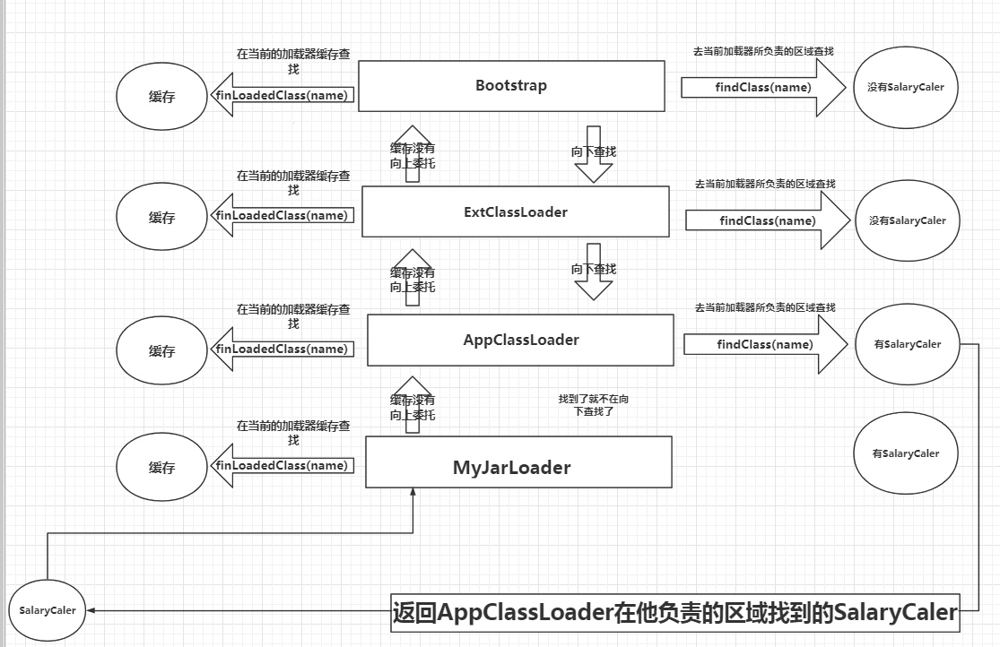
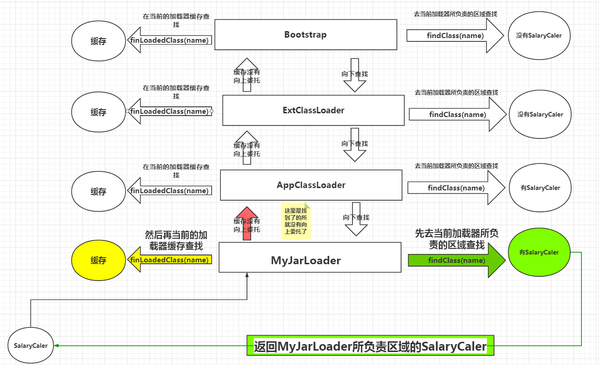

# java类加载器

**作者：子墨**


# 零、类加载机制（了解）

### 类加载的时机

- 隐式加载 new 创建类的实例,
- 显式加载：loaderClass,forName等
- 访问类的静态变量，或者为静态变量赋值
- 调用类的静态方法
- 使用反射方式创建某个类或者接口对象的Class对象。
- 初始化某个类的子类
- 直接使用`java.exe`命令来运行某个主类


### 类加载的过程

我们编写的`java`文件都是保存着业务逻辑代码。`java`编译器将 `.java` 文件编译成扩展名为 `.class` 的文件。.class 文件中保存着java转换后，虚拟机将要执行的指令。当需要某个类的时候，java虚拟机会加载 .class 文件，并创建对应的class对象，将class文件加载到虚拟机的内存，这个过程被称为类的加载。



**加载**

类加载过程的一个阶段，ClassLoader通过一个类的完全限定名查找此类字节码文件，并利用字节码文件创建一个class对象。

**连接:** 

> **验证**
>
> 目的在于确保class文件的字节流中包含信息符合当前虚拟机要求，不会危害虚拟机自身的安全，主要包括四种验证：文件格式的验证，元数据的验证，字节码验证，符号引用验证。
>
> **准备**
>
> 为类变量（static修饰的字段变量）分配内存并且设置该类变量的初始值，（如static int i = 5 这里只是将 i 赋值为0，在初始化的阶段再把 i 赋值为5)，这里不包含final修饰的static ，因为final在编译的时候就已经分配了。这里不会为实例变量分配初始化，类变量会分配在方法区中，实例变量会随着对象分配到Java堆中。
>
> **解析**
>
> 这里主要的任务是把常量池中的符号引用替换成直接引用
>

**初始化**

这里是类记载的最后阶段，如果该类具有父类就进行对父类进行初始化，执行其静态初始化器（静态代码块）和静态初始化成员变量。（前面已经对static 初始化了默认值，这里我们对它进行赋值，成员变量也将被初始化）

> 类记载器的任务是根据类的全限定名来读取此类的二进制字节流到 JVM 中，然后转换成一个与目标类对象的java.lang.Class 对象的实例，在java 虚拟机提供三种类加载器，引导类加载器，扩展类加载器，系统类加载器。


### forName和loaderClass区别

- Class.forName()得到的class是已经初始化完成的。
- Classloader.loaderClass得到的class是还没有链接（验证，准备，解析三个过程被称为链接）的。


以上转自: 	Java类加载机制 :https://blog.csdn.net/weixin_40236948/article/details/88072698


# 一、什么是类加载器

== **学习B站视频:BV16T4y1P79h的笔记** ==

### 1. 什么是类加载器？

Java类加载器是Java运行时环境的一部分，负责动态加载Java类到Java虚拟机的内存空间中。


> 下面让我们看一下下面的代码，来引发我们对类加载器的一些思考

```java
//获取 WathClassLoad.class的类加载器
ClassLoader wathClassLoad= WathClassLoad.class.getClassLoader();
//打印 WathClassLoad.class 的类加载器(AppClassLoader)
System.out.println("WathClassLoad.class 的类加载器:  "+wathClassLoad);

//获取ClassLoader的父类，也就是他的父加载器(ExtClassLoader)
System.out.println("WathClassLoad.class 的父加载器:  "+wathClassLoad.getParent());

//获取ClassLoader的父类的父类，也就是他的爷爷加载器(BootStrapClassLoader)
System.out.println("WathClassLoad.class 的爷爷加载器:  "+wathClassLoad.getParent().getParent());

//获取String的类加载器(BootStrapClassLoader)
System.out.println("String 的类加载器: "+ String.class.getClassLoader());
```

```
WathClassLoad.class 的类加载器:  sun.misc.Launcher$AppClassLoader@73d16e93
WathClassLoad.class 的父加载器:  sun.misc.Launcher$ExtClassLoader@15db9742
WathClassLoad.class 的爷爷加载器:  null
String 的类加载器: null
```


通过上面的代码我们可以直观的看到 java 的类加载器，以及我们对类加载器的一些疑惑

- 疑惑1：有几个层次的类加载器

  - 答： 如你所见有三个类加载器

  

- 疑惑2：为什么 ClassLoader 的爷爷类加载器 和 String等类加载器是null

  - 答: 出现null有两个意思:

    - 1. 获取不到就为null
    - 2. 根本就没有这个东西当然获取不到

    那么他是没有吗？显然不是，那么就是获取不到，既然获取不到那么就为null


- **疑惑3：那么这三个类加载器是什么呢，他们有怎样的关系呢？**

  - 答: 	**AppClassLoader(应用类加载器)	—父亲—>	ExtClassLoader(拓展类加载器)	—父亲—>	BootStrap ClassLoader**

  

- 疑惑4： **BootStrap ClassLoader 为什么获取不到呢?**

    - 答： 	因为**BootStrap ClassLoader 是由C++开发的**，他是JVM虚拟机的一部分，本身不是java类。那么怎么能用java来获取他的
    
    ​		
    
- **疑惑5:  为什么String这个类由BootStrapClassLoader，而WathClassLoad由AppClassLoader加载呢?**

    - 答: 	这是因为这三个类加载器都有自己负责加载的区域
        - **BootstrapClassLoader**：   主要负载加载JAVA_HOME/lib下的类库，像rt.jar 他就是你用的java.lang.* 、 java.uti.* 等；
        - **ExtClassLoader**：    主要加载JAVA_HOME/lib/ext目录中的类库。
        - **AppClassLoader**：    负责加载应用程序classpath目录下的所有jar和class文件。classpath目录可以看成你写的项目里面bin目录


>  可以通过以下代码来获取类加载器的加载目录

```java
//获取类加载器的加载目录
//java的指令可以通过-verbose:class -verbose:gc  参数在启动时打印出类的加载情况
System.out.println("BootStrapClassLoader 加载目录： "+System.getProperty("sun.boot.class.path"));
System.out.println("ExtClassLoader 加载目录： "+System.getProperty("java.ext.dirs"));
System.out.println("AppClassLoader 加载目录："+System.getProperty("java.class.path"));
```

```java
BootStrapClassLoader 加载目录： D:\java\jre8\lib\resources.jar;D:\java\jre8\lib\rt.jar;D:\java\jre8\lib\sunrsasign.jar;D:\java\jre8\lib\jsse.jar;D:\java\jre8\lib\jce.jar;D:\java\jre8\lib\charsets.jar;D:\java\jre8\lib\jfr.jar;D:\java\jre8\classes
ExtClassLoader 加载目录： D:\java\jre8\lib\ext;C:\Windows\Sun\Java\lib\ext
AppClassLoader 加载目录：D:\work\classLoad\bin
```


###   2. 双亲委派机制



#### 1. 解释:

~~(向上委托)~~

他加载一个类会从**AppClassLoader**的缓存里面看看有没有他要的类。(如果找到就返回)

如果没有就向上委托**ExtClassLoader**去查找**ExtClassLoader**的缓存里有没有，(如果找到就返回)

如果**ExtClassLoader**没有就向上委托去**Bootstrap**的缓存里去找。(如果找到就返回)

~~(向下加载)~~

如果**Bootstrap**缓存也没有那么**Bootstrap**就去他负责的路径去加载这个类文件，(如果加载到了文件就返回)

如果**Bootstrap**负责的目录没有这个类文件那么就让**ExtClassLoader**去他负责的位置去加载，(如果加载到了文件就返回)

如果**ExtClassLoader**负责的目录没有，那么就让**AppClassLoader**去她负责的目录查找，(如果加载到了文件就返回)

~~(没有找到)~~

如果再没找到就抛出找不到class异常`NoClassDefFoundError`


#### 2. 假设

假设我去查找我写的MyWifi.class文件

那么：




#### 3. 总结

1. 向上委托查找，向下委托加载
2. 每个类加载器对他加载过的类都有一个缓存
3. 双亲委派机制保证了java自己类不会被用户写的类覆盖


### 3. JDK类加载对象




我们通过定制ClassLoader的时候通常对URLCLassLoader操作，或其他


# 二、通过ClassLoader加载Jar里的class

1. 获取new URLCLassLoader(new URL[])对象
2. 加载jar中的class 文件
3. 获取这个class的实例
4. 获取class里面的方法并执行


> 核心代码

```java
//获取URLCLassLoader
URL[] jarPaths = new URL[1];
jarPaths[0]=new URL("file:D:\\java类加载器\\代码\\jar\\SalaryCaler.jar");//注意这里的路径要写成URL格式
URLClassLoader classloader = new URLClassLoader(jarPaths);//通过URL地址来加载JAR包


//加载jar中的SalaryCaler.class 文件
Class<?> loadClass = classloader.loadClass("com.zimo.loadingJarAndClass.SalaryCaler");
//加载这个class的实例
Object newInstance = loadClass.newInstance();
//运行这个实例里面的计算工资方法
Double money = (Double) loadClass.getMethod("cal",Double.class).invoke(newInstance, salary);
```


> 全部代码

- com.zimo.LoadingJarAndClass.OA

```java
public static void main(String[] args) throws Exception {

    Double salary =2000.00;//工资
    Double money ;//实际到手的工资

    //加载类
    URL[] jarPaths = new URL[1];
    jarPaths[0]=new URL("file:D:\\java类加载器\\代码\\jar\\SalaryCaler.jar");//注意这里的路径要写成URL格式
    URLClassLoader classloader = new URLClassLoader(jarPaths);//通过URL地址来加载JAR包

    while(true) {
        money=calSalary(salary,classloader);
        System.out.println("实际到手工资: "+ money);
        Thread.sleep(1000);
    }
}

//程序员偷偷修改工资将修改工资的代码逻辑分离出去
private static Double calSalary(Double salary,ClassLoader classloader) throws Exception {
    //加载jar中的SalaryCaler.class 文件
    Class<?> loadClass = classloader.loadClass("com.zimo.loadingJarAndClass.SalaryCaler");
    //加载这个class的实例
    Object newInstance = loadClass.newInstance();
    //运行这个实例里面的计算工资方法
    Double money = (Double) loadClass.getMethod("cal",Double.class).invoke(newInstance, salary);
    return money;
}
```


- SalaryCaler.jar
  - com.zimo.loadingJarAndClass.SalaryCaler

```java
public class SalaryCaler {
	public Double cal(Double s) {
		return s*1.4;
	}
}
```


# 三、自定义类加载器: ClassLoder

1. 继承SecureClassLoader，并覆盖findClass方法

2. 获取class文件的字节数组

   * 建议用文件输入流方式获取

3. 方法return 一个this.defineClass(name,byte[],int off,int len);

   * defineClass()是在jvm内存中定义一个class

   * findClass()方法有很多重载方式

> 核心代码

- com.zimo.MyClassLoader.MyClassLoader    extends  SecureClassLoader

```java
// 获取项目地址下的src具体路径
private String projectPath = System.getProperty("user.dir")+"bin\\";
//省略构造器

/**
* @param name
* class的名称(全限定名)
*/
@Override
protected Class<?> findClass(String name) throws ClassNotFoundException {
    //2. 获取class文件的字节数组
    byte[] b = getClassBytes(projectPath,name);
    System.out.println(name);
    //3. 在jvm内存中定义一个class
    return this.defineClass(name,b,0,b.length);
}
/********************************************************************************************************************/
//2.0 读取class文件
private byte[] getClassBytes(String path,String className) {
    //拼接class文件在磁盘中的全路径
    String filePath = path+ className.replace(".", "/").concat(".class");
    FileInputStream in = null;
    ByteArrayOutputStream byteOut = new ByteArrayOutputStream();//字节数组输出流在内存中创建一个字节数组缓冲区,用来存放从磁盘读取的class文件的内容
    try {
        //2.1 获取文件输出流
        in = new FileInputStream(new File(filePath));
        //从文件每次读取一个字节放入缓存区
        int code;
        while((code=in.read())!=-1) {
            byteOut.write(code);
        }
    } catch (Exception e) {
        System.out.println("class文件读取失败");
        e.printStackTrace();
    }
    //关闭文件输入流
    finally {
        //...
    }
    //将缓存区变为byte数组并返回
    return byteOut.toByteArray();
}
```


- com.zimo.MyClassLoader.OA

```java
public static void main(String[] args) throws Exception {

    Double salary =2000.00;//工资
    Double money ;//实际到手的工资

    //使用自定义的类加载器去加载我们的class文件
    MyClassLoader classLoader = new MyClassLoader("D:\\java类加载器\\代码\\jar\\");

    while(true) {
        money=calSalary(salary,classLoader);
        System.out.println("实际到手工资: "+ money);
        Thread.sleep(1000);
    }
}

//程序员偷偷修改工资将修改工资的代码逻辑分离出去
private static Double calSalary(Double salary,ClassLoader classloader) throws Exception {
    //项目中的class文件
    Class<?> loadClass = classloader.loadClass("com.zimo.MyClassLoader.SalaryCaler");
    //加载这个class的实例
    Object newInstance = loadClass.newInstance();
    //运行这个实例里面的计算工资方法
    Double money = (Double) loadClass.getMethod("cal",Double.class).invoke(newInstance, salary);
    return money;
}
```


# 四、自定义类加载器: JarLoader

1. 继承SecureClassLoader，覆盖findClass方法
2. 获取jar文件里面的class文件的字节数组
   * 获取方式：
      * 使用**URL**("jar:file:\D:\java类加载器\代码\jar\SalaryCaler.jar!/com/zimo/MyJarLoader/SalaryCaler.class")**.openSteam**;  (这里采用这种方式)
      * 使用jarFile文件处理:获取jar文件，处理jar条目，通过jar条目获取输入流
3. 方法return 一个this.defindClass(name,byte[],int off,int len);
4. **注意:   findClass();方法有很多重载方式**


> 核心代码


- com.zimo.MyJarLoader.MyClassLoader    extends  SecureClassLoader

```java
//1. 继承SecureClassLoader，覆盖findClass方法
public class MyJarLoader extends SecureClassLoader{
    private String jarPath;	//jar的路径 如: D://hello.jar
    public MyJarLoader(String jarPath) {
        this.jarPath=jarPath;
    }

    /**
     * 加载类
     * @param name 类的全限定名
     * @return
     * @throws ClassNotFoundException
     */
    @Override
    protected Class<?> findClass(String name) throws ClassNotFoundException {
        //2. 获取jar文件里面的class文件的字节数组
        byte[] b = getClassByte(name);

        //3. defineClass()是在jvm内存中定义一个class
        return this.defineClass(name,b, 0, b.length);
    }
	//读取class文件
    private byte[] getClassByte(String name) {
        String classPath = name.replace(".", "/").concat(".class"); //全限定名换成路径写法
        URL url;
        ByteArrayOutputStream byteOut = new ByteArrayOutputStream();//字节数组输出流在内存中创建一个字节数组缓冲区,用来存放从磁盘读取的class文件的内容
        try {
            //通过url来获取输入流
            url = new URL("jar:file:\\"+jarPath+"!/"+classPath);
            InputStream in = url.openStream();
            //从文件每次读取一个字节放入缓存区
            int code;
            while((code=in.read())!=-1) {
                byteOut.write(code);
            }
        } catch (Exception e) {
            e.printStackTrace();
        }
        return byteOut.toByteArray();
    }
}
```


- com.zimo.MyJarLoader.OA

```java
public class OA {

	public static void main(String[] args) throws Exception {
		
		Double salary =2000.00;//工资
		Double money ;//实际到手的工资
		
		//使用自定义的类加载器去加载我们的class文件
		MyJarLoader classLoader = new MyJarLoader("D:\\java类加载器\\代码\\jar\\SalaryCaler.jar");
		
		while(true) {
			money=calSalary(salary,classLoader);
			System.out.println("实际到手工资: "+ money);
			Thread.sleep(1000);
		}
	}
	
	//程序员偷偷修改工资将修改工资的代码逻辑分离出去
	private static Double calSalary(Double salary,ClassLoader classloader) throws Exception {
		//项目中的class文件
		Class<?> loadClass = classloader.loadClass("com.zimo.MyJarLoader.SalaryCaler");
		//加载这个class的实例
		Object newInstance = loadClass.newInstance();
		//运行这个实例里面的计算工资方法
		Double money = (Double) loadClass.getMethod("cal",Double.class).invoke(newInstance, salary);
		return money;
	}

}
```


# 五、代码混淆

~~将class文件加密，再获取class文件时解密，然后再jvm虚拟机中创建class文件~~ 
~~jar加密有两种一种事直接将jar加密，另一种是将加密后的class文件打包成jar文件~~


> class文件加密

1. 对class文件加密
2. 用类加载器去读取class并解密，然后加载解密后的class文件


> jar文件加密

1. 加密方式同上
2. 或者直接加密jar


这里就了解一下不做演示了 教程:https://www.bilibili.com/video/BV16T4y1P79h?p=5&spm_id_from=pageDriver


# 六、热加载

每一个类加载器都有自己的缓存，当这个类加载器加载了一个class之后，这个class会留在缓存之中  
所以我们要实现热加载最简便的方法就是每次加载一个class就要创建一个类加载器
当然如果对class进行更新时，类加载也刚好加载class，那么此时类加载器就会抛出异常，因为此时的class是不完整的，所以我们要记得捕获异常.热加载有一个加载的过程，如果在class更新时加载出现了错误不容易发现。并且热加载会产生非常多的垃圾对象


> 核心代码

- com.zimo.ThermalLoading.OA

```java
public static void main(String[] args) throws Exception {

    Double salary =2000.00;//工资
    Double money ;//实际到手的工资


    while(true) {
        money=calSalary(salary);
        System.out.println("实际到手工资: "+ money);
        Thread.sleep(1000);
    }
}

/*
	 * 热加载
	 * 每次加载类的时候都创建一个新的类加载器
	 */
private static Double calSalary(Double salary) throws Exception {
    //使用自定义的类加载器去加载我们的class文件
		MyJarLoader classloader = new MyJarLoader("D:\\java类加载器\\代码\\jar\\SalaryCaler.jar");
		//项目中的class文件
		Class<?> loadClass = classloader.loadClass("com.zimo.MyJarLoader.SalaryCaler");
		
		if(loadClass!=null) {
			//加载这个class的实例
			Object newInstance = loadClass.newInstance();
			//运行这个实例里面的计算工资方法
			Double money = (Double) loadClass.getMethod("cal",Double.class).invoke(newInstance, salary);
			return money;
		}
		return -1.00;
}
```

- com.zimo.ThermalLoading.MyJarLoader.java

```java
//1. 继承SecureClassLoader，覆盖findClass方法
public class MyJarLoader extends SecureClassLoader{

	private String jarPath;	//jar的路径 如: D://hello.jar
	public MyJarLoader(String jarPath) {
		this.jarPath=jarPath;
	}
	
	@Override
	protected Class<?> findClass(String name) throws ClassNotFoundException {
		//2. 获取jar文件里面的class文件的字节数组
		byte[] b ;
		
		String classPath = name.replace(".", "/").concat(".class"); //全限定名换成路径写法
		URL url;
		ByteArrayOutputStream byteOut = new ByteArrayOutputStream();//字节数组输出流在内存中创建一个字节数组缓冲区,用来存放从磁盘读取的class文件的内容
		
		InputStream in=null;
		int k;
		try {
			//通过url来获取输入流
			url = new URL("jar:file:\\"+jarPath+"!/"+classPath);
			in = url.openStream();
			
			//从文件每次读取一个字节放入缓存区
			int code=0;
			
			System.out.println(url);
			System.out.println(in);
			 k =in.read();
			
			byteOut.write(k);
			while((code=in.read())!=-1) {
				byteOut.write(code);
			}
			b=byteOut.toByteArray();
		
			//3
			return this.defineClass(name,b, 0, b.length);
		}catch (Exception e) {
			
			if(in != null) {
				try {
					in.close();
				} catch (IOException e1) {
					// TODO 自动生成的 catch 块
					
				}
			}
			
			System.gc();
			System.out.println("文件未加载");
			return null;
		}
		
	}

}
```


### 热加载总结:

1. 热加载弊端: 当类加载器读取文件时文件正在被更新那么程序会出错(反正我解决不了)
2. 热加载会产生大量的垃圾对象
3. 热加载机制将一下在编译阶段就能坚持出来的问题延迟到了运行时。
4. 在ClassLoader的loadClass方法中有一个Boolean的参数resolve。他就表示需不需要进行连接。(默认false)
5. 所有我们自己写一个好不容易去用别人写的**JReble**


# 七、打破双亲委派机制


### 1. 引入问题

我们来思考一个问题当我们项目里有一个 SalaryCaler.java，并且jar包下也有一个SalaryCaler.java，那么他会加载那个SalaryCaler.java。

结果显而易见，运行的是我们项目里的 SalaryCaler.java 而不是jar里的SalaryCaler.java 。这是为什么呢？当然是因为双亲委派机制。


>  让我们用代码运行下

我们这里的采用第四章节的代码，并稍微修改一下

修改一下OA.java 让他每次加载类都输出一下类加载器,这里只修改了calSalary()方法使用main方法就不贴出了

```java
//程序员偷偷修改工资将修改工资的代码逻辑分离出去
private static Double calSalary(Double salary,ClassLoader classloader) throws Exception {
    //项目中的class文件
    Class<?> loadClass = classloader.loadClass("com.zimo.BreakTheParentsAppointment.SalaryCaler");

    System.out.println("加载器: " + loadClass.getClassLoader());
    System.out.println("父亲加载器: " + loadClass.getClassLoader().getParent());
    //加载这个class的实例
    Object newInstance = loadClass.newInstance();
    //运行这个实例里面的计算工资方法
    Double money = (Double) loadClass.getMethod("cal",Double.class).invoke(newInstance, salary);
    return money;
}
```


然后在项目里添加一个SalaryCaler .java

```java
public Double cal(Double s) {
		return s*200;
}
```

当然jar包里的 SalaryCaler 也修改下

```java
public Double cal(Double s) {
		return s;
}
```


运行后的结果

```java
加载器: sun.misc.Launcher$AppClassLoader@73d16e93
父亲加载器: sun.misc.Launcher$ExtClassLoader@6d06d69c
实际到手工资: 400000.0
```

结果非常Amazing 啊，可以看成他的确是运行的项目里的SalaryCaler 而非jar的，并且通过他的加载器也可以看出来


下面让我们删除项目里的SalaryCaler,然后运行一下吧

结果如下，这次是正常了，SalaryCaler成功通过我们的MyJarLoader进行了加载

```
加载器: com.zimo.BreakTheParentsAppointment.MyJarLoader@70dea4e
父亲加载器: sun.misc.Launcher$AppClassLoader@73d16e93
实际到手工资: 2000.0
```


>  那么让我们分析一下吧，如何打破双亲委派机制

看下面这张图，这是loadClass方法下面让我们分析一下这张图



代码分析结果



流程分析结果




通过上面的分析我们知道了类加载器如何查找缓存如何加载类了，那么我们是不是可以做点手脚让流程按照我的方式来呢。就让MyJarLoder查找缓存之前先一步加载SalaryCaler呢？


### 2. 打破双亲委派机制思路

1. **覆盖loadClass方法**
2. 先加载类，后查询缓存

> 核心代码

- com.zimo.BreakTheParentsAppointment.MyJarLoader

```java
//....
@Override
protected Class<?> loadClass(String name, boolean resolve) throws ClassNotFoundException {
    //通过硬编码的方式来加载jar包中com.zimo.BreakTheParentsAppointment 包下的类
    if(name.startsWith("com.zimo.BreakTheParentsAppointment")) {
        return this.findClass(name);
    }
    //调用父loadClass方法来加载非jar包中的com.zimo.BreakTheParentsAppointment 包下的类
    return super.loadClass(name, resolve);
}
//....
```


- com.zimo.BreakTheParentsAppointment.OA

```java
public static void main(String[] args) throws Exception {
		
		Double salary =2000.00;//工资
		Double money ;//实际到手的工资
		
		//使用自定义的类加载器去加载我们的class文件
		MyJarLoader classLoader = new MyJarLoader("D:\\java类加载器\\代码\\jar\\SalaryCaler.jar");
		
		while(true) {
			money=calSalary(salary,classLoader);
			System.out.println("实际到手工资: "+ money);
			Thread.sleep(1000);
		}
	}
	
	//程序员偷偷修改工资将修改工资的代码逻辑分离出去
	private static Double calSalary(Double salary,ClassLoader classloader) throws Exception {
		//项目中的class文件
		Class<?> loadClass = classloader.loadClass("com.zimo.BreakTheParentsAppointment.SalaryCaler");
		
		System.out.println("加载器: " + loadClass.getClassLoader());
		System.out.println("父亲加载器: " + loadClass.getClassLoader().getParent());
		//加载这个class的实例
		Object newInstance = loadClass.newInstance();
		//运行这个实例里面的计算工资方法
		Double money = (Double) loadClass.getMethod("cal",Double.class).invoke(newInstance, salary);
		return money;
	}
```

让我们再运行一次

```
加载器: sun.misc.Launcher$AppClassLoader@73d16e93
父亲加载器: sun.misc.Launcher$ExtClassLoader@6d06d69c
实际到手工资: 400000.0
```

看来结果是符合我们的预期的


> 打破双亲机制后的流程图




### 3. 总结：

#### 1. 解决异常

通过这种方式我们发现，MyJarLoader他会去先加载类。这样的话我们就必须用热加载的方式去加载，否则会抛异常

```java
java.lang.LinkageError
```

> 改进

- com.zimo.BreakTheParentsAppointment.MyJarLoader

```java
@Override
protected Class<?> loadClass(String name, boolean resolve) throws ClassNotFoundException {
    //先去MyJarLoader缓存查找如果没有就去加载
    Class<?> c = findLoadedClass(name);

    //通过硬编码的方式来加载jar包中com.zimo.BreakTheParentsAppointment 包下的类
    if(name.startsWith("com.zimo.BreakTheParentsAppointment") && c==null) {
        return this.findClass(name);
    }
    return super.loadClass(name, resolve);
}

```

- com.zimo.BreakTheParentsAppointment.OA

```java
public static void main(String[] args) throws Exception {

    Double salary =2000.00;//工资
    Double money ;//实际到手的工资

    //使用自定义的类加载器去加载我们的class文件
    MyJarLoader classLoader = new MyJarLoader("D:\\java类加载器\\代码\\jar\\SalaryCaler.jar");

    while(true) {
        money=calSalary(salary,classLoader);
        System.out.println("实际到手工资: "+ money);
        Thread.sleep(1000);
    }
}

//程序员偷偷修改工资将修改工资的代码逻辑分离出去
private static Double calSalary(Double salary,ClassLoader classloader) throws Exception {
    //项目中的class文件
    Class<?> loadClass = classloader.loadClass("com.zimo.BreakTheParentsAppointment.SalaryCaler");

    System.out.println("加载器: " + loadClass.getClassLoader());
    System.out.println("父亲加载器: " + loadClass.getClassLoader().getParent());
    //加载这个class的实例
    Object newInstance = loadClass.newInstance();
    //运行这个实例里面的计算工资方法
    Double money = (Double) loadClass.getMethod("cal",Double.class).invoke(newInstance, salary);
    return money;
}
```


#### 2. 优化改进

我们通过覆盖loadClass方法的方式打破了双亲委派机制，但是我们的代码有问题我们通过硬编码的形式制定了包名但是这给整个系统留下来了一个不稳定的隐患。所有我们要改进

```java
if(name.startsWith("com.zimo.BreakTheParentsAppointment"))  将他ban掉
```


> 改进代码

- com.zimo.BreakTheParentsAppointment.MyJarLoader

让我们的类加载器先去他的缓存里找，找不到就去他负责的区域加载类，如果加载不到就交给父类加载器去缓存里找，找不到就去爷爷缓存里找.....

```java
@Override
protected Class<?> loadClass(String name, boolean resolve) throws ClassNotFoundException {
    Class<?> c =null;
    synchronized (getClassLoadingLock(name)) {
        //先去MyJarLoader缓存查找
        c = findLoadedClass(name);

        //缓存没有就去加载
        if(c==null) {
            //先去我的类加载器所负责的范围加载
            c = this.findClass(name); 
            //如果我的类加载器没有加载到就让父加载器去加载
            if(c==null) c = super.loadClass(name, resolve);
        }

    }
    return c;
}
```


> MyJarLoader的bug修改

我们写的类加载器有bug，如果他加载不到类就直接抛异常，撂摊子不干了，所有我们要解决这个问题

解决方法1:    

```java
@Override
protected Class<?> loadClass(String name, boolean resolve) throws ClassNotFoundException {
    Class<?> c =null;
    synchronized (getClassLoadingLock(name)) {
        //先去MyJarLoader缓存查找
        c = findLoadedClass(name);

        //缓存没有就去加载
        if(c==null) {
            //先去我的类加载器所负责的范围加载
            try {
                c = this.findClass(name); 
            } catch (Exception e) {
                // TODO: handle exception
            }

            //如果我的类加载器没有加载到就让父加载器去加载
            if(c==null) c = super.loadClass(name, resolve);
        }

    }

    return c;
}

@Override
protected Class<?> findClass(String name) throws ClassNotFoundException {
    //2. 获取jar文件里面的class文件的字节数组
    byte[] b = getClassByte(name);
    //如果byte数组为空就返回null（没有在我的加载器负责的区域找到class）
    if(b==null) return null;
    //3. defineClass()是在jvm内存中定义一个class
    return this.defineClass(name,b, 0, b.length);
}


//获取jar文件里面的class文件的字节数组
private byte[] getClassByte(String name) {
    String classPath = name.replace(".", "/").concat(".class"); //全限定名换成路径写法
    URL url;
    ByteArrayOutputStream byteOut = new ByteArrayOutputStream();//字节数组输出流在内存中创建一个字节数组缓冲区,用来存放从磁盘读取的class文件的内容
    InputStream in = null;
    try {
        //通过url来获取输入流
        url = new URL("jar:file:\\"+jarPath+"!/"+classPath);
        in = url.openStream();
        //从文件每次读取一个字节放入缓存区
        int code;
        while((code=in.read())!=-1) {
            byteOut.write(code);
        }
    } catch (Exception e) {
        //如果获取不到就返回null
        return null;
    }
    //关闭流
    finally {
        if(in!=null) {
            try {
                in.close();
            } catch (IOException e) {
                // TODO 自动生成的 catch 块
                e.printStackTrace();
            }
        }
    }

    return byteOut.toByteArray();
}
```


# 八、多版本共存

假设: 我想打印出我没做过手脚的工资数，同时打印出我做过手脚工资数那么我们怎么做。(注意：为了不让其他人起疑心我没做过手脚的工资计算逻辑也要打包成jar包)

所以我们抽取一下问题：

1. 有两个jar包，他们共同实现了同一个类
2. 要求加载这两个jar并分别调用他们的方法


>  解决思路

1. 分别用两个不同的类加载器实力去加载我们jar
2. 并分别调用他们的方法


> 核心代码

- com.zimo.coexistence.OA

```java
//多版本共存
public class OA {

	public static void main(String[] args) throws Exception {
		
		Double salary =2000.00;//工资
		Double money ;//实际到手的工资
		
		//使用自定义的类加载器去加载我们的class文件
		MyJarLoader classLoader = new MyJarLoader("D:\\java类加载器\\代码\\jar\\SalaryCaler.jar");
		MyJarLoader classLoader2 = new MyJarLoader("D:\\java类加载器\\代码\\jar\\SalaryCaler2.jar");
		
		while(true) {
			System.out.println("原本工资:"+ calSalary(salary,classLoader2));
			System.out.println("实际到手工资: "+ calSalary(salary,classLoader));
			
			Thread.sleep(1000);
		}
	}
	
	//程序员偷偷修改工资将修改工资的代码逻辑分离出去
	private static Double calSalary(Double salary,ClassLoader classloader) throws Exception {
		//项目中的class文件
		Class<?> loadClass = classloader.loadClass("com.zimo.coexistence.SalaryCaler");
		//加载这个class的实例
		Object newInstance = loadClass.newInstance();
		//运行这个实例里面的计算工资方法
		Double money = (Double) loadClass.getMethod("cal",Double.class).invoke(newInstance, salary);
		return money;
	}

}
```

- com.zimo.coexistence.MyClassLoder

使用第七章的MyJarLoder


# 九、SPI

>  什么是SPI

SPI全称Service Provider Interface，是Java提供的一套用来被第三方实现或者扩展的API，它可以用来启用框架扩展和替换组件。

> 为什么用SPI

使用SPI就能让我们的类加载器加载出来的对象不用再用反射来调用他了，可以像正常的对象一样调用

> 简单分析

在OA系统中声明一个接口，然后MyJarLoader提供实现类。

>提醒

这里我们只是简单的知道他基本怎么使用，不去深入的了解他。如果你想申请就去 [百度](https://www.baidu.com/s?ie=utf-8&f=8&rsv_bp=1&tn=baidu&wd=SPI%20JVM&oq=SPI%2520%25E6%259C%25BA%25E5%2588%25B6%2520%25E7%2599%25BE%25E7%25A7%2591&rsv_pq=d42edc55001e3993&rsv_t=0c22MpdKVH%2F%2BAHVCeeKg8Fk7cA5LbaTbrltokRrjSsDU3taYdi3PXBdEonw&rqlang=cn&rsv_enter=1&rsv_dl=tb&rsv_btype=t&inputT=2032&rsv_sug3=37&rsv_sug1=18&rsv_sug7=100&rsv_sug2=0&rsv_sug4=2257)查询你想要的答案吧


> 实现

1.  在项目(classLoad)下面建立一个`resources\META-INF\services`文件夹


2. 在项目\src下写一个接口(抽取类为接口，你不应该不会吧)

- com.zimo.spi.SalaryCalService

```java
public interface SalaryCalService {
	public double cal(double salary);
}
```

3. 在你的jar包下放入SalaryCalService的实现类

(可以创建SalaryCalService 然后实现了它的实现类后把SalaryCalService 接口删了)

- jar:	com.zimo.spi.SalaryCaler

```java
public class SalaryCaler implements SalaryCalService {
	public SalaryCal() {
		System.out.println("[INFO] SalaryCal实例类空参构造: SalaryCal类以加载");
	}

	@Override
	public double cal(double salary) {
		return salary*1.2;
	}
}
```

4. 在`resources\META-INF\services`文件夹下创建一个文件

   - 文件名是接口的全限定名

   - 文件的内容是接口的实现类的全限定名

   - 注意:文件的内容必须是一个实现类名占一行

- /classLoad/resources/META-INF/services/com.zimo.spi.SalaryCalService

```java
com.zimo.spi.SalaryCal
```


5. 获取实现类

```java
public static void main(String[] args) throws Exception {

    Double salary =2000.00;//工资
    Double money ;//实际到手的工资

    //使用自定义的类加载器去加载我们的class文件
    MyJarLoader classLoader = new MyJarLoader("D:\\java类加载器\\代码\\jar\\test.jar");

    //获取SalaryCalService的实现类列表
    //通过订制的类加载器去加载SalaryCalService.class
    ServiceLoader<SalaryCalService> sl =ServiceLoader.load(SalaryCalService.class,classLoader);
    //获取SalaryCalService并调用方法
    for (SalaryCalService salaryCal : sl) {
        System.out.println(salaryCal.cal(salary));
    }
    
    	//获取列表的迭代器
//		Iterator<SalaryCalService> it = SalaryCals.iterator();
		//获取实现类
//		while (it.hasNext()) {
//			SalaryCalService SalaryCalServiceImpl = it.next();
//			System.out.println("实际到手工资: "+ SalaryCalServiceImpl.cal(salary));
//		}

}

```


### 注意：

**如果加载不到实现类，那么就在`src/META-INF/services/`下创建，或者将resources定义为resources文件（IDEA），resources定义为源文件（eclipse）**

**ServiceLoader 会调用类加载器的 getResources 方法，如果该方法无法扫描到你的resources 请重写该方法。如果你用是自定义类加载器**

# 十、番外

## 1.  (查找)发现类

通过下面的工具类可以获取项目里面的类的全限定名。

有了全限定名就可以动态加载项目里面的类了(使用Class.forName(packageName))

```java
package github.zimoyin.mtool.uilt;

import org.slf4j.Logger;
import org.slf4j.LoggerFactory;

import java.io.File;
import java.io.IOException;
import java.net.JarURLConnection;
import java.net.URL;
import java.util.*;
import java.util.function.Predicate;
import java.util.jar.JarEntry;
import java.util.jar.JarFile;
import java.util.stream.Collectors;

/**
 * 通过反射来查找包下的所有的类
 */
public class FindClass {
    //默认扫描位置
//    private static final String PackagePath = "github.zimoyin";
    private static final String PackagePath = "";

    private static final String CLASS_SUFFIX = ".class";
    private static final String CLASS_FILE_PREFIX = File.separator + "classes" + File.separator;
    private static final String PACKAGE_SEPARATOR = ".";
    private static final Logger logger = LoggerFactory.getLogger(FindClass.class);

    private static List<String> results;
    private static List<? extends Class<?>> resultsClasses;

    /**
     * 返回扫描的默认位置的结果集
     */
    public static List<String> getResults() {
        if (results == null) {
            results = new ArrayList<String>();
            results = getClazzName(PackagePath, true);
            results = results.stream().filter(Objects::nonNull).filter(FindClass::isBlacklist).collect(Collectors.toList());
        }
        return results;
    }

    /**
     * 返回扫描的默认位置的结果集
     */
    public static List<? extends Class<?>> getResultsToClasses() {
        if (resultsClasses == null) {
            resultsClasses = getResults().stream()
                    .map(FindClass::toClass)
                    .filter(Objects::nonNull)
                    .collect(Collectors.toList());
        }
        return resultsClasses;
    }

    /**
     * 将类路径转为类实例
     */
    private static Class<?> toClass(String cls) {
        try {
            return Class.forName(cls);
        } catch (ClassNotFoundException e) {
            logger.warn("无法将此类路径加载成 Class 实例: {}", cls, e);
        }
        return null;
    }

    /**
     * 初始化加载类的黑名单
     */
    private static boolean isBlacklist(String s) {
        HashSet<String> blacklist = new HashSet<String>();
        blacklist.add("github.zimoyin.tool.mirai.config.BotConfigurationImpl");
        blacklist.add("github.zimoyin.core");
        return !blacklist.contains(s);
    }

    /**
     * 查找包下的所有类的名字
     *
     * @return List集合，内容为类的全名
     */
    public static List<String> getClazzName(String packageName, boolean showChildPackageFlag) {
        logger.debug("======================= 查找类 ===========================");

        List<String> result = new ArrayList<>();
        String suffixPath = packageName.replaceAll("\\.", "/");

        logger.debug("查找 " + packageName + " 下的类，递归查找子文件: " + showChildPackageFlag);

        //获取线程的类加载器（线程类加载器突破双亲委派）
        ClassLoader loader = Thread.currentThread().getContextClassLoader();
        try {
            //获取url： 查找具有给定(路径)名称的所有资源
            Enumeration<URL> urls = loader.getResources(suffixPath);
            while (urls.hasMoreElements()) {
                URL url = urls.nextElement();

                logger.debug("查找 " + packageName + " 下的类(URL): " + url);


                if (url != null) {
                    //获取URL的协议，如果是class就是file协议，jar就是jar协议
                    String protocol = url.getProtocol();
                    if ("file".equals(protocol)) {
                        String path = url.getPath();//类路径
                        result.addAll(getAllClassNameByFile(new File(path), showChildPackageFlag));

                        logger.debug("查找 " + packageName + " 下的类: " + getAllClassNameByFile(new File(path), showChildPackageFlag).size());
                    } else if ("jar".equals(protocol)) {
                        JarFile jarFile = null;
                        try {
                            jarFile = ((JarURLConnection) url.openConnection()).getJarFile();
                        } catch (Exception e) {
                            e.printStackTrace();
                        }
                        if (jarFile != null) {
                            result.addAll(getAllClassNameByJar(jarFile, packageName, showChildPackageFlag));

                            logger.debug("查找 " + packageName + " 下(jar中)的类: " + getAllClassNameByJar(jarFile, packageName, showChildPackageFlag).size());
                        }
                    }
                }
            }
        } catch (IOException e) {
            e.printStackTrace();
        }

        logger.debug("查找到的类数量： " + result.size());
        logger.debug("======================= 查找类END ========================");
        return result;
    }


    /**
     * 递归获取所有class文件的名字
     *
     * @param file
     * @param flag 是否需要迭代遍历
     * @return List
     */
    private static List<String> getAllClassNameByFile(File file, boolean flag) {
        List<String> result = new ArrayList<>();
        if (!file.exists()) {
            return result;
        }
        if (file.isFile()) {
            String path = file.getPath();
            // 注意：这里替换文件分割符要用replace。因为replaceAll里面的参数是正则表达式,而windows环境中File.separator="\\"的,因此会有问题
            if (path.endsWith(CLASS_SUFFIX)) {
                path = path.replace(CLASS_SUFFIX, "");
                // 从"/classes/"后面开始截取
                String clazzName = path.substring(path.indexOf(CLASS_FILE_PREFIX) + CLASS_FILE_PREFIX.length())
                        .replace(File.separator, PACKAGE_SEPARATOR);
                if (!clazzName.contains("$")) {
                    result.add(clazzName);
                }
            }
            return result;

        } else {
            File[] listFiles = file.listFiles();
            if (listFiles != null && listFiles.length > 0) {
                for (File f : listFiles) {
                    if (flag) {
                        result.addAll(getAllClassNameByFile(f, flag));
                    } else {
                        if (f.isFile()) {
                            String path = f.getPath();
                            if (path.endsWith(CLASS_SUFFIX)) {
                                path = path.replace(CLASS_SUFFIX, "");
                                // 从"/classes/"后面开始截取
                                String clazzName = path.substring(path.indexOf(CLASS_FILE_PREFIX) + CLASS_FILE_PREFIX.length())
                                        .replace(File.separator, PACKAGE_SEPARATOR);
                                if (!clazzName.contains("$")) {
                                    result.add(clazzName);
                                }
                            }
                        }
                    }
                }
            }
            return result;
        }
    }


    /**
     * 递归获取jar所有class文件的名字
     *
     * @param jarFile
     * @param packageName 包名
     * @param flag        是否需要迭代遍历
     * @return List
     */
    private static List<String> getAllClassNameByJar(JarFile jarFile, String packageName, boolean flag) {
        List<String> result = new ArrayList<>();
        Enumeration<JarEntry> entries = jarFile.entries();
        while (entries.hasMoreElements()) {
            JarEntry jarEntry = entries.nextElement();
            String name = jarEntry.getName();
            // 判断是不是class文件
            if (name.endsWith(CLASS_SUFFIX)) {
                name = name.replace(CLASS_SUFFIX, "").replace("/", ".");
                if (flag) {
                    // 如果要子包的文件,那么就只要开头相同且不是内部类就ok
                    if (name.startsWith(packageName) && !name.contains("$")) {
                        result.add(name);
                    }
                } else {
                    // 如果不要子包的文件,那么就必须保证最后一个"."之前的字符串和包名一样且不是内部类
                    if (packageName.equals(name.substring(0, name.lastIndexOf("."))) && !name.contains("$")) {
                        result.add(name);
                    }
                }
            }
        }
        return result;
    }


    /**
     * 获取jar包下的class文件名称
     *
     * @param jarFilePath
     * @return
     * @URL https://blog.csdn.net/xiao1_1bing/article/details/85122085
     */
    public static List<String> getJarClassName(String jarFilePath) {
        ArrayList<String> classNames = new ArrayList<>();
        JarFile jarFile = null;
        try {
            jarFile = new JarFile(jarFilePath);
            Enumeration<JarEntry> entrys = jarFile.entries();
            while (entrys.hasMoreElements()) {
                JarEntry jarEntry = entrys.nextElement();

                //如果是class文件就放入集合
                try {
                    String classPath = jarEntry.getName().replaceAll("/", "\\.");
                    int prx = classPath.lastIndexOf(".");
                    if (prx == classPath.length() - 1 || prx < 0) continue;
                    String lastName = classPath.substring(classPath.lastIndexOf("."));
                    if (lastName.equals(".class"))
                        classNames.add(classPath.substring(0, classPath.lastIndexOf(".")));//去掉.class后缀
                } catch (Exception e) {
                    e.printStackTrace();
                }
            }
        } catch (IOException e) {
            throw new RuntimeException(e);
        } finally {
            if (jarFile != null) {
                try {
                    jarFile.close();
                } catch (IOException e) {
                    throw new RuntimeException(e);
                }
            }
        }
        return classNames;
    }
}

```

## 2. 调用类的构造方法

```java
aClass = Class.forName(packageName);
Method method = aClass.getMethod(methodName);
//获取构造方法然后newInstance得到的实例传入invoke
Constructor<?>[] declaredConstructors = aClass.getDeclaredConstructors();
for (Constructor<?> declaredConstructor : declaredConstructors) {
    method.invoke(declaredConstructor.newInstance());
}
```


## 3. 配置文件加载

```java
//获取线程的类加载器（线程类加载器突破双亲委派）
ClassLoader loader = Thread.currentThread().getContextClassLoader();
//标准配置文件输入流
InputStream resourceAsStream = Thread.currentThread().getContextClassLoader().getResourceAsStream(configFile.getName());
// 加载配置文件有时候加载不到
InputStream resourceAsStream = this.getClass.getResource("app.json").openStream();
// 加载配置文件有时候加载不到
InputStream resourceAsStream = this.getClass.getResourceAsStream("app.json");
//通过JDK的类加载器获取JDK类加载器所能加载到所有配置文件
ClassLoader.getSystemResources("app/");
myClassLoader.getResources(PATH);
```

* 使用自定义类加载器加载配置文件。在自定义类加载器实现中添加（未测试）

```java
/**
* 获取jar中的resources 目录下的文件
*/
public URL printResources(String jarFilePath, String path) throws IOException {
    try (JarFile jarFile = new JarFile(jarFilePath)) {
        Enumeration<JarEntry> entries = jarFile.entries();
        while (entries.hasMoreElements()) {
            JarEntry entry = entries.nextElement();
            String entryName = entry.getName();
            if (entryName.startsWith(path)) {
                StringBuilder urlStr = new StringBuilder();
                urlStr.append("jar:file:/");
                urlStr.append(new File(jarFilePath).getCanonicalPath().replace("\\", "/"));
                urlStr.append("!");
                if (entryName.charAt(0) != '/') urlStr.append("/");
                urlStr.append(entryName);
                return new URL(urlStr.toString());
            }
        }
    }
    return null;
}

@Override
public Enumeration<URL> getResources(String path) throws IOException {
    List<URL> urls = new ArrayList<>();
    Enumeration<URL> resources = super.getResources(path);
    if (this.path != null && new File(this.path).isFile()) urls.add(printResources(this.path, path));
    while (resources.hasMoreElements()) urls.add(resources.nextElement());
    for (String rootPath : getClassRootPaths()) {
        if (new File(rootPath).isFile()) urls.add(printResources(rootPath, path));
    }
    urls = urls.stream().filter(Objects::nonNull).collect(Collectors.toList());
    return Collections.enumeration(urls);
}


@Nullable
@Override
@Deprecated
public URL getResource(String name) {
    return super.getResource(name);
}

@Nullable
@Override
@Deprecated
public InputStream getResourceAsStream(String name) {
    return super.getResourceAsStream(name);
}
```


## 4. 隔离

两个不同的加载同一个的类那么他们是不能互相转换的

如果主项目传入一个对象A，那么这个对象A是不能访问到插件(加载器)里面类的静态变量

* 访问到的静态变量是在对象A下的静态变量，如果插件中的静态变量值变量被修改那么对象A是无法访问到静态变量修改后的值

## 5. 自定义类加载器：jar 与 class 都能被读取

将 三和四的案例中 `getClassBytes` 方法改为引用以下类的方法来实现

### V1

```java
/**
 * 读取Class 字节
 * 只有读取 class 字节功能，没有加载功能
 */
public class ClassReaderUtil {
    private ClassReaderUtil() {
    }


    /**
     * 读取类文件
     *
     * @param className class 文件的全限定名
     * @param classPath class 存在的路径，可以是一个具体文件夹路径，也可以是一个Jar 路径
     * @return class 字节数组
     */
    public static byte[] readClassBytes(String className, String classPath) throws IOException {
        return readClassBytes(className, new String[]{classPath}, false);
    }

    /**
     * 读取类文件
     *
     * @param className        class 文件的全限定名
     * @param classPaths       class 存在的路径，可以是一个具体文件夹路径，也可以是一个Jar 路径。如果类在这些路径中都存在，则只返回一个
     * @param isFindSTDClasses 如果在第三方jar中没有找到，是否去标准库中找。注意：如果是类加载器加载类，一定要设置为false
     * @return class 字节数组
     */
    public static byte[] readClassBytes(String className, String[] classPaths, boolean isFindSTDClasses) throws IOException {
        // Search for the class in the given classpath
        byte[] bytes = null;
        if (classPaths != null) for (String path : classPaths) {
            if (bytes != null && bytes.length != 0) break;
            if (path.toLowerCase().endsWith(".jar")) {
                // The class is in a JAR file
                bytes = readClassBytesFromJar(new File(path), className);
            } else {
                // The class is in a directory
                //当前路径加上类全限定名来判断文件是否存在，存在则加载，否则则忽略
                File classFile = new File(path, className.replace('.', File.separatorChar) + ".class");
                bytes = readClassBytesFromFile(classFile);
            }
        }
        //如果没有在第三方Jar中就去标准库中找
        if (bytes == null || bytes.length == 0) {
            if (!isFindSTDClasses) throw new IOException("无法在路径下读取到class文件: " + className);
            else
                bytes = readStream(ClassLoader.getSystemResourceAsStream(className.replace('.', '/') + ".class"), true);
        }
        //没有找到任何Class
        if (bytes == null || bytes.length == 0) throw new IOException("无法在路径下读取到class文件且标准类库中也无法找到类: " + className);
       return bytes;
    }

    private static byte[] readStream(final InputStream inputStream, final boolean close)
            throws IOException {
        if (inputStream == null) {
            return null;
        }
        try (ByteArrayOutputStream outputStream = new ByteArrayOutputStream()) {
            byte[] data = new byte[1024];
            int bytesRead;
            int readCount = 0;
            while ((bytesRead = inputStream.read(data, 0, 1024)) != -1) {
                outputStream.write(data, 0, bytesRead);
                readCount++;
            }
            outputStream.flush();
            if (readCount == 1) {
                return data;
            }
            return outputStream.toByteArray();
        } finally {
            if (close) {
                inputStream.close();
            }
        }
    }

    /**
     * 从文件中读取字节
     *
     * @param classFile class 文件对象
     */
    private static byte[] readClassBytesFromFile(File classFile) throws IOException {
        try (InputStream in = Files.newInputStream(classFile.toPath());
             BufferedInputStream bis = new BufferedInputStream(in);
             ByteArrayOutputStream out = new ByteArrayOutputStream()) {
            byte[] buffer = new byte[1024];
            int bytesRead;
            while ((bytesRead = bis.read(buffer)) != -1) {
                out.write(buffer, 0, bytesRead);
            }
            return out.toByteArray();
        }
    }

    /**
     * 从JAR文件中读取类的字节码
     *
     * @param jarFile   jar 路径
     * @param className class 全限定名
     */
    private static byte[] readClassBytesFromJar(File jarFile, String className) throws IOException {
        try (JarFile jar = new JarFile(jarFile)) {
            JarEntry entry = jar.getJarEntry(className.replace('.', '/') + ".class");
            if (entry == null) {
//                throw new IOException("无法在jar中读取到class文件: jar:" + jarFile + File.separator + "!" + className);
                return null;
            }
            try (InputStream in = jar.getInputStream(entry);
                 BufferedInputStream bis = new BufferedInputStream(in);
                 ByteArrayOutputStream out = new ByteArrayOutputStream()) {
                byte[] buffer = new byte[1024];
                int bytesRead;
                while ((bytesRead = bis.read(buffer)) != -1) {
                    out.write(buffer, 0, bytesRead);
                }
                return out.toByteArray();
            }
        }
    }
}

```

### V2

```java
/**
 * 读取Class 字节
 * 只有读取 class 字节功能，没有加载功能
 */
public class ClassReaderUtil {
    private ClassReaderUtil() {
    }


    /**
     * 读取类文件
     *
     * @param className class 文件的全限定名
     * @param classPath class 存在的路径，可以是一个具体文件夹路径，也可以是一个Jar 路径
     * @return class 字节数组
     */
    public static byte[] readClassBytes(String className, String classPath) throws IOException {
        return readClassBytes(className, new String[]{classPath}, false);
    }

    /**
     * 读取类文件
     *
     * @param className        class 文件的全限定名
     * @param classPaths       class 存在的路径，可以是一个具体文件夹路径，也可以是一个Jar 路径。如果类在这些路径中都存在，则只返回一个
     * @param isFindSTDClasses 如果在第三方jar中没有找到，是否去标准库中找
     * @return class 字节数组
     */
    public static byte[] readClassBytes(String className, String[] classPaths, boolean isFindSTDClasses) throws IOException {
        // Search for the class in the given classpath
        byte[] bytes = null;
        if (classPaths != null) for (String path : classPaths) {
            if (bytes != null && bytes.length != 0) break;
            if (path.toLowerCase().endsWith(".jar")) {
                // The class is in a JAR file
                bytes = readClassBytesFromJar(new File(path), className);
            } else {
                // The class is in a directory
                //当前路径加上类全限定名来判断文件是否存在，存在则加载，否则则忽略
                File classFile = new File(path, className.replace('.', File.separatorChar) + ".class");
                bytes = readClassBytesFromFile(classFile);
            }
        }
        //如果没有在第三方Jar中就去标准库中找
        if (bytes == null || bytes.length == 0) {
            if (!isFindSTDClasses) throw new IOException("无法在路径下读取到class文件: " + className);
            else
                bytes = readStream(ClassLoader.getSystemResourceAsStream(className.replace('.', '/') + ".class"), true);
        }
        //没有找到任何Class
        if (bytes == null || bytes.length == 0)
            throw new IOException("无法在路径下读取到class文件且标准类库中也无法找到类: " + className);
        return bytes;
    }

    private static byte[] readStream(final InputStream inputStream, final boolean close)
            throws IOException {
        if (inputStream == null) {
            return null;
        }
        try (ByteArrayOutputStream outputStream = new ByteArrayOutputStream()) {
            byte[] data = new byte[1024];
            int bytesRead;
            int readCount = 0;
            while ((bytesRead = inputStream.read(data, 0, 1024)) != -1) {
                outputStream.write(data, 0, bytesRead);
                readCount++;
            }
            outputStream.flush();
            if (readCount == 1) {
                return data;
            }
            return outputStream.toByteArray();
        } finally {
            if (close) {
                inputStream.close();
            }
        }
    }

    /**
     * 从文件中读取字节
     *
     * @param classFile class 文件对象
     */
    private static byte[] readClassBytesFromFile(File classFile)   {
        try (InputStream in = Files.newInputStream(classFile.toPath());
             BufferedInputStream bis = new BufferedInputStream(in);
             ByteArrayOutputStream out = new ByteArrayOutputStream()) {
            byte[] buffer = new byte[1024];
            int bytesRead;
            while ((bytesRead = bis.read(buffer)) != -1) {
                out.write(buffer, 0, bytesRead);
            }
            return out.toByteArray();
        }catch (IOException e){
            return null;
        }
    }

    /**
     * 从JAR文件中读取类的字节码
     *
     * @param jarFile   jar 路径
     * @param className class 全限定名
     */
    private static byte[] readClassBytesFromJar(File jarFile, String className) {
        try (JarFile jar = new JarFile(jarFile)) {
            JarEntry entry = jar.getJarEntry(className.replace('.', '/') + ".class");
            if (entry == null) {
//                throw new IOException("无法在jar中读取到class文件: jar:" + jarFile + File.separator + "!" + className);
                return null;
            }
            try (InputStream in = jar.getInputStream(entry);
                 BufferedInputStream bis = new BufferedInputStream(in);
                 ByteArrayOutputStream out = new ByteArrayOutputStream()) {
                byte[] buffer = new byte[1024];
                int bytesRead;
                while ((bytesRead = bis.read(buffer)) != -1) {
                    out.write(buffer, 0, bytesRead);
                }
                return out.toByteArray();
            }
        }catch (IOException e) {
            return null;
        }
    }
}

```


## 6. 加载其他Jar ，使用Jdk里面的类加载器

```
URLClassLoader classLoader = new URLClassLoader(new URL[] { new URL("file:///path/to/jar1.jar"), new URL("file:///path/to/jar2.jar") });
```

# QA

1. 如果自定义类引用了其他类会通过什么类加载器加载

> Q: java 中 在自定义实现的类加载器加载jar中一个类后，并调用这个类的方法，那么如果这个类的方法引用了jar中其他类，那么其他类将会经过什么类加载器加载
>
> A: 当一个类被一个自定义类加载器加载后，如果这个类的方法引用了Jar中的其他类，那么这些其他类将会由同一个自定义类加载器来加载。这是因为Java中的类加载器都是按照“双亲委派模型”工作的，即当一个类加载器需要加载一个类时，它会先委派给其父类加载器去尝试加载。如果父类加载器无法加载该类，那么这个类加载器才会自己尝试加载该类。
>
> 在自定义实现的类加载器中，我们可以通过重写findClass方法来实现自己的类加载逻辑。如果需要加载其他类，我们可以使用相同的类加载器来加载这些类，或者在自定义类加载器中实现逻辑来委派给其他类加载器加载。具体实现方法可以根据具体情况来决定。

2. 自定义类加载器是否会缓存类，是否会更新class

> Q: java 中 在自定义实现的类加载器加载我的jar中一个类，该类是否被缓存
>
> A: Java中自定义的类加载器在加载类时，通常会使用缓存来提高加载效率。当自定义的类加载器加载jar中的一个类时，如果该类已经被加载过，那么这个类加载器就会从缓存中获取Class对象，而不是重新读取和解析class文件。
>
> 需要注意的是，如果jar中的类文件发生了变化，缓存中的Class对象就会失效。此时，类加载器会重新加载该类文件，并且更新缓存中的Class对象。因此，如果你在开发过程中频繁修改jar中的类文件，建议使用动态类加载器，避免缓存带来的影响。
>
> 需要注意的是，Java中的类加载器默认使用的是双亲委派模型，即当一个类加载器需要加载一个类时，它会先委派给其父类加载器去尝试加载。如果父类加载器无法加载该类，那么这个类加载器才会自己尝试加载该类。因此，如果你在自定义的类加载器中加载的类与父类加载器已经加载过的类相同，那么这个类也会从父类加载器的缓存中获取Class对象，而不是重新读取和解析class文件。
>
> 
>
> Q: 上述描述中 '类加载器会重新加载该类文件，并且更新缓存中的Class对象。' java是如何知道class被更改
>
> A: Java中的类加载器在加载类时，会检查类文件的最后修改时间来判断类文件是否发生了变化。如果发现类文件的最后修改时间比加载时缓存中的时间要晚，那么类加载器就会重新读取和解析class文件，并且更新缓存中的Class对象。
>
> 具体来说，Java中的类加载器通常会使用java.net.URLClassLoader类或其子类来加载类，这些类加载器会通过URL来定位和加载类文件。当类加载器需要重新加载类时，它会先检查类文件的最后修改时间，如果发现类文件的最后修改时间比加载时缓存中的时间要晚，就会重新读取和解析class文件，然后更新缓存中的Class对象。
>
> 需要注意的是，当使用自定义的类加载器来加载类时，可能需要手动实现类文件的变化检查逻辑。具体实现方式可以根据具体情况来决定，例如可以在类加载器中记录类文件的最后修改时间，或者通过其他方式来判断类文件是否发生了变化。