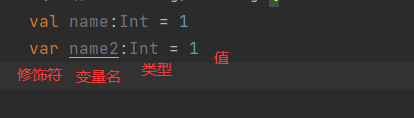

# Kotlin 随堂笔记

> 作者：子墨
>
> 日期：2022/09/08

## 一、特性与介绍

### 1. 特性

- 简洁： 提供了简洁与强大的功能以及随时都可以用的`lambda `来编写优雅的代码

- 安全：Kotlin 可以保护你避免对可空类型进行误操作

- 互操作性： 可以使用`JVM`平台上所有的库，并且可以与 Java、C、JavaScript等语言进行相互调用

- 跨平台：Kotlin可以编译成[Java字节码](https://baike.baidu.com/item/Java字节码/13025120?fromModule=lemma_inlink)在JVM平台上运行，也可以编译成[JavaScript](https://baike.baidu.com/item/JavaScript/321142?fromModule=lemma_inlink)或二进制代码运行

- [Android](https://baike.baidu.com/item/Android/60243?fromModule=lemma_inlink)官方支持开发语言

### 2.介绍

> 创立与发展

* 2011年7月，[JetBrains](https://baike.baidu.com/item/JetBrains/7502758?fromModule=lemma_inlink)推出Kotlin项目，这是一个面向JVM的新语言

* 2012年2月，JetBrains以[Apache](https://baike.baidu.com/item/Apache/6265?fromModule=lemma_inlink) 2许可证开源此项目

* 2016年2月，发布Kotlin 第一个稳定版本，并打算从这个版本开始长期向后兼容性

* 2017年，[Google](https://baike.baidu.com/item/Google/86964?fromModule=lemma_inlink)宣布在[Android](https://baike.baidu.com/item/Android/60243?fromModule=lemma_inlink)上为Kotlin提供一等支持。

* 2019年，[Google](https://baike.baidu.com/item/Google/86964?fromModule=lemma_inlink)宣布Kotlin成为官方首选开发语言

> 设计目标

* 创建一种兼容[Java](https://baike.baidu.com/item/Java/85979?fromModule=lemma_inlink)的语言

* 让它比Java更安全，能够静态检测常见的陷阱。如：引用空[指针](https://baike.baidu.com/item/指针/2878304?fromModule=lemma_inlink)

* 让它比Java更简洁，通过支持variable type inference，higher-order functions (closures)，extension functions，mixins and first-class delegation等实现。

* 让它比最成熟的竞争对手Scala语言更加简单。

##  二、安装

安装IDEA一切就有了，引用教程：https://blog.csdn.net/m0_52725750/article/details/124992057

## 三、变量与常量



* val ： 定义一个常量
* var：定义一个变量
* 变量的值不能直接定义为 null，下面几章节会讲解
* 当变量类型是小括号时那么这个变量就是一个函数（后面讲）
* is： 类型判断，类似于java的 instanceof 
* Any类型：是 Kotlin 中 所有非空类型（ex: String, Int) 的根类型。
* 类型推断：变量的定义可以省略变量类型，kotlin会自动推导判断变量类型

```kotlin
var a = 1 //kotlin 会自动判断他是哪种数据类型
```

* 常用类型：注意Kotlin 只有引用类型没有基本类型

```kotlin
 var byte:Byte =1 // 8位，1个字节 范围 -2的7次方 ~ 2的7次方减1

 var short :Short =1 // 16位，2个字节 范围 -2的15次方 ~ 2的15次方减1

 var int :Int =1 //32位，4个字节 范围 -2的31次方 ~ 2的31次方减1

 var long :Long =1 // 64位，8字节 范围 -2的63次方 ~ 2的63次方减1

 var float :Float =1f // 32位，4字节

 var double :Double =1.0 //64位， 8字节

 var boolean :Boolean =false //布尔值类型，只有true和false两种类型

 var string :String ="四斤" //字串类型

 var char :Char ='a' //字符类型 2个字节

 val intArray :IntArray =intArrayOf(0,1,2,3,4)//int类型的数组类型

 val stringArray :ArrayList =arrayListOf("一斤","二斤","三斤","四斤")//String类型的集合

 val a:()->String={""}//定义一个变量为函数
```

* 字符串拼接 不再能够进行 数字 + 字母进行拼接了，其他方法后面讲


## 四、查看kotlin字节码

IDEA 中安两次 shift ，输入 `show kotlin bytecode` 回车

单机字节码窗口的左上角 `Decomplie` 按钮即可看到反编译的java文件 

## 五、常用表达式

### 1. range 表达式

用来判断值是否在某个区间之内

语法： `num in num0..num1` (返回**布尔值**) 意思是 num 是否在**数学区间** [num0,num1]之间

```kotlin
//判断 a 的值是否在区间 [0,1] 之间
val a = 1
if(a in 0..1){
    println("$a : true")
}
```


### 2.if 表达式

和java一毛一样不写了


### 3. when 表达式

* when表达式类似于Java中的switch语句。

* 当满足于某个条件时执行某段代码

```kotlin
val 返回值= when(变量){
    //会返回语句块中最后一个语句的值
	条件1 ->  语句1 或者 {语句1}
    条件2 ->  语句2 或者 {语句2}
	else ->  都不满足，语句n
}
```

Kotlin 示例

```kotlin
    val name = "张三"
	//形式1，单挑语句大括号可省略
//    val result = when (name) {
//        "张三" -> "欢迎你，我家大门常打开"
//        "李四" -> "滚去加班，今晚不允许回家"
//        else -> "不认识的怪蜀黍"
//    }
	//形式2 
    val result = when (name) {
        "张三" -> {"欢迎你，我家大门常打开"}
        "李四" -> {"滚去加班，今晚不允许回家"}
        else -> {"不认识的怪蜀黍"}
    }
    println(result)
```

Java 示例

```java
String name = "张三";
String result;
switch (name){
    case "张三":
        result = "欢迎你，我家大门常打开";
        break;
    case "李四":
        result="滚去加班，今晚不允许回家";
        break;
    default:
        result = "不认识的怪蜀黍";
}
System.out.println(result);
```


## 六、String 模板

kotlin中不能对所有数据类型都进行字符串拼接了，相对的kotlin推荐使用String 模板来替换String 拼接的操作

* 字符串模板：可以将变量直接插入进入到字符串里面类似于`el`表达式或者java的string 占位符

* 示例:

```kotlin
var a = 1
var s = "今天是我进宫的第 $a 天" //在字符串所需的部分直接放入变量名，并在变量名前面用'$’符号进行修饰
//上面的方法很好，但是不能很好的确定变量的边界，容易导致变量无法被识别，或者变量后面的空格在打印的时候不是符合自己的预期
var s2 = "今天是我进宫的第${a}天"//直接用大括号进行包裹起来就完美解决上述问题。是不是更像 el 表达式了呢
//大括号内可以是语句
var s3 = "今天是我进宫的第${a*12}天"
```

## 七、函数

### 1. 函数声明

* `[修饰符]  fun 函数名 （[变量名：变量类型[=默认值]][，变量名2：变量类型[=默认值]]....）[:返回值类型]`

*  `修饰符  fun 函数名 （变量名：变量类型，变量名2：变量类型）:返回值类型`
*  `fun 函数名 （变量名：变量类型，变量名2：变量类型）` 除了这些其他的都可省略

----

### 2. 函数的默认参数

* `fun 函数名 （变量名：变量类型=默认值）` **省略了其他修饰符**
* 对于需要使用默认值的函数，调用的时候需要使用具名调用

```kotlin
fun main() {
    println(a(val1 = 1))
}

fun a(val0:Int = 1,val1:Int): Int {
    return val0 * val1
}
```

----

### 3. 函数的调用

* 具名调用: 在调用函数的时候指定函数参数的名称，常用于有默认参数的函数，另外使用具名调用可以不按照参数定义顺序传值
* 通常在kotlin中用具名调用方式来替换java中方法重载，但是具名调用是替代重载的方案，但是不能完全替换，部分场景下重载比具名调用更明了，当然kotlin提供了`@JvmOverloads`来自动重载函数,注意理智使用

```kotlin
fun main() {
    println(a(val1 = 1))
}

fun a(val1:Int): Int {
    return val1+1
}
```


* 函数调用：就正常调用就是了

```kotlin
fun main() {
    println(a(1))
}

fun a(val1:Int): Int {
    return val1+1
}
```

----

### 4.函数的Unit

对于没有返回值的函数类型就是Unit 类型，相当于Java的void

----

### 5. TODO

终止当前代码的运行： 抛出一个异常，常用于不期望能够成功运行的函数中，用来阻止函数运行

```kotlin
println(0)
TODO("老子罢工了")
println(1)
```

----

### 6.反引号的函数名

将函数名称用反引号包裹起来，就可以用关键字，非法字符等做函数名了，常用于调用java函数时，对面的函数名是kotlin关键字

```kotlin
fun main() {
    println(`woc ni ma`(1,2))

}

fun `woc ni ma`(val0:Int = 1,val1:Int): Int {
    return val0 * val1
}
```

---

### 7.  匿名函数

* 定义： 不取名字的函数，我们称之为匿名函数，匿名函数通常整体传递给其他函数或者从其他函数返回

```kotlin
//不常用写法，让你了解一下
val a = fun(val0:String): String {
    return "$val0 :Hello world"
}
//匿名函数
val use = {
    "锤子"
}
println(a("子墨"))//调用他需要括号，就和调用函数一样
```

#### 1. 函数定义

* 匿名函数可以作为一个变量的值

* 匿名函数可以定做变量赋值给函数类型的变量，就像其他变量一样，匿名函数就**可以在代码里传递**了
* 除少数情况外，匿名函数**不需要return关键字**来返回数据，**它会隐式或自动返回函数体的最后一行语句的结果**

* 定义：` val/var  函数名称:([参数列表]) -> 函数返回值类型 = {函数体}`

```kotlin
//实例1
val funName:()->String={
	val holiday="New Year."
	"Happy $holiday"
}
//实例2
val b:()->String = { "Hi~ " }
```

#### 2. 函数参数

参数可以存在也可以不存在，如果存在需要在定义里面指出参数

```kotlin
//定义一个参数的类型1
val b:(name:String)->String = {
    name ->//声明第一个参数的名称
    "I name is $name "
}


//定义一个参数的类型2
val b:(String)->String = {
    name ->//声明第一个参数的名称
    "I name is $name "
}
//定义一个参数的类型3
val b = {
    name:String ->//声明函数的参数与类型
    "I name is $name "
}

//当定义只有一个参数的匿名函数时，可以使用it关键字来表示参数名，当需要传入两个参数时，it关键字就不能用了
//定义一个参数的类型
val b:(String)->String = {
    "I name is $it "
}
```

#### 3. 类型推断

* 返回值类型可以自动推断，就不需要写返回值类型

```kotlin
val blessingFunction = {
	"$it, Happy New Year."
}
```

* 推断带参数的匿名函数，为了帮助编译器推断，匿名函数的参数名和参数类型必须有

```kotlin
val blessingFunction:{name:String,year:Int->
	"$name, Happy New Year. $year"
}
```

----

### 8. 回调函数

* **定义**： 如果你把函数作为[参数传递](https://so.csdn.net/so/search?q=参数传递&spm=1001.2101.3001.7020)给另一个函数，当这个函数被调用时，就说这个函数是回调函数。

* **作用**：回到函数作用：“解耦”，普通函数代替不了回调函数的这个特点。这是回调函数最大的特点。

* 回调函数的**缺点**：（你也不想回调地狱吧）

  1. 回调函数固然能解决一部分系统架构问题但是绝不能再系统内到处都是，如果你发现你的系统内到处都是回调函数，那么你一定要重构你的系统。

  2. 回调函数本身是一种破坏系统结构的设计思路，回调函数会绝对的变化系统的运行轨迹，执行顺序，调用顺序。回调函数的出现会让读到你的代码的人非常的懵头转向。

* Java 与 Kotlin 的对比： Java 也有但是条件苛刻需要定义一个接口，接口只能有一个抽象方法才能使用，相比Kotlin非常不友好

Java: 需要定义一个接口才能使用

```java
public class Main {
    public static void main(String[] args) {
        test("子墨", () -> "锤子");
    }

    public static void  test(String name,Use use){
        System.out.println(name + "使用"+use.use()+"打开罐头");
    }
}
interface Use{
    abstract String use();
}
```

Kotlin : 

```kotlin
fun main() {
    //调用，方式一
    val result = test("子墨", use =  {"锤子"})
    //调用，方式二
    val use = {"锤子"}
    val result = test("子墨", use)
    //调用，方式三
    val result = test("子墨") { "锤子" } //注意只有最后一个参数是回调函数才能这么使用
    //调用，方式三：假设有参数
    val result = test("子墨") {
        val0:String->
        "${val0}锤子"
    }
    //输出结果
    println(result)
}

//定义一个函数可以接收变量函数参数，也就是回调函数
//定义的参数是函数： use:() ->String
//use:() ->String  函数名:(参数列表)->函数返回值类型
fun test(name:String,use:() ->String): String {
    return "${name}使用${use()}打开罐头"
}
```

```kotlin
//回调函数可以定义参数
fun test(name:String,use:(String) ->String): String {
    return "${name}使用${use("小")}打开罐头"
}
```


示例2: 

```kotlin
//统计字符个数
val count = "haguiohaoihegihauiopndhguipahewpnagmpb".count()
//统计字符 a 的个数, count方法里面传入了个函数
val count = "haguiohaoihegihauiopndhguipahewpnagmpb".count({
    char->
    char == 'a'
})
println(count)
```

示例3   简洁写法:

lambda 的参数只有一个或者参数排在最后那么就可以简写

```kotlin
//统计字符 a 的个数, count方法里面传入了个函数
val count = "haguiohaoihegihauiopndhguipahewpnagmpb".count({
    char->
    char == 'a'
})
//函数（count）参数只有一个的时候可以省略括号
val count = "haguiohaoihegihauiopndhguipahewpnagmpb".count{
    char->
    char == 'a'
}
//当回调函数只有一个参数的时候可以用it代替
val count = "haguiohaoihegihauiopndhguipahewpnagmpb".count{
    it == 'a'
}
println(count)
```

示例4  函数引用:

让一个函数作为参数扔到另一个函数里面

```kotlin
fun main() {
    val result = test("子墨") {
        val0:String->
        "${val0}锤子"
    }
    //改为
    //调用
    println(test("子墨",::su))
}
fun su(val0:String):String{
    return "${val0}锤子"
}
//上面的代码
fun test(name:String,use:(String) ->String): String {
    return "${name}使用${use("小")}打开罐头"
}
```

理解流程: test 函数拿到两个参数，一个是`String` 一个是 `函数` ，test然后就能对这两个参数进行操作了

----

### 9. 内联函数

[Lambda](https://so.csdn.net/so/search?q=Lambda&spm=1001.2101.3001.7020)表达式最终实现是一个匿名内部类，既然是匿名内部类，那么久会造成额外的内存和性能开销。

为了解决这个问题，[Kotlin](https://so.csdn.net/so/search?q=Kotlin&spm=1001.2101.3001.7020)提供了内联函数的功能，它可以将使用Lambda表达式带来的运行时开销完全消除

[内联函数](https://so.csdn.net/so/search?q=内联函数&spm=1001.2101.3001.7020)的作用就是：内联函数在编译时会自动的将函数体里面的代码自动的替换到其他位置去

* 使用时只需要加上**inline**关键字声明就可以了

```kotlin
inline fun calculate(num1: Int, num2: Int, function: (Int, Int) -> Int): Int {
    return function(num1, num2)
}
```

----

### 10. 闭包

* 闭包（Closure）的概念总是存在于各种支持函数式编程的语言中。
* 定义： 函数和对其周围状态（lexical environment，词法环境）的引用捆绑在一起构成闭包。
* 闭包可以使得函数内部可以对外部作用域定义的变量进行访问。

> Java

Java中的闭包不同于多数其他函数式编程语言，很多时候不被认为是完整的。

```java
protected void onCreate(Bundle savedInstanceState) {
    ...
    ArrayList obj = new ArrayList();
   	int num = 0;
    int nums[] =new int[1];
    btn.setOnClickListener(v -> {
        num++;//报错
        int[0]++;//不报错，可以绕过java限制
        obj.set("666");//不报错,可以绕过java限制
    });
}
```

> 上面的写法会被IDE提示：Variable used in lambda expression should be final or effectively final。因为根据Java规定：匿名内部类内部，方法或块级作用域内的具名内部类内部使用的外部变量必须是final的。
>
> 为什么会有这种规定呢，因为对于Java闭包中的函数而言，周围环境（外部函数或块级作用域）在执行到结束时就会销毁，这里的周围环境对应与虚拟机栈中的一个栈帧。而栈帧中的局部变量，在方法返回后就会被虚拟机回收。
>
> 正因为如此，Java中的闭包其实并不完整。从闭包的定义来理解，Java函数中对周围环境中变量的引用无法阻止周围环境的销毁。从Java闭包的实现来看，这种对周围环境中变量的引用只是一种假象，编译器会对使用到的周围环境中的变量拷贝一份副本，而函数内部操作的只是不可见的副本而已。对这份不可见副本的修改不仅毫无意义，还会引起歧义，误以为周围环境中的变量真的被修改。因此，Java干脆从语言层面禁止了这种修改，也就有了上述规定。

绕过java限制 解释：

```java
 int num = 0;
protected void onCreate(Bundle savedInstanceState) {
    ...
    ArrayList obj = new ArrayList();
    int nums[] =new int[1];
    btn.setOnClickListener(v -> {
        num++;//不报错，可以绕过java限制
        int[0]++;//不报错，可以绕过java限制
        obj.set("666");//不报错,可以绕过java限制
    });
}
```

> 因为数组对象被分配到堆内存中，原来函数所需的，外部环境中的存在于栈帧中的变量到了堆内存中，会因函数内部引用而不被销毁。
>
> 实际上，Java中这种会被内部函数所修改的变量，更多时候我们会把它作为一个类的属性，而不是放在函数或块作用域的内部而受到栈帧出栈的影响
>
> 
>
> 作者：chym
> 链接：https://www.jianshu.com/p/fd24a37ae411
> 来源：简书
> 著作权归作者所有。商业转载请联系作者获得授权，非商业转载请注明出处。


> Kotlin

Kotlin中相较于Java，闭包是完整的

```kotlin
 override fun onCreate(savedInstanceState: Bundle?) {
     ...
     var num = 0;
     btn.setOnClickListener {
         num++ //正确
     }
 }
```


```kotlin
fun main() {
    //调用一
    println(test().invoke("二货"))
    //调用二
    val result = test()
    println(result("笨蛋"))
}

//注意函数的返回值类型定义那里：  (String)->String  
//(参数列表)->函数返回值类型
fun test(): (String)->String {
    var uu1 = "你好"
    //注意返回的是个函数
    return {
        uu1= "$uu1,"
        "$uu1 我是函数返回函数的值,我叫 $it "
    }
}
```


## 八、Null

> 为了避免java中经常出现的NullPointerException问题，[Kotlin](https://so.csdn.net/so/search?q=Kotlin&spm=1001.2101.3001.7020)引入了对null的控制。让开发者在在开发时去重视这个问题
>
> 因此，kotlin中**不能直接去赋值与操作null**，需要进行一系列的安全措施才可去触碰他

### 1. Kotlin的可空性

kotlin和java类型系统第一条也可能是最重要的一条区别：**kotlin对可空类型的显式的支持，这是一种指出你的程序中哪些变量和属性允许为null的方式。如果一个变量可以为null，对变量的方法的调用就是不安全的**，因为这样会导致空指针异常，kotlin不允许这种调用。

如何定义一个null类型： 在类型声明后面声明这个类型是可空类型(`val s:String?` ) 这样即可赋值为null

### 2. 安全调用操作符

> 安全调用操作符： `?.`

使用本操作符，当变量为null 时，对其引用不会抛出`NullPointerException` 而是返回结果为`Null`

```kotlin
    var s:String? = "hello world!"
    s=null
    println(s?.length)
```


> let 处理非空变量

```kotlin
var s:String? = "hello world!"
s=null
//当s 不为null 时进行处理
s?.let {
    println("s != null")
}
```


> 非空断言 `!!`

断言变量不为null，这样后面在使用该变量的时候不需要在为此变量进行使用安全调用了，**但是如果为null，就抛出异常**  

注：如果没有十足把我不要去断言，也不推荐使用该操作符

```kotlin
var s:String? = "hello world!"
//当s 不为null 时进行处理
s!!
println(s.length)
```

> 空合并操作符`?:`

当变量null的时候执行 `?:`后面的语句

```kotlin
var s:String? = "hello world!"
s=null
//当s 不为null 时进行处理
s= s?:"你好世界"
println(s?.length)
```


### 3. 先决条件函数

Kotlin标准库提供了一些便利函数，使用这些内置函数，你可以抛出带自定义信息的异常，这些便利函数叫做先决条件函数，你可以使用它定义先决条件，条件必须满足，目标代码才能执行。

| 函数           | 描述                                                         |
| -------------- | ------------------------------------------------------------ |
| checkNotNull   | 如果参数为null，则抛出IllegalStateException异常，否则返回非null值 |
| require        | 如果参数为null，则抛出IllegalArgumentException异常           |
| requireNotNull | 如果参数为null，则抛出IllegalStateException异常 ，否则返回非null值 |
| error          | 如果参数为null，则抛出IllegalStateException异常 并且输出错误信息，否则返回非null值 |
| assert         | 如果参数为false，则抛出Assertion Error异常 ,并打上断言编译器标记 |

```kotlin
var s:String? = "hello world!"
s=null
//当s 不为null 时进行处理
checkNotNull(s)
println(s?.length)
```

> 自定义异常 与 先决条件函数

```kotlin
fun main(){
var number :Int? = null

try{
    checkOperation(number )
      number !!.plus(1)
    }catch(e:Exception){
     print(e)
    }
}

fun checkOperation(number:Int?){
	number ?: throw UnsikilledException()
}

class UnsikilledException() : IllegalArgumentException("操作不当")

```


## 九、String

### 1. **Substring**

[字符串](https://so.csdn.net/so/search?q=字符串&spm=1001.2101.3001.7020)截取，substring函数支持IntRange类型（表示一个整数范围的类型）的参数，Until创建的范围不包括上限值。

```kotlin
val indexOf = NAME.indexOf('\'')
var str2 = NAME.substring(0 until indexOf)
print(str2)
```


​	
