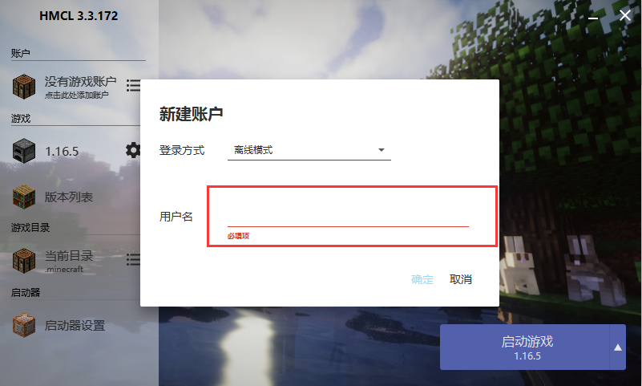
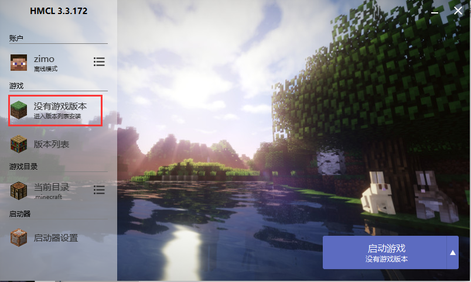
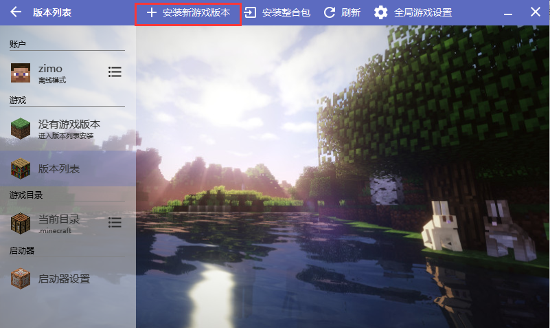
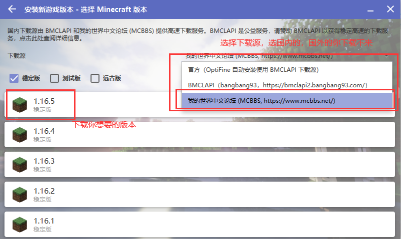
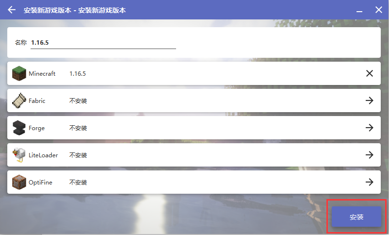
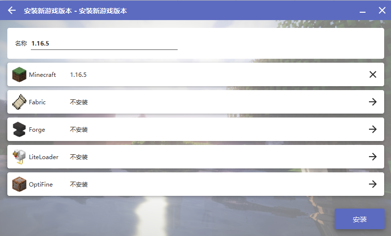
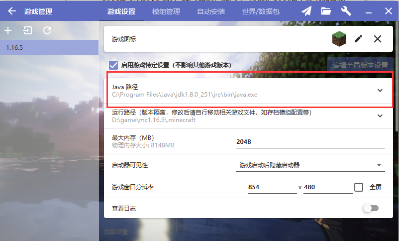
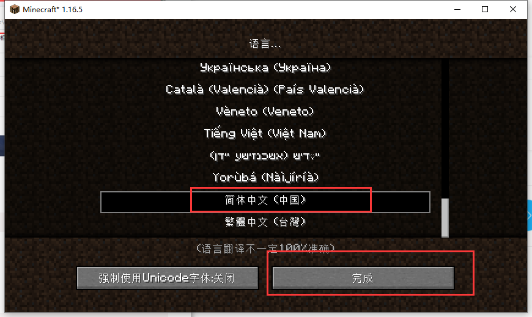

# 如何下载MC

作者:子墨

> 如何下载MC

下载MC无非二种方式

1. 用mc启动器下载
   - 官方启动器
     - 国际版mc
     - 网易mc
   - 第三方启动器
     - HMCL(这里教程使用的他)
     - 其他....
2. 下载整合包

> 下载HMCL

[点我下载](https://zimoyin.lanzous.com/iAjgff4x0he)

> 下载mc

下载完成后启动它

随意一个用户名

单击  没有游戏版本进入版本列表安装

单击安装新游戏版本

选择下载源，单击游戏版本

如果没有什么要求就单击安装(安装的不能安装mod)

> 下载页面详解

- 名称 ：随意填
- Minecaft   xxx   : 不用厉害
- Fabric  ：安装他后才能安装mod (与forge  冲突)
- Forge   : 安装他后才能安装mod (与Fabric   forge  冲突).一般安装他
- LiteLoader: 安装他后才能安装mod
- OptiFine ： 安装后可以安装光影，提高画质，提高fps(帧数). 安装后不影响能否服务器

下载其他东西他让你选版本，选最新的准没错

> mod和纯净版

**加了mod,Fabric ,Forge,LiteLoader  就不能和纯净版联机了。**

> 安装mod

前提(环境)

- 有mod加载器Forge  之类的
- 有mod文件

**把mod文件复制到  .minecraft/mods文件夹下**

注意: 

- **mod为 jar文件**

> 启动MC

启动mc需要java

如果有java请指定java路径，没有就去下载

> 下载java

[下载地址1 ](https://download.oracle.com/otn/java/jdk/8u281-b09/89d678f2be164786b292527658ca1605/jre-8u281-windows-x64.exe?AuthParam=1614679625_c024b75e2b793c38be997f3c76387438)

[下载地址2](https://zimoyin.lanzous.com/iBYzAmdreqh)

> 连接服务器

多人游戏===> (可以有个协议同意就好)  ==>  添加服务器 ==> 输入服务器地址    完成

> mc 切换语言

选择语言，确认

