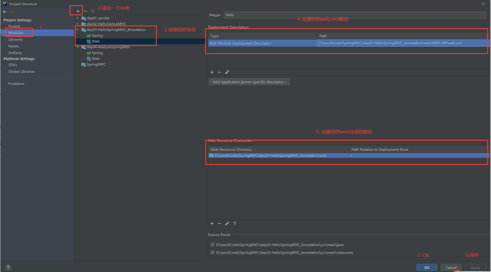

# 问题

在maven文件中web目录他没有被maven识别到，也就是web目录上没有小蓝点，正常情况是有的

# 解决方法

1. 打开Project Structure	（File--->Project Structure）
2. 选择Modules
3. 选中你的项目并在上面点击`+`按钮，添加一个`web`
4. 之后再右侧的上方设置你的`web.xml`在下方设置你web目录的根路径

